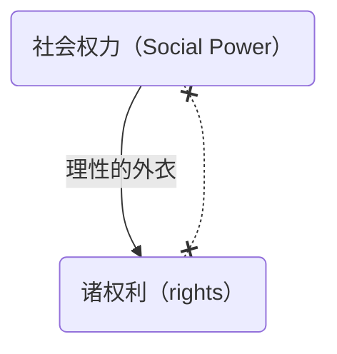

## 索引

[一、前置的准备阶段](https://blog.rainsin.cn/posts/marx/){:target="_blank"} 

二、社会权力与法的权利的关系 <i class="fa-duotone fa-solid fa-badge-check" style="
    text-indent: 0;
"></i> 

[三、扬弃唯物与唯心的对立](https://blog.rainsin.cn/posts/marx2/){:target="_blank"} 

[四、对认识论立场的超越](https://blog.rainsin.cn/posts/marx3/){:target="_blank"} 

[五、马克思的历史观](https://blog.rainsin.cn/posts/marx4/){:target="_blank"} 

[六、社会权力论与意识形态论](https://blog.rainsin.cn/posts/marx5/){:target="_blank"} 

[七、人的“类存在”的历史性](https://blog.rainsin.cn/posts/marx6/){:target="_blank"} 

[八、马克思关于人的本质的定义](https://blog.rainsin.cn/posts/marx7/){:target="_blank"} 

[九、近代个人主义原理的来历](https://blog.rainsin.cn/posts/marx8/){:target="_blank"} 

[十、马克思的历史科学论](https://blog.rainsin.cn/posts/marx9/){:target="_blank"} 

[十一、近代唯物主义的时代根源](https://blog.rainsin.cn/posts/marx10/){:target="_blank"} 

[十二、马克思的哲学革命的旨归：人类解放](https://blog.rainsin.cn/posts/marx11/){:target="_blank"} 

[十三、旧哲学的终结和“革命的科学”的开姶](https://blog.rainsin.cn/posts/marx12/){:target="_blank"} 

## 社会权力与法的权利的关系

<!-- {% include embed/audio.html id="socialpower" src="d/%E9%A9%AC%E5%85%8B%E6%80%9D/aac/%E6%A0%BC%E5%BC%8F%E5%B7%A5%E5%8E%82%E9%9F%B3%E9%A2%91%E5%90%88%E5%B9%B6%20%5B4%5D--%E7%AC%AC%E4%BA%8C%E8%AE%B2%2B%5B5%5D--%E7%AC%AC%E4%BA%8C%E8%AE%B2.mp3"%} -->

以上我们这个课程的第一点，就是社会权力的发现，我们知道马克思在《莱茵报》时期跟莱茵省议会的辩论，这场辩论让他发现了黑格尔法哲学是缺乏根基的，因为法哲学讨论的是法的理性。

如何来面对物质利益的纷争，黑格尔认为我们应用理性能够解决物质利益的争斗，让不同的物质利益服从一个理性的法则，理性的原则，那么这个理性的原则用 right 来表示就是权利，这个英文单词 right ，我学过英语的朋友知道，它可以翻译成权利。

马克思发现了整个社会世界的基础并不是如黑格尔所认为的通过理性来安排的物质利益关系，如果通过理性来安排的物质利益关系，这种物质利益关系就变成了 right ，其实是非理性的。物质利益的争斗要求消灭敌人，利益是最讲究实际的，在这世界上没有什么比消灭自己的敌人，更实际的事。在这里说出的是什么？<em>这个沉默的，不需要观念的，统治他人、奴役他人的力量</em>，我们刚才用的那个词叫 power 。我们现在的讨论，还不是在讨论政治权力，我们讨论的是 social power ，这是个重大的发现。这个发现的意义在于，马克思作为一个黑格尔主义者曾经相信整个人类世界的基础是理性的，现在他发现了人类世界的基础是非理性的物质生活关系，这种非理性的物质生活关系有一个另外的表达就是社会权力， Social Power ，这个重大的发现会导致马克思发动一场哲学革命。

什么是革命？革命就是**范式转换**，这个范式转换用英语来表达叫 Paradigm Shift 。

每一种学说都有一个核心的范式，假如这个核心的范式被改变了，就在这个学说的领域当中发生了学说上的革命。

一个社会形态也有它的核心范式，比方说封建主义的社会形态，它的一个核心范式就是地主，中国古代社会是如此，欧洲古代社会也如此，税赋这是最要紧的事情。这个以土地为基础的所有制，国家跟这个土地拥有者的关系就是税赋。后来地租资本主义来了，资本主义社会形成，资本主义社会的核心范畴就是**资本**，地租并没有消失，地租成了资本的一种形态，就资本的剩余价值的一种形态。我们有一些最起码的现代经济的尝试，<u>所谓剩余价值，有三种形态来体现的，一个叫产业资本家的利润，一个叫金融资本家的利息，还有一个就是土地拥有者的租金——地租</u>，所以地租仍然存在，但它已经不是中心范式了，在资本主义社会里边，它是资本范式的一个特例。这表明什么，社会革命发生了，从地主这个中心范式，转换为资本这个中心范式，就从封建社会转换为资本主义社会，这也是一场革命。革命在人类文明的各个领域里面向来都是进步的动力，物理学有物理学革命，化学有化学革命，人类社会形态有社会革命，一个人的一生的人生道路，也不断发生革命。当你恋爱的时候，这是一个人生阶段，结果呢，转换为婚姻，范式转换。在爱情当中 love 是它的中心范式，在婚姻当中，中心范式是什么呢？叫恩爱，就是夫妻之间的亲情，这也是范式转换，一场革命。所以革命不能被狭义地理解为街头暴力，流血牺牲，革命就是范式转换。街头暴力流血牺牲呢？这是向来以往的社会革命采取的形式。许多人提出告别革命是吧，这是狭义的理解的革命，其实革命是无法告别的，人类社会的每一个重要的进步都是革命带来的，社会的演变，社会的进步不是线性的累积，而是范式的转换，就像我们学物理学，整个学习物理学的过程也是一次又一次的革命的发生。学数学也一样，数学的基础部分，数论，我们小时候自然数，后来在小学读书的时候遇到了分数这个观念，一次数论革命发生了，自然数被重新理解了，后来又遇到了无理数这个概念，那么分数也罢，自然数也罢，都叫有理数了，这些数对以往数的理解发生了变革，变革之后呢原来的数还存在，它的意义被重新领会了，就像地租被成为资本的一个形态了一样的道理。

那么我们现在讲哲学的革命，西方哲学起源于古希腊。到了柏拉图[^bolatu]、亚里士多德[^yalishi]，那里最初的存在论或者说本体论，其实是存在论建立起来理念论，这是一个他们的中心范式。哲学的范式讨论什么，用理性来讨论事物存在者的存在规定，所以哲学的对象都是理性的存在者。人类的灵魂发挥他理性的能力可以认识柏拉图所说的理念，理念是非感性的，超感性的，所以西方哲学在它柏拉图主义的传统当中向来把哲学的对象看成是什么理性的存在者。现在马克思发现了什么，非理性的 power ，这就意味着什么，革命就要发生了，因为哲学的对象改变了，在理念论的传统的本体论当中，是无法讨论非理性的 social power ，这就要求范式的转换，所以哲学革命不可避免。现实中也一样，理论的革命，哲学的革命是现实生活变革的产物，没有资本主义的诞生就没有马克思的学说，而资本主义诞生，让马克思研究资本主义的本质规定的时候发现资本本质上是非理性的力量，资本就是能增殖的货币，货币表达了一个商品的交换价值，而这个交换价值是凝聚在商品上的人与人的关系，而这个关系绝不是理性的，是非理性的。

现在我们讲过了，那么现实中是怎样的呢？人类的社会生活，基础领域就是物质生活的领域，物质生活的关系是非理性的，所谓社会权力是一个**历史展开**的过程。奴隶制社会，那个社会权力就是一部分人作为工具，也就是作为奴隶，那么他作为奴隶主的财产被占有了，这是当时的社会权力，就人身依附关系，奴隶主与奴隶之间，这是当时的power。后来发生转变，进入封建主义，封建主义是什么，封建主和他所支配的农奴，半农奴或者行会手工业的师傅对徒弟和帮工的支配权是半人身依附关系，就是说 social power 又发生变化。到资本主义这种社会形态当中它的社会权力就是现在我们用的一个词叫**资本**，资本是种力量，是支配一部分人的一部分生命时间的力量。就像我刚才做的一个虚构，你们如果一个个囊中如洗，我口袋里全是多出来的货币，那么它就是一种力量，这种力量没有政治等级做基础的，不是说你向来是跟我有半人身依附关系，我可以支配你，不！我的货币就是一种交换价值，这种交换价值，当你不具备的时候，你不得不把你的一部分生命时间由我来支配，所以资本雇佣劳动这是一个经济学范畴。在劳动的市场上发生了资本与劳动力之间的等价交换，所谓经济关系。假如我们讲的是生产关系，两个概念不同的，一个叫经济关系,一个叫生产关系，经济学家把生产关系理解为经济关系，那么他一定符合经济的范畴和逻辑。**所谓等价交换，资本雇佣劳动，资本购买了劳动，这不就等价交换吗，完全符合理性，但是作为生产关系来理解呢，这个资本就是种感性的力量，它来支配一部分人的生命活动，它不需要经济学理论，它就是沉默的力量，在我口袋里呢，所以你们都跟着我走了，正在要求我支配你们一部分生命时间，不就这样吗。**

资本雇佣劳动是经济学表达，作为生产关系就是**积累起来的劳动行使了对当下活劳动的支配权**，这叫生产关系。**资本就是积累起来的过去的劳动**，除非你否定劳动价值论，也就否定亚当斯密和李嘉图，如果你承认劳动价值理论，这个劳动是指抽象劳动，这个价值是指商品的交换价值，那么就是过去积累起来的劳动。掌握在我手里了那叫资本，来支配你当下的活劳动，这是力量，不是等价交换。等价交换这个假象怎么会形成的呢？是因为劳动力也在市场中，那么就有竞争，于是劳动力的价格就上下波动，那么有一个基本上一个时间段的平均价格，不就是等价交换的意思，经济学给生产关系披上了一层，穿上了一件理性的外衣，我们都把这个理性的外衣看成是它的事情本身。我们认同的资本主义的经济制度就是我们认为它理性的，那马克思揭穿了说非理性的。

王国维说的对的，世界上就两种学问嘛一种学问叫可爱而不可信，如政治经济学；一种学问叫可信而不可爱，马克思的资本论学说。他可信，他不可爱，因为他不讲理性了。所以现在我每一个被雇佣的劳动者呢，他觉得他跟雇主之间是平等的，于是我们就心安理得。假如一些正是如理性的外衣所表现出来的平等，那么这个社会就没问题，但是劳资冲突斗争始终没停下来过，而且斗争就意味着什么， social power 需要转变。

我们看到马克思学说，我们今天是无法拒绝的，这是可以理解的。现在我们来说一件要紧的事，哲学要革命了，也就是要范式转换了。这个范畴转换的动力来自于哲学发现了自己无法讨论的对象，就是非理性的东西。我们举个简单的例子，西方哲学到近代有一个分支叫法哲学，那么黑格尔晚年的最重要的著作就是《法哲学原理》，那么法哲学用英语怎么表达的， Philosophy of Right ，我们现在翻译成法哲学，权利哲学。法就是权力体系，有种种权力。<u>一个由诸权力构成的体系叫法</u>，所以叫法哲学。好，现在我们看这个权力哪里来的，从法的理性的观念中推出来的，我们想应该是这样，所以进入了法学院学习法学这个专业的学生一定要修一门课，叫法理学，更进一步要修法哲学。法哲学还分了两种，权利看成自然权利的，也就是看作是这个理性规定出来的成文法，所以有两套法的体系，大陆法系和英美法系。权利来自哪里？当你学法哲学的时候你认为来自认为成熟了的理性，理性到近代成熟了，孟德斯鸠写了那本书叫《论法的精神》[^fade]。黑格尔有法哲学原理了，所以把权利看成是来自理性自己的推论，然后规定每一个人的权利。权利真这么来的吗？就像我刚才说的例子当中，我有那么多多出来的货币，它没有说话，没有观念，没有论证自己，但它就是力量，没有钱的人没有货币的人跟着我走了。那么有人说可以抢啊，不要跟着他，抢他就好了，但不能抢的呀，为什么？法律在，这个货币，我口袋里的这个货币是我的私有财产，私有财产乃是权利。我支配别人的力量，支配他人的一部分生命时间的力量是来自法律赋予我的私有财产的权利吗？哪怕法律没给我私有财产的名分，不给我这个 right ，我多出了那么多货币它仍然是种力量，它可以表现为什么，我开个地下工厂可以吧，因为他违法，所以放到地下，大家都不知道，但是有人来干活，因为资本在，这不过因为法律没有确证（confirm）它，没有对它做事后的确证，所以只能偷偷地干，秘密地干。秘密地干也是一种力量，就是它真实的力量，终于有一天，在一个国家的上层建筑，有一块就是法的上层建筑，它承认了这种力量，承认了这个 power 。怎么承认呢？赋予它一个法的观念，叫right，权利，那它就公开合法了，**并不是公开合法这件事情让他成为power的，而且他本来就是power，终于披上了理性的，法的理性的外衣成了right**。

中国在计划经济时代的晚期就有许多人从事体制外的商品贸易，这种活动当时被称为什么？投机倒把。道德上不接受，法律上不承认，但是在体制外从事投机倒把的人的口袋里多出了那么多在体制内工作的人没有的货币，它是真实的力量，它拥有未来，后来果然拥有未来了，改革了嘛，承认了，个人口袋里多出来的货币是个公开可以拿来做资本用的东西，于是投机倒把不再被称为投机倒把，又被称为搞活经济了。

于是我们就来讨论社会权力与法的权力这两者的关系，这关系非常简明，用一个简单的图示:

right来自social power，非理性的power，这个箭头表示穿上理性的外衣，从权力中产生出权利，其实right 和 power 本来是同一个东西，它们得到了不同的表达，被理性的表达了。

**把法的范畴加到非理性的power上，但你把范畴清洗掉就看到事情本身，这叫现象学原则，你不把范畴清洗掉，它变成法的事实，私有财产不可侵犯，这是一个法的事实，但它不是事情本身。我现在谈到现象学运动，胡赛尔的现象学运动的第一个口号是什么？回到事情本身，而不是从事实出发。事实不是事情本身，有法的事实，有经济事实，有政治事实，都已经被范畴规定了，政治学范畴规定了政治事实，经济学范畴规定出经济事实，法的范畴规定出法的事实，都是事实，并非事情本身。**

哲学革命因此开始发生，法哲学的对象是理性的，权利理性的。现在呢，我们跟着马克思发现了social power，换句话说哲学对象就改变了，原先是什么 ，Philosophy of right，现在要求一种这样的哲学，Philosophy of power。哲学的对象成了非理性的power，这个哲学怎么做？哲学的学术怎么建构？哲学的理论的核心范畴一定要发生变化了吧，从 Philosophy of Right 转变为Philosophy of Power，这个转变，就是马克思的哲学革命。马克思发动了这场革命，是马克思在1844年在巴黎发动的哲学革命，留下《1844年经济学哲学手稿》。

1844年这一年，有一个未来将震动整个欧洲的思想家出生了，他叫尼采[^nicai]。尼采诞生于1844年，这当然是种巧合，但是这个巧合让我们觉得非常有意思，尼采后来就跟着马克思，但他不是学马克思，他自己也发动过这些革命，这些的对象也是power，权力哲学，并不光是马克思一个人提出来，后来尼采也提出来了。受马克思和尼采深刻影响的，后来的法国哲学家福柯，继续沿着这条路走，并且确认什么？knowledge is power，知识也是power。福柯写了《知识考古学》[^zhishi]——解构主义哲学。福柯后来回顾，对他一生影响最大的思想家就两个，一个马克思，一个尼采。

我们继续推论，如果知识也是power，那教育也是power，为资本主义社会再生产被雇佣的劳动者，他哪怕很光鲜，IT工程师，足够光鲜，但他也是被权力支配的。现在有个名称叫码农，就跟农民一样的，特别好，道出了事情的真相。技术科学研究服从资本运动了，那么教育肯定要服从资本运动，除非人文教育跟资本没关系，这些人保留在他的精神世界的领域里面，基础科学的研究者或纯数学的研究者等等。

我们回到这件事情上来，于是马克思完成了这场哲学革命之后的哲学跟哲学革命之前的哲学有根本的差别了，这种差别叫范式的转换。我们如何去描述这个非理性的power以及它的转变，从过去的social power转变到今天的social power，可能还有未来的social power，这叫历史，但是历史曾经被放到理性的逻辑当中加以讨论——历史哲学，但是社会形态的演变是非理性的。物质生活关系的演变，也就是social power的演变，我们如何去描述这样一个演变的过程呢？

## 延伸阅读

[^bolatu]: 关于[柏拉图](https://myproxy.rainsin.cn/-----https://zh.wikipedia.org/wiki/%E6%9F%8F%E6%8B%89%E5%9B%BE){:target="_blank"} 的维基
[^yalishi]: 关于[亚里士多德](https://myproxy.rainsin.cn/-----https://zh.wikipedia.org/wiki/%E4%BA%9A%E9%87%8C%E5%A3%AB%E5%A4%9A%E5%BE%B7){:target="_blank"} 的维基
[^fade]: [《论法的精神》](https://rainsinpan.hk.cpolar.io/bookfile/%E8%AE%BA%E6%B3%95%E7%9A%84%E7%B2%BE%E7%A5%9E.azw3){:target="_blank"}资源
[^nicai]: 关于[尼采](https://myproxy.rainsin.cn/-----https://zh.wikipedia.org/wiki/%E5%BC%97%E9%87%8C%E5%BE%B7%E9%87%8C%E5%B8%8C%C2%B7%E5%B0%BC%E9%87%87){:target="_blank"} 的维基
[^zhishi]: [《知识考古学》](https://rainsinpan.hk.cpolar.io/bookfile/%E7%9F%A5%E8%AF%86%E8%80%83%E5%8F%A4%E5%AD%A6%EF%BC%884%E7%89%88%EF%BC%89%20(%E7%A6%8F%E6%9F%AF)%20(Z-Library).pdf){:target="_blank"}pdf资源