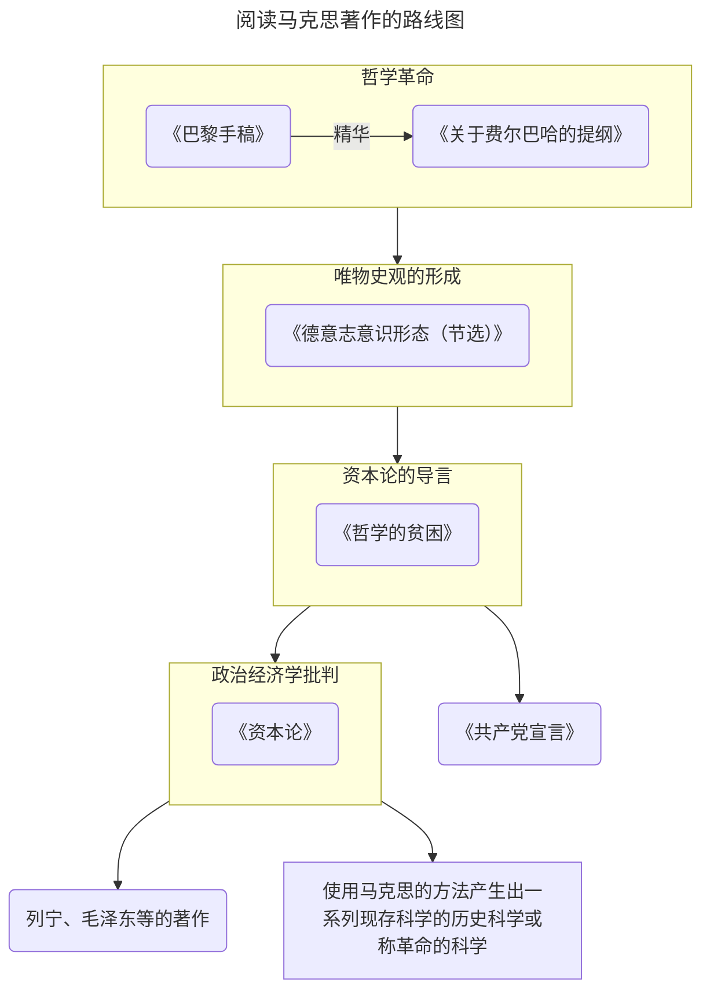
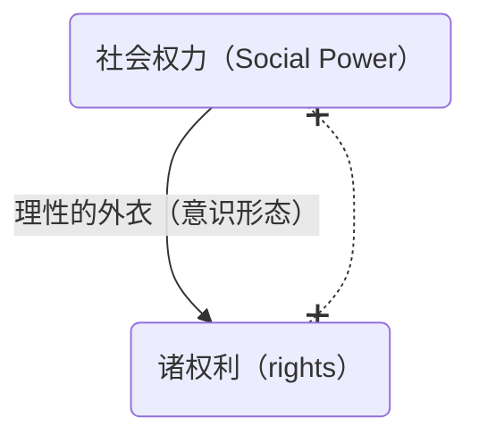

> 对许多人来说，高考、找工作或许是人生中最重要的转折点。但对我而言，真正塑造我的，是这几年持续的学习与思考——它们让我触摸到马克思思想中的智慧，也让我真正学会了如何思考。
{: .prompt-tip }

> 在整理内容时，我参考了B站UP主【温兴凯】精心修订的文字稿。由于我自己的原稿存在不少错漏，加上时间有限，就直接选用了这份整理得更清晰、更准确的版本，希望能带给大家更好的阅读体验。
{: .prompt-tip }

> 这份文字稿大约有11万字，完整阅读可能需要半个月左右。但要真正理解其中的思想，或许需要更长的时间沉淀。通过这堂《马克思的哲学革命及其当代意义》导论课（主讲：王德峰），我们不仅能从根本上认识马克思的思想体系，也会对“社会主义如何实现、为何必将实现”这样的根本问题，形成属于自己的、虽模糊却全局的见解。最终，愿你能享受这场深度思考所带来的、难以言喻的智力愉悦。  课程链接：[《马克思的哲学革命及其当代意义》王德峰](https://www.bilibili.com/cheese/play/ep261830)
{: .prompt-tip }

## 缘起、线索和框架

{% include embed/img-card.html Dname="KARLMARX" bg="https://source.rainsin.cn/img/post/mark/Karl_Marx%2C_1875.jpg" name="卡尔·马克思" con="无国籍" ski="思想家" det="https://www.marxists.org/" %}

马克思在《1844年经济学哲学手稿》中开启的哲学革命，其核心要义被高度凝练地汇聚于《关于费尔巴哈的提纲》。这十一条提纲，篇幅精悍，却至关重要——它是这场革命性哲学转向的纲领性宣言，勾勒出马克思新哲学世界观的完整图景。

正如王阳明心学精髓浓缩于《大学问》，六百卷般若智慧凝结于《心经》，《关于费尔巴哈的提纲》同样是马克思哲学革命丰富内涵的浓缩精华。因此，把握这场革命的核心，必须深入剖析这十一条提纲的思想脉络。

掌握了这一思想武器，我们便能更透彻地解读《德意志意识形态》、《哲学的贫困》、《资本论》等后续经典，然后继续在国学的海洋里驰骋，最后法喜充满。

这绝非易事。诚如雅可比所言：“即使兴趣盎然，若想深入欧拉、拉格朗日、拉普拉斯的堂奥，而非浅尝辄止，便须付出惊人的努力与代价。征服这些思想高峰，必经极度的焦虑与痛苦的思索。然而，一旦你懂得其内在之美，便能平静地接纳这一切。” 此理同样适用于历经历史淬炼的深邃学说。深入马克思的思想殿堂，亦需此等决心与付出。

## 提纲全文

《关于费尔巴哈的提纲》全文，总共十一条，一千二百个字，多回味几遍就背下来了：

@Hdiv(classic){
@Hbq(){
@Hsp(){
@Hp(intent){一、从前的一切唯物主义（包括费尔巴哈的唯物主义）的主要缺点是：对对象、现实、感性，只是从客体的或者直观的形式去理解，而不是把它们当作感性的人的活动，当作实践去理解，不是从主体方面去理解。因此，和唯物主义相反，能动的方面却被唯心主义抽象地发展了，当然，唯心主义是不知道现实的、感性的活动本身的。费尔巴哈想要研究跟思想客体确实不同的感性客体：但是他没有把人的活动本身理解为对象性的［gegenständliche］活动。因此，他在《基督教的本质》中仅仅把理论的活动看作是真正人的活动，而对于实践则只是从它的卑污的犹太人的表现形式去理解和确定。因此，他不了解“革命的”、“实践批判的”活动的意义。}
@Hp(intent){二、人的思维是否具有客观的［gegenständliche］真理性，这不是一个理论的问题，而是一个实践的问题。人应该在实践中证明自己思维的真理性，即自己思维的现实性和力量，自己思维的此岸性。关于思维—离开实践的思维—的现实性或非现实性的争论，是一个纯粹经院哲学的问题。}
@Hp(intent){三、关于环境和教育起改变作用的唯物主义学说忘记了：环境是由人来改变的，而教育者本人一定是受教育的。因此，这种学说一定把社会分成两部分，其中一部分凌驾于社会之上。 @Hsp(intent,inline-block,mt4){环境的改变和人的活动或自我改变的一致，只能被看作是并合理地理解为革命的实践。}}
@Hp(intent){四、费尔巴哈是从宗教上的自我异化，从世界被二重化为宗教世界和世俗世界这一事实出发的。他做的工作是把宗教世界归结于它的世俗基础。但是，世俗基础使自己从自身中分离出去，并在云霄中固定为一个独立王国，这只能用这个世俗基础的自我分裂和自我矛盾来说明。因此，对于这个世俗基础本身应当在自身中、从它的矛盾中去理解，并在实践中使之革命化。因此，例如，自从发现神圣家族的秘密在于世俗家庭之后，世俗家庭本身就应当在理论上和实践中被消灭。}
@Hp(intent){五、费尔巴哈不满意抽象的思维而喜欢直观；但是他把感性不是看作实践的、人的感性的活动。}
@Hp(intent){六、费尔巴哈把宗教的本质归结于人的本质。但是，人的本质不是单个人所固有的抽象物，在其现实性上，它是一切社会关系的总和。 @Hsp(intent,inline-block,mt4){费尔巴哈没有对这种现实的本质进行批判，因此他不得不： }@Hsp(intent,inline-block,mt4){（１）撇开历史的进程，把宗教感情固定为独立的东西，并假定有一种抽象的—孤立的—人的个体。 }@Hsp(intent,inline-block,mt4){（２）因此，本质只能被理解为“类”，理解为一种内在的、无声的、把许多个人自然地联系起来的普遍性。}}
@Hp(intent){七、因此，费尔巴哈没有看到，“宗教感情”本身是社会的产物，而他所分析的抽象的个人，是属于一定的社会形式的。}
@Hp(intent){八、全部社会生活在本质上是实践的。凡是把理论引向神秘主义的神秘东西，都能在人的实践中以及对这个实践的理解中得到合理的解决。}
@Hp(intent){九、直观的唯物主义，即不是把感性理解为实践活动的唯物主义至多也只能达到对单个人和市民社会的直观。}
@Hp(intent){十、旧唯物主义的立脚点是市民社会，新唯物主义的立脚点则是人类社会或社会的人类。}
@Hp(intent){十一、哲学家们只是用不同的方式解释世界，问题在于改变世界。}@Hp(end,fangsong){——《关于费尔巴哈的提纲》}
}
}}

## 序言

从19世纪到20世纪欧洲的国际共产主义运动全面展开，使得马克思的名字为全世界家喻户晓。人类已经进入了21世纪了，在21世纪我们人类所面临的共同的难题困境，在这样一个当代状况中，我们重新思考一个问题。这个问题就是：**马克思的学说与当代人类的关系是什么？**也就是要回答一个问题：**马克思的学说是否已经过时**。

这个问题哪里来呢？上世纪90年代有一位日裔的美国学者弗朗西斯·福山[^fushan]，发表了他那本著作《历史的终结和最后的人》[^lishi]。

这位日裔的美国学者在这本书里边说：“**随着苏东的解体，整个社会主义国家阵营的瓦解，历史终结了，未来将是自由的市场经济和议会民主的政治大行天下，广备全球，一个人类的千年福国即将开始，所以这叫历史的终结。**”[^l152]这本书在美国一时非常畅销，确实二十世纪留给二十一世纪的一笔重大的遗产就是**社会主义国家阵营的解体**。当时亲身经历了这一场世界历史性的巨大变故的人，在今天仍然能够回忆起当时的情景。这本书的一个非常重要的意思就是说马克思学说过时了，大概到了给马克思学说举行葬礼的时候了。

很快就有了反应，1993年美国加利福尼亚大学的一个思想与社会中心举办了一次大型的国际讨论会，这个会议的主题就是这样一句话，这样一个问题：马克思主义向何处去。加利福尼亚大学的这个思想与社会中心，邀请了包括美国在内的西方学者云集在加利福尼亚大学，这是场大型的国际研讨会。

法国哲学家德里达[^delida]应邀出席，德里达在他的大会的发言当中做了一篇长篇的演讲。这个演讲后来集成了一本小册子，也有中译本，上海艺文出版社出版，书名是《马克思的幽灵》[^youling]。

这篇演讲一开始，德里达就这样开始说了，他说：我从来不是一个马克思主义者，但我选择了一个合适的时机，向马克思表达我的敬意，没有马克思就没有未来。在今天这个地球上，所有的男人和女人，都是马克思学说，这笔精神遗产的当然的继承者，遗产不仅仅是一种赠与，而且是一种使命。那么德里达为什么要用幽灵这个词呢？马克思的幽灵？这是个双重的隐喻。首先会让我们想到共产党宣言开头的第一句话：**一个幽灵在欧洲游荡，共产主义的幽灵**；然后我们又会想到莎士比亚的戏剧《哈姆雷特》，哈姆雷特的父亲是被哈姆雷特的叔父谋杀的，后来哈姆雷特知道了事情的真相之后极为痛苦，因为他的叔父谋杀了他的父亲，娶了他的母亲，如果他要复仇的话，他一定伤害了他的母亲，但是他又不能不复仇。他处于如此巨大的痛苦之中，忧郁徬徨。他的父亲两次向他显灵，向哈姆雷特显灵，提醒了自己这个儿子，不要忘记了复仇的使命。德里达为什么也把这一层意思放进去了呢？在德里达看来，只要资本主义存在一天，整个资本世界存在一天，马克思就是个父亲般的幽灵，徘徊在资本世界上空，提醒着当代人类，**不要忘记了复仇的使命**。

@Hdiv(classic){
@Hbq(){
@Hsp(){
@Hp(){地球上所有的人，所有的男人和女人，不管他们愿意与否，知道与否，他们在今天，在某种程度上说，都是马克思和马克思主义的继承人。}@Hp(){不管我们喜欢与否，无论我们对他具有一种什么样的意识，我们都不能不是他的继承人。}@Hp(){遗产向来不仅是赠与，它同时还是一项使命，我们当下所是的存在的状况，就是最重要的遗产。}@Hp(){不能没有马克思，没有马克思，没有对马克思的记忆，没有马克思的遗产，也就没有将来。}@Hp(end,fangsong){——德里达《马克思的幽灵》}
}
}}

很显然，德里达的这篇演讲，针对的就是弗朗西斯·福山那本书《历史的终结和最后的人》。

历史真的终结了吗？资本主义的这种生产方式和它形成的社会状况将从此一帆风顺了吗？万里无云了吗？在这里我们可以看到美国公众在哲学上的浅薄，所以福山的这本书居然在美国成为bestseller（畅销书）。对这本书的批判之声立刻在欧洲学说界起来，这是一个我们今天可以回忆的一个片段，一个时代的转折点上的片段，它意味深长，所以今天我们就来试图进入马克思的学说的真谛之中，这很难。我们的课程标题就是马克思的哲学革命及其当代意义。这时候我就想起了叔本华[^shubenhua]当年对康德[^kangde]学说的评价，我们可以去读叔本华的那本代表作《作为意志和表象的世界》[^yizhi]。

在这本书的序言当中，叔本华是这样的谈论了康德的学说，叔本华说：“在康德伟大的学说面前，人类是难以教导的顽童，人类需要经过好几个世代的努力，才能慢慢地理解消化，吸收康德的思想。”我想说叔本华对康德学说的这一个评价完全可以移到对马克思学说的评价上去，**在马克思伟大的学说面前，人类是难以教导的顽童，要经过好几个世代的努力，好几个世代的人类的实践——社会实践 、生命实践，才能让大多数人真能去领会马克思的思想**，这是一个非常漫长的过程。马克思的思想是因为他发动了一场哲学革命才具备对未来的常识般的洞察力，这个洞察力的结晶，就是《资本论》[^zibenlun]这部著作品。

我们都熟悉《资本论》这本书吧，有的朋友大概在大学学习期间上过马克思政治经济学这门课，那么这门课程一定以资本论做基础。资本论对我们当下还处在其中的资本主义经济、社会和政治的未来的发展，做出的深刻的判断和准确的预言。迄今为止，任何研究资本主义的学者都未能超越资本论，这是一个客观的事实。许多当代经济学派，新型学派的创始人都从资本论这部著作当中获取他的灵感，有的人公开的承认了，有的人隐瞒了，所以这一切，都要加以指出：资本论学说是一种新型的**历史科学**，不是政治经济学。这种新型的历史科学是一场哲学革命。正如我们都已经知道的那样，一切科学都是从哲学中生发出来的，**哲学是科学的母体，科学是哲学的产儿**。

马克思发动了哲学革命之后，一种新型的科学，由马克思本人做了第一次示范，这门科学就是资本论的副标题：**政治经济学批判**。

我们还是回到这样一个话题上来，今天二十一世纪的人类跟马克思学说的关系究竟是什么？

马克思无需我们为他辩护，有许多学者怀着真诚的愿望，不断地为马克思学说辩解，其实不对，马克思学说何需我们为他辩解呢？我们今天的人跟马克思学说的关系是什么？ 我们要不断地向这门学说求教，要从中得到启发来面对当代人类状况所面对的困境和挑战。所以我们跟马克思学说的关系不是辩护，我们去继续求教。

当资本主义的经济发展比较平顺的时候，人们会把马克思遗忘了，当资本主义不可避免的危机再一次到来的时候，爆发的时候，就像08年金融风暴[^08]席卷全球，这时候人们又想起了马克思，向他请教了。据说08年那一年，在美国，资本论再度畅销，有许多年轻人结婚了，他们的亲人和朋友每每送一套资本论给他们作为新婚的礼物。我们还记得08年，美国的年轻人先是占领华尔街[^huaer]，后来在华盛顿安营扎寨，叫作占领华盛顿[^huasheng]。曾经被美国老百姓看成是民族英雄的华尔街的精英们成了罪人，这是刚刚过去的事情。于是人们又得向马克思求教了。

为什么马克思在今天仍然保持着他的生命力？要从源头上说起，这个源头就是马克思发动的哲学革命。马克思恐怕是不愿意称自己的学说是哲学的了。哲学，哲学家，在马克思的用语中成了贬义词，这是我们恐怕没想到过的，但这是真实的。我们引用了一段话，这段话非常著名，是马克思关于哲学的一段著名的格言，在柏林大学教学大楼底楼正门走进去，看到对面的墙上，就刻着马克思的这段话：**哲学家们只是以不同的方式解释世界，而问题在于改变世界**。细想想这段话的含义，首先我们看到了，在这段话里边，哲学家是不是个贬义词了，只是以不同的方式解释世界，换句话说马克思认为自己不是哲学家，如果我也算一个哲学家，我就也在解释世界，但是我看到的是什么，我看到的是世界的改变，这才是最根本的。无论用哪一种方式解释世界，其实前提就是对现状的承认，以不同的方式承认了现状，只是你用不同的方式来解释这个现状，**现存的东西不是等待我们去解释的东西，而是等待我们去改变和推翻的东西**。那么这句话就引起了广泛的关注，引起了欧洲思想界的广泛而持久的讨论。对这段话，举个例子，海德格尔[^hai]，在我看来20世纪最重要的德国哲学家是海德格尔，他的代表作是《存在与时间》[^tobe]。

许多中国读者都知道，海德格尔在晚年搞了一次三天的讨论班，讨论的主题就是马克思的学说，怎么理解它，然后海德格尔就把这段话拿来讨论了，他向马克思提问：确实世界要改变，但是哪一种世界的改变，不是对世界的解释做前提的呢？这是对马克思提出了明确的责难，我们可以承认实践的重要性，但我们实践要有方向嘛，我们想让这个世界往哪里走。这个判断哪里来，当然是来自对世界的解释，你这样解释世界了，于是你就这样去改变世界。哪一种对世界的改变，不是对世界的解释做前提呢？

我们把海德格尔的提问拿出来了，全部问题的要点在哪里呢？海德格尔这样一句提问，这样一个责难，是不是就把马克思这句话否定掉了呢？

问题又回来了，解释世界和改变世界的关系各位都一起思考一下，〔对世界的解释并不能带来对世界的改变〕我们同意的，〔但哪一种对世界的改变不由某种解释做前提呢？我们停留在对世界的理论态度是不行的，要有一个更好的实践态度〕我们也同意。在这样的往复的讨论之中，我们就陷入了悖论，一个循环，我们似乎走不出来了。就在面对这样一个悖论般的循环，我们怎么突破它，关键点在哪里。只有熟悉马克思的原著，只有深入过马克斯哲学革命发动的那个地方，就是深入到本书叫《1844年经济学哲学手稿》[^1844]，进入对这部手稿的研读之中，我们才有可能理解马克斯完成了一场怎样的革命。

我现在先把这个结论说出来，马克思认为对世界的解释态度是一个理论态度（纯粹的思维），人类需要解释，但不是解释世界而是**解释实践**。请注意，一个叫**解释实践**，一个叫**解释世界**，抓住这个理解马克思的基点，解释实践与解释世界的区分（世界在实践中被建构起来）。

我们面对的就是这样一个问题了，都说解释吧，确实任何世界的改变都以某种解释做前提的，这句话海德格尔没说错，但是海德格尔说的是：对世界的改变始终对世界的某种解释做前提。他用的是〔解释世界〕这样一个表达，而对马克思来说**〔真正有意义的解释，真正有意义的理论不是去解释这个世界的，是说明这个实践〕**，正是在这一点上我们可以进入马克思哲学的革命，马克思的哲学根本。

下面的问题自然来了，什么是实践？什么是世界？世界哪里来？假如我们把世界看成是某种现成的对象，客观地矗立在我们面前，然后我们去解释它，这就是理论态度了。有现成的世界矗立在我们面前吗？

世界哪里来，那么要先说一下实践这个概念了。实践这个词在汉语当中被广泛地使用，你别光说你得干，与其坐而论道，不如起而行之[^zhouli]，行干叫实践。

是这样的吗？日常语言可以这么用实践这个词，没有问题。你还是多实践实践吧，实践出真知对吧。但是实践这个词在西方哲学的传统当中有它确定的含义，从哲学概念的角度上来说实践，它很明确实践是什么，是**创生或改变社会关系的活动**。社会关系就是人与人的关系，西方哲学在他的传统中向来在这个含义上运用实践的，因此当一个农夫把锄头砸下土壤耕地的时候，这个举动并不叫实践，因为它不改变社会关系或创造一种新的社会关系。所以马克思说以往的哲学，都是在解释一个作为我们认知对象的世界，但最根本的是这个世界如何建立起来的，这个世界离开人与人的关系也没有人与自然的关系，也没有一个所谓自在的自然界向人呈现出来。所以**世界是被建构起来的，在人与人的关系中逐渐形成的，当我们去解释世界的时候，我们就在解释现存世界是如何形成的，而不是仅仅说明这个现存世界，就是要指出这个现成世界如何被人的实践活动建构起来**。请抓住这个要点，正是在这个要点上我们来理解，去领会马克思的哲学革命。

## 社会权力的发现（理解后面的基础）

我们先来讲马克思思想的一个历程，第一点就是“社会权力”的发现。

通常我们讲“权力”这个词的时候，头脑中第一个反应是什么？政治权力，政治是权力的领域，现在在权力这个词前面加一个“社会”，叫“社会权力”。

谁发现了他？马克思，因为他发现了社会权力，才导致他发动哲学革命。

我们简要回顾这段历史：

在马克思青年时期德国思想界的斗争，主要是“青年黑格尔派”跟“老年黑格尔派”之间的战斗[^straggle]。青年黑格尔派的领袖是布鲁诺·鲍威尔，他在波恩大学任教授，所以当时波恩大学哲学系也是青年黑格尔派的阵地，布鲁诺·鲍威尔在柏林大学期间就认识了马克思，他们组织了一个博士俱乐部，年轻的马克思表现出的惊人的才华深深吸引了布鲁诺·鲍威尔。

鲍威尔认为马克思是他最重要的战友，所以不断写信给马克思催他赶快完成博士论文，并向他承诺波恩大学哲学系有一个教职等着他。马克思也很高兴，但因为他同时又是这样一种思想家：一旦思考一个重要的哲学问题，想着想着就要构造体系，于是这篇博士论文就没完没了。

在布鲁诺·鲍威尔不断的催促之下，马克思的博士论文草草收场。马克思的博士论文在耶拿大学递交答辩，但他本人没有出席，在这种情况下耶拿大学还是授予他哲学博士学位。

当马克思得了博士学位正准备到波恩大学任教的同一时间，传来了布鲁诺·鲍威尔失去波恩大学哲学系势力的消息。在这种情况下，马克思只能放弃到大学做教授的职业理想，转而投身社会生活，到科隆去担任当时《莱茵报》的编辑，后来他还担任《莱茵报》的主编。

马克思在担任《莱茵报》主编期间遇到了一件事情，当时莱茵省摩塞尔地区的贫苦农民，被莱茵省议会通过的一系列的法案，剥夺了他们本有的对周遭自然环境、自然资源享有的历史形成起来的权利。

其中有一个法案叫《林木盗窃法》，法案的内容是：摩塞尔地区的农民如果在树林里边捡拾那些枯枝败叶，都属于盗窃林木。事先说明莱茵省议会是一个资产阶级议会，他们为保护林木所有者的权利通过了这样的法案。

马克思站在摩塞尔地区贫苦农民的立场上跟莱茵省议会辩论，前后发表了一系列文章在《莱茵报》上。马克思跟莱茵省议会辩论的理论武器是黑格尔的法哲学。这时候的马克思还是一个非常认真的黑格尔主义者。

马克思在柏林大学期间本来学的是法律专业，后来他将兴趣全转到哲学上去，因为在黑格尔的哲学著作中他大受鼓舞，还写信给自己的父亲说：“我一头扎到了黑格尔哲学的海洋之中了，他让我非常惊讶的发现，关于人类社会的历史和它的变迁，就如自然界的历史变迁一样，服从某种严格的必然性，而这种必然性是由黑格尔的哲学界展现出来了”。之所以这么说，是因为马克思一直有个重建法学体系的愿望。

马克思自己说：“我得到的所有结论，放到黑格尔哲学中去，发现它只是黑格尔哲学的一个起点”。可见这时候的马克思一定非常崇拜黑格尔。

所以跟莱茵省议会辩论的时候，他就拿黑格尔的法哲学做武器跟莱茵省议会战斗，但这种辩论后来让马克思发现：莱茵省议会通过的剥夺摩塞尔地区农民的历史权利的那些做法，都有法哲学的依据，这对马克思来说是个痛苦的发现。

理性能够解释为什么可以剥夺贫苦农民的权益，但这是一场物质利益的斗争，物质利益的斗争是无法用从理性中诞生的，它是现实中形成的，所以在那篇辩论的文章当中，马克思终于写下了这样一句话：“利益是最讲究实际的，在这世界上没有什么比消灭自己的敌人更实际的事情”。

人与人之间的关系，在物质利益的领域里边是种什么关系？是要消灭对方的关系，是生死斗争。亚里士多德[^yalishi]早就讲过“人是理性的动物”，那么一个理性的动物为什么要消灭同类呢？所以物质利益斗争并不是理性的。

最近一个惊人的事情发生了，哈马斯发射5000枚火箭要打以色列，以色列全国宣布处于战争状态，这场恶斗已经不可避免，这种斗争的根源可以用理性解释吗？

近代资产阶级在欧洲登上历史舞台之后，宣布的人类未来的美好的图景都是以理性做基础：自由、平等、博爱。

为什么随着资产阶级社会、资本主义生产关系的展开，实际状况却是对欧洲启蒙思想家所描绘的人类未来图景的一幅讽刺画呢？

1843年马克思还在《莱茵报》担任主编，后来这个莱茵报被官方封掉了，他就带着满腹的苦恼以及对黑格尔哲学的根本怀疑到了巴黎。

1844年马克思写下了《1844年经济学哲学手稿》，这是马克思发动哲学革命的地方。马克思在1859年为他即将出版的《政治经济学批判》写了个序，在这篇序言中，他简要的回顾了自己思想发展的历程。他说：

@Hdiv(classic){
@Hbq(){
@Hsp(){
@Hp(intent){在1842年和43年间，我担任了《莱茵报》的主编，就物质利益问题跟莱茵省议会辩论，我遇到了就物质利益发表意见的难题，为了解决我的苦恼，我的第一本著作就是针对《黑格法哲学原理》所做的批判”。对黑格尔哲学的批判让我认识到物质生活关系的领域，不是按照理性的精神安排的，人类的社会形态不是人类精神一般发展的结果，要解剖当代的市民社会必须到经济学中，去寻找钥匙。}@Hp(end,fangsong){——《政治经济学批判》}
}
}}

这番介绍就是为了说明“社会权力”这个概念，用英语来表达叫social power，它区别于political power。

物质生活关系的领域是一个权力的领域，那不是政治权力，政治权力是国家，我们通常现在称为上层建筑，社会权力就是政治之前的，它本身是非政治的，所以叫social power。

power是权力，自然界中没有power，power是人与人的关系，所以权力是社会现象。比方说一头狮子把一只羚羊吃掉了，我们能说这头狮子在行使他对羚羊的权力吗？肯定不是，这只是自然界的食物链，狮子处于食物链的高端，羚羊处于食物链的低端，那么高端把低端自然当成食物，这里边没有权力power，权力power是人与人的关系。

那么第二问，这是怎样的人与人的关系？是平等的吗？是理性的吗？

这种人与人的关系是一部分人支配、统治、奴役另一部分人的关系。它是非理性的人与人的关系。因为我们无法用理性本身来论证一部分人应当统治另一部分人。在理性的层面上，我们只能论证人与人的平等。笛卡尔说的“我思故我在”，我们每一个人都是个能运用理性的主体，所以我们就是主体，那我也承认你是个理性的主体，我们彼此尊重。

所以总结社会权力social power：

第一它是社会关系

第二它是非理性的社会关系

第三它不是观念，它是感性的力量

为了简要的说明这一点，我们可以举最为简单的例子：

比方说我们今天的人类的物质生活是在商品交换中展开的，既然是商品，它就有两个方面，一个是它的使用价值，一个是它的交换价值。若我有块面包，那么这块面包作为食物是它的使用价值，我可以拿它来充饥、来填饱肚子。

假如我有5块面包，我吃了4块之后饱了，第5块面包吃不下多出来了，而你1块面包都没有，饥肠辘辘怎么办？这块面包假定它值1美元，这是它的交换价值，你肚子饿的要死是吧？我知道你饿的要死，你要吃到这块面包我能理解，但是前提是什么？你口袋里必须有1美元，如果连1美元都没有，只能饿死，因为它是商品，有商品就有货币，也就有交换。这块面包就使用价值来说，是可以填饱肚子的东西，就交换价值来说，值1美元。

这1美元不是这块面包的自然属性，是它的社会属性。换句话说，一块面包值1美元，这1美元就是凝聚在这块面包上的人与人的关系。

那么再问，1美元代表的人与人的关系是理性的还是非理性的？

你如果口袋里1美元都没有只能饿死，因此它是非理性的，如果你还是想吃到这块面包，同时我也知道你口袋里没有1美元，于是还有一种做法，我家里地脏了，玻璃窗也脏了，桌子椅子都需要擦一擦，你到我家里把这些做了，我就把这块面包给你了，你愿意吗？

你一定愿意，你饿得要死，于是你愿意帮我干活了，换句话说我手中这块面包、这1美元是什么？是足以支配你的一部分生命时间的力量，这叫权力power。

这个论证当中没有任何毛病，于是我们不得不接受这个结论，但一旦接受这个结论不得了，为什么？这个结论把经济学根基铲掉了。资本主义生产关系兴起之后就有一门科学逐渐形成，到了亚当·斯密那发展成熟——经济学。

经济学讲的是资本主义生产关系，这种经济制度是人类有史以来最合乎理性的制度，我们不用政治等级的权力来获取生活资料，我们是在市场上平等交换，等价交换就是合乎理性的，代表了人与人之间的平等。

那么有一样东西也是可以被交换——劳动力，它也是个商品，也以等价交换的形式发生经济关系，并且完全合乎理性。

假如经济关系是不合乎理性的，哪有经济学这门理性的科学呢？当马克思发现了社会权力的第一天，马克思注定不会成为一个经济学家。《资本论》也不是一本经济学著作，不要忘了它的副标题 ——《政治经济学批判》。

批判不是简单的否定，批判有两层意思：澄清前提，划清界限。

澄清经济学这门科学的前提？划定这门科学的界限在哪里？

它的前提是把一个非理性的社会权力social power，穿上理性的外衣，用经济范畴穿上去变成理性的关系。经济学无法讨论社会权力social power这种非理性的感性的关系、感性的理念，这种感性的力量是无法放到经济学的理性范畴去中去的。

我们先虚构这样一种情况，假定我王德峰口袋里有许多货币，它远远超出我个人和家庭消费需要的范围，再假定在座的各位一个个都囊中如洗，在这种情况下，结果会怎么样？

第一种情况，你们抢我的货币，但有力量保护我这个货币，一个法律，一个国家机器，军队、警察、监狱，这叫政治权力political power， 它来保护我的social power社会权力，因为政治权力是从社会权力里面派生出来的，只要我有社会权力，在政治领域里就一定形成保护我的政治权力。

第一种情况不可能发生，因为你们知道警察很厉害的，监狱也很厉害，我私有财产的权利被政治权力political power保护着。

第二种情况一定发生，我走到哪里，你们跟我到哪里，我一句话都没说。

你们哇啦哇啦跟我说：你不能把那么多货币放在你口袋里。

我说：我喜欢放在我口袋里。

你们说：这不行的！

我说：为什么不行？

你们说：你应当拿它来投资，或投资实体经济或投资资本市场。

我说：我都不会。

于是你们说：你不会没关系，我们都会。

这意味着什么？你们争着要求我雇佣你们，你们正在要求把你们的一部分生命时间交由我来支配，所以在我口袋里多出来的那么多货币，它是什么？是权力power！

如果这些货币是我个人消费需要之内的，它不是权力power，只是消费基金；超出我消费需要范围的，就是社会权力social power。它在我口袋里，它没有说话，它沉默，但你们都承认它是个权力power，然后你们给我经济学观念、金融学管理观念。权力本身没有说话，它是真实的力量，是它让你们给我经济学观念。

## 社会权力与法的权利的关系

上一讲讲了社会权力的发现，黑格尔认为我们运用理性能够解决物质利益的争夺，让不同的物质利益服从一个理性的法则、理性的原则。

而马克思发现整个社会世界的基础并不像黑格尔所认为的，通过理性安排物质利益关系。物质利益关系的争斗是非理性的，它要求消灭敌人。利益是最讲究实际的，在这世界上没有什么比消灭自己的敌人更实际的事，这是一种沉默的、不需要观念的，控制他人，支配他人的力量。它叫权力power。

马克思作为一个黑格尔主义者，曾经相信整个人类世界的基础是理性的，现在他发现了人类世界的基础是非理性的物质生活关系，这种非理性的物质生活关系有一个另外的表达，就是社会权力social power，这个重大的发现导致马克思发动哲学革命。

什么是革命？就是范式转换，用英语来表达叫paradigm shift，每一种学说都有一个核心的范式，在学术领域会发生学术上的革命，一个社会形态也有它的核心范式，比方说封建主义的社会形态，它的核心范式就是地租，中国古代社会是如此，欧洲古代社会也如此。当资本主义社会形成后，也代表了社会革命的发生，从地租这个中心范式转换为资本这个中心范式，就是从封建社会转化为资本主义社会，这也是一场革命。

革命在人类文明的各个领域里边，向来就是进步的动力。

物理学有物理学革命，化学有化学革命，人类社会形态有社会革命，一个人一生的人生道路也不断在发生革命，当你恋爱的时候，爱情是它的中心范式，当从恋爱转变为婚姻后，核心范式转换为恩爱，这也是一场革命。所以革命不能狭义的理解为街头暴力流血牺牲，革命就是范式转换。

许多人提出告别革命，这是狭义的把革命理解为暴力革命了，其实革命无法告别，人类社会的每一个重要的进步都是革命带来的，社会的演变，社会的进步不是线性的结论，而是范式的转换。就像我们学物理学，整个学习物理学的过程也是一次又一次的革命，学数学也一样，数学的基础部分是数论，我们小时候学自然数，后来遇到了分数这个观念，一次数的革命发生了，自然数被重新理解了；后来又遇到了无理数这个概念，那么分数也罢，自然数也罢，叫有理数了，以往对数的理解发生了变革，变革之后原来的数还存在，但它的意义被重新领会了，就像到了资本主义社会，和地租被作为资本的一个形态一样的道理，这叫革命revolution。

现在讲哲学的革命。

西方哲学起源于古希腊，到了柏拉图[^bolatu]、亚里士多德那里形成最初的存在论，或者说本体论ontolage，这是一个当时的中心范式，用理性来讨论事物、存在者的存在根据、存在规定，所以哲学的对象都是理性的存在者，人类的灵魂可以发挥他理性的能力，可以认识柏拉图所说的理念，理念是非感性的、超感性的，所以西方哲学在柏拉图主义的传统当中，向来把哲学的对象看成是理性的存在者。

现在马克思发现了非理性的权力power，社会权力social power就意味着革命发生了，因为哲学的对象改变了。在理念论、传统本体论路线当中，是无法讨论非理性的社会权力social power。对象的改变要求范式的转换，所以哲学革命不可避免。

哲学的革命是现实生活变革的产物，没有资本主义的诞生就没有马克思的学说。马克思研究资本主义本质规定的时候，发现资本本质上是非理性的力量，资本就是能增殖的货币，货币表达了一个商品的交换价值，而交换价值是凝聚在商品上的人与人的关系，而这个关系绝不是理性的，是非理性的。

那么现实中也是这样，人类社会生活的基础领域就是物质生活，而物质生活的关系是非理性的，所谓社会权力social power是一个历史展开的过程。奴隶制社会的时候，一部分人作为奴隶，作为奴隶主的财产被占有，当时的社会权力social power就是人身依附关系，奴隶主与奴隶之间，奴隶对奴隶主有人身依附关系，奴隶不是作为独立的人存在。

进入封建主义，社会权力social power又发生变化，封建主和他所支配的农奴、半农奴，或者行会手工艺的师傅，对徒弟和帮工的支配权，是半人身依附关系。

到资本主义社会形态当中，它的社会权力就是现在我们用的一个词叫资本。资本是一种力量，是支配一部分人的一部分生命时间的力量，就像我刚才做的一个虚构，如果你们一个个囊中如洗，而我口袋里有多出来的货币，那么它就是一种力量，这种力量不是由政治等级做基础，不是说你向来跟我有半人身依附关系，我可以支配你。

我有货币，它就是一种交换价值，这种交换价值当你不具备的时候，你就不得不把你的一部分生命时间交由我来支配。

经济学家把资本与劳动力之间的等价交换理解为经济关系，那么它一定符合经济的范畴和逻辑，所谓等价交换，资本雇佣劳动，资本购买劳动，完全符合理性，但是作为生产关系来理解，这个资本就是一种感性的力量，它来支配一部分人的生命活动，它不需要经济学理论，它就是在我口袋里的沉默的力量，所以你们都跟着我走，争着要求我支配你们一部分的生命时间。资本雇佣劳动是经济学表达，作为生产关系的表达就是建立起来的劳动行使了对当下活劳动的支配权，这叫生产关系。

资本就是积累起来的过去的劳动。如果你承认劳动价值理论，这个劳动是指抽象劳动，这个价值是指商品的交换价值，那么过去积累起来的劳动掌握在我手里了，它叫资本，由它来支配你当下的活劳动，这是权力power，不是等价交换。

那等价交换这个假象怎么会形成呢？是因为劳动力也在市场中，在市场中就有竞争，于是劳动力的价格在市场中上下波动，那么在一个时间段内就有一个平均价格，就是等价交换的意思。

经济学给生产关系穿上了一件理性的外衣，我们都把理性的外衣看成是它的身体本身。

我们认同资本主义的经济制度，就是我们认为它是理性的，但马克思揭穿了这件事，说它其实是非理性的。

这样看来马克思十分讨厌，怎么把这个事情说出来了。王国维说的对，世界上就两种学问，一种学问叫“可爱而不可信”，如政治经济学，另外一种学问叫“可信而不可爱”，马克思的资本论学说，它可信但不可爱，因为它不讲理性，讲理性才可爱。

所以现在我们每一个被雇佣的劳动者，他觉得他跟雇主之间是平等的，雇主可以炒我鱿鱼，我也可以反炒他鱿鱼，不就是平等的吗？于是我们心安理得。假如一切真是如理性的外衣所表现出来的平等，那么这个社会就没问题，但是劳资冲突、阶级斗争始终没停下来过。

斗争意味着什么？社会权力social power需要转变政治权力political power，于是需要国家、需要军队、警察、监狱。

现在哲学要革命了，也就是要范式转换了，这个范式转换的动力来自于哲学发现了自己无法讨论的对象——非理性的东西。

我们举个简单的例子，西方哲学到近代有一个分支叫法哲学，黑格尔晚年最重要的著作就是《法哲学原理》，法哲学用英语表达就是philosophy of right ，这个词语直译成权利哲学，当然译成法哲学也没什么错，法就是权利体系，它有种种权利，那这个权利哪里来呢，从法的理性的观念中推出来的吗？

所有法律专业的学生会认为来自人类成熟的理性，黑格尔的《法哲学原理》把权利right看成是来自理性自己的推论，然后由它再来规定每一个人的权利right。权利真这么来的吗？

就像我刚才说的例子，假如我有那么多多出来的货币，它没有说话也没有观念，但它就是力量，让没有钱的人跟着我走了。这个货币在我口袋里，是我的私有财产，是权利right，是我支配他人一部分生命时间的力量。

它是来自法律赋予我的私有财产的权利吗？哪怕法律没给我私有财产的名分，我多出来那么多货币，它仍然是种力量。我开个地下工厂，虽然它违法但还是有人来干活，因为资本在，只不过因为法律没有承认它，所以只能悄悄的干、秘密的干，但它是种真实的力量，终于有一天，一个国家的上层建筑承认了这种力量，赋予它一个法的观念叫权利right，那它就公开合法了，并不是公开合法这件事情让它成为权力power的，而是它本来就是权力power，只是披上了法的理性的外衣，让它成了权利right。

中国在计划经济时代的晚期，就有许多人从事体制外的商品贸易，这种活动当时被称为“投机倒把”，道德上不接受，法律上不承认，但是在体制外从事投机倒把的人的口袋里，多出来那么多在体制内工作的人没有的货币，它是真实的力量，它拥有未来，后来果然拥有未来了。改革开放后，国家承认了个人口袋里积累起来的货币，于是“投机倒把”被称为“搞活经济”。

于是我们就来讨论社会权力与法的权利这两者的关系，用一个简单的图示来表示：权利right来自社会权力social power，这个箭头表示穿上理性的外衣，把法的范畴加到非理性的power权力上。 

究其真相，权利right和权力power是同一个东西，把范畴清洗掉就看到事情本身，这叫“现象学原则”。胡塞尔的现象学运动的第一个口号就是“回到事情本身”，而不是从事实出发。事实不是事情本身，有法的事实、有经济事实、有政治事实，这些都是被范畴规定了。政治学范畴规定出政治事实，经济学范畴规定出经济事实，法的范畴规定出法的事实，但它们并非事情本身，因此哲学革命就在这里开始发生。

法哲学的对象是理性的，现在我们跟着马克思发现了这个社会权力social power，换言之哲学对象改变了，原先是法哲学philosophy of right， 现在要求这样一种哲学——权力哲学philosophy of power。哲学的对象成了非理性的权力power。 哲学理论的核心范式从法哲学philosophy of right转变为权力哲学philosophy of power。

这个转变就来源于马克思发动的这场哲学革命，以及它留下的《1844年经济学哲学手稿》，之后的哲学跟哲学革命之前的哲学有根本的差别，这种差别叫范式的转换。我们如何去描述这个非理性的权力power以及它的转变，从过去的社会权力转变到今天的社会权力，可能还有未来的社会权力，这叫历史，历史曾经在黑格尔的历史哲学中被放到理性的逻辑当中被加以讨论，但是社会形态的演变是非理性的物质生活关系的演变，即社会权力的演变。

哲学革命发生了之后，有两类权力哲学，一类是马克思的，一类是尼采的，就这一点两位思想家的思想是相通的——整个人类世界的基础是非理性的权力。

那么他们的区别在于对权力power的起源的理解的不同，在尼采那里一部分人支配另一部分人的力量，这个power来自一部分人的意志叫will to power，我们把它翻译成汉语叫“权力意志”，所以尼采的哲学叫philosophy of will to power ，翻译成汉语是权力意志哲学。

马克思对权力的起源的理解跟尼采不一样，他认为权力来自于人与人之间的社会交往，感性的社会交往，在人与人的感性交往中、物质生活关系的交往中形成的，所以马克思的哲学是philosophy of social power，直译为“社会权力哲学”，但是马克思不大喜欢用“哲学”这个词，他认为哲学终结了，所以他不称自己的学说叫哲学，他称自己的学说是historical materialism，翻译成汉语叫“历史唯物主义”。

这个词也许我们在高中阶段就听说了，我们的政治课上讲马克思哲学分两个部分：辩证唯物主义和历史唯物主义，实际上马克思没有辩证唯物主义，马克思的哲学就只有一种，就是历史唯物主义。

马克思对自然界的认识 ，对人与自然界的关系都从历史唯物主义出发来说明，马克思绝不会脱离历史来谈自然界本身，现实的自然界一定是在人的感性活动中形成起来的。把人的历史的感性活动去掉，哪有一个自在的自然界供我们去认识呢？没有的，所以别相信马克思有辩证唯物主义，马克思对自然界的讨论，对于自然科学的基础和自然科学的发展的根据全用历史唯物主义来说明，这一点非常重要。

历史唯物主义其实就是社会权力哲学。

我们之前用过一个简单的图示说明权利right是从权力power转变来的，权利righ给权力power穿上一件理性的外衣来的，这个理性叫法的理性，这个转变是通过观念来表达的。 

比方说我拥有可以支配你的一部分生命时间的力量，它是权力power，然后现在给它穿上理性的外衣叫私有财产，而马克思说的很清楚，财产关系就是生产关系的法律用语，就生产关系它本来就是社会权力social power，它是沉默的，它不是观念，但它是感性的力量。

现在这感性的力量获得观念的表达，例如“投机倒被”被表达为“搞活经济”，支配他人的力量被表达为私有财产的权利。所以这个箭头的内容就是ideology，通常译成“意识形态”。 于是我们终于明白了历史唯物主义的一个基本原理，叫“经济基础决定上层建筑”，上层建筑分了两类：

一类叫政治的上层建筑：权利right

一类叫思想的上层建筑：意识形态ideology

我们在上学时期都听说过这句话——经济基础决定上层建筑。

通常人的理解：我们的经济要有一定的发展，社会财富要有一定的增大，我们才能有一个跟它相适应的上层建筑。经济基础决定一切物质财富的拥有，经济建设的成就决定一切。

不是这层意思，这个经济基础不是社会财富的量，而是一种特定的社会权力的性质决定了特定的权利。于是经济基础决定上层建筑应该理解为：非理性的社会权力生产关系决定理性的法的体系，所以理性是意识形态ideology给它穿上去的，一种叫宗教，一种叫哲学。

为资本主义生产方式确立起来的两种意识形态，一种是新教，另外一种是从笛卡尔开始的理性主义的启蒙的哲学。怪不得马克斯·韦伯要写那本书《新教伦理与资本主义精神》，资本主义生产关系要合法化，一是通过宗教给它合法化，叫宗教变革，天主教没办法把资本主生产关系合法化，新教就可以，所以欧洲历史上第一批资本家全是新教徒。现在我们看西方国家，凡是新教国家，经济发展就比较快、比较发达。

思想的变革不来自思想本身的发展，是来自非理性的社会权力的演变，然后再给它或理性、或宗教的表达，它就成为权利right。

在美元的硬币上还印着这样一句话—— “IN GOD WE TRUST” ，我们信仰上帝。

最初的资本家都想发财，并且以上帝的名义发财，因为只有拥有的私有财产越多，他们才可以跟贵族这个等级相抗衡，于是资本家们的独立人格的外部实现方式，就是他们拥有的私有财产。最初的资本家都克勤克俭，哪怕发了财仍然克勤克俭，没有奢侈淫逸，他们是为了争取他们的社会地位，从第三等级变成可以跟贵族等级相抗衡的地位。

上层建筑要发生变化，动力还是要来自资本主义生产关系本身，当时它已经在封建社会的胎胞里边萌芽产生，它是拥有未来的社会权力，它终有一天，或迟或早会得到“观念的表达和法律的认可”。

2007年中国第一部《物权法》出来，《物权法》承认私有财产，不是法律诞生了“私有财产”，而是它已经存在，然后法律再承认它。当然我们现在继续承认，中央文件也说的很清楚，非公经济——即私人的经济是中国现代化的生力军，这叫意识形态认可，相应的法律开始保障，只要民营企业家在法律的范围里边经营，法律就得保护他，突破法律的、违法的那就惩罚，说明在法律上已经承认它存在。

在其中我们看到了历史唯物主义，虽然马克思不想称它为哲学，但它就是哲学，是一种新哲学。这种新哲学能进去的人，能真正理解的也不多，它需要受人类社会的历史运动，逐渐的把马克思的历史唯物主义、社会权力哲学的内涵、它的真实意义在实践中展现。

只要是真正的思想，它都是超越时代的自我认识。思想是有力量的，但是现在呈现不了，所以黑格尔说：我劝诸公稍安勿躁。因为这个思想不是一般的观念，它是经过现象学运动之后的，对事情本身的揭示，是对实践的解释，而不是对现存世界的描述。

马克思哲学革命，它不是解释世界，而是解释产生世界的实践，这个“实践”的基本内容是人与人的物质生活关系的改变。因为有历史唯物主义，有马克思自己通过哲学革命创立了新哲学，同时也将带来对应的新科学，马克思称这种新科学叫“历史科学”，这个历史科学不是狭义的史学，是要将所有的社会事物放到人类的历史实践中去说明它的来源，说明它的展开和消亡，这样的科学是历史性、不拒绝历史的。

经济学、社会学、法学、政治学都是非历史性的，虽然它们会谈点过去的史料，但它们把它们的研究对象看成是理性规定的，因此它是不朽的、永恒的。比如说在经济学看来经济制度、资本主义经济关系是合乎理性的，因为合乎理性它就是不朽的，西方哲学所确认的理性是跟时间性冲突的，所以在西方近代哲学中产生不出马克思所说的历史科学。

近代以来的自然科学和社会科学，它最根本的弱点就是“非历史性”，没有把自然界看成是个历史过程，当下的我们会认为自然界是永恒的、不朽的认知对象，例如物理学研究物理现象，化学研究化学现象…向来如此，跟时间没关系。自然科学自己展开的过程，证明了它不断改变对自然的认知和描述，根源还是来自社会生活的历史变迁 。

举个简单的例子，我们知道按照亚里士多德的力学，力是速度的原因。它符合直观的事实，一辆小车放在那里，你推它它就动了，你不推它停下来，不就是力是运动的原因吗？

终于近代的伽利略来了，伽利略思考这样一个问题，你推这个小车它会动，不推它停，但是你不推的时候，它还会滑动一段路程，这个路程的长短取决于小车的轮子跟地面的摩擦力。于是他做了这样一个理想实验，比如说把一个铁球放在斜坡的顶端，由于重力的作用这个铁球从斜坡的顶端往斜坡坡底滚动，滚动到平面的时候，它还继续滚动一段时间，滚动的距离取决于铁球跟地面的摩擦力的大小。

摩擦力小滚动的路程更长，摩擦力大的话，滚动路程短，如果我们把摩擦力规定为零，它将永远滚动下去，这个实验无法在宇宙中做，因为在宇宙中不会出现一个物体不受任何力的作用，只能在思想中把力拿掉，比如说把摩擦力拿掉，这叫思想实验。于是我们得出这样一个结论：力不是运动的原因，换句话说力不是速度的原因，力是加速度的原因。加速度不等于仅仅增加速度，速度减慢也叫加速度。

换句话说力是运动状态改变的原因，而不是运动的原因。这是个重大突破，纠正并结束了亚里士多德延续了一千多年的谬误。那么我们不免要思考一个问题：为什么不早一点发现呢？假如伽利略出生在古希腊，这样人类在力学领域里面可以免除一千多年的迷雾。

我们相信伽利略和亚里士多德的智商一定都很高，不用怀疑。我们不能说因为伽利略比亚里士多德更聪明，所以才发现了这一点，就个人智力能力来说都一样，如果我们把伽利略挪到古希腊，他肯定也承认亚里士多德的结论——力是速度的原因。

要知道跟亚里士多德同时代的聪明的人实在太多了，但没人发现亚里士多德的这个错误，只有到一千多年之后才有人发现，为什么呢？

不要以为自然科学的进步是来自自然科学研究者的智力的发展，自然科学要对自然现象作重新理解，其基础是社会生活，而社会生活的原则要以当时的哲学来表达，不能简单的从直观事实出发，我们每一个直观到的经验、直观到的自然现象都要加以理性的描述，理性的描述的原则一旦上去思想实验就能做了。亚里士多德确实是从直观事实出发的，你手推车子动，手不推车子停，但这个直观的事实要加以理性的说明，理性才能发现一个新的原则，直观的事实要通过数学的理性才能加以理解，这就是笛卡尔原则。

笛卡尔的哲学只能诞生于西方近代，因为生产关系改变了。资本主义生产关系诞生于近代，它要把人类的劳动抽象化，扬弃具体劳动的感性差异，只说一般劳动，只说在一定的时间里边的体力和智力的支出，体力和智力支出叫劳动。例如生产皮鞋的劳动一定不同于生产煤油灯的劳动，这叫具体劳动的感性差异，而资本主义生产关系要求把这种感性差异扬弃掉，只说社会必要劳动时间，因为把人类劳动抽象化的缘故，于是把自然界也要抽象化，抽象化的方法就是数学，所以毕达哥拉斯的“数的宇宙观” 再度被用来建构自然科学，成为自然科学的方法论，抽象劳动才能让不同的劳动有一个量上的比较。

生产煤油灯的劳动不同于生产皮鞋的劳动，它们是不可通约的量，但为了让完全不同性质的劳动能够变成可通约的量，通约的量就是要抽象化，抽象化意味着量化成为可能。 这个商品的价值为什么比那个商品的价值高呢？假如生产一双皮鞋的时间等于生产五盏煤油灯的时间，那五盏煤油灯就可以跟一双皮鞋交换了，这叫等价交换。等价交换的前提就是抽象化，抽象化以后才能量化，量化才能等价。

人怎么看待自己的生活，就怎么看待自然界，技术的原则来自资本主义。以前的生产叫手艺、艺术的原则，而技术的原则就是效率的提高，技术来自科学，科学来自量化的描述自然界，这是非常非常有意思的一个讨论。

 马克思在《1844年政治经济学手稿》中说过这样一句话：“说什么生活有它的基础，科学则另有基础，这压根是谎言”。 

人类历史的社会生活的基础，跟自然科学的基础是同一样东西。西方近代自然科学量化的描述自然界，这就是种技术的原则隐藏在科学的原则里。我们为什么要量化的描述自然界，为什么要把自然状态，放到数学公式里，其中只有一个目的：控制control。

因为我们把自然状态放到数学公式里，我们就能通过改变数学公式当中某一个变量，就可以改变一个结果，这就是技术的态度，对于自然界的技术的态度，也就是控制自然界的态度，而这种要求来自资本自身的逻辑，因为资本的目的就是增殖。

增殖，有两种方式，一种叫“绝对的剩余价值”，一种叫“相对的剩余价值”。绝对剩余价值的生产方式是延长劳动者的劳动时间，但自然界为这个延长设定了界限， 每个人一天就24个小时，劳动之外要吃饭花时间、睡觉花时间、make love也要花时间。 make love就生产下一代劳动力，所以通过绝对无限延长劳动者的劳动时间，来增加剩余价值的方式是走不下去的。

那么还有条路，在整个劳动者的时间当中分两块，一块叫“必要劳动”，这段时间生产的东西正好是工人工资所代表的价值，他创造完了，但是他不能离开生产过程，如果他离开生产过程资本家将无利所获，而资本家需要增殖部分，那么增殖部分的生产叫“剩余劳动”。

8个小时里边，你用3个小时生产出你的工资收入所代表的新价值，你还得继续干5个小时，5 个小时就是剩余劳动时间，这5个小时所生产的价值就是相对剩余价值，它不是工人能拿的，工人的工资叫劳动力成本，是要加以限制，5个小时所生产的价值就是资本家的利润。

那么怎么让利润更大，让剩余价值产生的更多？

因为整个劳动时间不能变，它不能无限延长，就假定保持为8小时工作制，于是就要缩短必要劳动时间，本来3小时，现在缩短为2小时，甚至1小时、半小时都可以，这取决于劳动效率，只要不断缩短必要劳动时间，那么剩余劳动时间就相对拉长了， 这叫“相对剩余价值”的生产。

资本主要采用的是后一种，叫相对剩余价值的生产，于是它的逻辑要求技术，你一开始不用技术，选择提高劳动者的劳动熟练程度，但提高劳动熟练程度，它也是有自然界限的，管理科学就诞生于提高劳动者熟练程度的这个要求。

管理科学之父泰勒，他就观察两类劳动者，一类劳动者是熟练劳动者，一类是不够熟练的，比较他们两个人的动作，发现不熟练的劳动者有许多动作是多余的，于是这些多余的动作要清洗掉。

然后泰勒先生回家看到他妻子织毛衣，一看不对了，终于跟他妻子讲：“我观察你很久了，我发现你织毛衣的动作当中，有80%是多余的，怪不得你织的这么慢”。

听他说完这番话以后，他妻子真想打他一个巴掌。他妻子这么跟她说：“你知道吧，你所谓80%的多余动作，恰好是我织毛衣的乐趣所在，你把它清洗掉干嘛，那叫手艺，是有有限的艺术感”。

虽然这是开玩笑虚构的，但提高劳动者的熟练程度，到现在这都还是一种要求，但它也是有界限的，人不是机器，还是让机器代替人手，于是就有了针织机。织毛衣我们一般用四根针，三根针用来固定，还有根针在那里动，上上下下的挑，再看看针织机，它有非常多根针同时上上下下的挑，一件毛衣用针织机瞬间就能完成，用机器来解决一个劳动者熟练程度的问题。

这就表明了技术与资本是一对孪生兄弟，这种资本主义生产方式带来了人类社会翻天覆地的改变，改变了人与自然界的关系，自然界不再有它的感性的魅力，自然界就是一个物质世界，等待人类用概念和技术去处理它、控制它，这就是我们今天还在其中的文明，叫资本与技术的文明。

## 扬弃唯物与唯心的对立（一）

@Hdiv(classic){
@Hbq(){
@Hsp(){
@Hp(intent){从前的一切唯物主义（包括费尔巴哈的唯物主义）的主要缺点是：对对象、现实、感性，只是从客体的或者直观的形式去理解，而不是把它们当作感性的人的活动，当作实践去理解，不是从主体方面去理解。因此，和唯物主义相反，能动的方面却被唯心主义抽象地发展了，当然，唯心主义是不知道现实的、感性的活动本身的。费尔巴哈想要研究跟思想客体确实不同的感性客体：但是他没有把人的活动本身理解为对象性的［gegenständliche］活动。因此，他在《基督教的本质》中仅仅把理论的活动看作是真正人的活动，而对于实践则只是从它的卑污的犹太人的表现形式去理解和确定。因此，他不了解革命的、实践批判的活动的意义。}@Hp(end,fangsong){——《关于费尔巴哈的提纲》一}
}
}}

在前面的课程中我们知道马克思为什么发动哲学革命，以及这个哲学革命产生的成果——历史唯物主义。

那么我们还得进一步了解哲学革命本身的内涵。首先要讲的就是马克思提出了感性活动存在论。

为什么提出这种存在论就是哲学革命呢？因为感性活动存在论扬弃了唯物主义和唯心主义的对立，这是一个很大的问题。我们现在一般的讨论都说马克思是个唯物主义者，虽然马克思本人也用“唯物主义”这个词来称呼自己的新思想，但是马克思在前面是有限定词的，这是种把感性理解为实践活动的唯物主义，简要的称其为实践的唯物主义。

我们中国近代以来翻译西方哲学著作，遇到“ontology”这个词，对这个词怎么翻译成汉语经历过好几个阶段， 一开始叫“万有论”或者“本根论”，但这个译法不好，如果有万有论这种学问，那么万事万物的讨论都包含在里边，也就不需要其它学科了，这个“onta”是诸存在者的意思，来自希腊语，是个复数名词，所以最初译成“万有论”也有这个缘故。

Ontology就是指诸存在者的学问，“-ology”是一个后缀，通常来表示学说、学问，比方说心理学就是psychology，关于人类心智的科学。关于诸存在者的存在规定的学问，就是讨论存在问题，后来译成“本体论”被普遍接受，但现在看来还是不妥当，因为“本体”是中国哲学概念，中国哲学本来没有这个概念，佛学进入中国才讲了本体，比方说禅宗讲本心、心之本体，然后宋明新儒家受禅宗的启发和影响，开始把孟子讲的心称为本心仁体，简称“本体”，所以用本体论来翻译ontology会产生误解，因为欧洲哲学中没有中国哲学中的所谓本体

在大多数情况下我们扭不过习惯，我写文章经常还是称它为本体论，但是合适的译法应该是存在论，存在论的基本问题就是讨论存在者的存在规定，恩格斯后来写了一本书，书名叫《路德维希·费尔巴哈和德国古典哲学的终结》[^zhongjie]，简称“费尔巴哈论” 。

这本书里边恩格斯讲：“全部哲学的基本问题，特别是近代以来全部哲学的基本问题就是思维与存在的关系问题，他说在这个问题上区分了两大阵营，一个唯物主义阵营，一个唯心主义阵营。”

主张存在第一性，思维第二性，主张物质第一性精神第二性的叫唯物主义；倒过来主张思维第一性、精神第一性，存在或物质是第二性的那叫唯心主义。这是中国近代以来，特别是建国以后，基础教育到高等教育中关于马克思主义哲学的教科书里都是这么写的。

所以我们每个人大概都有这样的常识：就哲学领域里边分了两大派别，唯物主义一派，唯心主义一派。 我们多数人认为真理在唯物主义那一边，而唯心主义是谬误，这是我们长久以来的一种固定的认识。

既然马克思称自己为唯物主义者，那么我们也就相信马克思在唯物主义和唯心主义这两大阵营当中，站在唯物主义阵营一边，现在还有许多人还是这么理解，如果这么理解的话也就错失了马克思发动哲学革命的一个基本方面：超越、扬弃唯物与唯心的对立。

说话要有根据，先说文本的根据。马克思在1844年发动哲学革命留下的文献是《1844年经济学哲学手稿》，到了1845年春天，马克思在他的笔记中写下了《关于费尔巴哈的提纲》 ，在提纲中将这场哲学革命的基本要点，以非常精要的方式概括在里面，所以这十一条提纲虽然文字篇幅很短，但是极为重要，它是对哲学革命成果的概括，是打开马克思新哲学的全貌。

我们读过阳明心学的朋友知道，《传习录》 展开了阳明心学体系，这个体系的全貌概要的表达在他的《大学问》中了。 与此类比，马克思哲学革命的丰富内容也概括在《关于费尔巴哈的提纲》中，所以《关于费尔巴哈的提纲》 是马克思哲学革命的全貌，要了解马克思哲学革命的内容可以按照 《关于费尔巴哈的提纲》 中的十一条的线索一步一步了解。

我们先解决一个问题：马克思是否超越了唯物主义和唯心主义的对立，或者是扬弃了唯物主义和唯心主义的对立，马克思既批判唯物主义也批判唯心主义，一开头先批判唯物主义，存在论叫唯物主义存在论，它的基本思想我们大概都背得出来了，讲马克思主义哲学一般是这四句话来介绍马克思主义：世界是物质的，物质是运动的，运动是有规律的，规律是可以认识的。

说世界是物质的，物质是运动的，都是存在论立场，运动是有规律的，辩证法进去了，这规律是辩证规律，规律是可以认识的，认识论立场进去了叫可知论。 唯物主义思想一定都是可知论，在唯物主义看来思维、精神被认为是对物质的反映。

那么讲物质存在论，我们至少要了解它的基本道理，然后再着手批判。

第一，唯物主义跟我们讲这个世界是客观的，它有一个基本范畴叫物质，物质是不依赖于人的意识和意志的客观存在或者客观实在。现在我们每个人其实都有唯物主义的修养，而且本能般的信任这一点，因为我们心中有个观念叫“客观实在”，不以人的意志和意识为转移的客观实在，这个客观实在用英语来表达是objective reality，就是物质。

我们先为唯物主义论证一下，一个严谨的学问的态度：假如你现在反对这种主张、反对某种主义、反对某种观点，第一步是先站在这个观点的立场上为它做论证，而不是先否定它。这是学问探讨的基本态度。

你不同意这观点，马上去否定它，那是没有学术修养的表现。第一件事情应该先站在它的立场上，尽可能的为这种观点或者这种立场进行辩护，终于辩护不成了才发现你要反对的观点的根本弱点以及问题，然后才能去批判它。

第一步我们先要把唯物主义作为我们自己准备主张的立场，来作论证。唯物主义存在论说客观事物都是物质的事物，不是由人的精神派生出来的，不是人的心或者思维构造出来的，它客观存在，有没有人它也存在

假如你相信英国的唯心主义者，比方贝克莱说的：“物是观念的复合。” 一个事物实际上是一个观念的复合，如果相信这一点，那一辆汽车向你奔驰而来你别躲，因为这辆车只是观念的复合，但现实中你肯定躲了，如果不躲它一定把你撞死。这辆车可不是观念，它是物质的东西因为观念不可能撞死你的，所以要相信唯物主义。

那么请问思维怎么发生的呢？是不是离不开大脑皮层？大脑皮层是一种很高级的神经系统，但它是物质的，如果把大脑皮层这个物质的组织拿掉，还可以思维吗？ 假如事物都是你的思维、你的心构造出来，那父母是不是你生出来的呢？ 这又是针对唯心主义的一个毒辣的提问。这几个问题都很清楚，汽车开过来逃不逃？没有大脑皮层如何思维？如果客观事物都是我们的心构造出来的，那是不是意味着我们可以父母也构造出来？是父母生了你还是你生了父母？

经过这几个提问，看来我们要坚持唯物主义了 ，但是唯物主义也有很大的问题：试问有物质这种东西吗？我们在生活中所能知道的是个别事物以及种种的事物，比方说有鱼、有花、有鸟、有树、有河流、有星辰、山脉……种种事物。

它们是真实可见、可感知的，那么这些事物的区分是谁做的呢？ 鱼是鱼不是花、花是花不是鸟、森林是森林不是河流，回顾一下王阳明的一个友人对王阳明提出责难的故事：

王阳明说“心外无物” 心外没有东西，那么他的友人就跟他讲：“你说心外无物，我且问你那山间的花自开自落与你的心何干？”

这问得好，我们非常同意王阳明友人所说的，山间的花自己开放了，又自己凋谢了，不管有没有人它总如此，所以与心有什么关系呢？ 这是王阳明的友人对王阳明“心外无物”这个命题，做了一个唯物主义的反驳。 那么王阳明怎么应对呢？

王阳明这么说：“汝未去见那花时，汝心与花一时俱灭，汝一去见那花时，汝心与花一时都明了起来”。 就这么回答。 我们不免要想一想，王阳明这回答是不是很好的反驳了对唯物主义的反驳呢？

当时我读到王阳明这段话的时候，我觉得他回避了问题，友人要跟他讲的是，花是客观存在，你不能否认花的客观存在，你却跟我讲你如果不去见花，你的心跟那个花也都不存在了，人家说的是花自开自落与你的心何干，你偏要说“若不去见那花时，汝心与花一时俱灭” ，你一旦去见了“汝心与花一时都明了起来” 。

这算什么话呢？

我当时的认识水平就这么低，我就觉得王阳明没有有效的回应那个来自唯物主义立场的驳斥，随着哲学学习的深入，境界提升了，我反而觉得王阳明回答的好。

比方某样东西能被称为花，不是这个东西自己把自己跟它物区分开来，这区分一定是人做的，事物与事物之间的区分，都是人心给出的，若把人心的规定统统拿掉，也就没有此事物和彼事物的区分。

那什么是客观存在呢？ 只有物质了。如果讲世界是物质的，等于没有万事万物彼此的区分。用“物质”这个词等于什么话也没说，就是没有世界，所以有一个词语是哲学上的错误，叫“物质世界”，这两个词在哲学上是非法连用，有语病，物质怎么能是世界呢，因为世界是诸存在者、各种不同的事物构成的，如果没有各种不同的事物，只有物质也就没有世界，不过动物倒是没有世界，动物只是恰好被安置在它所处的那个物质环境里，只有跟它生存有关的周围的若干的东西。

人有世界， 因为人活在语言中，于是世界来了，大地、山川、星辰、河流向人呈现。动物是没有语言的，除非你把广义的信息的传达也称为语言。 人类的语言是由语词构成的，有一个个句子，这些词语都是观念，当这种观念跟事物关联，也就把事物彼此之间区分做好了。连基督教都讲这个道理，上帝造人用泥土造的，但光用泥土只是造出人的形体，还差最后一道工序，需对他所造的人的形体吹一口气，什么叫吹一口气，让他有了语言，于是人造成功了。

“语言是存在的家，人以语言之家为家”，这海德格尔说的。

在这个屋子里面种种的事物：椅子、桌子、灯诸如此类，因为有人才有这种事物的区分，什么叫有人？就人在语言中了，那语言是什么？人心给出语言，人与人的交往给出语言，语言如果离开意识，哪里还有语言呢？

如果我们要做一个彻头彻尾的唯物主义者，该怎么办呢？ 比方说吃饭，千万不能想我正在摄入卡路里，一想就又落入唯心主义了，如果你想你正在吃法国大菜，法国大菜是人心的规定，所以只能埋头吃，不能想也不能说，只有跟动物一样的吃饭， 才算是个彻底的唯物主义者。

一辆汽车把某人撞伤了，这件事情它跟世界没关系，跟人的语言和思维都没关系，就是两样东西碰撞，但如果你把这两样东西碰撞要说一说的话立刻就变为唯心主义，你把它描写为一个力学事件，还是人心规定上去了，所以你被它撞了，你痛了也别叫，痛了那么语言来了，就得这么坚持彻底的唯物主义。

物质存在论这种哲学有一个重要性，可以避免人的主观偏见，避免把主观的想法强加于客观的事物上。客观事物这概念其实是成立的，哪怕不是唯物主义，我们大部分人也都承认客观事物，但承认客观事物，并不是把这个事物的客观性交给“物质”这个概念，如果是这样属于物质存在论， 还是空话，因为没世界。

我们之所以说世界是客观的，因为语言是客观的，我们进入语言中我们就摆脱了个人的主观状态，就进入一种客观。

举个简单的例子，比方说水龙头拧开了，你去洗澡你觉得这水很冷，同样的水另外一个人也去洗了，但他觉得太热了，这都是主观感受状态，不是客观的。

那么什么情况下属于客观呢，用一个范畴——“度” ，把这个范畴用到水温上去叫温度，那么这个温度是可以测量的，所以不要说水过热了还是过冷了，而是说35度、还是37度、或40度，这就不用争论，这就是客观。

一个东西的客观性，不是扎根于它的物质性，而是扎根于语言。因为语言是我说话你听得懂，你说话我也听得懂，进入语言就意味着进入一个公共世界public world，我们就摆脱了个人的主观感受状态。 哲学上所追求的“客观性”是这个东西，不是物质性。

西方的唯物主义提炼出一个范畴叫物质，物质实在来说是个范畴。列宁说得对，“物质是标示客观实在的哲学范畴。”这是他对唯物主义“物质”这个范畴说了一句非常正确的话，但是把“物质当成是世界存在的基础 ，一切事物都是物质的”，这就是一句空话。

我们只能跟物打交道，不可能跟物质打交道，例如我们或跟鱼打交道，或跟花、或跟树、或跟河流打交道，我们怎么可能跟物质打交道呢？

“物质存在论”意义上的唯物主义，不是马克思的唯物主义，倒是马克思一开始就要批判的唯物主义，因为马克思仍然称自己是唯物主义者，所以他就不是泛泛的说一切唯物主义错了，他自己主张的是实践的唯物主义。所以他把跟他不同的唯物主义前面都加一个字， 叫“旧唯物主义”。 换句话说他是新唯物主义，不是物质存在论的唯物主义，不是以物质这个范畴做基础的唯物主义。

从前的一切唯物主义——包括费尔巴哈的唯物主义——的主要缺点是:对事物、现实、 感性，只是从客体的或者直观的形式去理解，而不是把它们当作人的感性活动，当作实践去 理解，不是从主体方面去理解。所以，结果竟是这样，和唯物主义相反，唯心主义却发展了 能动的方面，但只是抽象地发展了，因为唯心主义当然是不知道真正现实的、感性的活动本 身的。费尔巴哈想要研究跟思想客体确实不同的感性客体，但是他没有把人的活动本身理解 为客观的[ gegenständlich]活动。所以，他在《基督教的本质》一著中仅仅把理论的活动看 作是真正人的活动，而对于实践则只是从它的卑污的犹太人活动的表现形式去理解和确定。 所以，他不了解“革命的”、“实践批判的”活动的意义。 

——《关于费尔巴哈的提纲》第一条

第一句批判了马克思之前的唯物主义，换句话说既批判了物质存在论的唯物主义，也批判了费尔巴哈的直观的唯物主义。 他们的缺点是没有认识到所谓事物、所谓现实、所谓感性都应当被理解为实践，实践可理解为有主体的活动在里边，也就是“从主体方面去理解事物”。

这是非常有意思的一段话，但并不那么容易理解。我们总相信事物在我们之外是客观存在的，但马克思说这样的想法就是“旧唯物主义”，把主体拿掉、也把人的感性活动拿掉，把人的实践拿掉还有事物吗？不会有。

马克思是这层意思，我们要达到马克思这个境界，不是件容易的事。我们都学过西方自然科学。小学开始叫自然常识课，然后到初中、高中，我们学自然科学会有一个朴素的唯物主义信念，学自然科学意味着科学拿自己的概念、拿自己的理论去反映外部事物，表达了外部事物的物理属性、化学属性、生物属性。 

你跟一个自然科学家说他研究的那些外部客观的自然事物，其实是人的实践建构起来的，他肯定不能接受这一点。 自然科学家认为的所谓科学认识，就是我们作为认识主体，客观的去认识外部事物， 而且这种认识是价值中立、不偏不倚的。我们所得出的科学的结论都是价值中立的，它跟人的主观愿望没关系。比如说某个物理实在，你不研究它也这样，你研究它，那么就要准确的认识它，需要客观反映这个物理实在。

西方自然科学在它的最初阶段上，就是保持着这种天真的唯物主义信念，我们学自然科学，比方说初中开始学物理学或者化学，我们刚开始都会这么认为：科学伟大的地方在于它客观的、不偏不倚的、正确的反映了外部事物。

只要研究自然科学，就应当是个唯物主义者，如果是个唯心主义者，是不可能做自然科学研究的。但现代以来的自然科学家，都摆脱了这种天真的唯物主义。我想起尼采那句话：“人们从事物中发现的东西，其实是预先塞到事物中去的，塞进去的叫艺术和宗教，重新把它领出来叫科学。”

当尼采最初说出这样的话的时候，他的欧洲同胞们大概都听不懂。我们从事物中发现的东西，实际上是人塞进去的，就不是事物自身的东西，而科学做了后面一步工作，把人已经塞进去的东西再把它领出来。换句话说尼采认为科学并没有客观的反映外部事物自身的属性，科学所说的事物自身的属性，包括物理属性、化学属性都不是事物自身的属性。

我们举个例子就明白了，人类冶炼金属的历史非常早，所谓“青铜器时代”。 在青铜器时代，人类没有化学这门科学，但人类就有了冶炼金属这个活动，这个活动的动力来自于人要跟事物这样打交道，然后在想象中完成了冶炼，而想象来自当初的艺术、来自原始宗教，这里面没有科学。

换句话说跟事物如此这般打交道并不以认识事物的客观属性做前提，人的生存需要跟事物打交道，那么在没有科学的时候，打交道的根据就是想象、就是直觉、就是某种感悟，它不是所谓科学认识，人类文明的历史告诉我们无论是青铜器的冶炼，还是别的领域的活动都不以认识做前提。

科学有它了不起的文明作用。人跟事物打交道就是一个不断试错的过程，终于达到了自己的目的，那么这个打交道方式就需要固定下来，那固定下来要准确、要可以不断的被重复，在任何时间和任何空间上都可以重复进行，这是科学理论做的事，但科学理论在做这件事的时候，如果误以为自己是在反映外部客观事物的客观属性，那它就搞错了。

所谓物理学揭示事物的物理属性，并不是事物自身的物理属性，它只是是人跟事物打交道的这一种方式罢了；所谓化学所揭示的事物的化学属性也不是事物自身的属性，是人以另外一种方式跟事物打交道的方式。

如果还难以相信，我们再举个例子恐怕可以突破这一点。我们这个民族关于自然事物，没有物理属性的研究，也没有化学属性的研究，但我们对事物也有属性方面的研究，比如这个食物是热性的，那个食物是寒性的。中国的植物学、中国的医学把人类吃的东西分了三种性：寒性的、热性的、温性的。

但寒性、热性、温性都不是事物自身的属性，只是我们吃了这种东西以后对身体产生的影响而决定的，我们把这种影响固定为对象的自身属性。若还有一个民族也有它的哲学，既不是西方哲学，也不是中国哲学，它恐怕又有另外一套东西来说明事物的属性，然后再从中产生出它的科学，那么这套科学又会以为这是事物自身的属性。

我们天然的会想，柿子和螃蟹都是寒性的，不能一起吃，吃了一定出问题，寒性的是这两个食物自身的属性吗？ 不是的。它是人跟柿子打交道，也跟螃蟹打交道的方式，方式就是人把它作为食物吃了，那么其中就有一种状况发生，这个状况离开人它不存在，但这种打交道的方式，却被推到客体的一面去，而把主体扔掉了。

“所以从前一切唯物主义的主要缺点是把事物、现实、感性，只从客体的和直观的形式去理解，而不是把它们作为人的感性活动，没有把它们当作实践去理解，也就是没有从主体方面去理解。 ”

这就马克思的原话，在我看来费尔巴哈论纲第一条，是我们今天的人培养哲学修养的第一步，否则谈不上哲学修养。如果我们只在常识信念中，怎么可能让科学进步呢？

今天的自然科学已经达到了这样一个境界，比方说你是个物理学家，你在物理学领域里边提出了一个新的物理概念。

这个新概念被提出后就要被同行提问，他们不会问你所提出的新的物理学概念究竟表达了事物的哪一种客观属性？

而是问：“你准备拿这条新的物理概念做什么事，有了这个概念，物理学的某种实验就能做了。如果你能证明了这一点，则这条新的物理概念成立”。

你如果说：“我这个物理概念反映了以前没有被反映到的某种物理属性”。

大家一起笑了，因为概念不是对现实的反映，概念是人类跟事物打交道的方式的一个表达。你拿它做什么事，这是全部问题的关键。今天的物理学摆脱了它曾经有过的朴素的唯物主义信念，你提一个概念的设想就是作业假说，如果做成功了，这个概念成立。作业就是进入、展开某种物理过程，然后实验结果证明了这种作业是可以普遍进行的，且这种作业在任何时间、空间的都能重复进行，则这个新概念成立。

这就是在印证马克思在费尔巴哈论纲第一条所说的话。什么叫“事物、现实、感性”，它们都是被人类的实践、感性活动建构起来的。每一个事物都如此，一个客观事物向我们呈现，实际上它是被人的实践建构起来的，且这实践可以重复进行，于是尼采那句话终于被理解了：跟事物打交道，实际上就是把东西塞到原始宗教和艺术中去，然后再用科学把它们领出来。那为什么要再把它领出来呢？因为实践受到阻碍了，如果我们跟事物打交道突然被阻止中断了，认识起来，科学的作用在这个时候发生了。

我们总说认识事物的本质，那为什么要认识事物的本质呢？按照马克思的哲学革命的结果来说，“实践是认识的动力和源泉。”那么实践是怎样进行呢，以前的教科书这么写的：“实践就是主观见之于客观的活动。”那么又有个主观认识在先了，这样一来实践仍然以某种正确的认识做前提，结果这句话又把马克思讲的“实践是认识的源泉”废掉了，实践一定是认识前的活动，假如我们跟事物打交道很顺利，何必有认识活动呢？在什么情况下我们需要认识本质，实践受到阻碍。

举个简单的例子，恋爱也是种实践，因为夫妻关系需要通过恋爱来建构，那我们怎么开始恋爱的，比如说你是男人，你面对一个女人，你打量了她、思考了她、判断了她，最后才终于决定爱她，有这件事吗？恋爱并不是以被爱的对象的认识做前提的，爱是跌进去的fall in love，英语这个翻译很好叫坠入爱河，所以恋爱不是你先认识她，然后再去爱她，你是跌进去的，而且自己还未必知道这就是爱，直到父母找你了，说你最近你有点反常，星期天一个人在家关在房间里煲电话粥，一煲几个小时，于是他们问你是不是恋爱了？爱上谁了？

他们用了“恋爱”这概念，你才突然意识到自己大概是恋爱了，这哪里是以认识做前提呢？所以没有一个说法叫我去恋爱了，恋爱是你跌进去了还不知道，所以恋爱是实践。

那么认识活动什么时候发生呢？恋爱受阻了，叫失恋，叫爱情不在场了，于是你才开始要认识爱情的本质。 一个人匆匆忙忙跑到图书馆，去找一本书叫“关于爱情的科学指南”的书 ，后来找到一本“爱情心理学” 开始理论研究，想要认识爱情的本质了。

德语在这一点上很有意思，德语之所以特别适合于哲学思辩，是因为这个语言的一些构词特征规定。 例如“本质”和“存在”这两个词它的关系，学过英语的朋友们都知道，在英语中“存在”是to be，它的过去分词是been。而在德语中“存在”是sein，它的过去分词是gewesen，gewesen就相当于been。

“本质”这个词在德语中是das Wesen，das是个中性的定冠词，可以先不用管它，而Wesen这个词来自gewesen，“ge-”是一个结构，无足轻重，把“ge-”拿掉，wesen取出来第一个字母大写，就成了Wesen。也就是说，本质这个词是把动词“存在”的过去分词变化出一个名词来，凭这一点我们就能推导了：什么叫本质？本质就是过去了的存在。

什么叫存在——在场

什么叫本质——本来在场的东西过去了

如何理解？

我们举个例子：假如我口袋里钥匙圈上挂了一把小刀，此刻我需要把一张纸裁了，我手伸到口袋里去摸那把刀，结果那把小刀不在我口袋里，也就是不在场了，小刀不在场，于是裁纸的实践就被阻碍了，小刀不能上手，所以要开始认识小刀的本质了，我就发现一把尺也能把纸裁了，那么什么叫小刀的本质——锋利。

我们平时需要思考锋利这件事吗？不需要，上手用了就好了，但当它不在场了，就开始要认识刀的本质了，它的本质是锋利，于是这把尺在裁纸这件事上也算锋利。这就是认识与实践的关系：实践就是跟事物打交道，让事物上手，上手受到阻碍，认识活动发生。

什么叫锋利？锋利就是我们拿这个东西让一件事情做成了，叫“上手状态”，离开实践，这把刀谈不上锋利，至于锋利和钝，都是人自己规定的，对于在一块石头上刻图章来说，那把尺是不锋利的，刀是锋利的。 对于裁纸来说，尺是足够锋利的。锋利是这把尺的属性？还是这把刀的属性？都不是，它是让一个事物上手的状态，是用科学来规定的。

再例如我们都认为刀是很尖的，那尖是它的自身属性吗？锋利是它自身的属性吗？ 也都不是，对于那些要完成极其细微的雕刻工作的人来说，这把刀太钝了，但对我来说它太锋利了，它割在手上会让我流血。

人们跟事物打交道，就把某种东西塞到事物中去了，这种打交道如果总是能成功，这种打交道方式就会被固定，固定以后就需要通过一种概念、理论、逻辑把它放到一个体系中去，这就是科学。放进去以后呢，科学却认为是它描述了外部事物自身的属性，这就是天真的唯物主义，所以再来看马克思这段话就有意思了:

“从前的一切的唯物主义，包括费尔巴哈的唯物主义的主要缺点是对事物、现实、感性只是从客体的或者直观的形式去理解，而不是把它们当作人的感性活动、当作实践去理解，不是从主体方面去理解。 ”

批判唯物主义之后，马克思又再批判唯心主义。

“所以结果竟然是这样的，和唯物主义相反，唯心主义却发展了能动的方面，也就是发展了主体的方面，但只是抽象地发展了，唯心主义把主体的方面、能动的方面，归结为纯粹的思维和精神。”

为什么唯心主义只是抽象地发展，因为它不知道真正现实的感性的活动本身是怎么样的， 它把感性去掉了，这就是唯心主义的毛病。它的优点在于发挥主体的方面，就事物是被人建构的，但是人拿什么来建构事物呢？它说纯粹的思维、纯粹的精神活动，这些不能建构事物，只有人跟事物打交道，发生感性的活动，才建构了事物。

活动就是能动的主体的方面，但这个主体方面是感性的，而不是超越感性的纯粹思维。

马克思称自己的唯物主义叫实践的唯物主义，就是把感性理解为活动，理解为实践活动。但在费尔巴哈那里，感性只是直观，在马克思那里感性是活动，就是让事物上手，跟事物打交道，而费尔巴哈说直观， 就好像眼睛睁开看到了，耳朵竖起来听到了。马克思和费尔巴哈的唯物主义的区别在这里，所以旧唯物主义既指物质存在论意义上的唯物主义，也指费尔巴哈的那个直观的唯物主义，都叫“一切以往的唯物主义”，它们都被马克思批判了，虽然唯心主义也有优点，但同样被批判，这就是扬弃“唯物与唯心的对立” 。

这是马克思哲学革命的一个非常基本的内容，这场革命包含了超越唯物主义-唯心主义的对立。恩格斯说：“全部哲学，特别是近代以来的哲学的基本问题，就是思维与存在的关系问题。”而马克思已经超越了两大阵营的对立。

这是一场革命。

当然我们现在跟着马克思自己的说法走，仍然称马克思的学说是唯物主义学说，可以这么做， 因为马克思自己也用了这个词，但是我们一定要记得，马克思的唯物主义是超越了唯物和唯心的对立，它既不是唯心主义也不是唯物主义，它是感性活动的唯物主义，比物质存在论的唯物主义有巨大的优越性。

优越性在哪里？

物质存在论的唯物主义认为事物是现成的在我们面前、作为对象等待我们去认识它。在我们认知事物之前就先有了事物，而马克思认为事物是我们跟它打交道才做成的。

什么叫母亲河，离开人类的生存，谈不上河流，否则河流就变成一个抽象概念。河流在科学中的水文学概念的也是因为人依赖河流生存，才有的这个前提。

可能有人会问，月亮怎么办？我们没有与月亮打交道，没改造它，为什么会有月亮？ 答案是月亮仍然是被建构的，是被人的实践建构的，人在地球上生活就在实践，我们白天面对太阳，晚上面对月亮，月亮对人就有意义，我们有几种方法来建构月亮，一种是神话，月亮寄托了人类美好的情愫，所以有嫦娥奔月的神话，所以我们过中秋节，另一种是天文学概念，月亮是地球的卫星，如果我们只拿天文学来说话，我们就不需要过中秋节了。

月亮有不同的被建构的方式，它取决于人类的实践的内容，哪怕科学发展到今天，我们仍然过中秋节。如果这两条都拿掉，月亮什么也不是。 科学把人跟事物打交道的方式做成了逻辑的东西，它有它的伟大作用，但它代替不了人类对事物的情感的关联，什么叫世界，这就是世界，被人的实践、感性活动建构起来的。如果按照彻底的唯物主义，我们就不应该过中秋节。

马克思哲学革命的第一个方面：存在论革命超越了唯物主义存在论和唯心主义存在论的对立。在《关于费尔巴哈的提纲》第一条中马克思一方面批判了以往一切的唯物主义，也包括费尔巴哈的唯物主义，另一方面也批判了唯心主义，对唯物主义和唯心主义的批判，根据都是“实践”这个概念。

实践就是感性活动，所谓感性活动就是跟事物打交道，让事物上手。在跟事物打交道的过程当中，我们建构了所谓客观事物。客观事物并不是现成的放在我们面前，供我们去认识的一个客体，然后我们以直观的形式去理解、去把握它。这样的理解是以往一切唯物主义的主要缺点，他们忘记了所谓客观事物是被人的实践建构起来的，所以马克思说：“没有把事物、现实、感性理解为人的感性活动，理解为人的实践，也就是没有从主体方面去理解”。这是一个非常重要的存在论立场。是哲学革命的一个重要方面、基本方面。

扬弃唯物和唯心的对立，要确认世界是被人类的实践建构的，离开人的感性活动、离开人的实践便没有世界，世界并不是现成的放在我们面前供我们打量和认识的对象，而是我们先建构了它，这样我们便能够理解尼采那句话，科学的认识是后来的事情，是把人们预先塞到事物中的东西，再重新把它领出来，这一点马克思跟尼采的思想是相通的。

## 感性意识论：对认识论立场的超越（二）

@Hdiv(classic){
@Hbq(){
@Hsp(){
@Hp(intent){人的思维是否具有客观的［gegenständliche］真理性，这不是一个理论的问题，而是一个实践的问题。人应该在实践中证明自己思维的真理性，即自己思维的现实性和力量，自己思维的此岸性。关于思维——离开实践的思维——的现实性或非现实性的争论，是一个纯粹经院哲学的问题。}@Hp(end,fangsong){——《关于费尔巴哈的提纲》二}
}
}}

我们现在进入马克思的哲学革命基本内容的第二个方面——感性意识论。

感性意识论超越了，西方近代以来的认识论传统。认识论有一个前提，所谓认识活动就是认识主体面对认识客体，认识成功就是认识主体切中了认识客体。人类的认识活动是这样的被理解了，这叫传统的认识论立场，主客二分。

马克思用感性意识论，取代了传统的认识论立场，也就是取代了主体与客体二分这样一个立场。

我们把《关于费尔巴哈的提纲》 简称为“费尔巴哈论纲” ，这也是学术界传统的说法，费尔巴哈论纲第二条讨论的是真理问题，讨论真理问题一定是就是认识论问题。

我们是否能达到对事物的真理性认识呢？

一个认识论问题来了，一旦进入认识论，我们马上会陷入主客二分的立场中去，有一个认识主体好像是现成的在，又有一个认识的客体也现成的在。

现在先要补充说明一点，在费尔巴哈论纲第二条中有一个翻译问题。“人的思维是否具有客观的真理性”，实际上“客观的”这个词在英语当中是objective，在德语当中有一个和它一样的词，只是发音不一样是objektiv，马克思原文当中没有用objektiv，而是用gegenständliche，实际上这个词应当译成“对象性的” ，而不是“客观的” 。这个翻译的差别就会导致误解，把gegenständliche译成“客观的”，会误解马克思还是在讲主客体关系，讲客观的真理性。

这当然是个理论的问题，也就是一个认识论问题，但马克思现在发动了哲学革命，就不是讲传统的认识论问题。应该翻译为“人的思维是否具有对象性的真理性” ，这才是原话。如果问 “人的思维是否具有客观的真理性” 这正是一个理论的问题，如果说“对象性的真理性” 它就不是一个理论的问题，而是一个实践的问题。

我们对“对象性的”这个词做一个说明 ，“对象性的”与“客观的” 这两个概念的区分，一个对象对我而言不依赖于我而存在。为什么它不依赖于我而存在呢？因为它是我需要的对象。

对象性的存在表示某样东西对我来说，它是我需要的， 如果一个东西是我所需要的，就表明它不依赖我，在我之外，这是对这个对象性的存在的最好的证明。

比如说青菜这种食物，它是我所需要的，或者五谷粮食它是我需要的，这表明它自身真存在了。我们怎么证明它存在呢？不是它被我看到或者被我用概念规定，而是我对它有不可遏制的需要，表明它在我之外是独立的，不依赖于我。

这种讨论不是认识论讨论，而是生存论。人与食物之间，食物是人的不可遏制的需要的对象，它表明了两条：

第一条这个食物它作为我们人的对象自身真存在，它不依赖于需要者，它是被需要的。

第二条反过来证明，需要这个食物的需要者，自身也不是个纯粹的精神主体，他自身也是对象性的。假如人没有一个身体，只是一个纯粹的精神，他不需要食物。纯粹的精神主体是自满自足的，只要我们对外物有需要，就表明我们并不是个自足的个体，我们也是对象性存在，就像食物是我们的对象一样，我们也是食物的对象。自然界的某种东西作为食物存在了，而人需要它，食物也通过人对它的需要证明自己的存在；另一方面人也通过对食物的需要，证明自己也是对象性的。

比方说人分男人和女人，女人怎么证明自己的存在，因为男人对她有迫切需要她就是存在的；男人也通过对女人的迫切需要，证明自己也是存在的。 对事物的存在，我们有这种最根本的论证方法。在传统的认识论立场上讨论真理，就是主观与客观相符合，主观符合客观，这叫客观的真理，它是认识论意义上的真理。 马克思讲的真理是对象性的真理，它就不是主观正确的反映了客观、主体正确的把握了客体的真理性。

马克思不在这个意义上讨论真理，而是要超越它，提出“对象性的真理”。 在我们对外部事物的不可遏制的需要中证明了自己是对象，对方也是对象，在这一点上我们达到统一，叫真理来了。

要说明这一点，可以举简单的例子，人类的饮食，它的基础不在科学那里，如果在科学那里叫营养学，那么西方的自然科学，物理学、化学、生物学充分研究了人体每天需要摄入多少营养和成分，包括多少卡路里、多少碳水化合物、多少脂肪、多少蛋白、多少的维生素、多少矿物质，这叫科学。如果它正确那叫客观的真理，但是人类首先是需要这个食物，它是一种感性的不可遏制的对食物的需要，表现为食欲，在食物上得到实现了叫烹调，而不是营养。在烹调艺术中，我们跟食物之间的关系叫“对象性的关系”；在营养学当中我们跟食物的关系是食物被我们认知，这叫客观的认识论。

我想开个玩笑，也是真实发生过的一件趣事。好多年前我一个人坐在家里看书有人敲门了，我打开门一看是居委会主任，他跟我讲现在居委会挨家挨户送一样东西给大家，我说什么东西，他说一把盐勺子另外附了一个说明书。比方说一家三口每天的饮食，用这个盐勺子，按照说明书的指示来放盐，以此来控制食盐的量，就能保证饮食健康。

盐不能不吃，但是也不能过量，科学对此是有结论的，所以居委会挨家挨户送盐勺子。我非常感谢他们关心我们居民的饮食健康。

但是我告诉他：“你知道你送了样什么东西给我吗？”

他说：“什么东西？”

我说：“你送了一个当代巫术的工具，科学在这种做法当中成了当代巫术。”

他听不懂了。

我说：“你如果有时间咱们聊聊。”

他欣然答应。

我就跟他讲：“如果全体中国人民都用这个盐勺子做菜，最终会消灭宁波菜，因为宁波菜很咸，宁波菜消灭了之后，淮扬菜、 安徽菜也要被消灭，最后差不多烹调艺术都消灭了。 因为按照科学给我们的营养学理论，帮助我们准确的认识到人体每天必须摄入的各种营养成分，包括比例关系都全清楚，按照这个营养学的认知，实际上冲个营养汤就可以了，我们每天把营养粉冲成营养汤喝下去，准确的摄入必要的营养成分。久而久之我们的口腔不再分泌旺盛的唾液，我们对美食不再有不可遏制的需求，然后我们的胃会慢慢萎缩，在这种情况下我们的饮食是健康的还是不健康的呢？ ”

他说你这话有点道理。

人类饮食健康的基础不是营养学，是烹调艺术，营养学的真理叫客观的真理性，烹调艺术的真理叫对象性的真理性，比方说我从小如果是吃淮扬菜长大的，那么我一定对淮扬菜有一种不可遏制的需求，一道淮扬菜上来了，我会满心欢喜，迫不及待，因为它是我需要的对象。

注意这“需要”不是认知的对象，我们的胃是最爱国的，如果我们到欧洲生活吃饭，那叫西餐。我们也知道它能果腹，它会给我们提供脂肪、蛋白质、维生素、矿物质，但吃了几天，终于还是受不了。 如果从营养学的角度，这样吃是没错的，但实际上你还是会到唐人街去寻找中国餐厅，因为那才是我们的对象性的需要。

真理的基础不是主体跟客体统一、主观与客观的一致，真理的基础就是我们的对象性的需要成为一种对象性的力量，在实践中实现了。烹调是一种实践，营养学是理论，它在生病的时候有用，生病后我们在西医的指导下，为了对付这个毛病确定了一个食谱，需要增加某些营养成分，当我们因为生病的消化能力降低的时候，我们把蛋白质降解为氨基酸，并制成营养粉，因为它更便于消化，这叫营养学帮助了我们。

终于病好了，还继续每天喝氨基酸的汤吗？ 不会的。这时候你又会想起宁波菜多好吃、广东菜多美妙，然后重新回到健康的饮食中去，换句话说进入对象性的真理中。

马克思有一个非常重要的概念——感性意识，并把它跟概念思维、范畴思维区分开来。

范畴思维是我们通常说的认识的高级阶段，在马克思哲学教科书里，讲认识论部分就有相关的介绍，说人类的认识中低级阶段叫感性认识，高级阶段叫理性认识，而理性认识就是概念思维、范畴思维，在概念和范畴的基础上加以判断和推理。就是在逻辑、在纯粹思维的形式中去认识外部事物，而马克思强调所有概念思维、范畴思维的认识，它的真实基础在感性意识中，所以人的思维，可以通过逻辑学完成一种抽象，把感觉材料从认识的形式中通通剥离出去、清洗干净，从而获得纯粹范畴。

这是西方哲学走的路，到了康德那里纯粹思维的范畴都被罗列清楚，一共12个知性范畴，然后黑格尔在这基础上再加以演绎，一个范畴怎么从前面一个范畴里边推出来，于是推出一整个范畴的体系，那本书叫《逻辑学》，所以西方哲学家在纯粹思维的领域中来解决人的认识的基础问题，人对事物的真理性认识的基础是纯粹思维范畴和它的逻辑体系。这就是马克思之前的西方近代哲学在认识论领域里边所达到的最高成果，针对这一点马克思发动了哲学革命。

马克思说：“人应该在实践中证明自己思维的真理性”，什么叫“思维的真理性，即自己思维的现实性和力量，亦即思维的此岸性”。

“此岸性”相对于“彼岸性”而言，假如我们把人类认识的形式完成彻底的抽象，把认识形式当中所有的感觉材料都清洗干净，剩下纯粹范畴的思维形式，这就把思维推到彼岸了，此岸就是现实感性世界，然后再讨论彼岸如何跟此岸一致，这就是传统的认识论问题。马克思说不是这样，认识的真理性、思维的真理性是思维的现实性和力量。

如果把思维跟实践区分开，那么思维就变成纯粹思维，没有任何感性活动在其中，感性活动是实践的观念表达，这才是真正的真理性的思维，它实际上是对象性的力量，它是改变事物的力量，所以马克思说传统的认识论先把主体与客体区分开来，没有发现这两者之间其实是种对象性关系，主体和客体他们互为对象，彼此需要，比如说植物的成长是对太阳的对象性本质力量的证明，因为太阳让生命展开，另外太阳也通过植物证明了自己的对象性本质力量。

彼此都是各自的对象，这才是存在的真实证明，证据就是互相需要，所以人并不是完善的，张贤良那部小说的标题说的没错 《男人的一半是女人》 ，换句话说“女人的一半是男人”，这就是男人女人的关系，所以爱情是有存在论意义的，男人通过女人证明了自己作为男人的对象性本质力量，女人通过男人也证明了自己的对象性本质力量，这叫“存在”了。

世间万物的存在都是对象性关系的存在，这样马克思在他的哲学革命当中提出了自己的真理观，所谓的真理是对象性的真理，而不是客观的真理，这是一件很大的事情。

我们通常在语言上总是说客观的，不会用对象性的，说明语言是很顽固的，在语言这种表达形式当中隐藏了某种哲学上的谬见、形而上学的错误，但是没办法，所以我们要跟随着马克思经历一场哲学革命。

我们现在还会说客观发展规律，用的还是“客观的”这个词。客观规律意味着有一个认识它的主体，里面又包含了主客二分，什么叫客观规律，客观规律就是实践自身的法则，它不是事物自身的客观规律，离开实践讲客观规律，就会导致一种严重的后果，试问谁有权宣布客观规律？虽然我们不信上帝，但是在这种说法中，客观规律充当了上帝，然后那些认识上帝的人给我们颁布客观规律，我们服从，这会导致极大的社会后果。

在改革开放最初阶段，思想路线问题有一个大讨论， 讨论“实践是检验真理的唯一标准，若离开了民众的实践，谁有资格颁布客观真理给我们呢？”

以前认为有，然后有人不服从叫违背客观规律，服从叫符合客观规律，所以在这种唯物主义的客观规律的词语当中，隐藏着一个上帝呢。我们不要去讲这种所谓的客观规律，我们应该讲是实践自身生发出真理来。

“实践是检验真理的唯一标准”，这话说对了但是不够，“实践还是真理的源泉”，如果光讲标准，等于说先要有一个真理，然后拿实践检验一下，变成已经有现成的真理在那儿，然后再说需要一个检验的标准，证明它是否是真理的问题，但这是错的。实践是真理的现实力量的表达，所以我们要读懂马克思的本意，不要被某种词语迷惑了。

比方说，“人应该在实践中证明自己是为了真理性”，这里的“证明”应当读成“实现”，理解为“人应该在实践中，实现自己思维的真理性，即自己思维的现实性和力量”

所以怎么读原著，怎么读原文，要独立思考。我相信若我把 “证明” 改作“实现” ，马克思一定认为这就更好，所以这就是费尔巴哈论纲第二条，马克思提出了感性意识论来取代传统的认识论。传统的认识论就是概念思维，即最高的认识叫理性认识，马克思说不能脱离感性，不能把理性认识变成清除任何感性材料的纯粹认识，这是非常重要的，所以在感性意识里面包含感性需要、感性的愿望、感性的活动，见于实践的那种观念，叫感性意识论。

感性意识论就不是传统的认识论，就是说在感性意识中达到对对象性关系的正确的领会和表达，它是逻辑前的、概念前的认识活动。

对象性关系的把握，这种把握不是纯粹理论的，是艺术，如烹调。烹调当中有人的认识，但它这个认识不能理论化，它叫手艺。我们都有找教科书去学做菜的经历，一道菜该放多少克盐、多少克糖书里全写清楚，若真这么做菜，就要在厨房里放一个天平，我们平常是这么做菜吗？合格的烹调教科书应该这么写，用文火炖，那么文火是什么火，自己感觉，另外盐少许、糖若干，这就对了。

感性意识不是抽象的理论认识，马克思的思想在这里跟中国哲学相通了，中国哲学论道不是理性的思辨，而是从心体上领会，叫“体会”，这个“体”就是心体，这“会”不是理解understanding，而是领会。

我们现在还有体会吗？中国人一直讲体会，殊不知体会多重要，对中国人来说，我们这个民族跟周遭的事物打交道根据全在体会，但现在用的全都是理解，反而远离了体会，所以汉语当中“体会”这个词是无法翻译成欧洲语言的，你怎么用欧洲语言说“心之体”。

一个有真理性的理论，是展开了、揭示了、展现了我们的实践的力量，以理论的形态、以思维的形式来说出实践的力量本身，而不是对客体的反映。

反映和被反映像照镜子一样，这叫反映。唯物主义的认识论就是反映论，然后正确反映叫真理，错误的反映叫谬误，这是以往对真理和谬误的区分，但马克思说不，真理是表达实践的力量本身、感性的力量本身，如果把思维跟实践区分开来，讨论“离开实践的思维，它能否在现实世界中、感性世界中有现实性”，就很荒谬。前面说到超感性的世界就是一个彼岸的纯粹思维和理念的世界，西方哲学自柏拉图以来就有两个世界，一个理念世界在彼岸，一个感性现实世界在此岸，先把思维推到彼岸去，然后再去讨论理念跟现实事物的关系，以及这个理念有没有现实性，换句话说它在现实世界当中能不能被现实事物所体现。

这样的讨论马克思称它为“纯粹的经院哲学[^jingyuan]问题”，费尔巴哈论纲第二条的最后一句话是这么说的：“关于离开实践的思维，是否具有现实性的争论，是一个纯粹经院哲学的问题”，即跟实践无关的人类思维是不是具有现实性，也就是说是否能够切中现实世界。马克思说这是个“纯粹经院哲学的问题”，因为思维本就是实践的观念形式。

康德哲学说观念形式来自我们人类的理性，但他无法说明这种先验认识形式自身的来历，他只是揭示它，在康德那里时间、空间是先天的直观形式，所以人在时间和空间中把握外部事物。

时空这个直观形式是先天的，不是后天的，不是从经验获得，我们看不到空间本身，而是以空间的方式看外部事物，例如上下、左右、前后叫三维立体空间，康德这一点说对了，我们不可能对空间本身有直观，而是我们直观事物，但总是把事物放到空间形式中去直观。

那么我们要追问康德，先天的空间直观形式自身又来自哪里？

我们可以做一个简要的说明，假定有一个婴儿，父母把他放在童车里，为了避免他寂寞父母在童车上面架一个架子，架子上面吊一个红球，因为红色的刺激性比较强，小孩看到红球自然就兴奋了，于是手要去抓红球。 他第一次抓一定抓不准，失败多次以后终于每一次都抓准了，手一伸出去，就准确的抓到了这个红球，这是种操作、这是种实践，这是小孩在跟红球打交道，在多次失败之后终于不再会失败，这表明三维空间的观念就如此这般植入了这个婴儿的心。

因为他前几次都失败了，他手伸得过分了，红球就在他前面，手没伸到球就在手的后面，终于他每一次都能成功，证明空间观念进入他内心了，这是个简单的实践叫操作，于是康德所说的先天的空间直观形式就这样的进入了那个小孩的内心。

什么叫高度？我们要攀登过山才有高度的空间意识，当然后来有些山无法攀登，我们在观念上攀登，例如喜马拉雅山的珠穆朗玛峰八千多米海拔，只有少数人爬上去过，大多数人是从观念上爬了一遍，那就是几何学数学教我们的，它的基础来自我们实际的攀登过，所以康德所谓的先天空间形式，实在是实践构造的，所以脱离实践的思维，是否具有现实性的争论，纯粹是一个经院哲学的问题。

这是费尔巴哈论纲第二条所说的最后一句话，那么通过对第二条的理解，我们就知道在马克思的新哲学中没有传统的认识论，没有以主体与客体二分做前提的认识论，因为主体也是被建构的，客体也是被建构的，一个实践建构了主体和客体，并不是有现成的主体在外部世界，有个现成的客体等待被认识。

就像我们中国的思想家王阳明，他的朋友问他：“你说心外无物，我且问你，那山间的花自开自落，与你的心何干？”

一个来自唯物主义的反驳，那么阳明怎么回答呢？

他跟他友人说 ：“汝未去见那花时，汝心与花一时俱灭，汝一去见那花时，汝心与花一时都明了起来。” 

换句话主体、客体都来自一个“见” ，我们完全可以并不局限于把“见”理解为观看，它广义上就是人跟事物打交道，用马克思的话就是实践，因为实践两个方面都来了，一个我们的认识的心，一个被认识的花。

把实践拿掉，既不存在我们的心，也不存在外部世界的花，这是一个非常有意思的讨论，这是中国哲学曾经达到过的那个高度，虽然它说话简明还非常形象，但它的道理是非常深刻的，那么这样我们就完成了对费尔巴哈论纲第二条的理解和讨论。

## 切入社会制度之感性根基：马克思的历史观（三）

@Hdiv(classic){
@Hbq(){
@Hsp(){
@Hp(intent){有一种唯物主义学说，认为人是环境和教育的产物，因而认为改变了的人是另一种环境和改变了的教育的产物，——这种学说忘记了：环境正是由人来改变的，而教育者本人一定是受教育的。因此，这种学说必然会把社会分成两部分，其中一部分高于社会之上(例如， 在罗伯特·欧文那里就是如此)。}@Hp(intent){环境的改变和人的活动的一致，只能被看作是并合理的理解为革命的实践。}@Hp(end,fangsong){——《关于费尔巴哈的提纲》三}
}
}}

下面我们进入这课程的第五讲，我们用这句话来表达费尔巴哈论纲第三条的内容——切入社会制度之感性根基。这就是马克思的历史观。费尔巴哈论纲第三条批判的是法国唯物主义，其中一个特别重要人物是：爱尔维修[^aerweixiu]。

他是近代法国的唯物主义哲学家，他有一个非常重要的论点说：“人是环境和教育的产物。”这听来很有道理，我们每个人之所以成为这样子，是因为环境。这个环境指社会环境以及我们所经受的教育，把我们做成了这样一个人，我们通常愿意接受这一个想法，比方说教育可以指学校的教育，也可以指整个社会有一种学说、一种意识形态、一种思想影响了每一个在此社会中的个体，那么环境就是社会生活。我们常常也说社会生活是最大的教育家，它比父母厉害多了。

于是就有这样一个问题：我们的孩子更像他的父母还是更像他所属的时代？答案是更像他所属的时代。时代的社会生活让每一代人跟前面一代人不一样，使得每一代人更像他所处的时代，而无论父母怎样把自己的人生观、价值观或者人生的经验、教训灌输给孩子都没用。

社会生活就是最大的教育家，这点完全说的通，所以当我们读爱尔维修的哲学著作，会觉得都对，人是环境和教育的产物，这属于唯物主义，所以马克思说：“有一种唯物主义学说认为人是环境和教育的产物，因而认为改变了的人是另一种环境和改变了的教育的产物。

就像今天的中国的80后、90后、00后，在我们这一代年纪比较大的人50后、60后、70后看来，这一代人叫“改变了的人”。他们为什么会跟我们这一代人不同呢，因为他们成长在另一种环境中。

比方改革开放走到今天40多年，中国社会环境变化实在很大，所以它是一种变化了的社会环境的产物。80后、90后、00后所经受的经历的教育的内容，跟我们50后、60后所经历的教育的内容的差别也很大。我们小时候还读毛主席的老三篇《为人民服务》、《纪念白求恩》、《愚公移山》。学校教育的内容也跟现在差别很大，所以我们很自然认为爱尔维修说的有道理，但是马克思说这样就形成一个悖论了：环境怎么会改变？人是环境的产物，但环境恰好又是人让它改变的，人把环境改变了，那么我们是教育的产物，其中一定有施教者，而我们是被教育，但施教者首先还受教育。

这就开始循环了。

马克思说的没错，我们在爱尔维修的这个观点当中陷入一种循环，除非我们认为环境的改变是上帝造成的，教育者来自上帝的传达、上帝的神谕，但这是宗教的世界观、基督教的世界观，这种世界观下会认为社会环境的改变是上帝意志的产物、神意的体现，其中施教者就是从上帝那里领得了真理的人，他们是天主教会的神父，他们来布道。

如果我们不接受宗教的世界观，我们只能讨论一个问题：环境本身是怎么改变的？

当然是人让它改变了，不是上帝让它改变了，教育者成为教育者之前先要受教育，这个教育者不是被上帝教育出来的，如何怎么走出这个循环呢？

我们这里讨论的是社会环境，社会环境是由一系列制度形成的，我们在怎样的政治制度、经济制度、法的制度、教育制度、医疗制度等等，我们就在怎样的社会环境里。那么在这些制度中活动的人与人的相互关系，就是人与人的关系的一种规范，假如整个社会制度不再有规范的力量，这叫整个社会失范，失范的社会肯定乱了，需要重新整合，那社会整合是用制度，所以制度就是社会环境，那社会制度怎么改变的呢？

马克思说如果按照爱尔维修这种唯物主义的学说来说，人是环境的产物，但是爱尔维修又陷入一个悖论，一个自我循环中，结果这种唯物主义终于又成了唯心主义，所以马克思就这么说了：“那叫社会天才来给予其他人以教育，他们来改变社会制度。”

比如说一个空想社会主义者罗伯特·欧文[^ouwen]，这位英国人做了一个实验，在自己办的企业中采取社会主义原则，欧文想像他已经有足够的理性，他认为这个社会即企业内部不应该用资本的原则来组织，应该是企业的每一个员工在经济上平等。但这个实践、这种实验最终失败了，那么做这种实验的欧文表明他有个想法：社会一定分两个部分，他欧文恰好是高出于社会之上的一部分，所以由他来改造社会。这不就是唯心主义吗？

我们社会的进步难道是等待少数社会天才来向整个社会颁布真理吗？这就是唯心主义历史观，一个唯物主义学说不知不觉转为唯心主义，那么如何真正的了解环境与人的关系呢？

费尔巴哈论纲第三条的第二段话说的很明了，其实我们不能把环境的改变和人的活动分开来说，分开来之后它就变成一个循环的事情，环境由于某种力量改变了，于是影响了人的活动，其实环境的改变就是人的活动，它们是同一件事。人一定活动，这“活动”就是感性活动，就是实践，人始终在实践中不断改变着环境，这两者是一致的。

这就让我又想起王阳明来，王阳明讲，知和行不是两件不同的事，它们是一体的，当你“知”的时候，就开始行动了；当你的“行”展开了以后，就在完成那个“知”，这叫“知行合一”，在这里逻辑是一样的。

就爱尔维修的唯物主义，它把这两件事情分开来了，一个环境在改变，一个人在活动，这不是两件事情，它们是一体的，是一体两面的。一方面我们看到环境在改变，另一方面我们看到人在活动，它们是同一件事的两个方面，但不能将它们分为两件不同的事，区分谁是因谁是果，若环境的改变是因，则人的活动跟着改变叫果；换句话说也可以说人的活动是因，那环境的改变就是果，其实都是错。

人就在环境中，人的活动就在改变环境，环境不是静态的，它是个历史过程。例如社会制度的演变不就是环境在改变吗？而且每一次演变都是一场革命，欧洲历史上多次经济制度的革命，从封建主义的经济制度再到资本主义的经济制度，这革命是人在做，它属于人的活动。

教育制度、医疗制度的变革、革命，同时就是医疗实践，医患关系的实践，它不是某种天才为中国人设计了最好的医疗制度，而是医疗制度在真实的医患关系的冲突和矛盾中自己改变的，这叫“革命的实践”。

这是马克思的历史观，马克思的历史观指的就是感性活动的历史，它把人类历史、人类社会的演变看成是感性活动的历史，就是人在实践中一方面改变了自己，一方面又改变了环境，即改变了制度，所以社会制度的感性根基就是在全体社会成员的实践中。

就像费尔巴哈论纲第一条最后一句说：“费尔巴哈不了解’革命的’、‘实践批判的’活动的意义”一样，这里再次提到革命的实践。

人类的历史跟自然界的、自然物的展开的过程不能划等号，在某种意义上只有人才有历史，自然界没历史，那有人会觉得很奇怪，比如说我们的地球就经历了演变，有地质学研究历史就是研究地球的地质构造的演变过程。

其实不是。这点黑格尔说对了，他说：“自然界其实是各种自然形式的一个总仓库”。

黑格尔打了一个比方，他说所有的自然形式都在一列火车的车厢里，以生物形式做例子，这列火车的车厢里装满了各种生物形式，有单细胞生物、有草履虫、阿米巴等等，后面的有爬行动物、脊椎动物、哺乳动物，最后是高级灵长类动物，这些生物形式都在这列火车的车厢里，这辆火车每一站都会卸一点货下来，于是先有了脊椎动物，到了下一站又有了哺乳动物，有了马、牛，然后终于有了黑猩猩，一站一站的卸货看上去是个时间的进程，但它不是生物的历史。

所谓历史性存在，即后一种形式是前一种形式自己演变的结果，以马作例子讨论，马是生物当中动物的一种形式，假如天下所有的马都死光了，马这种生物形式还在，一旦这个地球的自然环境、条件达到一个合适的程度，马又会再次出现。我们再假定所有的生物都死光了，在这地球上一旦又有了产生生命的条件，那么整个生物进化的过程将重新来一遍，从单细胞生物开始到鱼，然后逐渐到陆地的爬行动物，一直到高级灵长类动物，所以物种的演变不是某一个物种自己努力的结果，它本有这种形式，但人不一样，人的社会形态的演变是前一个社会形态自己努力的活动的结果。

达尔文的进化论之前有一个拉马克进化论讲生物进化原理，但拉马克的生物进化论有一个很大的问题。他认为一个物种的个体的先天性状是可以通过后天改变的，改变了之后可以遗传给下一代。

按照这个逻辑，如果一个家族有一个晒太阳的传统，即每一个家族的成员都必须把自己的皮肤晒的黝黑黝黑的，于是一代一代相承终于到了某一代变成黑人，黑人这个人种是这么来的吗？

当然不是。

通过晒太阳把皮肤晒黑，这个黑皮肤是无法遗传给下一代的，再假如一个家族有跳高的传统，每一代人都努力的跳高，到了第五代一出生就是跳高冠军。

也是完全不可能的。

再问长颈鹿的脖子为什么长？是因为它生活的那个区域，它要吃的食物总是在高处，于是它努力的伸展脖子，几代之后终于变成长颈鹿了吗？

所以拉马克的进化论没有任何科学根据，它只是个假说。后来达尔文的进化论否定了拉马克这种假说，达尔文的进化论有一个前提，物种是自身变异获得另外一种形式，不是它努力的结果，而最后生存下来即证明这种变异成功。

自然界以生物作例子的种种自然形式，其实是自然界本来就具备的，它表现为时间过程中的逐一的展开，而不是后一种形式是前一种形式自身努力的结果，并非如此，所以黑格尔说的那句话有道理：“太阳底下没新东西。”

这个太阳底下指的是“自然界”，但人类社会有新东西，人类社会中前一种社会形态、社会制度中生活的人，他在这种制度下生活，他的活动就造成了社会制度的改变，同时这个改变了的社会制度又成为下一代人的活动的出发点。前人活动的结果成了下一代人活动的条件，而下一代人在这样一种条件中活动，他的活动同时又改变了那个条件本身。

这很像佛学说的“业”，“业”就是先前活动的结果，“业”留下来会规定这一代人怎么活动。每一代人的活动首先是“受业”，接受这个“业”的规定，这个“业”是哪里来的？前一代人活动的结果，那么他在“受业”中活动，活动的同时又在造新“业”。

“受业”同时是“造业”，它俩是同一件事。动物没有像人这样的“受业”和“造业”，假如我是蜜蜂中的工蜂，那么我终其一生都在干活，蜜蜂像个小社会有分工的，雄蜂的任务是交配，交配完成它就该死，它被自然形式所规定，世世代代的工蜂，只制造同样的蜂房。

人的劳动改变了自然物，它呈现为一个历史过程。今天我们造房子的方式和造出来的房子，都跟初民们不一样，虽然都叫造房子，人造房子是有一个历史进程的，每一代造房子的人在接受先前一代造房子的方式条件之下，又改变了这些方式和条件，于是房子造的和之前越来越不一样，这就是人的活动，它同时改变了环境。

人的活动是被环境所支配的叫“受业”，他在活动的同时又在改变着这个环境，那叫“造业”，“受业”与“造业”的统一叫人的活动。

爱尔维修只是指出了人“受业”的一面，人是环境的产物，这环境是先人活动的结果，它成了这一代人活动中被规定的方面。

比方说我现在如果想要做贵族做的了吗？不可能。因为这个社会没贵族了，我只能选择做资本家或做工人，所以这就是我们“受业”的一面，但是我们在活动中“受业”，它让我们活动的同时又造新“业”。

这里边有一个历史的必然性，就是“人类活动的命运自生”，这是我杜撰的一个概念，但我认为比较能说明问题。动物如果也有命运，这个命运不是它自己生长出来的，是被自然形式规定的。人的命运是自己生长出来的，叫命运自己形成自己，中华民族的命运跟欧洲民族的命运不一样，那么中华民族的命运来自哪里呢？

换种说法，比方说海德格尔说欧洲民族进入的资本和技术的文明，叫欧洲民族的天命，但是欧洲民族把这个天命强加到非欧洲民族头上，让所有东方国家都被迫进入现代化进程，但现代化这个目标不是我们的天命，这是资本征服世界的过程。从我们中华民族的历史的不断演变中不可能生长出资本主义，也不可能生长出对自然界的技术的态度。

这是欧洲民族的天命，由于资本的增殖的本性，这个增殖不能停下来，一停下来它变成消费基金，资本的不断增殖，其内在要求一定会让资本突破欧洲的疆界，把全世界人的消费需要看成是它的市场，把整个地球的自然资源看成是它增殖的材料，所以它一定征服世界。所以马克思说资本带来了世界史，在资本主义以前没有世界史，只有各个民族孤立发展的历史。

人类社会的命运是人自己活动的产物，我们中华民族有我们中华民族自己的命运，我们向来还在此命运中。我们怎么向西方学习我们都不可能成为西方人，虽然必须搞现代化，但现代化只是我们中华民族自身命运的其中一个阶段而已。

一个民族的命运，就是一个“业力”的流转，人的活动就是命运自生的过程，人在活动中正在形成着命运，改变着命运的轨迹，但它同时还是命运的线索，这条线索是属于中国人。所以司马迁[^simaqian]说他自己写《史记》的原因是：“究天人之际，通古今之变，成一家之言”。这是作为一个史学家的任务。

史学家讲他所研究的国度或者民族过去发生的事情，然后到今天成了怎么一个样子，这叫“古今之变”；“古今之变”当中有一条线索通了这个“变”，这个“通”就是一条命运的线索。一个史学家应当把这个命运的线索，在他的史学著作中揭示出来，然后筹划未来，叫“成一家之言”。

那么司马迁也成他的一家之言，他认为未来中国应当是建立儒家的道统。他写了春秋、战国的历史，专门给孔子[^kongzi]写了《孔子世家》这部传，在这篇文字里边是这么评价孔子的：“高山仰止，景行行止，虽不能至，心向往之。”

太史公三句话，“究天人之际”实际上就是哲学，“通古今之变”就是寻找、发现命运的线索。中国人的每一代人的活动如何再造的“新业”，“新业”和“旧业”之间是有关联的，这关联是一种必然性，即“命运的线索”。

我们当下人的活动也在这命运展开的过程中，佛教的话叫民族的“共业”，“共业的业力”始终在流转中

这样来讲读《关于费尔巴哈的提纲》第三条，我们会了解其中的思想是非常深刻的，其中的内涵是非常丰富的。马克思将这种思想做了很好的概括，当我们深入进去，就会关联到革命的实践，革命在这里不能狭义的理解为暴动、街头流血，社会形态的每一次真实的变更都是一次革命，一次范式转换，这范式转换是人的活动带来的。

这样我们对第三条就有了一个比较清晰的了解，也就是“马克思的历史观”的根基就在于社会制度的感性根源、感性的变迁，这感性是指人的感性活动，要把感性理解为实践。

## 社会权力论与意识形态论（四）

@Hdiv(classic){
@Hbq(){
@Hsp(){
@Hp(intent){费尔巴哈是从宗教上的自我异化，从世界被二重化为宗教的、想象的世界和现实的世界 这一事实出发的。他致力于把宗教世界归结于它的世俗基础。他没有注意到，在做完这一工 作之后，主要的事情还没有做哪。因为，世俗的基础使自己和自己本身分离，并使自己转入云霄，成为一个独立王国，这一事实，只能用这个世俗基础的自我分裂和自我矛盾来说明。 因此，对于世俗基础本身首先应当从它的矛盾中去理解，然后用排除这种矛盾的方法在实践 中使之革命化。因此，例如，自从在世俗家庭中发现了神圣家族的秘密之后，世俗家庭本身 就应当在理论上受到批判，并在实践中受到革命改造。}@Hp(end,fangsong){——《关于费尔巴哈的提纲》四}
}
}}

我们已经讲读了费尔巴哈论纲的前三条，第一条是感性活动存在论，第二条是感性意识论，第三条讲了马克思的历史观，现在我们进入费尔巴哈论纲的第四条，我们给一个小标题：社会权力论与意识形态论。

我们这课程一开始就说马克思发现了社会权力，然后我们说马克思的历史唯物主义，其实就是关于社会权力的哲学，用英语表达就是“philosophy of social power”，其中我们特别强调了“权力”跟“权利”在概念上的区分，用英语来说就是“power”和“right”的关系。我们已经明确的认识到理性前的或非理性的权力决定了法的上层建筑，由意识形态来决定，意识形态的主要形式是哲学或宗教。

费尔巴哈跟马克思是同时代，他想要对德国的现状加以突破，于是从宗教开始批判，当时德国在现代化进程中，滞后于英国和法国，当时的德国还有许多的封建统治和容克地主的权力，所以德国思想界对德国现状的批判走了一条哲学的路，德国进入现代化进程的第一步，在意识形态领域里边就是新教的创立，那么现在批判德国的现状仍然在意识形态领域里边，在哲学的领域里边，其中费尔巴哈是典型的人物之一。

马克思在费尔巴哈论纲第四条一开始就说费尔巴哈展开了一场宗教批判，费尔巴哈宗教批判的基本立足点，就说宗教是人的自我异化，人把自己的本质的东西，从自身那里异化出去交付给上帝。费尔巴哈说其实上帝所有的特性、能力，都是人自身的能力、自身的性质，人把属人的东西，交给了在人之外高于人的上帝，这叫宗教上的人的自我异化，它把人的本质，人的力量异化为上帝，人通过宗教自我异化，这实际上就是把世界分为两种世界，一个是宗教的、想象的世界，还有一个现实世界。

费尔巴哈的宗教批判，就从这个事实出发，然后费尔巴哈要把属于宗教的世界、属于上帝和天国的东西，还给人自身。 所以马克思说：“现实世界其实是宗教世界的世俗的基础，而费尔巴哈的宗教批判要求把属于宗教世界的东西，还给现实世界，还给人自身”。

这一点是费尔巴哈思想中进步、有价值的一面，但是马克思接着就要批判费尔巴哈了，马克思这么说：“看来这一工作是需要做的，由费尔巴哈完成了，但这并不是主要的事情”，这件事情是费尔巴哈指出宗教世界的全部内容，其实都来自它的世俗的基础，即现实世界。那么现实世界把自己跟自己分离了，然后让自己转入云霄，成为一个天国一样的存在叫独立王国。

怎么理解费尔巴哈揭示出来的这个事实呢？ 人为什么会通过宗教的形式来自我异化呢？为什么把属人的本质的力量都交给了超越人的神、或者说上帝呢？ 就是人的自我异化是怎么会发生？

人不会莫名其妙产生一种想象，把自己的能力、自己的本质交给一个超越自己的神，这种宗教上的自我异化的根源不在于人的想象，而在于人生活在其中的那个现实世界自身分裂了、自身矛盾了，这个自我分裂、自我矛盾就是现实世界本身有社会权力，人与人的关系在社会权力的关系中，造成了一部分人支配另一部分人、一部分人统治另一部分人、一部分人奴役另一部分人，所以马克思实际上说出了社会权力social power。

社会权力是人与人之间，非理性的冲突和矛盾，因为现实世界在社会权力的方式中存在，所以社会权力造成了现实世界的分裂和矛盾。因此，如何认识这个世俗基础？如何认识这个现实世界？

答案是应当从它的矛盾中去理解。

社会权力就是现实世界的矛盾，而费尔巴哈只是揭示宗教的幻想、宗教上的自我异化、人在宗教上的自我异化，他还停留在意识形态领域里，而问题的实质是这个世界应当被改变，要排除这个世界的矛盾，也就是要排除现实世界的社会权力，社会权力不是观念，它沉默silent，就像我之前举的一个简单例子：

假如我王德峰口袋里有那么多多出我个人和家庭消费需要之外的货币，而其他人一个个囊中如洗结果会怎么样？有同学回答说大家一起来抢我的钱，那我说这叫无产阶级革命，但是政治权力在，军队、警察、监狱，法律的规定也在，所以我就不怕，什么叫经济基础决定上层建筑？社会权力决定权利体系。

因此会发生另外一种情况：我走到哪里各位跟到哪里，喋喋不休的跟我讲这个钱不能放在口袋里的，我说我喜欢放在口袋里，各位说不行，你应该拿它来投资，或投资实体经济或投资资本市场，这叫金融。

我说我这些事我都不会干，各位说你不会干，我们都会干，这意味着你们都承认了我口袋里多出来的那么多货币是一种权力，可以支配你们一部分生命时间的权力。

你们争着要求我雇佣你们，这就是社会权力social power，你们必须把你们的一部分生命时间交给这个权力，虽然它不说话、没发表过任何意见，但它不是观念，是感性的力量，观念是你们发表的，发表那种雇佣劳动的观念，发表我口袋里的钱作为一种私有财产，第一不可侵犯、第二它是力量，所以这不是观念的问题，是我与你们之间作为人的关系已经有矛盾、分裂，它是现实的，在这种情况下只有在实践中使之革命化。

我们看到在《关于费尔巴哈的提纲》第四条中，马克思将现实世界中人与人的关系叫“世俗家庭”，宗教所构造的人与人的关系叫“神圣家族”，神圣家族的秘密在世俗家庭里，在人与人的现实的关系中。马克思从事这种批判，费尔巴哈只是从事宗教批判。

从第四条当中我们看到马克思讨论了社会权力和意识形态的关系，费尔巴哈所批判的人在宗教上的自我异化，始终还在意识形态的范围内，在意识形态里怎么批判都带来不了这个现实世界的进步。费尔巴哈只是说宗教所构造的世界是人自己幻想出来的，人应该把自己幻想出来的上帝的本质收回来交给人自己，那么世界就进步了。

但现实是，对宗教进行批判并不能带来世界的进步，现实世界的进步第一要揭示宗教的异化根源在于现实世界的自我分裂，那叫社会权力，有怎样的社会权力就有怎样的意识形态，所以费尔巴哈虽然从事了宗教批判，但终究无法完成对现实的改变，只有揭示宗教异化的根源，即现实世界自身是如何自我分裂的，这样才能带来现实世界的自我批判，并且这个自我批判不是观念，而是社会革命，所以马克思绝不会停留在意识形态的领域里去批判，光是批判旧哲学、批判宗教没用。

问题在于改变世界，如果只是批判旧哲学、批判宗教，也不过是换一种方式来解释世界而已，换一种方式解释世界就是重新承认这现实的世界，而没有去触动它，于是马克思提出了跟费尔巴哈不同的异化观念，自我异化在费尔巴哈那里是人把自己的本质交给上帝，叫宗教形式中的自我异化，而马克思说在宗教形式中的自我异化来自人在现实世界中的、感性世界中的自我异化。

费尔巴哈的在宗教形式中的自我异化，理解为把属人的东西交给了神，上帝所谓的全知全能至善，全是属于人自己本有的力量，这是种类力量。人作为一个类存在，类存在在每个人身上都存在着，我们每一个人都不是单个的生活在这世界上，我们只要生活在这世界上，一定处在与他人的关系中，我们是社会存在物，那么人与人的交往就形成一种超出每一个个体之外的社会力量，这个社会力量在西方近代哲学中表达为“类” ，人的类存在、类力量。

我们拿生物学来说“类”，比方说马是个“类”，张三家里的那匹黄马是个别的马，它属于马这个类。这匹张三家的个别的马是被马这个类所规定的，“马”是自然界的一种现成的存在形式，于是由个别的马来体现这个马类。

那么个人也一样，每一个个人是人类的一个成员，但是个人跟人类之间的关系不同于个别的马与马类的关系。

不一样在哪里？

人作为类的存在，不是自然界现成规定的，假如是自然界现成给予我们一种类属性，那么我们跟其他动物、物种就没差别，人就没有历史，人也没有文明的不断展开和发展，所以上帝并没有把人作为一种物种的类先已规定好，然后世世代代的人都一样。

就像之前说过的，世世代代的工蜂只制造同样的蜂房，不同世代的人不断的在改变着自然界，从而创造出人自己的文明来，所以这种类力量是历史的，是通过人与人的交往来形成和展开的，所有的劳动都是社会性的，单个人面对自然界的活动，不可能是劳动，劳动从一开始就是社会的活动，这一点也意味着人的类存在和类力量，是在人与人的社会交往中形成发展，那么人的自我异化就是人把自己的类力量跟自己的个体分离开来，让类力量在个体之外反过来支配每一个个体。

费尔巴哈指出，人把自己的类力量从个体中分离出来，交给了神、交给了上帝，于是人服从上帝，被上帝所支配。

人为什么把自己的类的本质、类的属性 、类的力量托付给一个上帝呢？根源在于人已经把自己的类力量与个体先分离开来，然后支配个体，它是感性的类力量，不是观念的。

我们先要说明类存在是感性的，比方说我们每一个人都需要他人，我王德峰戴的这副眼镜，不是我自己制造的，我穿的这双皮鞋也是他人生产的，我穿的服装也是别人制造的，甚至我吃的饭，如果我不是自己烹饪的话，那么就需要厨师烹饪给我吃。 人与人之间就是这样彼此创造，也许我在某一个领域里边，我有我的本事，我是能工巧匠，我能做精美的工艺品让你去享有，这是我在感性上创造你，而你让我戴上你制造的那副眼镜，你在感性上创造了我。

人与人彼此之间就是在感性上彼此创造，这本应该带来人与人之间的合作，人与人之间在对方身上实现自己，就像贝多芬创造了交响曲，让我王德峰听了，这个交响曲我听懂了、我听进去了，就好像这交响曲是我写的一样，那贝多芬一定很高兴，他通过这部交响曲把我王德峰做成了音乐家。同理诗人通过他们伟大的诗作，把每一个欣赏这首诗的人，做成了诗人，我们心中都有那种情感，只是我们自己没能力表达，结果诗人写的那首诗表达了，于是这首诗的作者通过那首诗，把我们做成诗人。

我们人与人之间在肉体和精神两个方面彼此创造，这种创造产生的力量是类力量，同时又属于我们每一个个体，这时候类力量没有跟我们分离。倘若听贝多芬的音乐必须花钱的话，就是说贝多芬的音乐作为类力量的一个方面做出了贡献，但是它又跟我疏离，反过来要求我必须有货币。

假如我不听音乐也活的下去倒是可以，但这是不是作为人活着。假如我要生存，我需要食物但我口袋里没钱，这时你恰好多出来一块面包，它值一个美元，而我没钱就只能饿死，货币成为人与人的关系的一个被物化了的中介，于是人与人的关系也被物化，拜金主义就这么来的。

我们为什么崇拜货币呢？因为每个人没有货币不行，钱不是万能的，但没有钱是万万不能的，我们对钱的需要，表明我们对他人的需要，对他人的活动和他人的活动成果的需要，我多么希望自己像鲁滨逊一样，漂流到一个孤岛上去，鲁滨逊漂流到一个孤岛上还能继续生活，因为他携带着他先前获得的社会的力量，有船、有那些文明的成果他才能继续活。

先前还是社会的力量、类的力量，那么现在每一个个体要进入类力量，当中有一个中介它叫货币money，我们对货币的需要，表明人对自己的社会存在是一种真实的感受，其中包括对他人、对他人的活动、他人的创造、他人的活动的成果有不可遏制的需要，但是我们实现人与人的相互需要，却是以人与人相对抗的方式，你口袋里钱多了，我口袋里就钱少了。在货币的关系当中，人与人之间一定是互相对抗的，在这个意义上货币就是对抗性的人与人的关系，所以它叫社会权力power。

马克思要讨论的是这个层面上的人的自我异化，它的根源是人在感性存在上的自我异化。

货币是人的力量，它是社会财富之一般代表。通过货币，我们彼此实现了相互需要，但是是以对抗的方式产生、来实现相互需要，这才是事情的真相。

马克思和费尔巴哈同样讨论人的自我异化，马克思进入了人的感性存在的层面。这里需要强调感性存在和肉体存在不是同一个概念。

我有一个胃我要吃饭，这只是说出了我的肉体存在，但是我必须吃属人的食物，要么广东菜，要么法国大菜或者宁波菜，这是我的感性存在。假如我只是茹毛饮血，把现成的自然物作为食物吃下去，这只能表明我的肉体存在。我穿衣服是我的感性存在，我赤身裸体这叫肉体存在。

我对异性有一种不可遏制的性欲的要求，如果里面没有爱情，它就只是肉体存在，倘若我在爱情中跟异性交往，这就是我作为人的感性存在。

再比方说，假如一个人随地大小便，那叫他的肉体存在，假如我们上的是公厕，这叫他的感性存在。动物没有感性存在，动物只有肉体存在，人才有感性存在，在人的感性存在中有他人在场，我穿着这件衬衫，就是他人就在场的证明，因为它不是个天然的自然物，它是被人加工过的，它是人的感性活动的成果，现在我穿着呢，它让我作为人成其为人，否则我就是赤身裸体的肉体了。

要谈论异化，就要在感性存在层面上谈论类的力量，是如何脱离个人，反过来支配个人。今天当代人类文明的类的力量的异化就是资本。你拥有足够的资本，你就可以获取足够的他人劳动的成果，这就是类力量，现在它作为资本的样态存在，支配每一个个体，包括支配拥有资本的资本家，他也被这个异化了的类力量所支配，从这一点上劳动者和资本家都很可怜。

我们处在一个异化的时代，这异化就是资本作为类力量跟每一个人类个体分离，反过来统治人类个体。资本就是今天的统治力量，当然我们不能简单的批判和否定它，不能仅仅从道德上批判它是恶。

马克思对资本的讨论，从来不把它作为恶来讨论，而是作为人类物质生产方式必经的一个阶段，在这个阶段上，资本有它伟大的文明作用。在《资本论》第三卷里边马克思讲的非常清楚，资本有三个伟大的文明作用。

一个是它极大的提高了劳动生产效率，因为资本增殖的方式要求把技术运用到生产中去。人类历史上还从来没有像今天这样，以如此高的效率，创造那么多物质财富。

第二个文明作用是它扩大了每一个个人的社会交往范围，没有资本带来世界历史，许多的人类个体终生都在一个狭窄的地理环境中生活，就像一个人一辈子不离开山区，他的社会化程度很低，现在的社会化程度高到有了互联网，我们在家里戴着睡帽，穿着拖鞋在电脑面前一坐，十个手指简单操作就进入了哈佛图书馆。人类文明的任何一个地方创造的成果，很快就成为全体人类可以共享的东西。在资本主义以前，人类狭隘的地域般的存在让同样的文明创造在不同地方重复发生，现在不会重复发生。

第三，资本要不断打开新的增殖空间，一定是某种新的使用价值的发现，比方说古代的皇帝可以过奢侈的生活，但他们不可能看电视，不可能拥有冰箱、还有iPad，他们不可能享用这一切，这种新的使用价值领域，是资本为了不断开辟新的资本增殖领域，通过科技的发展不断打开的，从而带来了我们的使用价值的无限多样化。以前人类的物质财富，是局限在若干种最基本的生存需要之上的。一个粮食、一个布匹，丰衣足食、良田万顷就好了，现在的使用价值领域多么丰富。

这些都是资本来到人间带给这个社会的，它是物质文明方面的巨大进步，它为将来人类的个体的全面发展准备好了物质要素，所以不要误解马克思对资本主义的批判。这种批判不是道德上否定资本主义，但马克思确认了资本是种人与人的对抗性的社会关系，这点毫无疑问，资本是当代人类的对抗性的生产关系，这种对抗的生产关系只要继续存在，人类社会的战争就不可避免，要知道现代战争的目的都是为资本增殖开辟道路， 国与国的、民族与民族的、或者国内的战争，这些都是有根源的。

马克思揭示了现代的社会权力就是资本。整个人类的现实世界的基础，就是这种社会权力对抗性的关系，这叫人的世界的自我分裂、自我矛盾。 人类未来的进步只能通过在理论上批判这个现实世界的异化，同时在实践中使之革命化，清除、消除一切社会权力，一旦达到这一点，就是马克思讲的真正的人类社会开始。

我们现在的人类社会，从古代到今天的人类社会，是真正人类社会的史前阶段，虽然我们向来都在社会中，但我们还不是在真正的人类社会中。真正的人类社会，人与人的交往是非对抗性的，类力量是每一个个体可以直接进入其中的，且人与类力量没有分离。

人与人的感性的交往带来了感性的类存在，那么每一个个体，应当把类存在作为人的自我享受，但现在不是这样，反而表现为类力量统治我们、支配我们，我们还没有来得及真正享受我们的类力量，我们就已经为这个类力量付出了我们生命的大部分时间，为资本增殖而奋斗。

现在有少数人悟到这一点，认为钱大概有一点就算了，不要在资本市场上继续奋斗了。现在有的人会有这样一个梦想：就是一旦达到财务自由，就直接在个人的生活里直接享用类力量，比方说精神享用，到复旦来听哲学课、到音乐学院去听音乐课，这是少数人的幸运， 但它也不牢靠。

试问财务自由什么时候真正实现了？没人知道，因为你的货币还在资本市场中上上下下，于是那句话来了：你不理财，财不理你。 这就人类现在的尴尬，如果每个人能达到像比尔·盖茨那样的财富，完全可以提前实现马克思所说的个人的自由全面发展，但大多数人不可能。

我举这些例子是要说明，我们不得不为资本这种异化了的类力量贡献我们的一生，我们过的就是异化的生活，而马克思期待的是把这个现实世界的自我分裂，第一在理论上揭示，第二在实践中改造，最后迎来一个人类解放。马克思提出了人类解放的宏大叙事，这一点直到今天被许多人看成是乌托邦、不现实的。 他们认为资本主义是最合理的经济关系、生产方式，它应当不朽，但这是不可能。

总结《关于费尔巴哈的提纲》第四条，“人的自我异化”这个概念指的是人把属人的力量、“类”的力量从人自身那里异化出去。费尔巴哈抓住的是宗教上的自我异化，人把人的本质的力量异化给上帝、神，于是构造了一个宗教世界，于是就与现实世界构成了两重的世界，这是费尔巴哈所批判的，人在宗教上的自我异化。

而马克思揭示的是要说明人在宗教上的自我异化，根源是人在现实世界中的自我异化，这个现实世界中的自我异化是人在感性存在中的自我异化，并且说明了感性存在跟肉体存在的区分，如果我们仅仅作为一个动物而存在，他就是肉体存在，但人的饮食是属人的饮食，人还要穿衣，还要使用许多文明创造物来实现自己的感性存在，那么感性存在是人与人之间感性交往彼此创造的，所以人在感性和精神两个方面相互创造，人对他人有一种不可遏制的需要，人的感性存在就是社会存在，而它首先在感性的层面上表现为人在劳动中彼此创造、彼此需要。

“人的类”就是这样存在的，然后人把自己的感性的类力量从个体那里分离出去，成为对于个体来说独立的力量，这种力量反过来支配个人，这就是马克思讲的人的自我异化。

人在感性存在的层面上发生的自我异化，首先应当被批判，它是人在宗教上自我异化的根源，宗教的自我异化只是人在意识形态的自我异化，例如马克思就认为黑格尔的哲学是当代资本异化的产物，这是费尔巴哈论纲第四条所说明的内容。

## 人的“类存在”的历史性（五）

@Hdiv(classic){
@Hbq(){
@Hsp(){
@Hp(intent){费尔巴哈不满意抽象的思维而喜欢直观；但是他把感性不是看作实践的、人的感性的活动。}
@Hp(end,fangsong){——《关于费尔巴哈的提纲》五}
}
}}

现在我们进入了费尔巴哈论纲第五条，只是一句话，虽然话说的简短，但其中的哲学思考和哲学革命的含义是非常深的，我们来一一加以说明。首先我们先看前半句：“费尔巴哈不满意抽象的思维” ，这句话究竟在说什么呢？我们不能光从字面上理解，好像费尔巴哈要主张具体的思维，而不是抽象的思维，不是这层意思，费尔巴哈所不满意的抽象的思维是指把“类” 仅仅当成思维的对象，这是费尔巴哈之前的西方近代哲学的一个基本的路子。

我们可以这样来想“类”和个体的关系，一匹马是白马，它是个别的、个体的马，我们可以感知到它，但马这个“类”却无法被感知。“类”和个体的关系在中国先秦时候的名家就被讨论了。其中的代表人物就是公孙龙子，有一个命题“白马非马” ，“白马”是指个别的马，一个具体的、个别的事物，白马非马这个“非”后面那个“马” 是指马的概念，然后公孙龙子用这个命题来说明一个个别的事物并不等于概念本身，个别的事物就是实际的事物，叫“实”，概念被称为“名”，名家学派的主题就是讨论名、实关系，概念和现实事物的关系。

名家显然已经对概念和个别事物做了区分，一个是个别的、实际的现实事物，一个是代表“类”的概念。一匹个别的白马不等于马类，这点没有疑问，如果一匹白马就等于马类，那么天下不能有别的黄马、黑马，所以“白马非马”是这层意思。

那么我们现在问一个问题：一匹个别的白马是我们可以观察到的，我们可以对它形成感知、直观，但马类不是我们感官的对象，谁能看到马类、触摸到马类、闻到马类？

因此“类”不是感觉、知觉的对象，“类”是思维的对象。人因为有思维，因为在思维中，所以人会把握到“类” ，这是中国名家讨论过的问题，也是西方近代哲学从柏拉图开始讨论的问题。

古代哲学已经把“类”看成是思维的对象、理性思考的对象，故它不是感官的对象，而费尔巴哈要来打破它， 所以这里说“费尔巴哈不满意抽象的思维”，就是不满意用思维来抽象地把握那个“类” ，费尔巴哈主张的是诉诸感性的直观，他说“类”是感性的直观的对象，这很奇怪，我们可以感性的直观到一匹白马，如何能感性的直观到马类呢？费尔巴哈说可以。

所以费尔巴哈在欧洲哲学史的发展中实际做出过巨大的贡献，如果没有巨大的贡献，他绝不可能启发马克思。西方的柏拉图主义传统一直到黑格尔，达成的一个基本的结论就是：“类”是理性思维所把握到的，所以理性的思维把握到的是不朽的真理，感官所把握到的都是不断在变化中的、生生灭灭中的个别事物。

例如一匹白马会死，一匹黄马也会死，但一匹白马或者一匹黄马的死并不是马类的死，个体的死亡是“类”对个体的胜利，这就意味着人类可以运用自己的理性的思维，把握到不朽的“类” ，因为真理在那里，不在个别事物上，这是西方哲学的传统。费尔巴哈要批判这种传统，他关注的是“类”本身，“类”首先是感性的，个体与“类”这两者之间不可分割。比方我们说人是类存在，因为人对自己作为人类这个存在是有自觉的，一个动物或者一种植物的它对于它自己作为哪一类植物或动物并不自觉。 它被规定为属于这一类植物，例如被规定为一朵玫瑰花或一种植物的生殖器官，这是它自己并不知道的。

一匹白马它属于马类这件事情，它也不知道，它就是被规定为自然界的一种形式叫“类” ，然后属于这个形式中的个体，就被这个“类”的特征规定好。一个动物的个体或者植物的个体，亦或者无机物的个体，并不知道自己属于某一个“类” ，或者说并不知道属于某一种固定的自然形式，它被这种自然形式所规定，但人却不一样。个体的人对自己作为类存在是有自觉的，而这个自觉首先不是思维，而是感性的。

费尔巴哈的回答很清楚，人与人之间彼此在感性上互相需要，第二人与人之间会爱，我们对他人的爱是感性的，绝不是头脑的理性。人在对他人的爱中透露出人的类存在，假如在我身上没有“类” ，我怎么会爱他人呢？不然就是个抽象的个体。我对他人的需要和对他人的爱表明我意识到我需要他人，我所爱的他人跟我一样都是“人之类” ，同属一“类”。

这个“类”靠需要和爱来证明它存在，它首先是感性的，并不能通过思维把这个“类”建构起来。对他人的爱表明“类” 在每一个个体身上感性的存在着，换句话说费尔巴哈非常高明的提出了一点：“人之类”或者人类首先是感性的对象，爱就是“类”在个体上的感觉。

什么叫爱？第一它在感性的层面上，第二它是种精神感觉，但精神感觉还是感觉，不是精神的理性，它是精神中的感性，表现为爱。 如果我们丧失这个爱我们会痛苦，痛苦可不是头脑的事，是灵魂的事，不是灵魂中所谓高级部分理性的事。倘若我们在爱中，我们会有幸福感，幸福、痛苦全是感性的，这种幸福是因为人的类存在，才会有这份幸福，这份痛苦也是因为人是类存在，才会有失恋的痛苦。对爱和爱的需要表明“类”在每一个个体身上以感性的方式存在着。我们做了这样一个思辨，所以第五条的前半句说的是费尔巴哈不满意于仅仅把类存在当成抽象思维的对象，费尔巴哈主张的是将“类”当作感性直观的对象。 这对于从古希腊，特别是柏拉图之后的哲学传统来说，恐怕是破天荒、第一次明确的说了 “类”首先是感性的对象，而后才可以通过思维将它做成概念，变成抽象思维的对象吗，也就是它在成为抽象思维的对象之前，首先是感性存在。

“类”根本上就是感性存在，所以它一开始就是感性直观的对象，所以马克思说：“费尔巴哈不满意抽象的思维，而诉诸感性的直观”，这个直观的对象是“类” 。通常我们总认为直观的对象一定是个别的可感知的事物，而提出“类”本身是直观的对象，这是费尔巴哈的重要贡献。

我有时候想来中国古代哲学的思想本来就是这条原则。中国人当然能领会“类”了，马和白马，马是“类”，白马是个别事物，在名家那里要把它做成一个纯粹的概念，个别的马叫白马，在其他学派那里没这个倾向，中国哲学的主导倾向是把“类”本身看成是感性的对象，它是被直观到的。

比方说中国医学，中医对疾病的诊断用了许多我们现在姑且说的概念：阴阳、虚实、寒热、燥湿等等……一对一对的概念 ，它们都是感性的，又是普遍的，实和虚不是描述个别事物，它们描述的是某种普遍状况，是指向“类”的。某人阴虚了，一个阴一个虚上去了。在西方看来这是个概念， 某种状况属于这一“类” ，因为这种状况是普遍的东西，同时它们是感性的，于是有把脉，中医诊断最重要的手段就是把脉，然后用脉象对它进行描述，脉象是感性的：洪脉、滑脉、浮脉、迟脉、数脉……所以中国的思想向来把“类” 作为感性直观的对象。

天地阴阳五行之气，金、木、水、火、土都是普遍概念，肺属金，西部也属金，东部属木，用了一个金字、一个木字，它们都是普遍概念，但它们也都是是感性的，所以中国思想向来把“类”看成是感性直观的对象，这是中国哲学的基本特征。

在中国哲学中没有把感觉材料都清洗掉，而西方哲学抓住的范畴里边没感觉材料，动物这个概念有感觉材料，因为它会动，然后在动物、植物之上再给它一个概念叫生物，还是有感性材料，因为它们都是生命。在生物之上叫有机物，它和无机物一起再并列为最后一个概念叫物质，在物质这个概念里就没有感觉材料，它是个思维范畴，在西方哲学里最大的概念就是范畴，那么最大的“类” 就是用范畴来表达，一类叫精神，一类叫物质。

西方哲学到了费尔巴哈这，对问题的看法根本改变了，他认为“类”是感性的对象，人之所以为人就是因为人属于人类，它是感觉的、感性的对象，并且费尔巴哈证明了这一点：我们对他人的需要和对他人的爱表明我们就是类存在，我们每一个个体都是类存在，而这种类存在首先在我们的感性中体现出来了，人与人的彼此需要和彼此相爱，表明了每一个个体同时是人类的一个成员，“类” 以感性的方式，以需要和爱的方式存在在每个人身上。

这里我们先把费尔巴哈的贡献说明白，接着再揭示他的缺陷在哪里。

马克思继承了费尔巴哈的某些哲学贡献，同时又超越了费尔巴哈，我们举一段马克思在《德意志意识形态》中的原话。《德意志意识形态》的第一章标题就是《费尔巴哈》，这一章专门讨论费尔巴哈的贡献和缺陷，引用这一章中的一段话，马克思说：

@Hdiv(classic){
@Hbq(){
@Hsp(){
@Hp(intent){诚然，费尔巴哈比’纯粹的’唯物主义者有巨大的优越性：他也承认人是感性的对象。但是毋庸讳言，他把人只是看作‘感性的对象’，而不是‘感性的活动’。因为他在这里也仍然停留在理论的领域里，而没有从人们现有的社会联系，从那些使人们成为现在这种样子的周围生活条件来观察人们——费尔巴哈从来没有看到真实存在着的、活动的人，而是停留在抽象的‘人’，并且仅仅限于在感情范围内承认‘现实的、单独的、肉体的人’，也就是说除了爱与友情，而且是理想化了的爱与友情以外，他不知道‘人与人之间’还有什么其他的‘人的关系’。}@Hp(end,fangsong){——《德意志意识形态》}
}
}}

“纯粹的唯物主义” 就是在物质范畴中的唯物主义，物质是个范畴，它里面没有感觉材料，主张世界的本体是物质，那就是拿一个范畴来规定这个世界的基础，这样的唯物主义叫“纯粹的唯物主义” 。

“费尔巴哈承认人是感性的对象” ，这里讲人是感性的对象，是指人类，作为“人之类”的人，作为一种类存在的人是感性的对象，这话意义重大。我们很容易认同个别的东西是感性的对象，但人是感性对象并不是说个人是感性的对象，而说的是人类是感性的对象，这一点费尔巴哈达到了，叫“巨大的优越性”。但是费尔巴哈就停留在这里，马克思承认费尔巴哈的这一点贡献，并且把感性的对象换成了感性的活动 ，说出人是感性的活动 ，而费尔巴哈只是把人只是看作感性的对象，而不是看作感性的活动。这一点就意味深长了。

意味深长在哪里呢？费尔巴哈把人的类存在作为感性的对象，但是他不知道人作为人的类存在是历史的生成起来的，是在人的感性活动当中诞生、被人的活动创造出来，人作为人的类存在，是人的感性活动的结果， 这活动始终在进行。不同阶段上的人的类存在有不同的特征，所以人的类存在是人的历史活动的产物。

这一讲的小标题是：人的“类存在”的历史性。

人的感性活动把人做成了人，不是基督教里所说上帝把我们做成了人。宗教信仰里上帝造人，第一步用泥土造的还不是真正的人，只是人的形体，他还差一道工序，需要上帝对他所造的人的形体吹一口气，让他有了语言，人才造成功。

这是《圣经》当中上帝造人的过程，在这样的神话故事里边包含了一个真理：语言是人存在的家，没有语言就没有人，但是基督教关于人作为人的存在的讨论就到此为止了，它没有说人是靠历史的感性活动把人做成了人，因为宗教需要有上帝， 上帝造万物还造出一种叫人的东西。

以前把“人是人自己的感性活动的产物”这一点，用最简要的语言来表达叫“劳动创造了人” 。它要表达的就是：劳动是人的最基本的感性活动，它表现为人跟自然界打交道。单个的人跟自然界的交往不是劳动，劳动是人这个群体面对自然界的活动，所以劳动一开始就是社会的活动，这个社会最初的形态叫部落，没有原始部落人就只是原始的兽群，一旦它形成部落了，也就形成了社会共同体，这个社会共同体解决自己的生存与自然界的方式成了劳动。

那么“社会”是什么？社会就是语言，没有人与人之间的语言、交往，哪有社会呢？ 因此语言和劳动一样的古老，因为人劳动一定说话，人说话一定劳动，也就是人通过人与人之间彼此的感性交流、交往，实现了人与自然界的交往。

人是自我诞生的，他作为一个物种叫高级灵长类动物的一种，这是自然界规定的，但他作为人的存在是他自己劳动的产物，也就是他的感性活动的产物。费尔巴哈仅仅停留在把人认作是感性的对象，而没有进展到把这感性的对象理解为感性的活动，这是马克思对费尔巴哈的超越。

费尔巴哈的局限性被马克思发现了，并没有一个感性的类存在现成的存在，然后人可以对它做感性直观，感性的类存在是人的感性活动的结果，并且它还不断改变，叫历史。

我们的服装的制造、我们近视眼所戴的眼镜是技术的结果，所以今天的人的感性活动的特征是技术，早些人的感性活动特征是手艺、是技艺。感性活动是有历史变迁的，所以人的类存在也经历历史变迁，这叫类存在的历史性。我们现在处在一个技术的文明中，我们就处在人的感性的类存在的这一个历史阶段。

那么费尔巴哈只是把人看作是感性的对象 ，为什么一定是一个哲学理论上的缺陷呢？ 这个缺陷会产生怎样的后果呢？

费尔巴哈只是停留在抽象的“人”上，也就是抽象的“类”，这表明在爱和友情的这种感性当中个人是类存在，但他停留在这个范围内。人的友谊和爱本应当充分成为现实，应该到处都看到爱情和友谊，但偏偏费尔巴哈看到了很多患瘰疬病的、积劳成疾的和患肺痨的贫民，他只能诉诸最高的直观和类的平等化。

马克思说：“费尔巴哈除了爱和友情之外，他不知道人与人之间，还有什么其他的人的关系”。而马克思却知道这个“其他的人的关系” 。费尔巴哈只看到了人与人彼此的和谐，相互的需要和相互创造，但是还有其他的人的关系是费尔巴哈看不到的——权力power，它是人的类存在在人与人的关系当中的异化，它不是实现为人的相互创造，而是人的相互对抗。

比如一般等价物叫货币，每个人都需要货币，这表明人是类存在，货币同时又意味着人与人之间的对抗，这就是异化。社会权力是人与人的关系，但费尔巴哈看不到。他说如果还有宗教，那就是我说的爱的宗教，这就是把人仅仅看成是感性的对象，这种哲学学说必然无法描述现实世界、无法理解现实世界中人与人的对抗、无法揭示这个社会权力的来源。

于是马克思对费尔巴哈的最后一句评价是这样的：“费尔巴哈本来从感性存在出发讨论人的存在，最终却变为“最高的直观” 、“类的平等化” 的唯心主义” 。 《德意志意识形态》的基本思想就在《关于费尔巴哈的提纲》十一条中，所以我向来认为《关于费尔巴哈的提纲》十一条是后来马克思和恩格斯共同合作的《德意志意识形态》的一个纲要。

《关于费尔巴哈的提纲》第五条，虽然就短短的一句话，其中包含的内容是非常丰富的：费尔巴哈不满意抽象的思维，而诉诸感性的直观，但是他把感性存在不是看作实践的人类感性的活动，必须把人的感性存在看成是人的感性活动。

这里“感性”指的不是人的认识能力，人的认识能力是认识论里面讨论的感性、理性，这里的“感性”是指人的感性存在。人的感性存在、类存在不断被人的感性活动创生着、改变着，于是人的类存在就是个历史过程，而且这个历史过程在不同语言、不同民族中还有巨大的文化差异。

我们讲瑶族如果还没有汉化的话，它就是它那个民族的感性存在，现在由于资本带来世界史，那些在这历史上形成起来的民族，他自身独特的感性存在的类型都一个个被消解，所以费尔巴哈论纲第五条，也是马克思哲学革命的一个方面的重要内容，即把人的感性的类存在理解为感性活动的历史，这里人的历史性存在自然而然进入了人的存在本身，不是先说人存在了，而后有一个历史过程，人的存在方式它就是历史的，人最基本的存在方式就是感性存在，后面才有精神的、理论的、认知的存在等等，甚至可以说宗教存在、哲学存在，这些存在的基础都是感性存在。

感性存在就是把自然的东西变成人的东西，变成人的东西就是变成社会的东西，比方说美，美是人类的感觉，美是人的感性的类存在。美首先是感性的，抽象的理论不可能美，但美同时又是社会的，也就是“类”的，它属于类存在的一个方面。例如说一个生活在孤岛上的人，没有任何打扮自己的需要，他对美没有需要，所以说美的感觉是一种社会性的感觉，当我们能审美的时候说明我们在感性的领域里面达到了类存在。

在西方的哲学传统中是这么说的：凡客观的东西都是能用概念来表达的。我们也说美是客观的，但美就不是概念能表达的，它是感性的形象。前面提到一个人如果流落到荒岛上去，这个荒岛上就他一个人，他没有任何必要打扮自己，也不需要装饰周遭的环境、美化周遭的环境。我们认为我们穿上好看的衣服是穿给别人看的，但同时我们是为自己穿的，因为在别人的肯定的、赞赏的目光当中，我们获得了自我肯定，如果没有他人我们不需要美。

美学曾经走过一段弯路，就心理主义的弯路，心理主义把美看成是一种主观感觉，而且因人而异，于是我们可以说这样一句话：“这朵花对我而言是美的”。康德说这句话太荒谬了。“臭豆腐对我而言是好吃的”这句话站的住脚，因为谈其口味无争辩，我们不要跟欧洲人讲臭豆腐多么好吃，他听到一定会被吓到，并且吃了一定马上吐掉。口味是一种个别的感觉判断，它是主观的。

审美判断不是个别感觉判断，它在感性的领域里边，但它不是主观的感觉判断。当我们判断一个事物是美的时候，我们是代整个人类来做此判断，我们说这朵花是美的，我们其实是在要求所有的人都同意它，这就是美的客观性。

美的客观性不是说美的事物被称为美的，也不是说它自身有美的属性，而是人与人之间共同认同的客观性，当我们说美的感觉的时候，我们也就在说人是“人之类”，是感性的对象，所以费尔巴哈说人是感性的对象完全是对的，但他的缺陷是只停留在这一点，马克思往前走一步，他说：“人不仅是感性的对象，而且是感性的活动。”因此美学在马克思的道路上，也往前走一步。

离开人的感性活动哪有美呢？我们经常用“自然美”这个概念，这没什么问题，但是这种概念也包含某种危险，就是在“自然美”这概念当中，我们会认为自然本身是美的，我们看到了美好的自然景色，这个美是这个自然界自身的属性吗？

我们觉得青藏高原壮美，是因为人心。 每个人都有一种艺术的心灵，我们可以把某种精神的感受投射到外部景物上去，这是一种感性活动的创造，虽然此刻没有实际动手创造美，所以“自然美”这概念会引起误解，自然本身无所谓美不美，它既不美也不丑。

假如自然美是自然物自身的属性，美学应当属于自然科学当中的一种，但谁会认为美学是自然科学当中的一种呢？物理学要研究自然物的物理属性，化学要研究自然物的化学属性，难道有一门自然科学叫“美学”，它研究自然的美的属性，这听起来太荒谬了。

美学属于人文学问，但我就搞不明白为什么直到今天，许多人还振振有词的跟我讨论自然本身也是美的，美成了自然物的客观属性了，没有这种事。当人们在实际的跟自然物打交道中，改变自然物的时候，其中就包含改变它的形状、形象、构型，当这种改变进行的时候，人们会从中分离出对构型本身的欣赏，于是美就来了。

美是怎么来的？美是劳动的产物，是感性活动的产物，这一点费尔巴哈没搞明白，所以马克思发动的哲学革命产生的一系列成果中，也包括在美学的领域。马克思在《1844年经济学哲学手稿》当中多次提到对美的讨论，我念一段：

@Hdiv(classic){
@Hbq(){
@Hsp(){
@Hp(intent){诚然，动物也生产。它也为自己营造巢穴或住所，如蜜蜂、海狸、蚂蚁等。但是，动物只生产它自己或它的幼崽所需要的东西；东西的生产是片面的，而人的生产是全面的；动物只是在直接的肉体需要的支配下生产，而人甚至不受肉体需要的支配也进行生产，并且只有不受这种需要的支配时才进行真正的生产；动物只生产自身，而人在生产整个自然界；动物的产品直接同它的肉体相联系，而人则自由的对待自己的产品。动物只是按照它所属的那个种的尺度和需要来建造，而人却懂得按照任何一个种的尺度来进行生产，并且懂得处处都把内在的尺度运用到对象上去；因此人也按照美的尺度来建造。}@Hp(end,fangsong){——《1844年经济学哲学手稿》}
}
}}

动物虽然也生产，但这种生产是它的物种尺度所规定，这种生产首先并不被肉体的需要所支配，世世代代的工蜂只制造同样的蜂房，人不是这样。我们身上都有肉体器官，人能自己创造一种机器来接近肉体器官，叫仿生学。比方说眼睛是天然的器官、自然界给予我们的器官，我们按照它的原则，构造出个照相机来了，还有一种尺度是内在的尺度，美的尺度属于人自身，所以叫内在的尺度。

我们这样的讨论有几个好处：

第一，我们进一步了解了人的感性存在跟肉体存在的区分。

第二，我们进一步了解了人的类存在，首先是感性存在，它的证据是我们人与人的彼此需要或者彼此的爱，或者异化这种关系变成彼此的对抗，都表明类存在是感性的，而且这种关系、这种类存在是在人的感性活动中被建构起来的，并不是一开始就被给定的，所以在费尔巴哈那里，人的类存在没有历史性，在马克思那里，人的类存在是人的感性活动的产物。感性活动方式不断改变，人的类存在也不断改变，于是人的存在的历史性就被确立，即人的感性的类存在的历史性被确立。

这样我们就比较充分的讨论了《关于费尔巴哈的提纲》第五条，我把它的核心的要点概括为：人的“类存在”的历史性。“类存在”是人的感性的对象，这是费尔巴哈的贡献，但马克思说它不仅是感性的对象，而且是感性的活动，这是马克思哲学革命的一个重要成果，它真正确立了人的历史性存在，人首先在感性的“类”的存在方面不断自我创新、自我改变，这种自我创新、自我改变是社会的活动，社会就是真实的、现实的个人彼此之间的相互交往，没有一个所谓抽象的社会。

我们总是从名词的角度来说有一个现成的社会，“社会”本来是个动词，社会的本义就是感性交往，这种感性交往不断的历史的展开，于是社会的形态也不断的历史的演变，这就是第五条的重要性。它的内容虽然只有短短的一句话，但其中的内涵非常丰富，其中的哲学思考是非常深入的：“费尔巴哈不满意抽象的思维而诉诸感性的直观”。这里讲的“抽象的思维”或者“感性的直观”，指的是对类存在的思维和对类存在的直观，类存在向来被认为是被我们的思维所把握到的对象，而不是感性直观的对象，只有个别的事物才是感性的对象，费尔巴哈在这方面有重大的突破，他确认了人的类存在是感性直观的对象。

但费尔巴哈的缺陷在他所理解的作为感性直观到的“类” 是没有历史性的，“类”好像向来就如此这般存在，所以马克思揭示出费尔巴哈的这种局限性，马克思说：“人不仅是感性的对象，而且是感性的活动。” 其中这“人”不是指单个的人，而是“人之类”。人的类存在在人的感性活动当中被创生、被改变，这个创生和改变的过程就是人类社会的历史，所以人的存在，在根本上是历史性的。

## 马克思关于人的本质的定义（六）

@Hdiv(classic){
@Hbq(){
@Hsp(){
@Hp(intent){费尔巴哈把宗教的本质归结于人的本质。但是，人的本质不是单个人所固有的抽象物，在其现实性上，它是一切社会关系的总和。 @Hsp(intent,inline-block,mt4){费尔巴哈没有对这种现实的本质进行批判，因此他不得不： }@Hsp(intent,inline-block,mt4){（１）撇开历史的进程，把宗教感情固定为独立的东西，并假定有一种抽象的—孤立的—人的个体。 }@Hsp(intent,inline-block,mt4){（２）因此，本质只能被理解为“类”，理解为一种内在的、无声的、把许多个人自然地联系起来的普遍性。}}
@Hp(end,fangsong){——《关于费尔巴哈的提纲》六}
}
}}

现在我们进入第六条，讲到“人的类存在是历史性存在”，自然就涉及到一个问题：我们是否可以给人的本质下一条定义呢？

给人下定义这件事在古希腊就发生了，比方说亚里士多德认为“人是理性加生物性”，一方面我们确实是生物，但人还是理性的动物。亚里士多德还对人下了另外一个定义：“人是政治的动物”，这个政治强调的是人是社会存在。

既然马克思讨论费尔巴哈，那按照费尔巴哈的思想，他是如何理解人的本质呢？

费尔巴哈说：“人为什么会创造宗教，因为人把自己的本质从人那里分离出去交给了神、交给了上帝，所以应该还给人。”

比方说基督教所讨论的上帝的所有的特征、性质、能力其实都是人的本质，而我们却把人的本质转变为神的本质。费尔巴哈说要将人的本质回归给人，叫“归结于人的本质”。

当费尔巴哈这样从事宗教批判的时候，马克思就发现了他所讨论的”人的本质”是每个人都固有的一种抽象物，所以马克思才说马的本质是每一匹单个的马所固有的抽象物，一个个别的动物之所以被称为马，是因为它符合马的本质。

那人也是这样吗？

我们都确认“类”在我们每一个个体身上存在。假如“类”从我们个体身上分离了，我们就没有做人的感觉了吗？当我们感到自己生活的异化、感到生命的无意义，即“类”的本质脱离个人。

这样说来“类”应该在每个个体身上存在，人才作为人活着、他的生命才有意义、才能活出个人样。中国人也说这句话——“作为人而成其为人”，所以费尔巴哈也认为人的类本质应当是每个个体所固有的，但是有时候就分离了。怎么会分离呢？ 在费尔巴哈的思想中有这样一个假定：每一个人作为人，他已经拥有了“类”的本质了。

“类”的 本质应当怎么来看呢？

要结合《关于费尔巴哈的提纲》第五条的内容来看：人的类存在、类本质是历史性的，是被人的感性活动建构起来的，而这感性活动是人与人的社会交往活动，离开人与人的交往，没有感性活动。

感性活动中最基础的一种形式叫劳动，劳动并不是单个的人面对自然界的活动。劳动和语言一样古老，如果没有语言哪有劳动，人与人之间，在语言的交流中跟自然界打交道。

我们命名了自然物，这个自然物为什么有这个名称？这个名称不是对自然物自身的概念规定，例如“花”这个名称，在英语中叫“flower”，汉语中叫“花”，这个词并不是表达那个自然物本身的属性，而是表达这个自然物与人的生存之间的关联，这叫对事物的命名。

所以语言是人与人之间的感性交往，这种感性交往是让劳动成为可能的前提。我们共同领会到这个自然物跟人的生存的关联，于是就如此这般的跟这个自然物打交道。我们跟不同的人类个体用某种共同的方式跟自然物打交道。

为什么大家都采用了这种共同的方式呢？因为我们在语言中交流了，这个语言就是公共世界，一旦进入语言就摆脱个人的主观性，你说别人听得懂，别人说你也听得懂，就摆脱了个人主观感受，进入了一个公共世界public world，所以一个小孩如果他失去语言的能力，他就没办法进入社会。

所以劳动和语言一样的古老，语言就是人与人之间的感性交往，在这种感性交往中建构了两种关系：一种是人与人的关系，一种是人与自然物的关系。

我们如何命名自然物？如何命名人与人之间的关系？比方说在家庭当中血缘基础上的伦理关系，我们称某人为自己的父亲，称某人为自己的儿子，它是命名人与人的关系。

所以如何看人的本质呢？

马克思说它不是抽象的，它不是在每一个个体上本已存在着的，就人的本质的现实性上讲，离开社会交往、离开社会关系谈不上人的本质，那么社会关系、社会交往是有历史的差别，而不是过去如此，将来永远如此，否则人类社会就没有历史了，包括民族之间的差异，所以不能把人的本质固定起来，作为每一个人类个体本来就拥有的具备的东西。我们每一个个体成其为人是必须进入社会，必须通过与他人的交往，在建构起来的社会关系中、在建构起来的人与自然的关系中，我们成其为人的本质，这就是马克思关于人的本质的定义：人的本质在其社会性上是一切社会关系的总和。

马克思关于人的本质的这个定义，是费尔巴哈不可能给出的，在费尔巴哈的思想中不可能达到这一条定义，因为费尔巴哈抽象的去认识人了，于是他讨论的本质全是理论的抽象、哲学的抽象。

他讨论的人的本质不是现实的本质，所以马克思说现实的本质是作为社会关系之总和的本质，不是对这种现实的本质进行批判，现有的社会关系是应当被批判的，为什么应当被批判？

社会关系在感性的层面上始终是社会权力，迄今为止的人类历史是人与人之间的感性的对抗，所以这种现实的本质是应当被批判的，而且在事实上，总是这个社会自我批判的，这个社会在自己的实践中，不断批判既有的社会关系，这不是来自观念。

费尔巴哈没有对这种现实的本质进行批判，因此他不得不：

（1）撇开历史的进程，把宗教感情固定为独立的东西，并假定有一种抽象的——孤立的——人的个体；

（2）因此，他只能把人的本质理解为“类”，理解为一种内在的、无声的、把许多个人纯粹自然地联系起来的普遍性。

费尔巴哈的两个缺陷分别由马克思加以指出，第一个缺陷是撇开人的存在的历史性。费尔巴哈不想抽象地讨论“类”，所以他总是要从人类个体出发来讨论，在人类个体上可以直观到“类”，这是费尔巴哈的贡献，但是他只是停留在抽象的人类个体上面，好像每一个人类个体都是现成存在的，每一个人类个体作为人类存在是社会关系的结果，费尔巴哈没这么想，所以他的第一个缺陷就是假定抽象的、孤立的人类个体，过去如此，现在如此，将来也如此，仿佛人类历史的起点先已经有许多无数抽象的、孤立的人类个体存在了，然后再讨论他们彼此之间的交往。

人类个体是先已存在，然后交往再产生社会形态吗？还是社会关系、社会形态造成了人类个体他的特征？

社会关系是不是要以关系者的先在作为前提？

我们通常的逻辑思维认为是这样，我是个体，你也是个体，我们先已存在了，然后我们通过交流、交往建立了某种关系，但其实是关系把关系者建构起来，这“关系”就是人的感性活动的方式，感性活动就是社会活动，不同时代的社会活动的方式建构出不同时代中的个人。

比方说原始部落时期，人类的感性活动是原始的狩猎，慢慢的畜牧业来了，再然后是农耕文明，这种跟自然界打交道的感性活动的方式，同时就是建构社会秩序的方式，在这种特定的部落的社会秩序中，造成了原始部落的个人的特征，不是预先存在一个人类个体，而是原始部落中的每一个个人是这个部落共同体的一个器官、一个肢体，在此之中的每个个人是被规定的。

所以是关系造成关系者，而不是先由关系者建构出关系来，这是一个思维方式的突破。人不得不以共同活动的方式跟自然界打交道，这种共同活动的方式是在作为个体的存在方式之前，就已经展开了，并造就了这个历史阶段上的个人的特征。它不是一个非历史的，从古到今到未来，永远如此的抽象人类个体， 所以人的感性存在、人的类存在是人的感性活动建构的，这感性活动的历史，无法进入费尔巴哈的哲学的视野，所以叫“撇开历史进程”，费尔巴哈假定了一种先已存在的、向来存在的、将来也存在的“抽象的、孤立的人类个体”，这是他的局限性的第一点。

费尔巴哈关于人的思考的第二个局限性。就什么是“类”？费尔巴哈认为“类”在每一个个体上存在，它在每个个体身上是种内在的，本来就存在的，然后通过这样的类存在，把许多个人自然地联系起来的一种抽象的共同性。人的社会性在费尔巴哈的思想中，成为个体之间的内在的共同性。其实人的社会性是人与人的交往，所以我先前讲"社会"在马克思的思想中根本上就是一个动词，当然经常做名词用。

比如说在英语上"社会"作为动词是指人与人的交往，个体是被社会化的，而不是先有那个固有的社会性在人身上，人是在交往中被社会化了。这对于儿童的成长是一个非常重要的概念，为什么我们的孩子在小时候要进入幼儿园呢？就是他开始了一个社会化过程，就过集体生活。

如果没有幼儿园，在上海那要有弄堂，在乡下要有村落，村里的孩子一起玩耍，你不能把你的孩子一个人关在房间里，这样他无法健康成长，他必须跟他人交往，社会化让人成其为人，不是他已经是人了，本有社会性。 我小时候从来没进过幼儿园，因为我母亲是家庭妇女，她觉得可以省这笔钱，于是天天在家里就看着我，但是我还是完成了我的社会化。为什么？ 因为有弄堂，弄堂不就是幼儿园吗？它是一个自觉组织起来的幼儿园，在弄堂里可以跟年龄相仿的伙伴们一起玩耍、一起集体活动，也一起打架，样样都有。现在我们的孩子有个最重要的缺失就是不打架了。打架是人的一种感性的成长，社会性是感性的。

举个例子，谈恋爱怎么谈？在网上谈吗？ 网络聊天只是一种联系方式，最终还得线下见面，这叫“感性的相遇”，在网上交流只是观念的交流，有人文采非常好善于说话，那些观点非常新颖、非常时髦，然后被另外一个人爱上了，请问这是真正的爱吗?

不！爱是感性的。

爱还是不爱？只有两个人线下见面了才能被决定，所以不要在网上把自己包装的十全十美，这种十全十美不是被爱的原因。作为一个男生，你可能有许多缺陷，但你羞涩腼腆，跟女孩子一说话脸就红了，有时候就是在这种状况中女孩子就爱上了你，你知道吧？

你说你是强大的，在网上观念地把自己变成强大的、无所不能的、善于表达的。但在现实中你讷讷也讷讷然，张口就结舌，有时候这反而是种感性的魅力，而这种感性的魅力必然带来感性的相遇，这是完全有可能的，我们并不需要一个典型的观念上的强者。

社会化的过程才让人具备了社会性，而不是"预先固有的、内在的、无声的，把许多个人纯粹的、自然的联系起来的共同性"，这是费尔巴哈虚构的共同性。人的社会性来自人的感性的交往，互联网是一把双刃剑，它的异化的一面就是让许多年轻人从小开始就进入网络社会，那是个虚拟的社会，年轻人一旦下网就无限孤独，久而久之就形成一种毛病，现在有个说法叫"社恐"，害怕现实中的社会交往。

在现实中社会交往是一个孩子感性成长的必要条件。男孩子要打过架才好，在两个男孩子的对抗中，一方在另一方的的眼神中看到怯懦，相反在对方的眼神中看到勇敢，只有这样我们的男孩子才像是个男孩子，而且男孩子之间经常还会扮演英雄救美女的事情，这是个男孩子的成长，是属于他的感性交往。

马克思在这第六条当中批判了费尔巴哈的“人的本质观”，因为费尔巴哈把人的本质看成是单个人所固有的人与人之间的共同性。人的本质实际上是"人的自我诞生过程"，它是历史的形成起来。人通过劳动将自己与动物区分开来，这劳动是在社会中的劳动，在感性交往中的改变自然的活动。

我们每一个人的自我是怎么形成起来的？我发现我是我不是别人这件事是怎么来的？人的意识哪里来？

申明我们不是在心理学意义上讲人的意识，因为动物也会有意识，那叫动物心理，那是动物也会有的自然意识。我们讲的是人的意识它哪里来？

我写一段在《德意志意识形态》当中马克思说的话，我们试图来理解这段话的含义：

@Hdiv(classic){
@Hbq(){
@Hsp(){
@Hp(intent){意识起初只是对周围的可感知的环境的一种意识，是对处于开始意识到自身的个人以外的其他人和其他物的联系的一种意识}@Hp(end,fangsong){——《德意志意识形态》}
}
}}

这句话中中有许多限定词，我们先注意这样一个词组“开始意识到自身的个人” ，它指的是我们的自我意识的形成，意识到自身的个人就是指“自我”。我们意识到自身了，我是一个意识到自身的个人，这个“个人”不是指他的身体，是指“自我”或“自我意识”，那么“自我意识哪里来”就是一个哲学问题。

比方说一条狗会知道它是一个自我吗？在这种情况下可能会知道，假如正好有一面镜子，狗走到镜子面前它会发现镜子里有另一条狗，于是这条狗动了动自己的前爪，镜子里的那条狗也跟着动了，然后它再对着镜子里的狗叫唤，镜子里的狗的嘴也跟着动。最后这条狗弄了老半天觉得没啥意思就走了。

同样的，人的自我是通过照镜子照出来的吗？当然不是，那么怎么来的呢？发现自己跟别人的差别吗？若是发现自己跟别人的差别，狗也做得到，例如一只白毛狗遇到了另外黄毛一条狗，它很容易看到差别吧？再或者这条狗发现另外一条狗比它高大，更凶悍或者比它弱小，这差别它也很容易发现吧？但这种发现不足以让这条狗发现自己是个自我，比较也比较不出自我来。

有人说懂得自保就是有自我意识，那个叫个体的自保本能，任何生物都有自保本能，这是大自然赋予每一个生命体的本能，但是我们不能说这个自保本能就是它的自我意识，病毒也有自保的本能，那么你不能说病毒有自我意识，那稍微复杂点的生物——一棵树呢？它也不会有自我意识，甚至再复杂一点的高级一点的动物，猫啊、狗啊，它们也没有自我意识。

它们能发现自身跟别的同类的差别，但它们并不知道自己属于猫类或属于狗类，不会有这个意识的，所以我们哲学上要讨论这个问题的。

人是怎么形成自己的呢？

每一个人类个体如何形成自己的自我意识，发现自己是自己不是别人，这是个很有意思的问题。我印象很深，我童年的时候是问过我父亲的，那时候我突然心中有一个问题，于是我这样问我的父亲：“为什么你是你不是我，为什么我是我不是你。”我父亲认为这问题太奇怪了，毫无意义，所以当我提这问题的时候我就在想：我作为一个个体，我父亲作为另外一个个体，为什么你的感受不是我的感受，我的感受你能理解，终于还是我的感受，你能同情的理解，但这感受还在我心里。假如我这份痛苦你知道后，我也没办法把我的痛苦转移给你，这痛苦还是我自己的，无法彼此替代，这种痛苦恰恰就是我一种非常强烈的自我意识。

我可以为我的亲人、或者朋友的某种成功感到高兴，但我们知道这种成功的喜悦属于他，不属于我们，我们可以欣赏他，为他感到高兴，但那份成功的喜悦属于他这个自我，不可能变成我的喜悦，只是我非常同情这份喜悦而已，所以这是一个哲学问题。

马克思如何回答"人的自我意识来自哪里" 。

自我意识有两层，第一层，他一定是意识到自己是人。我是人，你也是人，不是说你是另类、异类，因为我不会跟狗讨论我为什么是我，你为什么是你，但人与人之间会有这个想法； 第二层，这个自我彼此之间有差别，这个差别不是外观、不是身高体型、讲话的声音上的，这种差别不至于让每一个人形成自我。马克思的回答就这句话："人类的意识是对周遭可感知的环境的意识"，别把"可感知的环境"误解为天然的自然环境，这个"周围可感知的环境"里边包含的东西是"他人与他物的联系"，这叫你所处的"周遭可感知的环境"。当你发现了"他人与他物的联系"的时候，你同时就开始意识到"他人与他物的联系"在你的自我意识之外，你发现了这种联系，你的自我意识也就开始了。“对处于开始意识到自身的个人以外的其他人和其他物的联系的一种意识"，它被你意识到了、看到了、感知到了，这时候自我意识就起来了。

什么意思呢？

比方说假定在幼儿园里，你的幼儿园的同伴在那里搭积木，我们都知道积木是种儿童的游戏，它是一种操作，别人把积木成功搭成了一个城堡被你看到了，你此刻看到的就是他人（即幼儿园同伴），跟他物（积木搭成的城堡）之间的关联，你意识到了这种联系，你就意识到自己作为一个自我的存在，于是你也想做，你也想以这种方式来改变自然物，当然此刻的自然物也不自然，是积木，你看到你的伙伴将积木搭成了一个城堡，你也就看到自己作为人的存在了，于是你也想完成，这时候你的自我意识来了。

甚至没看到他人，你也可以想到他人的存在。比方说海德格尔在《存在与时间》当中举了个例子：你走到小河边上看到河岸有一个停泊的船，你一看到这船首先会知道它不是天然物，你会立刻联想到这是一个曾经由某人用来代步的交通工具、在河上行驶的交通工具。在这船上虽然没有任何人，但你已经看到他人在场了。

他人与他物的这层联系叫船的制作，你在这种联系中，你发现自我，它表现为你也能坐一坐，你也可以用它来代步，或者你也可以造一个这样的船，如果造成功了自我肯定，造失败了自我否定，每一个自我就是这么存在的。

还有一种情况，你看到另外一个自我死了，他永远离开这世界了，你突然发现他回不来了，这一刻也是发现自我意识。因为你会发现自己跟那个亡者一样面对虚无，自我意识成立的同时就是领会虚无，这是同一件事。当我们什么时候领会到死亡和虚无，也就是领会自我的时候，他人的死亡是这个人跟整个世界的联系中断了，所以自我同时就是社会存在物，这社会就是他人与他物的联系，就他人与自然物当中的一种联系，所以自我是感性的，它不是抽象的精神，一个能思维的头脑，它是感性的，它是他人与他物（即自然物）如此这般的一份联系被你发现了，你发现这份联系把你也做成了一个人、一个自我，自我是这么被做成的，这是一个非常根本的讨论。

@Hdiv(classic){
@Hbq(){
@Hsp(){
@Hp(){一切关系都是为我的存在。}@Hp(end,fangsong){——《德意志意识形态》}
}
}}

这又是《德意志意识形态》里面说的话，马克思在这里对“关系”这个词，加以一个哲学上的先定的用法。我们通常说比如说猫和老鼠有关系，但这种关系是人领会的，猫和老鼠的关系对猫来说不是作为关系存在的，它是本能的联系，而人却能自觉到关系，所以一切对人来说的关系都是为我而存在，不是我先在，而是造就了我的那个关系。

所以这样的讨论是非常非常深入的，讨论了关于“自我存在的存在论”，它是一种非常非常深刻的思想，许多人恐怕还达不到，因为我们现在想到的自我，就是一个抽象的个体、一个抽象的自我，自我就不是他人，其实马克思的关于自我的哲学思考揭示了他人就在自我的核心处，自我不是排斥他人的，恰好他人在每一个人的自我的核心处存在着。我们经常想象的自我是一种空洞的、抽象的完全绝缘的自我，与他人绝缘的自我，他先已存在，这完全是虚构。

看过一部电影叫《盗梦空间》吗？这部《盗梦空间》 实际上是弗洛伊德，精神分析学说的一个演示。

这个电影讲述的是做梦，这个《盗梦空间》里面的主人公他做的好多梦，我们一开始看这部电影觉得很乱搞不懂。他说梦里边又有一层梦，终于到了最底层的梦的时候，这个做梦的人发现，他如此仇恨的父亲，他要对着干的父亲其实就在他自我的核心。他自我最离不开的就是他一直在仇恨的父亲。

这个父亲对他来说是他人，这个他人就在这个儿子的自我的核心处存在，他塑造了这个儿子的自我，所以不要想象一种绝缘的、空洞的、抽象的自我，没有这种绝缘的自我。构成我们每一个人的具体的自我意识的内容，全是我们所在的那个时代，我们所在的那个民族，小一点我们所在的那个家庭当中的他人，它们都在我们自我的核心处。

我们慢慢长大总是想拒绝这些，想要保持一个完全独立的自我，这只是我们的一种心理上的努力，最后你会发现不可能。这些“他人”贯穿了你的一生，你的童年。甚至其中在你家庭中最重要的人，这个“他人”就在你的自我的核心处，把你这个自我造就的跟别人的自我有很大的不同。

自我的内容是具体的、真实的，因为有“他人”在其中，所以不要想象一个在我们肌肤内部的某一个位置上，有一个绝对抽象的自我。

德裔的美国哲学家威廉·巴雷特写过一本书叫《非理性的人》，为了让美国公众能够了解欧洲大陆的存在主义哲学，因为美国公众普遍的哲学修养不如欧洲大陆，所以美国公众不大能懂存在主义哲学，

威廉·巴雷特的《非理性的人》这本书，介绍欧洲大陆的存在主义哲学，其中举了一个例子，他说一对双亲有一个孩子，这孩子慢慢长大，终于有一天对自己的名字有反应了，假定这孩子叫彼得peter，他父母叫唤他peter他就回过头了，父母很开心自己的孩子知道他叫什么了。有一天客人来到家里，这对双亲就要在客人面前表演一下，他们跟客人说自己的孩子已经知道自己叫什么名字了，于是这客人就演示了一下，他叫唤了一下peter，孩子果然回头了，那对双亲很高兴了，但是这个客人还不放心，于是又追问这个小孩peter 是谁，那么双亲就等待他指一指自己，结果他们没想到的是他的儿子指向了母亲的臂弯，双亲大失所望。

威廉·巴雷特说这孩子完全是正确的，我们成年人才把自我看成是某种精神的实体，存在在肌肤内部的某一个位置上。你们说王德峰是谁，我马上回应在这里，其实王德峰这个自我是这么存在的吗？

不！

每一个人的自我都是一个场，叫生存场。每一个人的自我都在对他生死攸关、他的生存最关切的事物上，自我就在这些东西上存在。我王德峰几十年在复旦大学哲学系任教，假定我有一天我坐公交车，满车厢的乘客我都不认识，我突然听到有两个人在说复旦大学哲学系怎么样怎么样，你知道我什么感受？我发现我的名字被呼唤了，这就是我王德峰，我这个自我就存在在其中的一个方面，在我的生存场当中有一样东西就是复旦大学哲学系。

假如我又听到陌生人在讨论我父亲某某某怎么样怎么样，仿佛我自己的名字又被呼唤到，因为我父亲是我生存场中的另一个方面吧？他是与我生存攸关的人。

假如出国呢？流落藩邦呢？ 你在国外听到有两个外国人在说中国怎么样怎么样，你作为中国人，你发现你的名字被呼唤到了，这就是我们自我的存在方式，它不是孤独的、抽象的、绝缘的自我。

借助了物理学概念，自我乃是个生存场existential field，existential就是生存的，field就是场的意思，自我弥漫于我的生存所在的那个场域，所以不要去讲孤独的、抽象的人类个体，这是费尔巴哈的局限性。

@Hdiv(classic){
@Hbq(){
@Hsp(){
@Hp(intent){意识起初只是对周围的可感知的环境的一种意识，是对处于开始意识到自身的个人以外的其他人和其他物的联系的一种意识。}@Hp(end,fangsong){——《德意志意识形态》}
}
}}

所以我们现在看这段话就明白了，意识是怎么起来的，人的意识对每个人来说首先是自我意识，物理学理论进入了你的内心、进入你的头脑，它成为你自我意识的一部分，这个意识怎么起来？“是对处于开始意识到自身的个人”，就是自我意识起来，自我意识起来等于“对他人和他物的联系的意识”，开始意识到自身的个人，这叫自我意识的起来。

在“开始意识到自身的个人以外的其他人和其他的物的联系的一种意识”。其他人与其他物的这份联系被你意识到了，你的自我意识也同时来了，这种联系不是外在的。这个“其他的物”是指在他人那里上手的自然物，你看到了别人把木头制作成一个船了，就是看到了他人与木头这种自然物的这一种联系，此刻你发现了自己是个自我，于是你也想做这样的事，这就是人的社会化，人在社会化过程中自我意识愈愈清晰、愈愈发展、愈愈丰富，我们的社会化程度越大，我们的人生的经历越是展开，我们的自我意识内容也就越来越丰富，也许我们的生存场很大，一个自我意识的丰富程度，是与他这个自我的生存场的宽广程度一致的，大到什么程度？天下。

这是儒家讲的天下关怀，格物、致知、诚意、正心、修身、齐家、治国、平天下，然后《大学》三纲领：明明德、亲民、止于至善。把三纲领第一个“明明德”与八条目的最后一个连起来叫“明明德于天下”，这是最了不起的自我，也就是陆九渊所说的“吾心便是宇宙，宇宙即是吾心”。 

我们从《关于费尔巴哈的提纲》的第六条展开了讨论，人的社会本质是社会关系的总和，社会关系是人与周遭的事物打交道，同时也就是跟人打交道，他人与他物的联系，在语言中、在你的感性的直观中都被给予了。

比方说我们研究自然科学，我们可能在别人的书摘里边研究物理学，虽然这不是个人活动，但它以个人的形式进行的活动，它是社会活动。我们进入了一个物理学的共同体，这共同体由历史积累而成的，从亚里士多德的物理学直到今天爱因斯坦的物理学，一部物理学的历史，它丰富了你这个自我，所以每个人都有一颗心，其中就有好奇心，我们学习就是为了满足我们的好奇心，把我们的心养大，把自我越养越大，这个 existential field（生存场）越来越大，乃至于如中国人说的天下，这就对了。

## 近代个人主义原理的来历（七）

@Hdiv(classic){
@Hbq(){
@Hsp(){
@Hp(intent){因此，费尔巴哈没有看到，“宗教感情”本身是社会的产物，而他所分析的抽象的个人，是属于一定的社会形式的。}
@Hp(end,fangsong){——《关于费尔巴哈的提纲》七}
}
}}

对《关于费尔巴哈的提纲》的讲解，我们从第一条讲到了第六条，第六条讲了马克思的“关于人的本质的定义。”这种定义展开了马克思的历史观的性质，然后我们现在进入第七条，第七条的表达在语气上是顺着第六条说下来，所以一开始就是个“There for所以”，

然后马克思说：“费尔巴哈没有看到‘宗教感情’本身是社会的产物”，换句话说，宗教感情并不是人作为人固有的，它是有来历、是社会的产物。马克思用“社会”这个词，我们先前反复说明，“社会”本质上是一个动词，虽然常被用作名词，用英语表达叫society，而马克思始终是在动词的意义上在用“社会”这个词，叫社会交往、人与人的交往。

转换过来就是“费尔巴哈没有看到‘宗教感情’本身是人与人交往的产物，而费尔巴哈所分析的‘抽象的个人’ ，实际上是属于一定的社会形式的。”，就这么一段很简短的话里边有许多的内涵，这样我们就进入本课程的第九讲——近代个人主义原理的来历。

我们现时代中的人总有一个不言而喻的假定，所谓“社会”就是无数“个人”之间交往而形成的一个形态，叫社会形态，并且认为一个社会成立的前提是要有“个人”，先有某种独立的“个人”，他们彼此交往形成社会秩序、社会组织、社会制度等等。

把个人作为社会形成起点，这种说法其实是属于近代的原理，人类的历史起点并不是从单个的人出发的，无论是英国、法国还是德国的近代哲学，都有一个对人类最初的原始状态的虚构，其中有一种假设就是先有一个渔夫和猎人，渔夫打渔，猎人打猎，然后他们将各自获得的产品进行交换，再将渔夫和猎人彼此之间的交换设定为人类历史的起点。

这种“个人”其实都是被思维抽象出来的，近代的理性抽象出人首先是“个人”，然后说一个渔夫是“个人”，一个猎人是“个人”，再说他们彼此交换产品，这并不是历史的起点，它其实是近代以来人类的感性交往的方式，但西方近代哲学却把它设想为人类最初的原始状态，把“个人”和“个人”的成立，以及个人与个人的交往设定为历史的起点，这只是一种虚构。

马克思在这里说，因为费尔巴哈也从这样一个“个人”出发，所以他要去分析这个“抽象的个人”，而这个“抽象的个人实际上属于一定的社会形式”，即资本主义生产方式起来之后的社会形式或近代以来的社会形式，我们中国进入这种社会形式非常非常晚。

我们在计划经济时代的时候，每一个个人其实都属于一个社会共同体，比方说在城市里是企业、工厂，国营的或集体经营的，每一个个人就是一个社会共同体的一个器官、一个肢体，他并不是所谓独立的个人，证据在哪里？

很简单。

当时没有身份证，对于当时的中国人来说最重要的证件是工作证，如果尚未工作，那最重要的证件就是学生证，所以所谓独立的个人的形成，对中国来说是非常晚近的。

在农村，个人属于家族，叫宗法社会，有独立的个人吗？没有。

所以《关于费尔巴哈的提纲》第七条，就值得我们好好的去理解和思考它，短短的话里边，赋予深刻的内涵，帮助我们来了解近代人类状况的起源，所以第九讲就讲“近代个人主义原理的来历”。

第一点我们来讨论费尔巴哈不断围绕并展开论述的“宗教感情”，费尔巴哈完成了他的宗教批判，并且马克思承认费尔巴哈的贡献和功绩，但是马克思同时要追问，费尔巴哈所不断讨论的宗教感情，它来自哪里？

对于当时德国人来说最重要的宗教感情是马丁·路德发动宗教改革运动，创立的新教。

新教跟天主教的区别在于，在天主教当中没有独立的个人。每一个加入天主教教会的个人，他跟上帝的关联，就是天主教会这样一个中介。天主教会充当了上帝在人间的代表，每一个个人要通过这个教会才能得救，当天主教终于衰落到腐败的程度的时候，我们都知道历史上这样一个事件，罗马教皇开始向普通老百姓出售赎罪券，你花几个铜板买到这张教会给你的赎罪券，你就等于领到了进入天国的门票。腐败如此，终于引发了一个德国人——马丁·路德在墙上贴了《九十五条论纲》，开始抗议天主教会，一场宗教改革运动兴起，其成果是新教的创立。新教的原则是每一个人凭自己的自由的意志和良知，直接可以跟上帝沟通，我们不需要教会这个中介，上帝就在我们每个人的心里，这是我们内心的信仰，不需要谁把这信仰颁布给我们。

天主教会向来执掌了对《圣经》的精神解释权，宗教改革运动后，每一个人凭自己的信仰有权解释《圣经》的教义，概括成四个字就是“因信称义” ，“义”就是教义，你可以这样解释《圣经》，我也可以那样的解释《圣经》，只要我们解释的前提是我们内心对上帝的信仰，在信仰的基础上，我们才谈论宗教的真理，这是以宗教的形式展开了一个原则，叫“个人主义”、 “个人的独立”。

当然我们预先要声明一下，在日常语言当中我们每每用“个人主义”这个词的时候，就会被误解为利己主义，个人主义不等于利己主义，利己主义不等于个人主义，利己主义者是借用集体的力量谋自己的利益，他承认集体、承认一个共同体，但他并不是个人主义。把利己主义等同于个人主义，那是把利己主义抬高了。

个人主义是独立人格的原则，我主张个人主义、主张独立的人格，我就会受不了你被别人无端的侵害，我会帮助你，这时候我是利己主义吗？不，我是个人主义。

现在我们讨论的重点在于新教这种宗教情感，马克思说这是社会的产物，那么这里就立刻涉及到马克思的“宗教观”，马克思实际上在很多地方都探讨了宗教问题，而最为典型且概括地表达马克思的宗教观的则是他所著的《〈黑格尔法哲学批判〉导言》。这篇文章发表在1843 年的《德法年鉴》上，我们从中摘取一段来了解一下马克思的“宗教观”。在这段话里马克思明确的说出了：宗教感情本身是社会的产物，不是人作为人本来固有的感情。

在这篇导言中马克思这么写道：

@Hdiv(classic){
@Hbq(){
@Hsp(){
@Hp(intent){宗教里的苦难既是现实的苦难的表现，又是对这种现实的苦难的抗议。宗教是被压迫生灵的叹息，是无情世界的感情，正像它是没有精神的制度的精神一样。宗教是人民的鸦片。}@Hp(end,fangsong){——《〈黑格尔法哲学批判〉导言》}
}
}}

宗教表现的苦难在基督教里非常典型，其中讲耶稣代替全体人类殉难，承受那份痛苦，担当整个人类的痛苦和罪恶。了解基督教的人都知道，耶稣在十字架上殉难，这叫“宗教里的苦难”。马克思说它是现实苦难的表现，现实苦难在深入社会生活中实际的发生了，又是对这种“现实的苦难的抗议” 。

这段话很经典，并且被广为传颂、传播，凡是对马克思的宗教观有了解的都知道这段话，而费尔巴哈却把宗教感情看成是人所固有的，因为人把自己作为人的力量都异化为上帝的力量。人以宗教的方式自我异化，把人自身的本质和他的所有的力量，托付给一个最高的存在，于是上帝成为全知全能的存在。在上帝面前人充满缺陷，于是宗教感情一定起来，这就是费尔巴哈的宗教观，所以马克思批判了它。

谈到近代德国的历史，就不能不讨论新教的宗教感情，新教的起来对欧洲社会来说意义重大，它的重大意义是这场宗教改革运动跟哲学上的启蒙运动携起手来，把欧洲民族带入个人主义的原理中去。

宗教和哲学都是马克思所说的意识形态领域，这个时候意识形态发生了重大的变革，在宗教领域中，天主教会的权威和每一个人对教会的服从叫“权威的原理”。那么在现实社会生活中有三个等级，最高等级是僧侣，第二等级是贵族，第三等级是两类人，一类人是商人，还有一类是手工业劳动者和在地主庄园里边劳动的半农奴。

整个欧洲中世纪，一千多年基督教时代中的欧洲社会就是这样一个等级的权威。现实中有等级的权威，在思想和精神的领域当中，有天主教会的权威，而且这两者合为一体叫“政教合一” 。欧洲经历了一千多年“政教合一”的政治，一个君主他要加冕，必须教皇到场为他加冕，因此神权高于王权。

而“权威的原理”进入了近代的两场思想运动，一场是宗教上的思想运动，即宗教改革运动，一个是哲学上的思想运动，从笛卡尔开始的理性主义的启蒙运动，这两个思想运动在欧洲建构起“个人主义原理”，于是就必须讨论一个问题：

个人主义原理它本身来自哪里？

表面上来自两次思想运动，一场宗教改革，一场由笛卡尔发动的近代哲学的变革。如果认为社会的进程就是一种新原理取代旧原理的过程，那么一部人类的历史就是思想史。马克思发动哲学革命，颠覆这种向来对历史的进程的所谓唯心主义的理解。

于是我们来讲第九讲的第二点“原理与世纪的关系”，这里我们用“世纪”这个词来代表人类社会生活的一定的时代，时代与原理的关系，所谓“抽象的个人”，恐怕我们现在都确认它，并且给它一个命名：human right人权，这个“人权”指的是个人的权利，它已经把个人作为前提了，我刚才说过中国人要把“个人”设定为前提实际上是有来历的，早年我们不可能把“个人”设定为前提，而是把“单位”设定为前提，所以当时没有身份证。

计划经济时代晚期，那会儿我从中学毕业做了工人，去到一家国营的工厂，假如我在马路上骑自行车违反了交通规则，被警察逮住了，你知道当时的警察怎么处理这件事吗？

第一问我哪个单位的，我说什么什么单位的，工作证给他了，一看上海东风有色合金厂，一个电话打到我们的厂办的厂长办公室，说你们有一个青工叫某某某的闯了红灯了，你们要好好教育，然后把我放了，就这么一件事。

跟我年龄相仿的人，都曾经经历过这样一个社会的，我后来才明白老工人为什么以厂为家。那个时候退休是一件大事了，比如有人终于退休了，一个工厂会组织锣鼓队给退休工人戴上大红花，然后给他一个镜框，上面四个大字“光荣退休”，然后把他送到家里，帮他把这个光荣退休的镜框安放在墙上，所有人一起祝贺他、感谢他为社会主义建设做了贡献。我小时候在弄堂突然下午听到锣鼓声，我们居民们第一反应是这弄堂里有人退休了。

这就是当时的个人，个人属于一个社会共同体，在城市里，这个社会共同体是国营的企业、工厂，在农村是人民公社。

我中学毕业那会儿，在成为一个青年工人、新工人之前，需要先进入学习班学习两个礼拜，在里面学习如何成为工人阶级中的合格的一员，在学习班的最后一天，厂工会主席会来跟我们年轻的青年工人们讲话并鼓励我们，然后拿出两张表格让我们报名填写。

什么表格呢？当时三大件计划凭票供应，缝纫机、自行车、手表三大件。我看了这表以后发现前面已经排了好多好多人了，我就纳闷了，轮到我领到这三张三大件的票子得猴年马月。于是我就忍不住问工会主席：“轮到我的时候是哪一年呢？”

他马上问我一个问题，你现在几岁？我说十九岁。

现在不会马上结婚吧？我说不会。

你大概二十五、六岁结婚吧，太早不好，早婚早育不好，所以二十五、六岁结婚了是吧？ 我说差不多。

到时候正好轮到你了嘛，你三大件都有了嘛。

听完他这样一个解说，我感觉到一股暖流从心里起来了，我们这个工厂为我们每一个年轻人，都考虑到这份上了。什么时候结婚三大件就给你，这不是一股暖流是什么？于是我就知道什么叫老工人以厂为家。

还有一件我印象蛮深的事，我在工厂里的一个师兄，有几天干活没有劲道，萎靡不振、成天垂头丧气的样子，车间主任就问他，你最近怎么了，为什么干活没有干劲了。他说老婆要跟他离婚了。车间主任一听，觉得这件事情大，于是当天晚上，就和车间工会主席一起到他家里去了，请夫妻两个人坐下来好好的聊一聊。

提了一条原则——批评与自我批评相结合，不要光说对方的问题，先检查自己的问题，把《毛主席语录》打开念几段，大家确实做了批评和自我批评，差不多之后车间主任和工会主席说，你们彼此都现在明白了吧，那个结就打开了。背诵《毛主席语录》，团结起来争取更大的胜利，还离什么婚呢。

这叫“单位的个人”，不是“抽象的个人”，是独立的个人，所以我们今天中国人对此很有体会，因为我们经历了社会转型。从计划经济时代转变到市场经济时代，我们终于从共同体里边被抛出来了，这种情况下我们生活的所有方面要自己做好，如果没有资源，就得进入内卷，现在不是内卷很严重吗？

这时候你会发现你是个孤立的个体，所以费尔巴哈所研究的“抽象的个人”是有历史来历的，它不是人类历史的起点。所以马克思要讨论这个“原理跟世纪（时代）”的关系，我们在马克思的另外一篇著作当中可以读到这样的话，就马克思在《哲学的贫困》这篇著作中批判蒲鲁东。

我们来看马克思写下的这样的话：

@Hdiv(classic){
@Hbq(){
@Hsp(){
@Hp(intent){每个原理都有其出现的世纪。例如，与权威原理相适应的是十一世纪，与个人主义原理相适应的是十八世纪。因而不是原理属于世纪，而是世纪属于原理。换句话说，不是历史创造原理，而是原理创造历史。但是，如果为了顾全原理和历史我们再进一步自问一下，为什么该原理出现在十一世纪或者十八世纪，而不是出现在其他某一世纪呢，我们就必然要仔细的研究一下：十一世纪的人们是怎样的，十八世纪的人们是怎样的，他们各自的需要、他们的生产力、生产方式以及生产中使用的原料是怎样的；最后，由这一切生存条件所产生的人与人之间的关系就是怎样的。}@Hp(end,fangsong){——《哲学的贫困》}
}
}}

这段话特别精辟的说出了我们应该如何思考“原理和世纪”的关系，“世纪”就是一个世纪一个世纪的交替，就是时代的交替，它是现实的历史，它让世纪与世纪之间不同，这种不同的原因是什么呢？是因为“个人主义原理”不同于“权威原理”带来十八世纪吗？

马克思说不，要考察的是十八世纪中人们是怎样生产的？人们的生存条件是怎样的？在这种生存条件当中产生出人与人之间的关系，而这种关系被表达为“个人主义原理”，他以十八世纪做例子研究十八世纪的欧洲人的生存条件是什么？十一世纪的生存条件又是什么？

结论很清楚——生产方式改变了。

今日之中国我们每一个个人也是这样，我们当初个人的生存条件属于一个集体，属于一个社会共同体，在城市中无论是国营的还是集体所有制的，在农村无论是生产大队还是人民公社，在里面我们从事生产，从事人与人之间的物质交往。这种交往方式是种共同体内部的一种原则，于是每一个个人不可能不是这个社会共同体的器官。

现在我们的生存条件又是如何呢？大学毕业是不是要找工作了？当初我大学毕业的时候需要找工作吗？全国统一分配。生存条件是不是发生根本的变化，在这种根本变化之后的人与人的关系，是在一个社会共同体中的伦理关系，我们要忠诚于我所在的企业，我们为社会主义建设尽我们的力量，而社会主义企业保证了我的生活，它被表达为伦理的。

现在呢？有可能失业吧？我们不用胡编乱造，不要虚构什么别的东西，就说现实。我们今天所处的生存条件中人与人的关系不是伦理的，它是契约的，是在规则中的，在规则中的每一个个人就是抽象的个人、孤立的个体，所谓“近代以来的个人主义原理”。

讲到这里我们不妨略作展开，人类社会的类型实际上分了三种，这种对社会类型的区分的标准是指人与人之间如何继承他的关系。

一种是以家族做本位的，在家族（family）里边，每一个个人与个人之间的关系是以家族伦理做原则的，那么家族建立在血缘关系的基础上，叫亲属制度。谁是我的伯伯，谁是我的叔叔，谁是我的祖辈，谁是我的同辈，谁是我的下一代，这些就构成一个亲属关系、血缘关系，然后在这个基础上建立一种社会制度，这种制度就是以亲属关系做基础的伦理制度，在中国最为典型，儒家的意识形态、儒家的思想跟这个制度完全吻合，它是一个伦理的等级。长辈对我们要关爱，长辈对小辈的生活承担责任，而小辈对长辈要服从，这就是儒家。它的思想跟一个社会结构的高度一致叫宗法社会。在宗法社会中，一个族长的权威胜过知县，朝廷派了地方官做了知县，知县解决不了的问题、社会矛盾谁来解决？ 族长，这是家族本位的社会。

那么我们因此就可以推想，人类所有的民族在他的初始阶段上，一定经历过家族本位的社会。原因是人都是父母生出来的，每个人一定都来自一个家族（family），这是没有例外的，所以所有的民族，他的社会基本类型的第一阶段一定是家族本位。在国家没有诞生之前，是由诸家族构成的部落，部落社会就是家族本位的社会，然后有若干个民族从家族本位社会过渡到团体等级本位社会，家族是伦理等级本位，那么到团体本位就团体等级，例如宗教，非常典型的就是欧洲。

欧洲民族在基督教诞生并且成为国教之后，基督教时代就开始。当基督教被政治权力充分承认，并且跟政治权力结合的时候，它成为国教，欧洲中世纪就开始了一千多年基督教时代。在这一千多年基督教时代中，欧洲民族的社会类型发生了根本变化，个人从家族中被拖出来被置入到教会中去，教会就是个宗教团体，这是很重大的一个历史时期。

在欧洲中世纪一个孩子出生，一方面他有血缘关系上的父亲，在这一点上他属于family（家族），但很快他要经受洗礼，进入了宗教教会中去。一经受洗礼，他就有自己的精神上的父亲，叫教父。这个小孩就成为团体中的个人、教会中的个人，于是在这教会中，他又跟他的生身父亲相遇，他们的关系就是教友，在上帝面前，他们是平等的，哪有伦理上的等级呢？

所以西方传教士在中国传基督教的时候，第一件事情要把《圣经》翻译成汉语，当他们把《圣经》翻译成汉语的时候，发现有些话是不能翻译的，一旦翻译了，中国人就不会加入基督教，比方说这样的话：“耶稣说的，抛弃你的家园、抛弃你的土地跟我走，我们是上帝的选民。”

你敢把这段话译成汉语让中国人读吗？中国人一读一定吓一跳，所以隐去不译。 

还有一句：“耶稣还说，谁不憎恨他的父母，谁不憎恨他的兄弟姐妹，他就不是我的门徒。”

这句话敢译吗？

所以基督教的原则是把个人从对家族的依赖中摆脱出来，每个人都是上帝的选民，你不要老记住自己是父母，还有兄弟姐妹。当然基督教并不是要我们憎恨父母，只是简而言之不要依赖，割断与家族本位的那种联系，割断这个脐带，就这层意思。

所以在那个时代许多个人的最高理想是做红衣主教。司汤达有一部小说《红与黑》，里边一个人物叫于连，于连的人生理想就是做红衣主教，当然再高一级就是教皇了。所以这就是一千多年的团体等级本位的社会。

问题是它怎么会解体的？

到了中世纪末期教会堕落、贵族衰落，第三等级起来跟上面两个等级战斗，那么第三等级为什么要推翻等级秩序呢？马克思学说说的很清楚，因为第三等级有两个向往。

在封建社会的晚期，他们已经发现了个人自由劳动的可能，例如手工业劳动者想要摆脱行会制度对他的支配，当他积累起自己的手艺后他就想要做行会师傅，但行会的规则极其严酷，不是有手艺就能成功成为一个行会师傅。于是手工业劳动者就开始摆脱行会规则，从而奔向个人的自由劳动，凭个人的手艺和有限的动产——就是那些工具是属于他们的，于是他们就另起炉灶干起来，那么它的前提是什么呢？

另有一拨人叫商人，他也是第三等级，他在向往动产的自由。我们都知道土地是不动产，在欧洲中世纪土地都有主人，这个主人就是世袭的贵族，在当时土地的所有权是世袭的、代代相传，这一点跟中国不一样，中国古代社会土地是可以买卖的，在欧洲中世纪土地不可能买卖，是世代相传的，这个相传就是根据这贵族世代承袭下去。

商人在他的成功的经商活动中积累了大量的货币，这叫动产，这个货币面对土地这个不动产它毫无办法，商人积累那么多货币对他来说无非是个人消费，他仍然没有社会地位，他上面还有两个等级，所以商人感到受压迫而且确实受压迫。

例如商人的经商和贸易的活动都是在贵族地主的领地与领地之间的夹缝中，他们为了经商，为了成功的展开贸易，他们必须不断的跟贵族地主战斗，需要成立武装商队，就相当于中国古代历史上的镖局，经商的时候需要有人护卫这个商队。但商人跟贵族的战斗成功是偶然的，失败是经常的，终于他们开始走下一步——改变政治结构，也就是发动资产阶级革命。要建立一个社会与资本运作的资本增殖的政治制度，推翻等级统治。

这就表明在商人那里有一种非常强烈的愿望，这是他们新的感性意识，这个意识的内容就是奔向动产的自由，动产战胜不动产，让土地变的可以被买卖、可以购买，这是商人的目标；手工业劳动者想要摆脱行会对他们的桎梏，奔向个人自由劳动。

一个奔向个人自由劳动，一个奔向动产的自由，于是双方相遇了。在哪里相遇？在城市中相遇，手工业劳动者想奔向个人自由劳动，那么商人恰好有足够的货币，双方一结合，一种资本主义生产关系就来了。

这种资本主义生产关系的最初形态就是工场手工业，它不是行会手工业，行会手工业是由行会师傅为主导，行会手工业的生产工具和劳动者的手艺，跟工场手工业中的生产工具和劳动的手艺虽然是一样的，但是生产关系的性质变了。

在行会手工业里边，行会手工业的主人和手工作坊的主人、师傅，那是种等级，那么底下帮工和徒弟跟师傅之间的关系叫半人身依附关系；工场手工业的主人不是师傅，而是资本家，他让整个工场手工业服从于资本的支配；其中生产的目的也改变了，行会手工业的生产目的是为周遭的主顾提供手工业产品，它珍惜的是手工业家族的荣誉和地位。工场手工业它的产品是销到市场上去，目标是货币的增殖，资本主义因此诞生。

行会手工业的师傅干活是精工细作，他根本不追求效率，他做那个皮靴、做那个服装要打上手工业家族的这个标志、族徽，这是他的光荣和他的地位，为周遭有限地区的这个居民们生产是他的老主顾，世代相承。那么商人一开始就是在市场上活动，他对市场了解的非常清楚，他改变了生产的目标，为市场的需求而组织生产，一旦为了市场的需求组织生产的时候，资本主义其实就诞生了。

为什么要为市场的需求组织生产呢？因为它带来货币的增殖，带来剩余价值。商人最初投钱购买的作坊、工具叫生产资料，那些想要从事个人自由劳动的手工业者的劳动力变成商品，被商人购买了，二者一结合叫“工场手工业”。商人将投进去的货币在产品销售之后就带来增殖部分，这一部分就叫剩余价值，以剩余价值为生产目的的生产关系就是资本主义生产关系，于是人与人的关系改变了。工场手工业的主人是最初的资本家，他跟这个工场手工业中的劳动者之间没有伦理上的关系，没有半人身依附关系，而是雇佣关系，是发工资的。

在这种情况下独立的个人来了，资本家也是抽象的个人，工场手工业作坊里边干活的手工业劳动者也是抽象的个人，他们之间就是一种契约，它的方式就是wage工资。在行会的手工业作坊中，徒弟、帮工不拿工资、不需要工资，在行会和作坊里是包吃包住，生活全由师傅安排好，最多是给你一点零花钱而已，但零花钱可不是工资。

我们看到社会生产关系的性质的改变，带来了孤立的个体，在伦理纽带之外的个人，个人主义原理就是这么来的，于是“原理属于世纪”。个人主义原理属于资本主义生产方式起来的世纪——十八世纪。

《关于费尔巴哈的提纲》第七条，短短的一句话里边有丰富的内涵，它说明了欧洲社会历史的进程，由于生产关系的改变发生了社会形态的改变，也发生了社会类型的改变，我们通常讲社会形态指的是社会经济形态，不同的社会经济形态的区分是根据生产关系的不同而区分的，我们讲社会基本类型指的是人与人关系的一个组织方式，是家族本位还是团体本位，还是个人本位。

那马克思说明了个人本位的社会来自资本主义生产关系的确立，于是我们都成了“个人”，因为我们的物质生产不是以一种团体的或者家族的方式组织的。

我们说明了第三种类型——个人本位的社会是怎么诞生的。它是在人类的物质生产方式的历史中形成起来，当欧洲中世纪的封建主义的生产方式到了晚期终于不能维持，因为要突破封建经济对个人的束缚：一是对个人自由劳动的束缚，二是对资本的动产的自由的束缚。

这两种突破让资本主义生产关系形成起来，在这种关系中每一个个人获得了一种新的生存条件。比方说在城市里作为手工业劳动者，原先的生存条件就是行会，你或成为师傅，或仍然是帮工，现在资本主义生产方式建立起来了，生存条件跟行会没关系，没行会之后，人与人之间在市场上见面，劳动者跟资本在市场上见面叫雇佣劳动，劳动被雇佣了也就是在市场上买卖劳动力，市场上买卖的前提是出售者对自己拥有的东西要有主权，劳动者可以自由出售自己的劳动力，他对自己的劳动能力和手艺拥有主权，他就是独立的人。

我们要理解这点很容易，在我们中国计划经济时代的晚期，有一部分人想要摆脱体制到体制之外，有的去经商了那叫投机倒把。有的是因为乡镇企业起来了以后，觉得在体制内的企业当中只是拿着固定的工资，那个时候叫“三十六块万岁”，虽然拿着固定的工资但掌握一定的技术，有的是八级工、技术员、或者工程师。

当乡镇企业来了以后，他们星期六就到乡镇企业干活了，叫星期六工程师，在那里获得更多的收入，而乡镇企业跟全民所有制的国营企业里边出来的星期六去干活的那些工程师、技术工人之间的关系是雇佣、买卖。

这种行为曾经被阻止了，后来终于开放了，放开了之后意味着所有的工程师，对自己的能力拥有主权，可以出售自己，这不就是个体的人吗？个体的人不是想象出来的，我应该是一个独立的个体，想象没用，你得自己去体制外经商，或去乡镇企业干活。

一旦生产关系变了，随着乡镇企业起来，家族企业、个体的民营企业不断展开，人与人的关系就变成了另外一种关系，要每个人拥有对自己劳动力的支配权。生产资料的拥有者，拥有用生产资料让劳动结合的权利，那叫开厂做资本家，他们都是“个体”。

他们之间没有伦理关系，谁也不要说你更好的照顾我，你施恩于我，不，我们买卖。我干了活，你给我工资开低了我走人了，当年我做国营企业的工人的时候，也就是计划经济时代晚期，我确实对我所在的工厂有一份感恩的心，它施恩于我了，我因此要忠诚于它，这叫伦理的关系，后来伦理的关系打破了，才有了近代个人主义原理。所以不是世纪属于原理，而是原理属于世纪。

我想这样我们就把《关于费尔巴哈的提纲》第七条的意思说得比较清楚了，那么另外再顺带补充说明一下"抽象的个人"这个词、这个概念究竟在说什么。

为什么“抽象”了？把什么“抽象”掉了？

把个性抽象掉了，当我们在这个市场当中去寻找雇主的时候，我的个性不能决定什么东西，我必须承认自己就是一个劳动力商品，你跟雇主说我有独特的个性，我干活有自己的干法，我的干活当中还有有限的艺术感，这不行。

你进了这个企业工作，你带来多大的效益？你活动的效率如何？你所有的个性应当被扬弃掉，服从企业的效率原则，你不就被“抽象”了吗？

你关于生命的自我的理想，都属于你个性的一部分，这些统统要洗掉，我们不再是个具体的有个性的人，这叫“抽象的个人”。有些领域实际上是拒绝这种抽象化的，比方教育，不同的教师应当有不同的个性，但是当教育产业化以后，教师的个性也会一点点被清洗掉，你带来怎样的升学率？你给你所教的学生带来怎样的一种应试能力才是更重要的。

这是生活中的具体例子，来让我们理解哲学中的那些概念，与“抽象的个人”相对的另外一个概念是有“个性的个人”，这样我们算是完成了对《关于费尔巴哈的提纲》第七条的解说。

## 马克思的历史科学论（八）

@Hdiv(classic){
@Hbq(){
@Hsp(){
@Hp(intent){全部社会生活在本质上是实践的。凡是把理论引向神秘主义的神秘东西，都能在人的实践中以及对这个实践的理解中得到合理的解决。}
@Hp(end,fangsong){——《关于费尔巴哈的提纲》八}
}
}}

我们现在进入《关于费尔巴哈的提纲》的第八条，也就是我们整个课程的第十讲，第八条的内容也很短，第八条讲了马克思的哲学革命的一个方面的指向，指向科学的革命——社会科学的革命。现有的社会科学包括我们今天仍然在学习和研究的社会科学，经济学、政治学、法学、社会学等等，实际上都是《关于费尔巴哈的提纲》第八条所批判的对象，因为这些科学都是非历史的，没有历史性在其中的科学。

比方说经济学认为它研究的是资本主义的生产关系、资本的逻辑。在经济学看来，在资本逻辑中的经济关系是人类唯一能够找到的合乎理性的关系，在资本主义生产关系、经济关系形成之前的人类社会的经济关系都是非理性的，人类在错误中走了几千年了，终于在经济生活的物质利益关系的领域当中，找到了唯一符合理性的经济关系，而符合理性的东西就是不朽的。

于是经济学把资本主义生产关系、经济关系看成是不朽的东西，而以往的经济关系都是历史的错误，在经济学看来非理性的人与人的物质利益关系是以往的谬误，而经济学所研究的是在资本主义生产方式形成之后的人与人的经济关系，它合乎理性，因为它合乎理性，我们就有一门科学可以研究着它，这门科学就叫经济学，经济学必须以这个做它的前提。

经济学是不是一门理性的科学？是的！它必须这么看自己，所以所有的资本运动的规律，都作为经济规律被把握了，而经济规律一定是合乎理性的规律。

经济学宣布它所研究的生产关系、经济关系是合乎理性的，它等于宣布了这种经济关系是不朽的，于是“历史性”不在其中。如果你还要把它否定掉，等于把资本主义经济关系否定掉，你又回到了非理性的生产关系中去，这意味着你在重复历史上过去的错误。

这是社会科学中的一门叫经济学，还有社会学、政治学、法学呢，这些社会科学都把它们研究的对象看成是种理性的东西。政治学是门理性的科学，法学也是理性的科学，法的理性叫法理，社会学研究社会这样一个层面的存在，也把它放到一种逻辑的框架、逻辑的构造里边去讨论，现实社会生活如果发生问题，社会学就会告诉我们该怎么纠正它，让它重回逻辑、重回理性的轨道，这叫社会学的作用。这一切就是我们今天都在学的社会科学social sciences。

它们都是非历史的科学，把历史的结果看成是谬误，终于谬误结束了，人与人的社会关系、社会组织方式都应该是理性的，人与人的物质利益关系也应当是理性的，那叫经济学。整个国家要维护一个法的权利的体系，而这个法的权利的体系也是理性的，那叫法哲学，从法哲学当中确认了每一项权利的法理在哪里，这种社会科学关于自己是理性的科学的自我想象，在《关于费尔巴哈的提纲》第八条中被批判了。

我们看看马克思是怎样批判的。

看第一句话，“社会生活本质上是实践的”，我们但凡学过马克思主义哲学教科书的人，都会说这句话。“生活是实践的”等于什么也没说，或者太简单。

“实践的”概念是怎么用的？

这个“实践的”不是说社会生活本质上都是大家在活动，活动不等于实践。实践是创生或改变人与人的关系的活动，那叫实践，英语上表达不能用“practice”，而应当用“praxis”，学过英语的朋友知道，“实践”有两个英文单词，一个叫“practice”，还有个叫“praxis”，虽然都可以把翻译成实践，但含义不一样。

在“practice”当中所表达的意思是“应用”，这个意义上的实践是以认识做前提的，把认识应用到活动中去叫“practice”，它没有创生或改变什么，只是以认识做前提，把认识应用于活动中。

而马克思讲的实践，也包括康德讲的实践，都不是“应用”，是创生或改变人与人的关系，既有的关系被改变了，就是既有的关系被批判。批判既有的关系，形成新的关系，在这个含义上的实践，用英语来表达是“praxis”，你查英汉词典就知道“praxis”还表示艺术创作，艺术家有所创造，在“有所创造”的含义上的实践就是“praxis”，所以我们对实践这个概念做了说明，我们不是在“应用”的意义上、在一般活动的意义上讲实践，而是在创生或改变关系的意义上讲实践。

那么在这种理解当中，第一句话就充满意义了：“社会生活本质上是实践的”，社会生活本质上在改变着既有的关系，要创造出新的关系，所以这句话应该这样来解读“社会生活本质上是实践的”，等于在说“社会生活本质上是自我批判的”，社会生活并不是等待理论来批判它，改变它。在马克思之前的近代西方哲学都认为社会生活之所以改变是因为理论，理论的改变带来了对社会生活的批判，所以康德非常努力的要指点一条理性主义的启蒙的路来：每一个人发挥自己的理性就可以发现现实生活中的谬误，把这些谬误清洗掉了社会生活就进步了，社会生活能够被改变、能够进步，是来自思想更好的运用理性。

而马克思说你先不要说思想理论怎么改变，社会生活本质上是自我批判的，它自己在改变自己，就像我们刚才提到的那个例子：欧洲封建社会为什么会解体呢？并不是某种哲学理论指导出来的结果或某种了不起的社会天才又有了一种新的理论、更好的学说让欧洲社会改变了。

不！

而是第三等级中一部分手工业劳动者和一部分商人，在他自己的生活实践中发现了在封建关系中的劳动是种桎梏。他们怎么会发现？因为他积累起手艺。

他个人的生产工具跟奴隶制不一样，在奴隶制中劳动者也是工具之一跟其他工具并列在一起，封建经济中的劳动者，他的工具是属于他个人的手艺，于是他在自己的积累起来的手艺和工具的结合当中，他应该奔向一种新的生活，于是才发现在封建关系下的劳动是一种桎梏，不是他头脑发现或感性的发现。每个人都一样，一个手工业劳动者，他的手艺越来越好甚至超过他师傅了，他还必须被师傅所规定和束缚。

所以不要人提醒，他自己发现了，这叫新的感性意识来了，那么社会生活自然要发生变化，从行会中走出来的手工业劳动者、从地主的庄园中奔向城市的半农奴都要奔向个人自由劳动，这叫社会生活的自我批判开始了，它不是哲学的引领，也不是宗教的引领。

比方我们说马丁·路德是一个伟大的宗教改革家，因为他创立了新教，但是新教的基本原理在基督教神学的历史上早就有了，我们可以往前追溯到教父哲学的开创者圣·奥古斯丁，他关于人对上帝的信仰、基督教的信仰的原则背后都是个人主义，但是这种宗教思想、这种教父哲学并不能带来一个个人主义的社会，哪怕它老早就被表达过了。

马丁·路德并不是唯一一个第一个表达“因信称义”的人，为什么当初表达了也没用呢？因为社会生活还没有开始自我批判，所以一部人类的历史究竟是宗教思想史还是哲学思想史或生产方式改变的历史？

假如你确认人类社会的历史是生产方式不断自我批判的历史，你就是历史唯物主义；你若认为社会形态的演变是思想的改变造成的，或宗教思想的改变或哲学思想的改变，你就是历史唯心主义，这一点因此就明了了。

这就是《关于费尔巴哈的提纲》第八条第一句话“社会生活本质上是实践的”的讲解。

于是科学应该做什么事？比方说社会科学应该做什么事？

应该去去理解、领会、实践，也就是去理解和领会社会生活的自我批判，但是迄今为止的社会科学偏偏没有这么做，他们是拿理性思维的范畴去表达现有的社会生活现有的关系，就把人与人之间的社会交往活动放到范畴规定中去。

第二句话这么说：“凡是把理论导致神秘主义方面去的神秘东西，都能在人的实践中以及对这个实践的理解中得到合理的解决。”

那么现在我们看这句话的前半部分，“把理论导致神秘主义方面”，什么是“理论的神秘主义方面”，理论用自己的范畴去规定社会生活，规定人与人的关系，换句话说社会科学的理论把人的社会生活做了范畴的抽象，这就是马克思说的“理论的神秘主义方面”。也就是现有的理论不是社会生活规定出人的理性认识，而是理性的认识带来这种当下的社会生活。

理性的武器是什么？范畴思维。

要明白这一点不难，现在的当代人类社会生活当中，社会科学显的特别重要，经济学、法学、政治学这些社会科学的整个理论体系是以一系列范畴建构起来的，经济学有一系列经济范畴，法学有法的范畴，政治学有政治范畴，于是我们就在范畴中生活了。

范畴建构起事实来，社会科学认为自己首先是实证的，是从事实出发的。你跟一个社会学家讨论，他会说我们研究的对象是社会事实；你跟一个经济学家讨论，那么经济学家会跟我们讲他研究的是经济事实；法学家跟我们讲，他研究的是法的事实。

那么请问经济事实、社会事实、法的事实是怎么形成的呢？

我们以经济学为例子，经济学讲劳动与资本的关系是一种经济关系，什么叫是一种“经济关系”呢？里边有三个范畴，一个叫劳动，一个叫资本还有一个叫价值。那么价值就是什么意思呢？价值是经济学的核心范畴，资本拿出其中自己的一部分来购买劳动叫价值交换。

“资本雇佣劳动”是一个经济事实，“雇佣”就是购买的意思，既然是购买，就没有别的超经济的因素起作用，资本家没有拿着鞭子把你逼到工厂里干活，你来或者不来，我们都是在市场上见面，这叫等价交换。你多少时间的劳动值多少钱，是在劳动力市场上根据供求关系调节出来的价格，所以资本家跟劳动者是平等交换、等价交换，所以“资本雇佣劳动”就是一个经济事实。这个经济事实并不是事情本身。

事情本身是什么？

不拥有生产资料的人只能出售自己的劳动，而拥有生产资料的人可以购买劳动。事情本身实际上就是资本，作为积累起来的以往的劳动，在一个人手中成为他所占有的东西，而这个以往积累起来的劳动是一种权力，它可以支配不具备生产资料的、不拥有积累起来的劳动的人的生命时间。

所以经济事实不是事情本身，它通过等价交换叫资本雇佣劳动。这是事情本身是资本正在行使它支配他人劳动的权力。

请注意，现在许多人认为这不对，我们当然跟雇主是平等的，雇主可以炒我鱿鱼，我也可以反炒鱿鱼，这倒也对，现在有的年轻人还裸辞，可问题在于什么呢？你炒了老板鱿鱼，你手中拥有资本吗？资本就是生产资料的货币形式，你拥有资本就等于拥有足够的生产资料，你才可以不再被人家雇佣了，如果这个前提不存在，你炒了老板鱿鱼，你还得等另外一个老板来雇佣你，还是这件事吧？

人与人之间的活生生的感性的权力关系，被经济学的范畴遮蔽了，这个范畴叫“价值”，然后等待等价交换。经济学理论有种种的范畴，核心范畴就是“价值”，然后从中引出了其他的范畴：工资、利润、利息、地租等等……构成一个范畴的体系，那叫“经济学理论”。

范畴规定出生活来了，在经济学理论中，经济范畴规定出人的经济生活来了，这就是“经济学理论的神秘主义的方面”，当代人都在这种理性的形而上学中，或者说我们都是理性的唯心主义者，唯心主义不用灌输给你，你就这样生活的，因为你在范畴规定中理解了社会交往、理解了社会生活，你把范畴当成是社会生活的基础。

我举个虚构的例子，假定有一对夫妻，丈夫是纯粹的经济学家，妻子是纯粹的法学家，他们各自在自己研究的领域里边达到很高的造诣。结婚以后双方面对共同的家庭事务，那么这两个人要讨论这件事情该做还是不该做，如果该做，该怎么做？

你想象一下他们将怎样开始讨论。丈夫先开口说话，跟妻子讲这件事情我们该不该做，如果该做该怎样做之前，恐怕得先解决一个前提性问题，妻子问他什么是前提性问题，丈夫说我们先要研究一下投入与产出、成本与效益，因为他是经济学家，马上把经济范畴拿来了。

然后妻子说不对，你搞错了，你所谓前提性问题并不是前提性的，比你所提的问题更根本的才是真正的前提性问题，它们是义务和权利，先要搞清楚义务和权利的问题，才能讨论谁投入、谁获得产出、谁付成本、谁分享效益。这是不是先要讨论义务和权利的关系吗？

所以法学家认为，我们讨论社会生活的问题的前提是权利和义务的问题，经济学家认为我们讨论社会生活问题有个前提性问题，它们是投入与产出、成本与效益。

那么他们就这么争论吧，争论了两个多小时，这两个多小时的争论偏偏没有触及到家庭事务本身，那个家庭事务本身被遮蔽了，变成了范畴的讨论。

太有意思了！我们当代人的生活，社会生活就这样。当复旦大学跟我王德峰签合同的时候，我就感受到这张合同里面有两套范畴：一套叫经济范畴，一套叫法的范畴。

复旦大学是甲方，我是乙方，这合同的内容一读，一个经济范畴进去了。在合同里我被聘任到某一个岗位上，在合同有效期间里边我必须投入什么、我必须教什么课、我必须研究什么、新发表多少论文规定。那么在这个合同有效期，我做到这一点，甲方他该给我多少岗位工资、岗位津贴也写清楚，这是经济范畴了吧？

然后甲方或乙方任何一方如果违背某一个条款，他要承担怎样的责任、权利和义务，在这合同里乙方的权利被规定，甲方的权利也被规定了，各自的义务也讲清楚了，于是一套法的范畴也进来了。

终于我面对这个合同，各位知道我在想什么：什么是我王德峰跟复旦大学的真实的关系？什么是事情本身？它是经济的事吗？是法的事吗？

不是！

事情本身是：复旦大学培养了我，我在复旦大学里研究了哲学，哲学是我的个性的爱好，我就偏喜欢空之又空的学问，而复旦让我进去读书并培养了我，研究生毕业后让我留校，我因此加入了这个学术共同体，所以复旦大学是我的家、是我的精神的家园，哪里是甲方和乙方的关系！

于是我怀着对复旦的感恩之情，尽我的努力去研究学问、尽我的努力把课讲好了，希望学生超过自己。因为推进我们这个民族的思想的事业中，其中有一个方面就是哲学，我想所有专业的教师跟复旦的关系都是这样，物理学是个学术共同体，化学也是个学术共同体，我们整个民族的学术进步，文科是精神家园，哲学、史学、文学的研究和教学是我们民族文化精神的传承，是我们民族的科学的进步。

这就是综合性大学，它不是甲方，在其中工作的人不是乙方，但在社会科学的范畴规定中这一切都被遮蔽掉了，所以当我签这个合同的时候内心无限悲凉，于是接下去完全可能发生种种事情，其中就有可能包括：某教师认为复旦跟我签这个合同不行，另外一个大学给我更高的薪水，我辞了复旦的工作去其他学校。这种情况多吧？太多了。

又或者某些大学觉得你是个重要的学者，向你伸出橄榄枝来，许你房子，许你更高的岗位津贴、研究经费，然后你去吧，中国的学术事业终于成了这样一个模样。

“把社会科学导致神秘主义方面去”讲的是一种范畴规定。理性规定是生活的基础吗？不，它只是完成了一种抽象，结果是将事情本身遮蔽了。

“事情本身”这个词来自胡塞尔，胡塞尔的现象学运动的口号是“回到事情本身”。而现今的科学都是从事实出发，然后胡塞尔又有一句非常有意思的话：“近代以来的欧洲只见事实的科学，导致了只见事实的人。”我们听来觉得蛮好的，科学就应该从事实出发，然后我们就只见到事实，不是对了吗？

“只见事实的科学”指的就是西方近代以来的科学。什么叫只见事实？没有进入事情本身。因为事实是被范畴建构的，经济事实被经济范畴建构，社会事实被社会范畴建构，法的事实由法的范畴来建构，于是我们就活在范畴中。

那么下面就要问人类的社会科学理论为什么会这样的呢？为什么会有它的神秘主义的方面呢？若它是被神秘的东西带来的导致神秘主义方面，那神秘东西在哪里？

在实践中的社会生活的异化，就是隐藏在实践中的神秘东西。人的自我异化就是在实践中的那个神秘东西，它带来了理论的神秘主义，这异化在资本主义生产方式中起来，然后全面展开。

人的“类”的力量是来自人与人之间的相互的感性的交往，来自人类在肉体和精神两个方面彼此创造，这就是人与人之间相互交往的“类”，这个“类”本来在每一个个体身上应该得到实现，因为这个类力量本是个人与个人交往出来的，叫感性交往，但它脱离个人反过来支配个人，这叫异化。

资本主义一定带来这样的异化，个人的劳动来自这个个人的个性，这个个人的个性的劳动就是劳动的具体性。制造皮鞋的劳动一定不同于制造手表的劳动，劳动的不同的个性来自他的具体劳动的不同，但这个劳动的意义怎么被确认？

这个手表被你生产出来，它可以用来计时叫计时器，这双皮鞋被你生产出来，它可以套在脚上被称作鞋具，这是它的意义吗？不。

手表生产出来了首先确实有一份使用价值，但这份使用价值的意义在于它带来货币的增殖，使用价值的增多并不是资本主义生产的目的，使用价值的增多的意义在于它带来货币交换价值的增殖。这就是商品的两重性。

商品一方面是使用价值，另一方面是价值，使用价值是为价值增殖服务，与此同理，个人的具体的有个性的劳动是为一般劳动、抽象劳动服务的，异化因此来了。每个人在自己的个性中发挥自己的才能，为类力量的提高做出创造，但这个类力量被抽象地表达为资本的增殖，它反过来支配每个个人的生活。

若我如果从小有一个想当画家的人生理想，因为我特别崇拜梵高，随着慢慢长大了，我终于知道这个绘画以及在绘画当中的一种创造不能带来生活的基本条件，继续当画家只会带来贫穷，如梵高生前一样。但我们梵高是靠谁养的？他弟弟。

这不就是异化吗？

类力量摆脱了它的具体的感性财富的意义而成为资本的一般力量，于是我从小有的那个理想——成为一个艺术家了不起的画家，以及从事绘画这样一个劳动它还算劳动吗？

得看它能不能给资本带来增殖，如果带来不了增殖，就不叫“劳动”，叫“个人怪癖”，如梵高生前一样，这就是异化，这就是在“实践中的神秘的东西”。

它带来社会科学理论的神秘的方面，拿范畴这种普遍的规定性，把人类社会生活的感性全部遮蔽掉。感性交往以及感性的冲突都被范畴规定遮蔽掉，并且经济范畴想要用它的逻辑、用它的理性来消解人与人之间物质生活关系中的冲突，但冲突并不是范畴规定就能消解掉的，它真实存在，在今天劳资冲突在西方发达国家不断展开，这就是感性的冲突。

面对感性冲突经济学怎么弄呢？用经济范畴来讨论这种冲突的根源，劳动力市场、工资的待遇如何调整、购买、谈判诸如此类，所以劳资冲突在西方发达国家照样发生，面对这种冲突，现在西方国家把它纳入法律的轨道，叫“法的范畴”，同时又进入经济的轨道，那叫“经济范畴”。

主要方式就是劳方以工会的方式宣布罢工，告诉你多少时间，那么资本家就算一算会损失多少，如果这点损失无所谓还能继续耗下去的话，就拒绝到谈判桌边上来。等到终于不行了到谈判桌边上来，他不得不让步，提高他所在那个领域的劳动力成本，就涨工资，如果提高到一定程度他自己也无利润可图，他也就结束了，也不跟你谈判了，从此这个行业结束，资本家把企业关掉。

这些都是真实的感性冲突，它不是经济学可以用范畴的逻辑来消解掉，逻辑消解不了这个东西。

所以《关于费尔巴哈的提纲》第八条，虽然短短一段话，从中我们看到了人类的科学理论应该走另外一条路——不是用范畴的规定来遮蔽事情本身，而是直接说这事情本身，这事情本身就是感性的实践，这神秘的东西就是在生活实践中的异化，如何解决这个神秘的东西呢？也要靠实践自身来解决，但这个实践还需要有理论的引领，这个理论不再是现在的社会科学理论，而是马克思讲的历史科学，这种历史科学是对这个实践的理解。

理论还是有用的，理论的用处不在于用理性的范畴来解释世界、解释生活，而是要突破范畴来解释这个实践本身、来理解这个实践作为社会生活的自我批判它正在怎样发生？你把它说出来，说出来之后在生活斗争中的人得到了一种明确的方向。

所以人类社会实践中的自我异化不是靠理论，也不是靠马克思所说的历史科学能够消解的，还是实践自己在做，但实践应当被引领，这种引领并不是通过历史科学向我们颁布一套真理，然后向世界喝到真理就在这里，向它跪拜吧。

不！

马克思主张的历史科学，是说明这个实践自身的科学，把把这种科学说出来，就是给这个世界一个真正的斗争的口号，让这个世界知道自己究竟为什么而斗争？怎么会发生这种斗争的？

这就是马克思的历史科学论，马克思既然发动了哲学革命，哲学革命一定引领并带来社会科学的革命，社会科学一旦发生革命它就成为历史科学，那么历史科学究竟是种怎样的科学？

马克思给出了最初的示范，历史科学也是复数，有种种历史科学，马克思首先给出了一种示范——资本论学说。《资本论》这本书有个副标题“政治经济学批判”，这就是马克思创立的一门历史科学。

为什么许多人读《资本论》觉得很困难，难以理解呢？因为阅读《资本论》的人恐怕对科学的理解还在现今的社会科学的范围内，你把《资本论》作为一门社会科学来理解、来研究，你终于进不进去，究竟历史科学是怎样做它的工作、做它的研究呢？它如何去理解实践呢？对实践本身做出合理的说明呢？你看《资本论》的方法就知道了。

我们现在仍然在提纲的第八条中，我们前面说了好几个方面，一个是如何理解“社会生活本质上是实践的”。对这句话的理解可以通过改变这句话的表达，我们改成这样一句话“社会生活在本质上是自我批判的”，这样我们就明确的说明了马克思讲的“实践”是指人与人的关系的创立或改变，这样的活动叫实践。

人与人的关系的创立或改变是在哪里发生的呢？不是在思想的领域中，不是在观念的变更中发生的，而是在社会生活的实践中发生，因为社会生活就是在一种矛盾冲突以及冲突的解决中展开。迄今为止的人类社会，人与人的关系都包含着矛盾和对抗，所以它是自我批判的，也就是说社会生活自己批判自己，这种自己批判自己就是人与人的交往的关系，本来就包含对抗的性质，所以它一定会有一个自我批判。

然后第二句话说明了现有的哲学或社会科学理论，它的根本的问题就是近代以来的理性形而上学把社会生活放到范畴体系当中去，因为范畴就来自理性——西方哲学中讨论人的认识的最高能力叫理性，那么这是种怎样的认识活动呢？

范畴思维将人类的社会生活做范畴的规定，那就是把社会生活放到理性的层面当中去加以讨论，这是让理论脱离生活本身的所谓“神秘主义的方面”，为什么尤其是西方的社会科学理论会走上这样一条对活生生的社会生活的范畴规定呢？

因为社会生活本身实践中的神秘的东西，这个实践中的神秘的东西就是人的社会生活的自我异化。所以第二句话这么说：“凡是把理论导致神秘主义方面去的神秘的东西，只能在实践中以及对这个实践的理解中得到合理的解决。”

社会生活的自我异化只有通过社会生活的展开才能被扬弃的，我们可以在观念上扬弃异化，但社会生活的异化依然存在。

经济学命题可以揭示出经济事实来，但在这个事实首先是被经济范畴建构出来的，资本与劳动等价交换这样一个经济事实中，就包含了价值、资本、劳动这三个范畴。这里可不是讲的是人的感性活动意义上的劳动，它是经济学所用的一个范畴，倘若它不是被做成范畴，它怎么谈的上跟资本交换呢？资本就是积累起来的价值，即过往的劳动以货币的形式放在那里成为价值，它的目的是为了增殖，若资本停止增殖它就死了，于是它为了增殖必须完成一个事情，跟劳动进行价值交换，所以有三个范畴：资本、价值、 劳动。

我们如果把“资本”这个经济范畴拿掉，它代表的就是积累起来的劳动。把经济范畴清洗掉，获得的是积累起来的劳动跟活劳动的关系；劳动作为经济范畴清洗掉，就是当下活劳动；雇佣也就是购买或等价交换，把这个价值范畴清洗掉，这个经济事实不再是这个事实了，是一个事情本身，即积累起来的劳动行使对活劳动的支配权。

雇佣现在叫支配或者统治都可以，于是也可以理解为：积累起来的劳动统治活劳动、积累起来的劳动支配活劳动，这不是经济事实，这是把经济事实的范畴规定清洗完毕之后的事情本身，这件事情只有历史科学能做，经济学做不了，因为经济学向来就用经济范畴规定，把人与人之间物质生活关系做成经济事实，而这个命题只属于资本论学说。资本论学说就是第一门历史科学，由马克思给出示范，就是《资本论》。

积累起来的劳动支配活劳动乃是实践，对这个实践的理解属于资本论学说这门历史科学，而经济学不会进入这个实践，经济学从经济事实出发，而经济事实实际上是由经济学的经济范畴建构好的。

这个道理就表明了历史科学的方法的第一条原则：清洗范畴。这是《资本论》的方法，把范畴清洗掉了，我们就获得了事情本身，事情本身就是实践的展开。

清洗范畴之后发现事情本身，其中一定会发生对抗、矛盾、对抗再统一，或对立统一，既对立又统一，当我们用对立统一这个概念的时候我们立刻想到了“辩证法”，所以历史科学的方法论第二点：感性辩证法。

为什么要加“感性”两个字，因为黑格尔已经在他的《逻辑学》中建立了一个完整的辩证法体系。黑格尔的辩证法是“概念辩证法”，马克思的辩证法是以清洗范畴做前提的，它讨论事物与事物之间，实际上是事情本身中的对立和统一，它不是概念的辩证法，是作为社会生活中活生生的感性实践自身固有的辩证法。

马克思是这么讨论黑格尔的辩证法与他自己的辩证法之间的区别，在《资本论》第一卷第二版的跋当中，马克思回应了学界对《资本论》第一卷第一版出版以后的一种评论。有人评论马克思的《资本论》是从生动的经济材料出发来建构他的理论，这一点他对马克思表示赞扬，同时又说马克思的不幸，说他的方法采用的是黑格尔的辩证法，好像马克思成了一个在经济研究领域中的黑格尔。

在《资本论》第一卷第二版出版的时候，马克思为这第二版写了个跋，那位评论家在评论马克思《资本论》的那篇文章中这么讲，说马克思的研究方法是严格的现实主义的，而叙述方法不幸是德国辩证法的。

马克思怎么回应这种批评的呢？

@Hdiv(classic){
@Hbq(){
@Hsp(){
@Hp(intent){这位作者先生把他称为我的实际方法的东西描述的这样的恰当，并且在考察我个人对这种方法的运用时又抱着这样的好感，那么他所描述的不正是辩证方法吗？}@Hp(end,fangsong){——《资本论》第一卷-第二版跋}
}
}}

就这位作者在评价马克思运用那些描述生动活泼的经济材料的方法非常好，但是马克思所描述的这方法在那个作者看来不就是辩证法吗？他认为马克思陷入了黑格尔的德国辩证法中去了。

底下马克思这么说：

@Hdiv(classic){
@Hbq(){
@Hsp(){
@Hp(intent){我的辨证方法，从根本上来说，不仅和黑格尔的辩证方法不同，而且和它截然相反。在黑格尔看来，思维的过程，也就是它称为观念的而甚至把它变成独立主体的思维过程，是现实事物的创造主，而现实事物只是思维过程的外部表现。将近三十年以前，当黑格尔辩证法还很流行的时候，我就批判过黑格尔辩证法的神秘方面。但是，正当我写《资本论》第一卷的时候，愤懑的、自负的、平庸的今天在德国知识界发号施令的模仿者们，却已高兴的像莱辛时代大胆的莫泽斯·门德尔松对待斯宾诺莎那样来对待黑格尔，把他当作一条‘死狗’了。因此我要公开的承认我是这位大思想家的学生，并且在关于价值理论的一章中，有些地方我甚至卖弄起黑格尔特有的表达方式。辩证法在黑格尔手中神秘化了，但这决不妨碍他第一个全面的有意识的叙述了辩证法的一般运动形式。在他那里，辩证法是倒立着的。必须把它倒过来，以便发现神秘外壳中的合理内核。}@Hp(end,fangsong){——《资本论》第一卷-第二版跋}
}
}}

这里马克思做了非常清楚的说明，他用的方法当然也是辩证法，但是他的辩证法跟黑格尔辩证法的不同是：他把黑格尔的倒立着的辩证法又倒回来了。

什么叫倒立着的辩证法？就是用头立地的辩证法，观念、思想、头脑把辩证法看成是“概念的辩证法”，但辩证法本应该用脚立地，我们双脚站在大地上那叫感性的世界，辩证法应该在感性的世界中，不是在头脑的概念中，不是概念上的自我矛盾、自我展开，然后走出一条正反合。这是黑格尔的辩证的路，所以在马克思的辩证法前面，恐怕真应该加“感性”这个词，虽然同样说辩证法，但我们要做区分，因为黑格尔的辩证法是概念辩证法，马克思把这种颠倒重新倒回来叫“感性的辩证法”，这是历史科学的方法论，当然也就是《资本论》的方法。

在历史科学的方法论中，我们的第一件事情是把“资本雇佣劳动”这个经济事实的范畴去掉，我们获得了“积累起来的劳动支配活劳动”这样一个事情本身，在这个事情本身当中，我们注意到用了“支配、统治”这些词，这表明积累起来的劳动一定跟活劳动有冲突、有对抗，这里并没有发生积累起的劳动与活劳动的平等交换，所以“支配”这个词很重要，我们先前就讨论过这个问题，你可以反炒老板鱿鱼，那么接下去你还得等着另外一个老板雇佣你，谁掌握积累起来的劳动，谁就获得支配别人生命时间的力量。

一个在理性上没有冲突的经济事实，现在变成了在感性中冲突的事情本身，历史科学的方法论的两条原则：一清洗范畴，二感性辩证法。

由此能说明一个非常重要的事情，经济学讨论的是“经济关系”，把经济范畴去掉，这个经济关系叫“生产关系”。资本雇佣劳动是经济关系，积累起来的劳动支配活劳动才是生产关系，这两个概念不能划等号。

我们现在说话每每是不严谨的，当我们在讨论经济关系的时候，我们就说在讨论生产关系。

不！我们是讨论穿上经济范畴的生产关系，它并不是生产关系本身，因为经济范畴来自人类的理性，所以一定是理性的关系，于是经济关系都是理性的关系，把它在社会科学层面作讨论和展开叫经济学，但是在社会生活本身中所谓的“经济关系”，其实就是人与人的感性交往的关系，它是冲突的、对抗的，那叫生产关系。

所以经济关系是生产关系的范畴规定，把这个范畴规定拿掉才还原为生产关系的存在，因此我们完全可以说这样一句话：“经济学家从来没发现过生产关系，发现生产关系的第一个人就是马克思。”

这一点要加以反复的申说，当你申说这些的时候，你遇到的来自学界的阻力是极大的，我深有体会。我说有一个概念其实不能成立的：马克思主义经济学。

马克思有经济学吗？马克思讨论经济关系吗？

马克思学说中没有经济学，虽然马克思讨论经济关系，但它不属于经济学。在《资本论》中每一次对经济关系的讨论，都是把它还原为生产关系，但是大学里就有这个专业，叫马克思主义经济学，还有博士点。

现在我们明了了这个事情是怎么回事了，这一个误解、这一种障碍如果不破除，我们怎么可能去谈的上历史科学的展开和发展，马克思留给后人的工作是庞大的、任务艰巨的，因为有种种历史科学。马克思在经济的维度上展开了政治经济学批判，这叫《资本论》学说，在政治的维度上应当展开政治学批判，又是一门历史科学，历史科学在法的领域里边也一样，法学批判，对人类社会的法律、法的现象，把它做成一门历史科学，方方面面……

包括自然科学也应当从历史科学的领域里边重新阐发，自然科学它的展开，物理学史、化学史跟人类社会生活的历史展开，人类社会生活的历史演变是近代自然科学产生的原因，但自然科学不讨论这一点，自然科学把自己的发展看成是人类智力进步的结果，“说什么生活有基础，科学则另有基础，这压根是谎言。”所以历史科学的研究还应当进入自然科学的领域。

科学哲学家库恩是不是受到马克思启发，我们不了解，但他提出的《科学革命的结构》这本书其实就是历史科学的原则在自然科学史的探讨中的运用，人类未来的知识的新类型可以用一个概念表达，叫历史科学。迄今为止的科学都是非历史性的，你把范畴清洗了获得事情本身，你回过来再来看这些范畴它本身来自哪里？

我们来看马克思那段非常幽默的话，在《哲学的贫困》第二卷第二章第一节这么说：

@Hdiv(classic){
@Hbq(){
@Hsp(){
@Hp(intent){如果说有一个英国人把人变成帽子，那么，有一个德国人就把帽子变成了观念。这个英国人就是李嘉图，一位银行巨子，杰出的经济学家；这个德国人就是黑格尔，柏林大学的一位专任哲学教授。}@Hp(end,fangsong){——《哲学的贫困》}
}
}}

我们知道在亚当·斯密之后，李嘉图把劳动价值理论完成了，这个“英国人”指的就是李嘉图，这里的“帽子”指的是经济范畴，李嘉图给人戴上一顶经济范畴的帽子，这个经济范畴是理性的，它来自人的头脑的理性，由黑格尔做成了这件事，所以这个“德国人”就是指黑格尔。所有范畴都来自人类的理性，所以再把范畴做成观念，由黑格尔完成。

我们先前讨论过，我们生活在一个理性形而上、理性唯心主义的社会中了，因为我们每个人都被戴了各种帽子，经济范畴的帽子戴好了吧？戴好了；法学范畴的帽子也戴上了吧？戴上了；政治学范畴的帽子也戴上吧？你是公民还是臣民不就是个法的范畴吗？总而言之我们被戴上若干种帽子，但人本身消失了。

我王德峰是个怎样的人呢？复旦大学所雇佣的教师，一顶经济范畴的帽子就来。我是某人的丈夫，跟某人构成一种婚姻上的法的关系，一顶法学的帽子戴上来了，当然丈夫可以是非法学的意思，感性的、伦理的都可以，但是现在把感性的、伦理的都变成法的范畴，一对年轻人相爱了，排除种种的阻力，终于有一天手拉着手到民政局去登记结婚，民政局官员就会提醒他们。

第一句话说的好：“恭喜你们今天喜结良缘。”

第二句话：“你们作为现代社会的公民，应当有必要的法律知识，所以向你们提出如下建议，其中一条建议你们应当搞一下婚前财产登记。”

当这个民政局官员对这对恋人提出这个建议的时候，这对恋人心中怎么想的？突然知道了今天不是来喜结良缘的，是来签合同的，原来婚姻是一张契约，契约就是法的关系。在签字之前，这个合同的有关条款要看清楚，在合同有效期期间，就还没有离婚，各自的权利是什么？各自的义务是什么？搞清楚再签字。这就是现代生活，法的范畴的帽子也被戴上了。

所以马克思这段话我们看明白了：经济学家李嘉图把人变成帽子，就是给予他经济范畴的规定。近代法学家，譬如说孟德斯鸠也可以把人变成帽子，这顶帽子叫法的范畴。

人本身在哪里呢？没了。

其实人本身本来在，只是被范畴遮蔽了，夫妻两个人共命运的生活开始了，那叫真正的婚姻，它是共命运。如果有一段很长的时间共命运，那在佛教看来是很好的缘，它是真实的。一个民族进入了资本主义生产方式之中，一种新的命运就来了，这种生产关系包含着人与人的对抗、和解、合作、再对抗、再冲突，这就是事情本身。

迄今为止的人类社会，除了原始部落的共产主义不去说它，所有的生产关系都是对抗性的，奴隶主与奴隶的生产关系，封建主与他的农奴，或者手工业劳动者与手艺人的关系也是对抗性的。

今天资本主义生产关系也是对抗，是积累起来的劳动支配活劳动的关系，否则曾经就不会有那些风起云涌的工人运动，以及直到今天还没断绝的劳资冲突、罢工等等。

工会为什么能成为政治上独立的一员，说明我们承认这个事实的存在。劳资之间可以合作也可以对抗，一切合作都来自对抗，对抗到一定程度合作就来，这就是生产关系，而经济学家把生产关系做成了理性上的经济关系。

这样我们基本上讲明白了为什么要把《关于费尔巴哈的提纲》第八条理解为马克思提出来的“历史科学论”，这是马克思的哲学革命的一个重要方面——人类在科学知识领域当中要革命。

为了巩固我们对这一点的理解，我再引用马克思在《哲学的贫困》中的一句话。马克思在《哲学的贫困》当中跟蒲鲁东论战，蒲鲁东是一个经济学家，他想用黑格尔的辩证法来做经济学的一个理论基础，然后马克思批判他。马克思说在经济学领域当中有不同的派别，有的是宿命论的经济学家，有的是博爱论的经济学家。

我把这段话引用一下：

@Hdiv(classic){
@Hbq(){
@Hsp(){
@Hp(intent){博爱学派是完善的人道学派。他们否认对抗的必然性；他们愿意把一切人都变成资产者；他们愿意实现理论，因为这种理论与实践不同而且本身不会包含对抗。毫无疑问，在理论上把现实中的每一步，都要遇到的矛盾撇开不管并不困难。那样一来，这种理论就会变成理想化的现实。因此，博爱论者愿意保存那些表现资产阶级关系的范畴，而不要那种构成这些范畴的实质并且同这些范畴分不开的对抗。}@Hp(end,fangsong){——《哲学的贫困》}
}
}}

在2006年达沃斯论坛上，比尔·盖茨这么说的：“人类在经济建设的领域当中所取得的进步，不足以让人类自豪，人类在科学技术的领域当中所取得的进步，也同样不足以让人类自豪，人类只有在改变人与人的不平等关系方面，所取得的进步才足以让人类自豪，但是迄今为止在这方面我们没有进步只有倒退。”

底下讲数据了，在这个地球上每天生活消费不超过一美元的人有十亿之多，他说我们看一看我们今天的经济制度，什么叫今天的市场经济？就是穷人为富人打工的经济，你口袋里的钱越多，整个市场为你服务的动力就越大，你口袋里的钱少了，整个市场为你服务的动力随之降低、减少，直到最后降低为零。

这话说的对。然后比尔·盖茨问：“我们能否让市场经济也为穷人服务呢？”

这就是他这个演讲所提出的一个核心的概念：21世纪创新型的资本主义，叫经济关系能否摆脱它的对抗性质，能否让市场也为穷人服务。

在这一点上第一我们感动了，说明比尔·盖茨有颗善良的心；第二他应当属于马克思这里所说的博爱学派的经济学家，但比尔·盖茨的缺陷在于他没研究过《资本论》，如果他读过他就会知道贫困首先是由资本主义的生产关系制造出来。

问题不是资本主义如何缓和贫穷、消弭贫穷，在于贫穷是先被资本主义制造出来的，这贫困怎么制造出来的？是依据资本主义生产方式的原则，叫剩余价值的生产，剩余价值一定来自对劳动者的劳动的那部分时间的无偿获取，叫剩余劳动时间，你把这一头拿掉哪有剩余价值呢？

剩余价值会在商品流通领域中产生吗？不可能的。把商品从甲地搬到乙地获得价格差，这叫商业利润，但财富并没有因此增多，流通领域不能创造财富，金融叫资本市场，它也不能创造财富，离开生产劳动领域财富不会增多。会有许多人不同意，因为有许多事实摆在我们面前，现实中那么多人都靠炒股发财了，个人是可以在资本市场上短时间暴富，但不等于他创造了财富，如果这样也能创造财富，我们统统在家里搓麻将不就行了吗？

所以劳动价值理论通过亚当·史密和李嘉图确立好了，在这个基础上马克思提出的剩余价值理论，这是马克思的贡献。当资本主义生产是为追求剩余价值而展开的时候，那么剩余价值的提供者一定是劳动者，于是贫与富的分化终究是不可避免。

“资本主义首先将贫困制造出来，然后再试图消除贫困它。”

在这里我们没有苛求比尔·盖茨的意思，我们只是说了事情的真相。当然我们要尽量的缓和、缩小贫富分化程度。目前主要的手段是由国家来执行二次分配，主要以税收的手段。国家获取了这个税收之后，来解决社会福利保障的问题，但二次分配的前提是一次分配一定制造贫困，否则需要二次分配吗？就是这么一个简单的道理。

所以马克思底下的话全听懂了，马克思说：“博爱学派否认对抗的必然性，他们愿意把一切人都变成资产者。”全民资本家这多美好，一个国家全民资本，现在有人认为已经差不多是这样了，毕竟我们股民那么多，股民不就是资本拥有者，然后通过股票获得了利息。现在多少人炒股我不知道，几亿人炒股是可能的，那么就是几亿个资本家了吗？

请问一个普通的股民，他是可以靠他的股票的利息生存的吗？这是他的生存条件吗？不。

于是我们也读懂了这句话：“他们愿意把一切人都变成资产者美好的愿望，他们愿意实现理论，因为这种理论与实践不同而且本身不会包含对抗。”这太有意思了，经济学理论自身能包含对抗吗？如果包含对抗，这个理论就是不自洽的，一切科学理论都要试图达到逻辑上的自洽，所以它不能允许这个理论本身包含对抗。

明白这意思吧？

底下马克思说了：“毫无疑问在理论上把现实中的每一步都要遇到的矛盾撇开不管”，这一点并不困难，那样一来这种理论就会变成理想化的现实，因此“博爱论者愿意保存那些表现资产阶级关系的范畴”。这种范畴都是理性的当然要保存。

“而不要那种构成这些范畴的实质并且同这些范畴分不开的对抗。”换句话说这些范畴哪里来的？是现实的生产关系的对抗带来经济学要用范畴来表达这种关系，并且因为范畴是理性的，就把这个对抗通过理性的范畴消解掉，但是范畴本来就来自现实中对抗，所以才需要这些范畴。

所以要理解马克思的资本论学说，这是他要开辟的历史科学的道路，在理解马克思的历史科学前必须了解他的哲学革命，马克思哲学革命又精要地概括在《关于费尔巴哈的提纲》十一条中。

## 近代唯物主义的时代根源（九）

@Hdiv(classic){
@Hbq(){
@Hsp(){
@Hp(intent){直观的唯物主义，即不是把感性理解为实践活动的唯物主义至多也只能达到对单个人和市民社会的直观。}
@Hp(end,fangsong){——《关于费尔巴哈的提纲》九}
}
}}

《关于费尔巴哈的提纲》的第九条也是短短的一句话：“直观的唯物主义”是指谁的唯物主义？费尔巴哈的。

这一点我们先前做了说明，费尔巴哈之前的唯物主义就是主张物质本体论的唯物主义，它的出发点是纯粹物质，因此也可以被称为“纯粹的唯物主义”，而费尔巴哈讲的唯物主义是从感性直观出发的唯物主义，在他之前的唯物主义全是抽象的、纯粹的、物质范畴的思辨，没有感性在其中，而费尔巴哈的唯物主义是“感性原则中的唯物主义”，但这个“感性”不是活动，而是直观。

这一点我们在《关于费尔巴哈的提纲》第一条的讨论当中充分展开了，这种唯物主义在《关于费尔巴哈的提纲》的第九条中看来，也就是“不是把感性理解为实践活动的唯物主义”，那么它“至多也只能做到对市民社会的单个人的直观”，我们来思考这个表述。

先说明什么叫“市民社会”，用英语来说bourgeois society，实际上就是“资产阶级社会”。在欧洲封建社会晚期的第三等级又叫城关市民，用法语来说就是bourgeoisie，那么把它变成形容词就是bourgeois，市民社会就是bourgeois society。

所以第三等级就是资产阶级的前身，市民社会其实指的就是“资产阶级社会”，在资产阶级社会中抽象的个人出现了，我们之前讲过因为当时摆脱了家族本位、团体的等级本位，成了个人本位的社会，欧洲资产阶级社会是不是这样的？是的。

所以这种“直观的唯物主义”其实来自人类社会发展的这样一个阶段，即资产阶级社会这个阶段。资产阶级社会这样一个历史阶段，是近代以来的唯物主义产生的时代根源。其实不光是费尔巴哈的直观的唯物主义，在他之前法国百科全书派的唯物主义，还有霍布斯的唯物主义其实都是欧洲社会历史进程进入资产阶级社会这个阶段的产物。

所以第九条讲了一个非常重要的道理：任何哲学学说，任何一种宗教的形态，它并不是来自提出这个学说或者提出这种宗教的人的头脑。

比方说“直观的唯物主义”在费尔巴哈那里出现了，并不是费尔巴哈这个头脑有了一个伟大的发明，虽然费尔巴哈的智力足够发达，他也善于哲学思考，但这只是他个人的才能或天赋，同样天赋的人还需要看他生活在哪一个时代。

若他生活在另外一个时代，他就不可能提出“直观的唯物主义”，不可能提出对抽象的个人的直观。因为费尔巴哈已经身处资产阶级社会中，于是他对世界、对社会的理解，就由这个社会的特征所规定，这一点超出任何个人的才华、能力。

就好像在物理学的领域当中，我们可以想见亚里士多德的智商一定很高，他被称为古希腊最博学的天才，尽管如此，他在力学的领域里边依然得出“力是速度的原因”的这个错误的结论，而错误延续了一千多年，直到一个叫伽利略的人来纠正了这种错误，针对亚里士多德“力是速度的原因”，伽利略提出了另外一个命题“力是加速度的原因”。

那么伽利略为什么不早一点出现？或者“力是加速度的原因”这个命题为什么不早一点？在古希腊就出现？这样人类在力学的领域当中就可以免除一千多年的迷雾。但伽利略这个力学命题是不可能在古希腊时代出现。

因为每一种学说，每一种理论无论是哲学还是科学，都是它所处的时代的产儿。这个一定的时代中的人的社会生活的性质，规定了这个时代中的哲学或其他理论，马克思的学说也不例外。马克思绝不会说别人的学说都是时代的产儿，他的学说是他伟大的头脑的产物，不会的，这叫一以贯之。

没有欧洲工人运动的兴起，没有资本主义在欧洲发展的早期阶段劳资之间的巨大的冲突和对抗，没有马克思亲眼看到无数的平民在贫困潦倒中生活，而同时发现资本主义带来巨大的社会财富，而且它的意识形态宣布了自由平等和博爱，跟现实生活形成了讽刺性的对比……

没有以上种种社会状况，怎么可能有马克思的学说呢？

资本主义在它展开的过程中终于结束了以往的等级社会，终于最后分化为两大对立的阶级，要么落到无产阶级队伍中去，要么成了资产阶级队伍的一员，整个社会日益分化为两级：资产阶级和无产阶级。

当这种社会形成的时候，一种哲学一定起来，这种哲学要力图说明：资本主义社会曾经被看成是充满希望的，未来的、美好的社会，为什么陷入如此的贫困和对抗之中呢？

于是无产阶级的形成就带来了它最初的理论代表，叫“空想社会主义者”。傅立叶、欧文都是空想社会主义者，这种社会主义学说当然是阶级对抗的产物，随着工人运动的展开，无产阶级和资产阶级的对抗日益严重。空想社会主义者为未来描绘的图景，但也只是在观念的层面上，于是一个伟大的头脑来了，叫马克思。

他要揭示的是社会主义是从资本主义自身的发展中形成起来。这一点当然是深受黑格尔辩证法的启发，每一个事物一定同时包含自己的对立面，只是黑格尔把这个现实事物的自身的对立面表达为理性的概念，所以他的辩证法又叫“概念辩证法”。

马克思发现这种辩证法恰好应该加以改造，用来说明人与人之间的感性关系中的对抗。资产阶级和无产阶级两大阶级的对抗，不是观念的对抗，而是感性生活中的对抗。所以马克思后来发现这种对抗是社会生活的基础，它无法用观念来平息、来消解，他把“这种对抗”称作社会权力social power，这个发现引发了哲学革命。

所以马克思本人的学说，同样也是时代的产儿，也是资本主义发展的不断的深入，两大阶级的分化愈愈的明显，对抗愈愈的加剧带来的产物，这样的来理解思想史才是正确的。

哲学的历史不是人类智力发展的历史，科学的发展也不是人类智力的本身的进步的结果。人类的智力在古代已经相当好了，我们要知道那些伟大的哲学学说都在古代的，思想从来都是旧的，智慧在古代。

所以包括近代唯物主义在内的哲学学说，你要探究它的根源，这根源就是这种学说产生的当时的社会的基本性质。在古希腊是不可能产生“直观的唯物主义”，不会产生所谓对抽象个人的感性直观。

《关于费尔巴哈的提纲》第九条的要点在于揭示了费尔巴哈唯物主义的阶级局限性、时代局限性，因为费尔巴哈没有对资本主义生产关系本身进行批判，他接受了“资产阶级社会是无数抽象的个人构成的社会”这个事实，并试图用哲学理解它是唯物主义的，同时是直观的。

这种哲学上的局限性不是来自费尔巴哈头脑的理解的局限性，而是来自他所身处的这个社会的局限性，所以我们要突破它。

可惜费尔巴哈并没有把握到黑格尔所讨论的“人与人的关系的冲突、对抗、对立、统一”，停留在了“直观的唯物主义”那里不能往前再走一步。要往前再走一步必须有辩证法的原则，而马克思成功的做到了这一点，也就是改造了黑格尔的辩证法。

将黑格尔的辩证法加以改造就是感性的辩证法，感性的辩证法恰好可以用来描述近代以来的西方社会，它的感性对抗、感性冲突，以及感性冲突的解决要走向未来。我们先前讲过黑格尔的哲学是没有未来向度的，黑格尔关于哲学说了这样的话：“哲学就是密纳发的猫头鹰，只是在黄昏的时候才起飞”。我们都知道猫头鹰在白天睡觉，天黑了才活动。

黑格尔你说哲学也是这样，他告诉我们某种哲学的智慧对一个社会形态的洞察，要等到这个社会形态已经非常成熟了、开始变老了，哲学才能揭示这种社会的本来真相，这叫“密纳发的猫头鹰”。换句话说，黑格尔认为哲学只有等到它的研究对象已经非常成熟的情况下，才能理解这个对象，那么它只是面向过去。

那未来是什么？黑格尔说的很清楚：“未来是希望和恐惧的对象”。

这一点就让黑格尔哲学本身陷入一种自我的矛盾之中，因为黑格尔的哲学把历史理解为人类的理性展开的过程，所以有“历史哲学”，但是人类的理性好像没办法进入未来，无法对未来做判断，所以才说“未来是希望和恐惧的对象”。

这话他又说对了，那么在这一点上我们完全可以说这样一句话：在黑格尔哲学终止的地方，就是马克思哲学革命开始的地方。

资产阶级社会日益成熟，这个“成熟”表明为它不断地以一种新的方式来控制两大阶级的对抗和冲突，那么现在我们看到的就是一个我们都知道的事实：就欧洲发达国家，它的二次分配的程度极高，尤其是北欧，我们都叫福利国家。于是人们认为马克思的无产阶级革命的学说在今天过时了，你看欧洲无产阶级就不想革命，他们的收入很高，与他们早期的无产阶级先辈一比他们生活好多了，那么这个阶级斗争大概就要熄灭了。这是一种看法。

其实资本主义生产关系本身包含的对抗，并不会因为二次分配的程度提高而消失，因为在一个发达国家内部的二次分配程度越来越高，不会让资本的利润越来越降低。

这有一个前提，这个发达国家的资本可以走出去，可以到欠发达的或者发展中国家，寻找它的市场，获得廉价的劳动力，这个地球上只要这块空间继续存在，所谓发展中国家继续存在，资本还可以活蛮长时间，或者说阶级矛盾从发达国家那里不断转移出去，所以欧洲发达国家的现状不足以说明资本主义生产关系可以不具备对抗性质。

## 马克思的哲学革命的旨归：人类解放（十）

@Hdiv(classic){
@Hbq(){
@Hsp(){
@Hp(intent){旧唯物主义的立脚点是市民社会，新唯物主义的立脚点则是人类社会或社会的人类。}
@Hp(end,fangsong){——《关于费尔巴哈的提纲》十}
}
}}

在之前的课时里我们看到马克思说了费尔巴哈哲学的局限性，我们自然关心马克思哲学能不能突破这个局限性。若能突破这个局限性意味着马克思哲学的立足点不是“市民社会”，因为费尔巴哈哲学的立足点是市民社会，即资产阶级社会。

这样我们自然的进入了对《关于费尔巴哈的提纲》第十条的讨论，也就进入我们这课程的第十二讲。

第一句话说了：“旧唯物主义哲学的立脚点是'市民'社会。”

关于市民社会，“市民”两个字加了着重号，马克思称自己的哲学是“新唯物主义”，其实我们知道，把“感性”理解为“实践活动”的唯物主义，是贯彻历史性原则的唯物主义，叫历史唯物主义，也就是“新唯物主义”。

它的立脚点是人类社会，在“人类”这个词底下也加了着重号，“市民”跟“人类”这两个概念，市民社会又叫资产阶级社会，市民阶级也叫资产阶级，旧唯物主义这种近代哲学它的立脚点就是“市民阶级”，所以“人类”跟“市民”这两个概念比一比，那么“人类”还有阶级吗？真正的人类没有阶级区分，没有阶级对抗，因此叫“人类社会”。

这个“人类社会”不是指我们与动物界相比说我们在“人类社会”中那个层面上说“人类社会”。其实我们没有真正进入“人类社会”，我们从原始部落走到今天的人类历史，其实只是真正的“人类社会”的史前阶段。

迄今为止的人类社会的各种社会形态，不是人类作为一个类的力量、类的本质，在每一个个人身上存在，而是人与人之间的分化和对抗，人不断的超越自然界、超越动物界，作为人而成其为人，这是一个历史过程。每一次类力量的发展都以牺牲一部分个人作代价，这种牺牲的方式叫“社会对抗”，市民社会是一种当下我们还在其中的一种社会对抗的形式，那么新唯物主义，也就是马克思的新哲学，它的立脚点不是当下，而是未来，叫“人类社会”，或“社会化的人类”、“摆脱了阶级区分和阶级对抗的人类”，叫社会化充分实现后社会化的人类，也就是我们今天通常讲的共产主义之后的社会。

这里我们已经看到马克思认为在他之前的旧哲学，包括唯物主义，其实都没有未来向度，都是立足于当下，而马克思是立足于未来，他有未来向度，这种立足于未来的哲学，它的宗旨是“人类解放”。马克思的学说给出了人类解放的宏大叙事，当然这一点引起了相当多人的怀疑，包括我们现在许多人认为私有制的终结，阶级区分的消失、人类大同、乌托邦是一种幻想。

我们现在难以想象私有制的结束，我们现在认为市场经济的发展符合人性，什么叫符合人性？就人性被规定为利己主义、利己的本性，于是我们就有劳动的动力，也有经营企业的动力，这些都是我们现在普遍的看法、认识。换句话说我们时下普遍的看法、认识就跟旧唯物主义一样，立脚点都是市民社会。

现在全部问题的要点是从马克思的新哲学当中，是否能看到一种开启未来的必然推论，就这一点我们要加以说明。因为关于共产主义的理想，人类曾经表达过千百次，这是马克思自己说的，但是对现实历史进程毫无影响。共产主义不是我们应当得到的理想状态，而是在整个人类的经验的历史中，在现实历史中经验的诞生起来。

我们现在转入了一个重要的问题的讨论：我们如何论证共产主义？

把共产主义社会作为一种悬设的理想，拿它来批评、批判现代社会很方便。人都有这样一种愿望：摆脱贫富分化、阶级斗争、终结战争、人与人之间的相互残杀最终达到人类大同。

这不是人都会有的想法吗？所以提出共产主义的思想不难，问题是要论证它，全部问题在于能否论证，那么许多人认为马克思的学说也无法论证，还是乌托邦，这是问题的要点。

马克思在《1844年经济学哲学手稿》里边这样说：“人类历史的全部运动，既是这种共产主义的现实的产生活动，也就是共产主义的经验存在的诞生活动。”

这一句话说得非常清楚明了，共产主义并不是我们头脑虚构的人类的理想的社会状况，我们应当去达到它，共产主义是在现实整个全部人类历史的过程中，不断让它经验的诞生，全部历史是共产主义经验诞生的活动，经验诞生不是在头脑中诞生，是在现实中诞生，故全部历史是共产主义现实的生成起来的过程。

我们现在讨论，在马克思那里未来理想的人类社会，不是由理想本身产生，而是我们要理解历史自身的运动，理解人类社会历史自身的必然性，它一定走向扬弃私有制。

要理解这一点其实并不困难，我们知道私有制是指生产资料的私人占有，不要把个人生活用品的私人占有混为一谈。

个人生活用品所有制就是人类自己的衣服属于自己，别人不能随便穿，我吃饭用的碗，喝茶用的杯子是属于个人的用品，大家随便用肯定不卫生，也没有必要。又例如我的眼镜是根据我的脸庞和我的视力制作，你不会拿也不会需要它。

在这个点上个人所有制始终存在，而现在讲的私有制，不是个人生活用品的所有制，而是生产资料，即积累起来的劳动，人类的劳动始终要通过活劳动跟积累起来的劳动的结合才能发生。生产资料的私人占有叫私有制，你占有一百双皮鞋不叫私有制，只能说你喜欢一百双皮鞋，你每天换着穿没什么人会反对。

你占有了生产皮鞋的机器，那可是另外一件事，那叫私有制。你占有了积累起来的劳动，你就拥有了权力power，它可以支配、统治另一部分人的生命时间，这叫私有制。这种私有制会万古长存吗？是万古不朽的吗？

有人这么认为，因为据说这种生产资料的私有制植根于人的利己的本性，那么请问人的利己的本性又来自哪里？自然性吗？不。

自然界规定每一个物种所需要的生活资料非常有限，每个人只有一个胃，我吃了三大碗饭我就饱了，第四碗我再也吃不下去了。我们今天对于物欲不断的扩大，不是人的自然本性，是一种社会状况、一种文明的价值体系给我们带来的。只有你占有的生产资料力量越大，你就越能够在社会生活当中趋于更高的地位，这叫社会性的一种畸形的实现方式。人要有社会存在感，它不是人的天然的本性，而是这种文明、这种生产方式规定的某种所谓进步。

这些当然不必全面展开的讨论，而是说明一件事。

按照当下的资本主义发展的这样一个状况，它带来越来越高度发达的生产力，这种生产力由于现代科技的充分运用，它越来越具有社会性质。社会化程度非常高的生产力的性质，在根本上排除少数个人对它的占有和利用，你占有不了了、利用不了了，你要社会联合起来的力量，才能支配社会化程度如此高的生产力。

生产力的社会化程度和它的个人占有之间的矛盾越来越突出了，比方说作为资本家，他的能力、他的兴趣不足以占有如此规模巨大的生产力。要知道今天规模巨大的生产力背后，有多少生产部门的联合以及多少科技开发的运用。当我们在支配它、使用它的时候，一定是一种集体的合作，由许多个人联合起来的力量才能驾驭这样的生产力，所以它不是一种理想被提出来。

社会主义是在资本主义关系下的生产力的高度社会化发展必然带来的私有制的终结。你曾经拥有厂房也行，拥有若干机器设备你能驾驭它，现在机器设备背后有多少东西，甚至智能机器人也加入其中进去，你驾驭的了吗？要让某一种最先进的生产力在生产过程中发挥作用，它需要各个方面的要素的集合。

这就是说马克思对共产主义的论证，它不是乌托邦的论证，而是说随着历史的运动的展开，也就是生产力不断的发展提高，封建主义生产关系中的生产力一定比奴隶制关系中的生产力要高，那么资本主义来了，它是一种突变，由于追求相对剩余价值的需要，要求不断的无限的提高劳动生产效率，于是机器被运用到生产中去，机器背后就是科学，科学用于生产叫技术，技术的原则就是当代社会的原则，这种技术的普遍的运用，创造了越来越多的以前根本没有的使用价值，叫新的使用价值。

比方说我们看电视、我们用iPad、智能手机、移动互联网等等这些技术，那么这种生产力的不断的发展、展开，它的社会性质不断的提升，在马克思看来都是值得我们欢欣鼓舞的，因为它在不断地突破资本主义私人占有的狭隘性，所以从中我们看到了私有制终将结束的那一刻。

共产主义就是私有财产的扬弃，这种私有财产的扬弃，是在私有财产的形式中不断发展起来的生产力所带来的这种扬弃，全部历史运动是共产主义的经验诞生的活动。

在这个意义上，社会主义并不是在资本主义之外跟它对立的东西，社会主义是从资本主义自身的发展中不断形成、积累起来的东西，这就是辩证法。一个事物越是充分发展，越是积累出否定自己的力量，就是老子说的“反者道之动”。每一个事物在自己的发展中走向自己的反面，资本主义在自己的发展中也将走向自己的反面——社会主义。

在这个意义上理解社会主义，理解人类社会或社会化的人类。它来自哪里？来自当下市民社会的充分发展，所以马克思说资本有伟大的文明作用，马克思对资本主义的批判并不是一种道德的立场：资本主义是恶，社会主义是善，不是说资产阶级是狼、无产阶级是羊。不是这种道德的立场，马克思当然会同情大多数的劳动者、无产者的贫困的生活状况，但是马克思这种人类的悲悯之心并不是他论证共产主义的基础。

所以《关于费尔巴哈的提纲》第十条就要讲明白什么叫新哲学？它的立脚点就是未来，所以马克思哲学具有未来向度，是因为它从过去历史中论证出将来，所以它就有未来向度。我来引用一段马克思在1859年出版他的《政治经济学批判》这本书时写的一个序言：

@Hdiv(classic){
@Hbq(){
@Hsp(){
@Hp(intent){人类始终只提出自己能够解决的任务，因为只要仔细考察就可以发现，任务本身，只有在解决它的物质条件已经存在或者至少是在生成过程中的时候，才会产生。大体说来，亚细亚的、古代的、封建的和现代资产阶级的生产方式可以看作是社会经济形态演进的几个时代。资产阶级的生产关系是社会生产过程的最后一个对抗形式，这里所说的对抗，不是指个人的对抗，而是指从个人的社会生活条件中生长出来的对抗；但是，在资产阶级社会的胎胞里发展的生产力，同时又创造着解决这种对抗的物质条件。因此，人类社会的史前时期就以这种社会形态而告终。因此，人类社会的史前时期就以这种社会形态而告终。}@Hp(end,fangsong){——《政治经济学批判》序言}
}
}}

比方说追求共产主义的实现是我们每个人非常深刻的愿望，人的社会性存在的实现必然包含这种愿望。人是社会存在物，人最大的愿望是人与人之间彼此是互相帮助和相爱，而不是互相对抗和仇恨，在这种对抗和仇恨的社会中我们活的不像人，这点同意吗？

所以从某种意义上这种愿望里边本就包含着对共产主义的理想，这个愿望实际上扎根于我们作为人的存在之中，那么在什么情况下我们能实现这种理想呢？

马克思这么说：“人类始终只提出自己能够解决的任务。”

你有理想没问题，但它现在还不是现实的任务。

“人类始终只提出自己能够解决的任务，因为只要仔细的考察就可以发现，任务本身，只有在解决它的物质条件已经存在或至少在形成过程中的时候，才会产生。”

换句话说现在共产主义在当下是任务吗？不是。

因为实现共产主义的物质条件还不具备，所以什么时候人才提出任务？每一代人只能提出自己能够解决的任务。

“亚细亚的生产方式”实际上指的是以中国为主的亚洲国家的生产方式。"古代的"是指欧洲社会曾经有过的奴隶制。

“古代的、封建的和现代资产阶级的生产方式可以看作是社会经济形态演进的几个时代，资产阶级的生产关系是社会生产过程的最后一个对抗形式。”

换句话说先前的，包括亚细亚的、古代的、封建的和现代资产阶级的生产方式都是在社会生产领域中的对抗性的形式。这一点我们先前都说明了，迄今为止的生产关系都是社会权力social power，这就意味着它是种具有对抗性质。但是他这里特别说到“资产阶级的生产关系，它是社会生产过程的最后一个对抗形式”，全部要点在于它是“最后一个”，换句话说它一旦扬弃了，未来人类社会的生产关系将不再具有对抗性质。”

“这里所说的对抗，不是指个人的对抗，而是指从个人的社会生活条件中生长出来的对抗。”我们今天的个人的社会生活条件不同于封建社会中的个人，封建社会中的个人的社会生活条件的基本性质要么是地主，要么是平农、农民、雇农，那么今天这种社会生活条件还在吗？你想做贵族可以吗？不可能的。

据说今天还存在地主，其实是农业资本家，他已经不是那个贵族地主了，所以社会生活条件随着时代而发生改变。在今天的个人的社会生活条件当中也产生着今天的对抗，古代有古代的对抗，但这不是个人之间的对抗，不是好人与坏人的对抗，是个人的社会生活条件本身包含对抗、生长着对抗。

你做不成资产阶级，就只能做劳工阶级，所以现在许多白领想做一种努力——实现财务自由。所谓“财务自由”就是上升到资产阶级队伍。而上升到资产阶级的人同时又随时害怕落到无产阶级队伍中，不就当下的白领吗？这就他们的社会生活条件，其中包含对抗，你要么被上级支配，要么自己做上级——就是做资本家。谁支配谁这是个重要的问题。

若每个月拿的工资让你脱贫了，但是你依然没有自由，你一定害怕别人不雇佣你，这种害怕里边包含着个人生活条件里边的对抗性，这样我们就读懂了马克思所说的意思。

当然还是有人会想：不要想的那么多，要干一行爱一行，不要指望上升到资产阶级队伍中去，这没啥意思，既然这个时代超越不了，那么还是学学佛，人要有境界，那叫唯心主义。但这个社会生活条件的对抗是真实的，那么我们在这对抗中怎么过自己的一生？

所以许多年轻的白领称自己为佛系，这也是对这种对抗性的社会条件的一种抗议和拒绝，但它不是出路，我们接着看下去。

“这里说的对抗不是指个人的对抗，而是指从个人的社会生活条件中生长出来的对抗，但是，在资产阶级社会的胎胞里发展的生产力，同时又创造着解决这种对抗的物质条件。”

这句话现在看懂了。为什么在资产阶级社会的胎胞里发展起来的生产力，是一种解决这种对抗的物质条件呢？我们刚才说了，资本主义生产关系带来空前发展的生产力，这是资本伟大的文明作用，这种生产力发展到一定的程度，它就拒绝个人对它的占有，私有财产的扬弃就在这种生产力高度发展的情况下，形成了扬弃私有财产的对抗的物质条件。

“因此，人类社会的史前时期，就以这种社会形态而告终”。这个“社会形态”就资产阶级社会形态，随着资产阶级社会形态的扬弃、消亡，人类社会的史前时期终结了，终结之后进入了真正的人类社会，叫“人类社会”，而所有的人是社会化了的人类，而不是在社会对抗中的阶级，这就是人类解放的话语。

马克思的哲学拥有未来的向度，拥有未来不是说他提出了关于人类大同的理想，在他之前许多人都提出过，包括我们中国人，马克思哲学不是把它作为一个理想来表达，而是说它在历史进程中经验的诞生起来，这个经验的诞生就是生产力的高度发展，终于达到那一天。

从客观上讲，巨大的社会生产力无法由个人驾驭和利用；从主观上来讲，对私有财产的占有成为没有必要的事情，剩余劳动不再有可能，因为社会生产力如此高的发展，尤其是机械化、自动化到一定的程度，生产者一定是在生产过程之外，他变成一个监督这个生产过程、维修机器的人，这就是马克思每一次都要表达他对技术的进步的欢呼的原因。

同时对个人劳动者的剩余劳动时间的无偿占有变的越来越多余，那么物质财富达到充分涌流，在这种情况下以前大量的作为私人的物质财富将越来越多成为公共品，我们可以随时获得它，在这时候人对自身的理解跟先前就不一样了。

先前我们都会认为人一定是有强烈的占有欲，我们不能想象一个没有利己本性的人，不能想象没有私有制的社会，就像古希腊那么伟大的哲人柏拉图、亚里士多德都不可想象一个没有奴隶制的社会会怎么样，今天我们再说奴隶社会会觉得它合理吗？我们会说它是野蛮的，不合理的。我们不可想象今天的人类社会倒退到奴隶制中去，在当时是没有奴隶制不可想象，今天是重返奴隶制不可想象，这就是历史在展开。

每一个历史时代中生活的人，一定是被这个时代所局限的，而马克思哲学革命要求突破这种时代给予我们的局限性，这就是《关于费尔巴哈的提纲》第十条，我称为“马克思哲学革命的旨归”，他发动这场哲学革命归根到底是为了说出人类的解放来，人类是自己解放自己，没有救世主承担这个人类解放。其中一个最重要的阶级就是无产阶级的解放，不是让自己成为一个新的统治阶级，而是把所有的人都解放了。

“无产阶级只有解放全人类，最后才能解放他自己。” 这是《共产党宣言》中的话，但是我相信大多数人还觉得这是空渺的。

## 旧哲学的终结和“革命的科学”的开姶（十一）

@Hdiv(classic){
@Hbq(){
@Hsp(){
@Hp(intent){哲学家们只是用不同的方式解释世界，问题在于改变世界。}
@Hp(end,fangsong){——《关于费尔巴哈的提纲》十一}
}
}}

我们接着《关于费尔巴哈的提纲》第十条说下来，我们已经知道《关于费尔巴哈的提纲》的第十条是马克思的提出的人类解放的话语。马克思把他的的新哲学称为“新唯物主义”，它的立脚点是人类社会或社会化的人类，这表明了马克思哲学打开了未来向度，这个未来并不是悬设在我们前面的一个理想状态、应当的状态，然后我们努力的去达到它。

马克思哲学不是“这样的哲学”，“这样的哲学”是指在他之前的哲学——通过一种理性形而上学，用理性思辨出一个人类应当达到的状态，拿它来要求现实世界、现实历史进程。

这实际上是柏拉图主义的延伸，在柏拉图思想中有两个世界的区分，一个是彼岸的理念世界，一个是此岸的感性现实世界，而真理在理念世界中，人类的灵魂可以发挥自己的理性的能力认识到理念，认识到理念就拿理念来比照现实，一定会发现现实的缺陷，于是要改造现实。这是西方哲学思想中柏拉图主义的传统。

马克思在《关于费尔巴哈的提纲》的第十一条要来终结这个传统，因为在马克思看来或者马克思发现了这一点：所有对关于人类理想状态的哲学推论，其实无非是对现实世界的一种解释罢了。

所以我们来看第十一条所说的话：“哲学家们只是用不同的方式解释世界，而问题在于改变世界。”

这个表述很容易引起误解：

改变世界不就是改造世界吗？

改造世界你拿什么来改造？

你有一个悬设的理想标准，如柏拉图的理念拿它来改造世界吗？

假如是这样的话那柏拉图的“理念论”也没错，改造世界的前提是先对世界做了一种解释，所以海德格尔的疑问自然要来：“难道有哪一种对世界的改变，不以对世界的某种新的解释做前提吗？”

这就是我们在讨论马克思哲学革命一开始就提到的海德格尔对马克思的误解，现在恐怕可以清楚了。

马克思讲的改变世界并不是说对世界以某种理念做标准来加以改造，马克思所说的改变世界其实是世界自身不断在改变中，也就是实践，问题在于实践，而实践并不是拿着一套现成的理论，要求现实符合它，马克思从来不在这个意义上讲改造、改变，而是我们要去体会社会生活自身的自我批判。

就如《关于费尔巴哈的提纲》第八条所说的，“社会生活本质上是实践的”。实践本来就发生，而理论的意义在于去理解这个社会生活的自我批判，并且把它合适的说出来。

为什么需要这样做呢？马克思在1843年写给卢格的信中讲的非常清楚，这封信后来发表在《德法年鉴》上，马克思在信中这么说：“我们并不是悬置一个真理向世界喝到真理就在这里，向它跪拜吧，我们不是这样的哲学家，我们是从世界本身的原理中为这个世界阐发新的原理。”

你首先要去领会、认识当下这个世界，从这个世界自身的原理中发现、阐发新的世界，为世界阐发新原理。

这个新原理来自哪里？来自当下世界本身的原理，从世界本身的原理中为世界阐发新原理，而不是脱离世界自身的原理。

马克思说我们的任务是什么，不是跟这个世界讲停止斗争吧，你的一切斗争将是无谓之举，不，而是给斗争一个真正的口号，我们究竟为什么而斗争，这件事情是理论的任务，这种理论的任务表明了未来的科学，这叫革命的科学，它不是发动革命，革命不需要发动，革命是生活世界的自我批判，而问题是革命的方向在哪里。”

斗争不是任何人能发明的社会生活的冲突，它不以人的意志为转移，它自己就展开了自己，但是这个冲突不应当是盲目的，如果我们在斗争中，我们要知道自己究竟为什么而斗争，给予已经发生的斗争以一个真正的斗争的口号。

这是1843年马克思已经表达的思想，这种思想已经预示着他对旧哲学的批判是不可避免的，也就是“从理性自身中推论出这个世界应当达到怎样的状态”这样的旧哲学终结了。所以在马克思的行文当中哲学和哲学家差不多等于贬义词。

另有一个20世纪的当代的哲学家海德格尔也表达了同样的意思，在《哲学的终结和思的任务》这篇文章当中，我们能够领会到海德格尔的哲学观其实跟马克思的哲学观是相通的。海德格尔说真正的思想就是铭记存在，感谢存在，领会那个存在，而不是用范畴规定存在者。然后海德格尔说出来让欧洲人非常惊讶的话：“几个世纪以来，思想最大的敌人就是“理性”，当思想认识到这一点的时候它才能开始真正的思想。”

思想最大的敌人是理性，这足以让欧洲同胞们惊讶，就是在向来的理性主义的传统中，我们不是真正的思想，而是规定存在者。

所有的范畴叫存在者的“法相”。对事物做最大的分类就是范畴，比如说物质一个范畴，精神一个范畴，存在者的最大的类别其实是“相”，在理性的思考中，我们就在“相”中，佛教倒是老早就说明了这一点，在中国哲学中所有的概念都叫”名”，那么佛学一定在“名”后面加一个字“相”，合起来就是“名相”。

换句话说，一切概念都是“相”，并不是存在本身。海德格尔达到了这个认识，而马克思早就达到这个认识——在概念规定中讨生活的哲学终结了。马克思的这层意思在《哲学的贫困》当中说的十分的清楚。

西方近代的理性形而上学是在先验的理性当中，也就是从康德开始的先验哲学规定出理性的不朽的形式，拿它来比照现实，那么这样的事情在无工人运动起来的最初，也有一批理论家在做，这批理论家叫“空想社会主义者”。

我们从《哲学的贫困》当中引用一段话：

@Hdiv(classic){
@Hbq(){
@Hsp(){
@Hp(intent){正如经济学家是资产阶级的学术代表一样，社会主义者和共产主义者是无产者阶级的理论家。在无产阶级尚未发展到足以确立为一个阶级，因而无产阶级同资产阶级的斗争尚未带有政治性以前，在生产力在资产阶级本身的怀抱里尚未发展到足以使人看到解放无产阶级和建立新社会必备的物质条件以前，这些理论家不过是一些空想主义者，他们为了满足被压迫阶级的需求，想出各种各样的体系并且力求探寻一种革新的科学。但是随着历史的演进以及无产阶级斗争的日益明显，他们在自己头脑里找寻科学真理的做法便成为多余的了；他们只要注意眼前发生的事情，并且有意识的把这些事情表达出来就行了。当他们还在寻求科学和只是创立体系的时候当他们的斗争才开始的时候，他们认为贫困不过是贫困，他们看不出它能够推翻旧社会的革命的破坏的一面。但是一旦看到这一面，这个由历史运动产生并且充分自觉的参与历史运动的科学就不再是空论，而是革命的科学了。}@Hp(end,fangsong){——《哲学的贫困》}
}
}}

什么叫“在自己的头脑里找寻科学真理的做法”呢？也就是先验主义先验的构想出人类社会本应当有的状况来批判当下无产阶级受压迫的状况，这样的做法就是空想社会主义者的做法。所以从哲学上讲，空想社会主义者还在西方近代哲学的范围内，以他们的方式重新解释这世界，然后判定资本主义的生产方式的罪恶和错误。

并且还有实践的人，欧文搞了空想社会主义的实践，但一切终归失败，因为他们的出发点错了，对世界换一种社会主义的解释也无法改变世界，那么真正的做法应当是马克思发动哲学革命之后的哲学，它是深入到社会生活的基础中，去看这个社会生活如何在自己的矛盾对抗中发生自我批判，不是你发明这种自我批判，它自身就在展开，然后你去理解它，哲学应当走上这条道路，那么旧哲学就终结了。

马克思接着写到，就是刚才说的随着历史的演进和无产阶级斗争的日益明显，空想社会主义从自己的头脑中寻找真理的做法就成了多余的了。

“他们只要注意眼前发生的事情，并且有意识的把这些事情表达出来就行了”。这个“事情”是什么？是社会生活中自身的实践和冲突，你有意识的把它表达出来便行了。

“当他们还在寻求科学和只是创立体系的时候当他们的斗争才开始的时候，他们认为贫困不过是贫困”，“他们”就是空想社会主义者，“贫困”就是无产阶级的贫困。空想社会主义者认为贫困不过是贫困，贫困是社会生活的消极面，但他们看不出这种贫困，“看不出它能够推翻旧社会的革命的破坏的一面。”

旧社会的变革就是靠无产阶级贫困带来，他们只是消极的看待了无产阶级的贫困，而没有看到它积极的一面，积极的一面就是革命的一面，但是一旦看到它积极的一面，这个由历史运动产生并且充分自觉的参与历史运动的科学就不再是空论，而是革命的科学。

这个革命的科学是哪一门科学呢？——资本论学说。所以理解《资本论》，读懂《资本论》的前提得先读《哲学的贫困》，《哲学的贫困》其实是进入资本论学说的钥匙。

资本论的科学就是革命的科学，而现今哪一门社会科学是革命的科学呢？没有。

因为现今我们还在努力学习和研究的社会科学，它的哲学基础是西方近代哲学，我们今天的社会科学都是舶来品，政治学、经济学、法学、社会学都来自西方，而这种社会科学的哲学基础绝不是马克思的新哲学，而是从笛卡尔开始的近代哲学，也就是理性的形而上学，拿这些做基础搞了一门又一门的并且称自己为实证的科学，从事实出发的科学，而事实都是被范畴建构起来脱离了事情本身。

所以我们现在认识到了马克思的哲学革命，意味着马克思对旧哲学的彻底批判，这种批判就宣告了旧哲学的终结，就像海德格尔宣告了哲学的终结一样，倘若我们能够走出理性形而上学，去发现思想自身的任务，思想的任务就是铭记存在、领会存在，把存在本身加以表达。马克思也是这层意思。

马克思要求导向一种不光是海德格尔意义上的“思的任务”，更是导向一种新科学的诞生，新科学是描述实践的科学，也就是描述这个生活世界自我批判的科学，生活世界的自我批判是生活世界自身的革命，把它自觉地表达出来就可以了。

通过这个参与历史运动，而以往的科学不可能参与历史运动，它们只是描述事实，包括今天的社会科学，当历史运动展开的时候，我们的任务是什么？真正的理论家的任务是什么？

注意眼前发生的事情，有意识的把这些事情表达出来就行了，也就是将生活世界的自我批判这件情揭示出来，然后关注它，自觉地有意识地表述它，而不是对历史运动，对这个社会生活的自我批判指手画脚，你这个对了那个错了，不是这样。

因为这种想法又让我们会不知不觉之间回归近代哲学的原则中去，这样一个基本的概念就形成了叫“革命的科学”。

革命的科学不是科学发动了革命，而是正确的表述生活世界已经有的革命，这是新的科学观，新的哲学观带来新的科学观。旧的科学或现有的科学、很成熟的科学都是对现实历史进程的非历史的概念规定。在本应当看到历史运动的地方，他们只看到固定不变的客观事实。

所以这一点非常非常要紧，认识到这一点意味着中国的社会科学的研究应当走出它自己的道路，而不是在西方社会科学后面亦步亦趋、照搬套用，所以我一直强调中国社会科学界恐怕应当重新经历一场历史唯物主义的启蒙，虽然我们学历史唯物主义学了那么多年。

我想我们学术研究机构、社会科学研究机构的学者应该本有历史唯物主义的基本修养才行，但是现在把马克思扔掉了。

“所谓实证科学的原则、历史唯物主义好像是多余的”。这是现在社会科学界的一种普遍的意识，这种意识在根本上让中国自己的社会科学不能真正的诞生起来。我们要注意眼前发生的事情，比方说中国当下社会生活发生的事情。

这些社会生活如何也是一种实践？也就是自我批判的？而不是把西方社会科学的现成的理论模型套到中国社会现实进程上去，中国社会有它自己的进程，这个进程虽然是一个现代化进程。在现在化进程中，我们当然要向西方社会科学学习，但是这是中国的现代化进程，中国社会它自身的历史运动、历史性，这不可被遗忘。

所以这样我就认为马克思学说、马克思哲学、马克思哲学革命在当代中国学界重加讨论、重加认识是十分紧要的事情，不了解马克思发动的哲学革命，我们就只是在近代的思想的范围内做着各种社会科学，这种社会科学是无法参与历史运动的，我们在搞社会主义市场经济，哪有一种从西方搬来的现成的模式，就能够让中国的社会主义市场经济体制建好，在中国建构社会主义市场经济体制，就是中国社会生活的历史运动。

我以前有一个讲座上就提到这样一件事情，说马克思的地位在哪里？社会科学家的角色又是什么？我讲了一个寓言故事，大家也许听说过：

有一群老鼠最近很苦恼，因为每当它们外出觅食的时候总有一个猫来袭击它们，导致严重的伤亡，为了面对这个严重的局面，老鼠开大会来讨论，许多老鼠发言提出了各种方案、主张争论不休。

突然有一个年轻的小老鼠站起来发言了，它这么说：“各位先生不用争了，其实这个问题很容易解决，我们只要把一个铃铛扶到猫的脖子上去，问题不就解决了吗？猫平时出没是悄默无声的，现在它脖子上有铃铛了，它一出来我们听到声音预先避开。”

绝妙的主意，掌声雷动。

掌声落定之后，有一个苍老的声音起来，是个年老的老鼠，它说：“刚才这位先生的发言，我听了之后十分佩服，真是个绝妙的主意，但是我还有一个问题想要问大家，谁去把这个铃铛扶到猫的脖子上去呢？”

面对这样一个问题全体老鼠沉默了，大会主席宣布散会。

这故事在说啥？谁是聪明的小老鼠？今天的社会科学家。从理性上讲很简单，你把铃铛扶到猫的脖子上，不就解决问题了吗？完全符合理性对不对，但理性能做到这一点吗？

理性只是讲了一个逻辑，它不能做成任何事。

把铃铛扶到猫的脖子上必须怎么干？有一帮凶猛的老鼠，摁住了那个猫，然后把铃铛套上去了，这是斗争struggle，绝不是理论theory。

一个国家，一个民族正在经历巨大的社会转型，要建构市场经济体制，这个建构市场经济体制的活动是理性安排出来的吗？它是社会斗争social struggle。今天我们全体会到了，资本主义这种生产方式或者说市场经济的生产方式诞生于欧洲，然后要让它在中国降落，这不是个理性安排的活动。如果是理性安排的活动，我们早就完成这个任务。

中国有很强的社会科学研究的队伍，社会科学这个领域，随着改革开放的深入越来越吃香了，多少人学的是经济学、金融学、法学、政治学、社会学，中国改革开放早期阶段有一句话后来过时了——“学好数理化，走遍天下都不怕。”

当时我们要重视自然科学，现在不一样了要重视社会科学。我们有那么多聪明的小老鼠，问题应该自然解决，恕我直言有点讽刺的意思。

在中国的社会科学工作者确实做了巨大的努力，通过学习西方社会科学的理论，在吸取西方资本主义发展几百年的许多教训，这些理论是有意义、有价值的，但它不能套用到中国社会，如果套用的话，那就变成一大堆洋教条。

这样我们就明白了一个基本的道理，马克思的哲学革命所带来的关于人类未来科学，或者它实践出一门科学叫资本论科学在揭示这么一件事：重新思考理论活动跟实践的关系。不是用理论来解释世界，而是用理论来理解实践。这就是问题的最后结论。

理论能拿来理解和说明实践的时候，这种科学叫革命的科学，因为实践就是社会生活的自我批判，社会生活本就是革命的，我们对“革命”这个词不要惊恐，不要狭义的理解为所谓的街头暴力、流血牺牲。人类的历史、人类社会生活的方方面面、每一个领域的进步都是革命带来的。

没有物理学革命，哪有物理学的进步呢？爱因斯坦的相对论物理学不就是物理学革命的产物吗？任何一个领域都是一样的，化学也经历了它的革命，从燃素说到氧化说。

数学的革命又是一场又一场，数学的基础部分就是数论，我们最初习得的是自然数的观念，用十个手指做工具来数数，后来手指不够就用算盘，这叫自然数观念，因为它进入我们内心很自然。后来遇到第一个数论的重要概念——分数，你学分数的时候一场革命就发生了，分数之后又有一场革命来了——叫无理数，√2是开不尽的，但它又是个确定的数，它的小数点后面可以无限的延长，又是一个确定的数对吗？

当无理数观念来了后，于是先前学的所有数都叫有理数，数的性质被重新理解了，这又是一场革命，后面还要遇到一场革命叫虚数，那么以往我们学的都叫实数，无理数也在实数的范围内。这就是数学的发展，它的每一次发展、每一个进步都是革命带来的。

科学的领域不是知识的线性的积累，人类知识的真正的增长，每一次都是革命带来的，所以“革命”这个词不能狭义的理解。包括社会生活也发生革命，叫“社会形态的革命”。比方说资本主义社会取代封建主义社会当然是一场革命，而这种革命每每通过暴力完成，于是革命又跟暴力关联起来了，革命是一切文明领域进步的动力，现在科学也应当是革命的，这就是马克思的结论。

革命的科学，它是描述革命、理解革命的科学。

这样我们就完成了对《关于费尔巴哈的提纲》十一条的讨论。

## 延伸阅读和注释

[^zhouli]: 源自《周礼·冬官考工记第六·总叙》，原文：“或坐而论道；或作而行之；或审曲面执，以饬五材，以辨民器；或通四方之珍异以资之；或饬力以长地财；或治丝麻以成之。”
[^aerweixiu]: 爱尔维修，法国启蒙思想家、哲学家。他出身富裕，曾任包税官，后投身学术。他的核心思想是彻底的唯物主义和功利主义。主要观点包括：1.唯物主义感觉论：认为人的一切知识、观念都来源于感觉，精神活动可归结为感觉能力。2.“教育万能”与环境决定论：强调人是环境的产物，人的差异主要源于后天教育与社会环境，而非先天禀赋。3.利益论：主张利益是人类行为的唯一动力和道德评判的标准，提出了“合理的利己主义”原则。其激进思想对后来的法国大革命以及空想社会主义、功利主义（如边沁）和马克思的学说都产生了重要影响。主要著作是《论精神》。
[^ouwen]: 罗伯特·欧文，英国空想社会主义者、社会改革家。他既是成功的实业家，也是充满理想的实践家。核心思想与实践包括：1.“环境决定性格”：与爱尔维修一脉相承，他坚信人的性格是由后天环境（尤其是教育和社会制度）塑造的，而非天生。2.模范工厂实验：在其经营的苏格兰新拉纳克棉纺厂进行改革，缩短工时、提高工资、改善工人居住条件、兴办学校，并证明这仍能盈利，成为“和谐工业”的典范。3.空想社会主义实践：主张废除私有制，建立以合作社为基础的“新和谐村”。他于1824年在美国印第安纳州购买了土地，进行“新和谐公社”实验，但最终失败。影响与遗产：他的思想和实践启发了后来的合作社运动与工人权益斗争，是早期社会主义思想的关键人物。马克思和恩格斯批判其理论的空想性，但也承认其贡献。
[^simaqian]: 司马迁（约公元前145年或前135年—约前86年），字子长，西汉夏阳（今陕西韩城）人。他是中国西汉时期伟大的史学家、文学家、思想家，被尊称为“太史公”。他继承父亲司马谈的职位，任太史令。后因替投降匈奴的将军李陵辩护，触怒汉武帝，被处以宫刑。他忍辱负重，最终完成了《史记》这部不朽的著作。
[^kongzi]: 孔子（公元前551年―公元前479年），名丘，字仲尼，春秋末期鲁国陬邑（今山东曲阜）人。他是中国古代伟大的思想家、教育家、政治家，儒家学派的创始人。整理和编定了《诗》《书》《礼》《乐》《易》《春秋》等古代文化典籍。
[^jingyuan]: 经院哲学是西欧中世纪中期（约11-14世纪）在基督教神学院（尤其是大学）中形成并主导的哲学思潮。他们主要运用理性（主要是亚里士多德的逻辑）来论证、系统化和解释基督教信仰，调和理性与信仰的关系。采用辩证法的形式，通过提出一个命题（正题与反题），引用权威（如《圣经》、教父著作）进行论证，最后通过逻辑推理得出结论。其典型表现形式是结构严密的《神学大全》。围绕“共相”（普遍概念）与“殊相”（个别事物）之间的关系，展开了唯实论（共相先于事物而独立存在）与唯名论（共相只是名称，后于事物）的长期争论。主要人物有：安瑟尔谟、托马斯·阿奎那、邓斯·司各脱、奥卡姆的威廉。它代表了中世纪欧洲理性的复苏与系统化，为近代哲学与科学的兴起准备了条件，但其僵化的形式和沦为神学“婢女”的地位，也成为后来文艺复兴和启蒙运动批判的对象。
[^zhongjie]: 《路德维希·费尔巴哈和德国古典哲学的终结》：这是弗里德里希·恩格斯于1886年撰写的一部哲学著作，旨在说明马克思主义哲学与它的德国哲学先驱——特别是黑格尔和费尔巴哈——之间的关系。本书宣告了以黑格尔为顶峰的“德国古典哲学”这一特定形式的终结。它表明，马克思和恩格斯在批判地继承黑格尔的辩证法与费尔巴哈的唯物主义基础上，已经创立了一种全新的、科学的世界观——辩证唯物主义与历史唯物主义。它标志着哲学从“解释世界”的旧哲学，转向了“改变世界”的新哲学。
[^bolatu]: 柏拉图（约公元前427年—公元前347年），古希腊哲学家，苏格拉底的学生，亚里士多德的老师。他创立了雅典的学园，被视为西方哲学史上最具奠基性的人物之一。核心思想与贡献：&emsp;&emsp; 1.理念论：这是柏拉图哲学的核心。他认为我们感官所接触的现象世界是变动不居、不真实的。在这些现象背后，存在一个真实、永恒、不变的理念世界。现象世界只是理念世界不完善的摹本。例如，所有具体的“美”的事物，都因分有了那个绝对的“美本身”（美的理念）才成为美的。&emsp;&emsp; 2.灵魂回忆说：他认为学习就是回忆。人的灵魂是不朽的，在投生为人之前就已经认识理念。后天的学习，只是通过理性，重新回忆起灵魂原本就已知道的知识。&emsp;&emsp; 3.《理想国》：这是他最著名的对话录，描绘了一个由“哲学王”统治的理想城邦蓝图。在理想国中，社会分为三个等级：统治者（智慧）、卫士（勇敢）和生产者（节制），三者各司其职，达成“正义”。 柏拉图的哲学奠定了西方哲学的唯心主义传统，对后来的基督教神学、文艺复兴、乃至整个西方思想史都产生了极其深远的影响。怀特海曾评论说：“欧洲哲学传统最可靠的一般特征，就是它是由对柏拉图的一系列注脚构成的。”
[^yalishi]: 亚里士多德（公元前384年—公元前322年），古希腊哲学家、科学家，柏拉图的学生，亚历山大大帝的老师。他创立了吕克昂学园，与柏拉图的学园分庭抗礼。他的思想体系极为庞杂，被誉为“百科全书式的学者”，是西方哲学与科学的奠基人之一。核心思想与贡献：1.对理念论的批判与“实体”论：他批判了柏拉图的“理念论”，提出了“吾爱吾师，吾更爱真理”的名言。他认为实体（具体存在的个别事物，如“这一个人”、“这一匹马”）是第一性的，形式（事物的本质）与质料（构成事物的材料）不可分割地结合在实体中。2.四因说：为了解释事物的存在与变化，他提出了四因说，即：i.质料因：事物由什么构成。ii.形式因：事物是什么，其本质结构。iii.动力因：事物变化形成的动力来源。iv.目的因：事物为了什么目的而存在。3.逻辑学之父：他创立了形式逻辑，其核心是三段论推理。他的逻辑学著作被汇编为《工具论》，成为西方逻辑学的基础长达两千多年。4.伦理学与政治学：在伦理学上，他提出幸福（eudaimonia）是人生的最高目的，而幸福在于合乎德性的实现活动，并主张中庸之道。在政治学上，他提出“人是政治的动物”，系统地比较了各种政体。亚里士多德的思想通过中世纪经院哲学（尤其是托马斯·阿奎那）深刻地影响了基督教神学和西方思想。他的体系直到科学革命前，在物理学、生物学等多个领域都占据着统治地位。
[^nicai]: 关于[尼采](https://myproxy.rainsin.cn/-----https://zh.wikipedia.org/wiki/%E5%BC%97%E9%87%8C%E5%BE%B7%E9%87%8C%E5%B8%8C%C2%B7%E5%B0%BC%E9%87%87){:target="_blank"} 的维基
[^zhishi]: [《知识考古学》](https://source.rainsin.cn/bookfile/%E7%9F%A5%E8%AF%86%E8%80%83%E5%8F%A4%E5%AD%A6%EF%BC%884%E7%89%88%EF%BC%89%20(%E7%A6%8F%E6%9F%AF)%20(Z-Library).pdf){:target="_blank"}pdf资源
[^l152]: 历史终结论的四个要点：(1)可将历史视作一种进化形式。(2)历史终结后，仍会有事件发生。(3)对人类未来悲观是恰当的，因为人在控制科技上是无能的。(4)历史终结，意味着：自由民主制将成为所有国家政府的唯一形式、而且是最后的形式。--来自维基百科。
[^fushan]: 关于 [弗朗西斯·福山](https://myproxy.rainsin.cn/-----https://zh.wikipedia.org/wiki/%E6%B3%95%E8%98%AD%E8%A5%BF%E6%96%AF%C2%B7%E7%A6%8F%E5%B1%B1){:target="_blank"}的维基
[^lishi]: [《历史的终结和最后的人》pdf资源](https://source.rainsin.cn/bookfile/%E5%BC%97%E6%9C%97%E8%A5%BF%E6%96%AF%C2%B7%E7%A6%8F%E5%B1%B1%EF%BC%9A%E5%8E%86%E5%8F%B2%E7%9A%84%E7%BB%88%E7%BB%93%E5%8F%8A%E6%9C%80%E5%90%8E%E4%B9%8B%E4%BA%BA%20(%E6%89%AB%E6%8F%8F%E7%89%88).pdf){:target="_blank"}
[^delida]: 关于 [德里达](https://myproxy.rainsin.cn/-----https://zh.wikipedia.org/wiki/%E9%9B%85%E5%85%8B%C2%B7%E5%BE%B7%E9%87%8C%E8%BE%BE){:target="_blank"}的维基
[^youling]: [《马克思的幽灵》pdf资源](https://source.rainsin.cn/bookfile/%E9%A9%AC%E5%85%8B%E6%80%9D%E7%9A%84%E5%B9%BD%E7%81%B5.pdf){:target="_blank"}
[^shubenhua]: 关于 [叔本华](https://myproxy.rainsin.cn/-----https://zh.wikipedia.org/wiki/%E9%98%BF%E5%9B%BE%E5%B0%94%C2%B7%E5%8F%94%E6%9C%AC%E5%8D%8E){:target="_blank"} 的维基
[^kangde]: 关于 [康德](https://myproxy.rainsin.cn/-----https://zh.wikipedia.org/wiki/%E4%BC%8A%E6%9B%BC%E5%8A%AA%E5%B0%94%C2%B7%E5%BA%B7%E5%BE%B7){:target="_blank"} 的维基
[^yizhi]:[《作为意志和表象的世界》](https://source.rainsin.cn/bookfile/%E4%BD%9C%E4%B8%BA%E6%84%8F%E5%BF%97%E5%92%8C%E8%A1%A8%E8%B1%A1%E7%9A%84%E4%B8%96%E7%95%8C%20(%E5%8F%94%E6%9C%AC%E5%8D%8E)%20(Z-Library).pdf){:target="_blank"} 的pdf资源
[^zibenlun]: [《资本论》](https://source.rainsin.cn/bookfile/%E8%B5%84%E6%9C%AC%E8%AE%BA%EF%BC%88%E5%85%A8%E4%B8%89%E5%8D%B7%EF%BC%89%20(%E5%8D%A1%E5%B0%94%C2%B7%E9%A9%AC%E5%85%8B%E6%80%9D%2C%E4%B8%AD%E5%85%B1%E4%B8%AD%E5%A4%AE%E9%A9%AC%E5%85%8B%E6%80%9D%E6%81%A9%E6%A0%BC%E6%96%AF%E5%88%97%E5%AE%81%E6%96%AF%E5%A4%A7%E6%9E%97%E8%91%97%E4%BD%9C%E7%BC%96%E8%AF%91%E5%B1%80)%20(Z-Library).pdf){:target="_blank"} 的pdf资源
[^08]: 关于[08年金融风暴](https://myproxy.rainsin.cn/-----https://zh.wikipedia.org/wiki/2007%E5%B9%B4%E2%80%942008%E5%B9%B4%E7%92%B0%E7%90%83%E9%87%91%E8%9E%8D%E5%8D%B1%E6%A9%9F){:target="_blank"} 的维基
[^huaer]: 关于 [占领华尔街](https://zh.wikipedia.org/wiki/%E4%BD%94%E9%A0%98%E8%8F%AF%E7%88%BE%E8%A1%97){:target="_blank"} 的维基
[^huasheng]: 关于 [占领华盛顿](https://baike.baidu.com/item/%E5%8D%A0%E9%A2%86%E5%8D%8E%E5%B0%94%E8%A1%97/6174179#3){:target="_blank"} 的百度
[^hai]: 关于 [海德格尔](https://myproxy.rainsin.cn/-----https://zh.wikipedia.org/wiki/%E9%A9%AC%E4%B8%81%C2%B7%E6%B5%B7%E5%BE%B7%E6%A0%BC%E5%B0%94){:target="_blank"} 的维基
[^tobe]: [《存在与时间》pdf](https://source.rainsin.cn/bookfile/%E5%AD%98%E5%9C%A8%E8%88%87%E6%99%82%E9%96%93%20%5B%E4%B8%AD%E6%96%87%E4%BF%AE%E8%A8%82%E7%AC%AC%E4%BA%8C%E7%89%88%5D%20(%E9%A6%AC%E4%B8%81%E2%80%A2%E6%B5%B7%E5%BE%B7%E6%A0%BC%E7%88%BE%20%5BMartin%20Heidegger%5D)%20(Z-Library).pdf){:target="_blank"}资源
[^1844]: [1844年经济学哲学手稿](https://www.marxists.org/chinese/marx/marxist.org-chinese-marx-1844.htm){:target="_blank"} 原文
[^straggle]: 青年黑格尔派与老年黑格尔派之争，19世纪30-40年代，在黑格尔逝世后，其追随者发生分裂，产生左派和右派。老年黑格尔派（右派）：维护黑格尔体系的保守方面，认为其哲学与基督教和普鲁士国家是调和的，旨在为现存秩序辩护。青年黑格尔派：强调黑格尔哲学中的辩证方法，对其保守结论进行激进批判。他们最初集中于宗教批判（如施特劳斯、鲍威尔、费尔巴哈），否认宗教与理性的相容性，后逐渐转向社会与政治批判。 1.这场争论打破了黑格尔体系的独尊地位，极大地推动了德国思想的解放。 2.其批判精神，特别是费尔巴哈对宗教的唯物主义颠倒，为后来的思想革命扫清了道路。 3.马克思与恩格斯早期属于青年黑格尔派，但最终通过批判其成员的唯心史观与空泛论战，实现了哲学革命，创立了历史唯物主义。