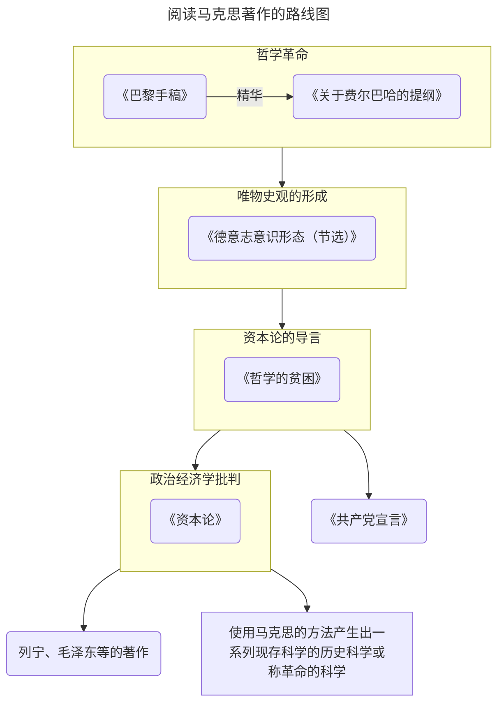
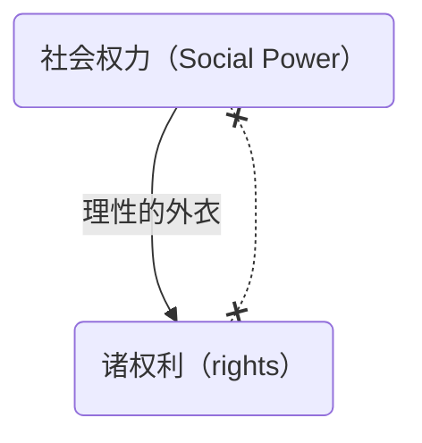

## 线索和框架

马克思在《1844 年经济学哲学手稿》（《巴黎手稿》）里面发动了哲学革命，而这场哲学革命的基本要点，以非常精要的方式概括在《关于费尔巴哈的提纲》中了。这十一条提纲，虽然文字篇幅很短，但是极为重要，它是对哲学革命成果的概括，是马克思打开新哲学所形成的全貌。就像阳明心学，王阳明有《传习录》，展开了王阳明心学的一个体系，这个体系的全貌概要的表达在他的《大学问》中了。与此类比，马克思的哲学革命的丰富内容概括在《关于费尔巴哈的提纲》中了，所以我们了解马克思哲学革命的内容，可以按照《关于费尔巴哈的提纲》这十一条的线索，一步一步了解。

我们获得了这场哲学革命的成果之后，就可以更加深入的学习后续的著作：《德意志意识形态》、《哲学的贫困》、《资本论》，加上前面的两部就构成了我们下面学习马克思的路线图了，之后可以更好的学习列宁、教员的著作，这场哲学革命的成果应该是**每一个共产党员都应该要有的基础哲学素养**。

这不是一件容易的事，就像雅可比说的那样：“即使是兴趣使然，如果你想深入了解欧拉、拉格朗日、拉普拉斯等人的成果，而不仅仅只是粗略的浏览，那你必须付出惊人的努力和代价。想要征服这些高山，你需要经历极度的焦虑和痛苦的思索。但是，如果你懂得数学之美，你就会非常平静地接受这一切。”这句话同样也适用于在历史的洗涤中流传下来的各种学说。

要深入了解马克思的成果，就是要付出惊人的努力和代价。我们好多人（包括我）其实大多都是名词党，每天挂在嘴边的各种名词、语句其实都不知道其真实的或者完整的内涵，甚至曲解了其本来的意思，但庄周又说：“吾生也有涯，而知也无涯。以有涯随无涯，殆已！”，就算挂在嘴边的名词我们也很难全都了解，那要如何？对于我来说，即要多读经典多深入思考减少“自以为是”的倾向，又要修炼“闭嘴”的功夫来消除“好为人师”的习惯。

《关于费尔巴哈的提纲》全文：

@Hdiv(classic){
@Hbq(){
@Hsp(){
@Hp(intent){一、从前的一切唯物主义（包括费尔巴哈的唯物主义）的主要缺点是：对对象、现实、感性，只是从客体的或者直观的形式去理解，而不是把它们当作感性的人的活动，当作实践去理解，不是从主体方面去理解。因此，和唯物主义相反，能动的方面却被唯心主义抽象地发展了，当然，唯心主义是不知道现实的、感性的活动本身的。费尔巴哈想要研究跟思想客体确实不同的感性客体：但是他没有把人的活动本身理解为对象性的［gegenständliche］活动。因此，他在《基督教的本质》中仅仅把理论的活动看作是真正人的活动，而对于实践则只是从它的卑污的犹太人的表现形式去理解和确定。因此，他不了解“革命的”、“实践批判的”活动的意义。}
@Hp(intent){二、人的思维是否具有对象的［gegenständliche］真理性，这不是一个理论的问题，而是一个实践的问题。人应该在实践中证明自己思维的真理性，即自己思维的现实性和力量，自己思维的此岸性。关于思维—离开实践的思维—的现实性或非现实性的争论，是一个纯粹经院哲学的问题。}
@Hp(intent){三、关于环境和教育起改变作用的唯物主义学说忘记了：环境是由人来改变的，而教育者本人一定是受教育的。因此，这种学说一定把社会分成两部分，其中一部分凌驾于社会之上。 @Hsp(intent,inline-block,mt4){环境的改变和人的活动或自我改变的一致，只能被看作是并合理地理解为革命的实践。}}
@Hp(intent){四、费尔巴哈是从宗教上的自我异化，从世界被二重化为宗教世界和世俗世界这一事实出发的。他做的工作是把宗教世界归结于它的世俗基础。但是，世俗基础使自己从自身中分离出去，并在云霄中固定为一个独立王国，这只能用这个世俗基础的自我分裂和自我矛盾来说明。因此，对于这个世俗基础本身应当在自身中、从它的矛盾中去理解，并在实践中使之革命化。因此，例如，自从发现神圣家族的秘密在于世俗家庭之后，世俗家庭本身就应当在理论上和实践中被消灭。}
@Hp(intent){五、费尔巴哈不满意抽象的思维而喜欢直观；但是他把感性不是看作实践的、人的感性的活动。}
@Hp(intent){六、费尔巴哈把宗教的本质归结于人的本质。但是，人的本质不是单个人所固有的抽象物，在其现实性上，它是一切社会关系的总和。 @Hsp(intent,inline-block,mt4){费尔巴哈没有对这种现实的本质进行批判，因此他不得不： }@Hsp(intent,inline-block,mt4){（１）撇开历史的进程，把宗教感情固定为独立的东西，并假定有一种抽象的—孤立的—人的个体。 }@Hsp(intent,inline-block,mt4){（２）因此，本质只能被理解为“类”，理解为一种内在的、无声的、把许多个人自然地联系起来的普遍性。}}
@Hp(intent){七、因此，费尔巴哈没有看到，“宗教感情”本身是社会的产物，而他所分析的抽象的个人，是属于一定的社会形式的。}
@Hp(intent){八、全部社会生活在本质上是实践的。凡是把理论引向神秘主义的神秘东西，都能在人的实践中以及对这个实践的理解中得到合理的解决。}
@Hp(intent){九、直观的唯物主义，即不是把感性理解为实践活动的唯物主义至多也只能达到对单个人和市民社会的直观。}
@Hp(intent){十、旧唯物主义的立脚点是市民社会，新唯物主义的立脚点则是人类社会或社会的人类。}
@Hp(intent){十一、哲学家们只是用不同的方式解释世界，问题在于改变世界。}@Hp(end,fangsong){——《关于费尔巴哈的提纲》}
}
}}

## 序言

<!-- {% include embed/audio.html id="frontend" src="d/%E9%A9%AC%E5%85%8B%E6%80%9D/aac/%5B2%5D--%E9%A9%AC%E5%85%8B%E6%80%9D%E5%AD%A6%E8%AF%B4%E4%B8%8E%E5%BD%93%E4%BB%A3%E4%BA%BA%E7%B1%BB%E7%9A%84%E5%85%B3%E7%B3%BB.aac"%} -->

<!-- {% include embed/img-card.html Dname="KARLMARX" bg="http://pan.fucku.top/img/post/mark/Karl_Marx%2C_1875.jpg" name="卡尔·马克思" con="无国籍" ski="历史哲学家" det="https://www.marxists.org/" %} -->

从19世纪到20世纪欧洲的国际共产主义运动全面展开，使得马克思的名字为全世界家喻户晓。人类已经进入了21世纪了，在21世纪我们人类所面临的共同的难题困境，在这样一个当代状况中，我们重新思考一个问题。这个问题就是：**马克思的学说与当代人类的关系是什么？**也就是要回答一个问题：**马克思的学说是否已经过时**。

这个问题哪里来呢？上世纪90年代有一位日裔的美国学者弗朗西斯·福山[^fushan]，发表了他那本著作《历史的终结和最后的人》[^lishi]。

这位日裔的美国学者在这本书里边说：“**随着苏东的解体，整个社会主义国家阵营的瓦解，历史终结了，未来将是自由的市场经济和议会民主的政治大行天下，广备全球，一个人类的千年福国即将开始，所以这叫历史的终结。**”[^l152]这本书在美国一时非常畅销，确实二十世纪留给二十一世纪的一笔重大的遗产就是**社会主义国家阵营的解体**。当时亲身经历了这一场世界历史性的巨大变故的人，在今天仍然能够回忆起当时的情景。这本书的一个非常重要的意思就是说马克思学说过时了，大概到了给马克思学说举行葬礼的时候了。

很快就有了反应，1993年美国加利福尼亚大学的一个思想与社会中心举办了一次大型的国际讨论会，这个会议的主题就是这样一句话，这样一个问题：马克思主义向何处去。加利福尼亚大学的这个思想与社会中心，邀请了包括美国在内的西方学者云集在加利福尼亚大学，这是场大型的国际研讨会。

法国哲学家德里达[^delida]应邀出席，德里达在他的大会的发言当中做了一篇长篇的演讲。这个演讲后来集成了一本小册子，也有中译本，上海艺文出版社出版，书名是《马克思的幽灵》[^youling]。

这篇演讲一开始，德里达就这样开始说了，他说：我从来不是一个马克思主义者，但我选择了一个合适的时机，向马克思表达我的敬意，没有马克思就没有未来。在今天这个地球上，所有的男人和女人，都是马克思学说，这笔精神遗产的当然的继承者，遗产不仅仅是一种赠与，而且是一种使命。那么德里达为什么要用幽灵这个词呢？马克思的幽灵？这是个双重的隐喻。首先会让我们想到共产党宣言开头的第一句话：**一个幽灵在欧洲游荡，共产主义的幽灵**；然后我们又会想到莎士比亚的戏剧《哈姆雷特》，哈姆雷特的父亲是被哈姆雷特的叔父谋杀的，后来哈姆雷特知道了事情的真相之后极为痛苦，因为他的叔父谋杀了他的父亲，娶了他的母亲，如果他要复仇的话，他一定伤害了他的母亲，但是他又不能不复仇。他处于如此巨大的痛苦之中，忧郁徬徨。他的父亲两次向他显灵，向哈姆雷特显灵，提醒了自己这个儿子，不要忘记了复仇的使命。德里达为什么也把这一层意思放进去了呢？在德里达看来，只要资本主义存在一天，整个资本世界存在一天，马克思就是个父亲般的幽灵，徘徊在资本世界上空，提醒着当代人类，**不要忘记了复仇的使命**。

@Hdiv(classic){
@Hbq(){
@Hsp(){
@Hp(){地球上所有的人，所有的男人和女人，不管他们愿意与否，知道与否，他们在今天，在某种程度上说，都是马克思和马克思主义的继承人。}@Hp(){不管我们喜欢与否，无论我们对他具有一种什么样的意识，我们都不能不是他的继承人。}@Hp(){遗产向来不仅是赠与，它同时还是一项使命，我们当下所是的存在的状况，就是最重要的遗产。}@Hp(){不能没有马克思，没有马克思，没有对马克思的记忆，没有马克思的遗产，也就没有将来。}@Hp(end,fangsong){——德里达《马克思的幽灵》}
}
}}

很显然，德里达的这篇演讲，针对的就是弗朗西斯·福山那本书《历史的终结和最后的人》。

历史真的终结了吗？资本主义的这种生产方式和它形成的社会状况将从此一帆风顺了吗？万里无云了吗？在这里我们可以看到美国公众在哲学上的浅薄，所以福山的这本书居然在美国成为bestseller（畅销书）。对这本书的批判之声立刻在欧洲学说界起来，这是一个我们今天可以回忆的一个片段，一个时代的转折点上的片段，它意味深长，所以今天我们就来试图进入马克思的学说的真谛之中，这很难。我们的课程标题就是马克思的哲学革命及其当代意义。这时候我就想起了叔本华[^shubenhua]当年对康德[^kangde]学说的评价，我们可以去读叔本华的那本代表作《作为意志和表象的世界》[^yizhi]。

在这本书的序言当中，叔本华是这样的谈论了康德的学说，叔本华说：“在康德伟大的学说面前，人类是难以教导的顽童，人类需要经过好几个世代的努力，才能慢慢地理解消化，吸收康德的思想。”我想说叔本华对康德学说的这一个评价完全可以移到对马克思学说的评价上去，**在马克思伟大的学说面前，人类是难以教导的顽童，要经过好几个世代的努力，好几个世代的人类的实践——社会实践 、生命实践，才能让大多数人真能去领会马克思的思想**，这是一个非常漫长的过程。马克思的思想是因为他发动了一场哲学革命才具备对未来的常识般的洞察力，这个洞察力的结晶，就是《资本论》[^zibenlun]这部著作品。

我们都熟悉《资本论》这本书吧，有的朋友大概在大学学习期间上过马克思政治经济学这门课，那么这门课程一定以资本论做基础。资本论对我们当下还处在其中的资本主义经济、社会和政治的未来的发展，做出的深刻的判断和准确的预言。迄今为止，任何研究资本主义的学者都未能超越资本论，这是一个客观的事实。许多当代经济学派，新型学派的创始人都从资本论这部著作当中获取他的灵感，有的人公开的承认了，有的人隐瞒了，所以这一切，都要加以指出：资本论学说是一种新型的**历史科学**，不是政治经济学。这种新型的历史科学是一场哲学革命。正如我们都已经知道的那样，一切科学都是从哲学中生发出来的，**哲学是科学的母体，科学是哲学的产儿**。

马克思发动了哲学革命之后，一种新型的科学，由马克思本人做了第一次示范，这门科学就是资本论的副标题：**政治经济学批判**。

我们还是回到这样一个话题上来，今天二十一世纪的人类跟马克思学说的关系究竟是什么？

马克思无需我们为他辩护，有许多学者怀着真诚的愿望，不断地为马克思学说辩解，其实不对，马克思学说何需我们为他辩解呢？我们今天的人跟马克思学说的关系是什么？ 我们要不断地向这门学说求教，要从中得到启发来面对当代人类状况所面对的困境和挑战。所以我们跟马克思学说的关系不是辩护，我们去继续求教。

当资本主义的经济发展比较平顺的时候，人们会把马克思遗忘了，当资本主义不可避免的危机再一次到来的时候，爆发的时候，就像08年金融风暴[^08]席卷全球，这时候人们又想起了马克思，向他请教了。据说08年那一年，在美国，资本论再度畅销，有许多年轻人结婚了，他们的亲人和朋友每每送一套资本论给他们作为新婚的礼物。我们还记得08年，美国的年轻人先是占领华尔街[^huaer]，后来在华盛顿安营扎寨，叫作占领华盛顿[^huasheng]。曾经被美国老百姓看成是民族英雄的华尔街的精英们成了罪人，这是刚刚过去的事情。于是人们又得向马克思求教了。

为什么马克思在今天仍然保持着他的生命力？要从源头上说起，这个源头就是马克思发动的哲学革命。马克思恐怕是不愿意称自己的学说是哲学的了。哲学，哲学家，在马克思的用语中成了贬义词，这是我们恐怕没想到过的，但这是真实的。我们引用了一段话，这段话非常著名，是马克思关于哲学的一段著名的格言，在柏林大学教学大楼底楼正门走进去，看到对面的墙上，就刻着马克思的这段话：**哲学家们只是以不同的方式解释世界，而问题在于改变世界**。细想想这段话的含义，首先我们看到了，在这段话里边，哲学家是不是个贬义词了，只是以不同的方式解释世界，换句话说马克思认为自己不是哲学家，如果我也算一个哲学家，我就也在解释世界，但是我看到的是什么，我看到的是世界的改变，这才是最根本的。无论用哪一种方式解释世界，其实前提就是对现状的承认，以不同的方式承认了现状，只是你用不同的方式来解释这个现状，**现存的东西不是等待我们去解释的东西，而是等待我们去改变和推翻的东西**。那么这句话就引起了广泛的关注，引起了欧洲思想界的广泛而持久的讨论。对这段话，举个例子，海德格尔[^hai]，在我看来20世纪最重要的德国哲学家是海德格尔，他的代表作是《存在与时间》[^tobe]。

许多中国读者都知道，海德格尔在晚年搞了一次三天的讨论班，讨论的主题就是马克思的学说，怎么理解它，然后海德格尔就把这段话拿来讨论了，他向马克思提问：确实世界要改变，但是哪一种世界的改变，不是对世界的解释做前提的呢？这是对马克思提出了明确的责难，我们可以承认实践的重要性，但我们实践要有方向嘛，我们想让这个世界往哪里走。这个判断哪里来，当然是来自对世界的解释，你这样解释世界了，于是你就这样去改变世界。哪一种对世界的改变，不是对世界的解释做前提呢？

我们把海德格尔的提问拿出来了，全部问题的要点在哪里呢？海德格尔这样一句提问，这样一个责难，是不是就把马克思这句话否定掉了呢？

问题又回来了，解释世界和改变世界的关系各位都一起思考一下，〔对世界的解释并不能带来对世界的改变〕我们同意的，〔但哪一种对世界的改变不由某种解释做前提呢？我们停留在对世界的理论态度是不行的，要有一个更好的实践态度〕我们也同意。在这样的往复的讨论之中，我们就陷入了悖论，一个循环，我们似乎走不出来了。就在面对这样一个悖论般的循环，我们怎么突破它，关键点在哪里。只有熟悉马克思的原著，只有深入过马克斯哲学革命发动的那个地方，就是深入到本书叫《1844年经济学哲学手稿》[^1844]，进入对这部手稿的研读之中，我们才有可能理解马克斯完成了一场怎样的革命。

我现在先把这个结论说出来，马克思认为对世界的解释态度是一个理论态度（纯粹的思维），人类需要解释，但不是解释世界而是**解释实践**。请注意，一个叫**解释实践**，一个叫**解释世界**，抓住这个理解马克思的基点，解释实践与解释世界的区分（世界在实践中被建构起来）。

我们面对的就是这样一个问题了，都说解释吧，确实任何世界的改变都以某种解释做前提的，这句话海德格尔没说错，但是海德格尔说的是，对世界的改变始终对世界的某种解释做前提，他用的是〔解释世界〕这样一个表达，而对马克思来说**〔真正有意义的解释，真正有意义的理论不是去解释这个世界的，是说明这个实践〕**，正是在这一点上我们可以进入马克思哲学的革命，马克思的哲学根本。

下面的问题自然来了，什么是实践？什么是世界？世界哪里来？假如我们把世界看成是某种现成的对象，客观地矗立在我们面前，然后我们去解释它，这就是理论态度了。有现成的世界矗立在我们面前吗？

世界哪里来，那么要先说一下实践这个概念了。实践这个词在汉语当中被广泛地使用，你别光说你得干，与其坐而论道，不如起而行之[^zhouli]，行干叫实践。

@Hdiv(classic){
@Hbq(){
@Hsp(){
@Hp(){国有六职，百工与居一焉。}@Hp(){或坐而论道；或作而行之；或审曲面势，以饬五材，以辨民器；或通四方之珍异以资之；或饬力以长地财；或治丝麻以成之。}@Hp(){坐而论道，谓之王公；作而行之，谓之士大夫；审曲面势，以饬五材，以辨民器，谓之百工；通四方之珍异以资之，谓之商旅；饬力以长地财，谓之农夫；治丝麻以成之，谓之妇功。}@Hp(end,fangsong){《周礼·冬官考工记》}
}
}}

是这样的吗？日常语言可以这么用实践这个词，没有问题。你还是多实践实践吧，实践出真知对吧。但是实践这个词在西方哲学的传统当中有它确定的含义，从哲学概念的角度上来说实践，它很明确实践是什么，是**创生或改变社会关系的活动**。社会关系就是人与人的关系，西方哲学在他的传统中向来在这个含义上运用实践的，因此当一个农夫把锄头砸下土壤耕地的时候，这个举动并不叫实践，因为它不改变社会关系或创造一种新的社会关系。所以马克思说以往的哲学，都是在解释一个作为我们认知对象的世界，但最根本的是这个世界如何建立起来的，这个世界离开人与人的关系也没有人与自然的关系，也没有一个所谓自在的自然界向人呈现出来。所以**世界是被建构起来的，在人与人的关系中逐渐形成的，当我们去解释世界的时候，我们就在解释现存世界是如何形成的，而不是仅仅说明这个现存世界，就是要指出这个现成世界如何被人的实践活动建构起来**。请抓住这个要点，正是在这个要点上我们来理解，去领会马克思的哲学革命。

## 社会权力的发现（理解后面的基础）

<!-- {% include embed/audio.html id="faxian" src="d/%E9%A9%AC%E5%85%8B%E6%80%9D/aac/%5B3%5D--%E7%AC%AC%E4%B8%80%E8%AE%B2%EF%BC%9A%E7%A4%BE%E4%BC%9A%E6%9D%83%E5%8A%9B%E7%9A%84%E5%8F%91%E7%8E%B0.aac"%} -->

我们在马克思的哲学革命这个题目下说要讲的第一点，也是延承了马克思思想的一个历程来讲的第一点，就是社会权力的发现。

我们现在面对一个概念叫**社会权力**，马上想到它不等于**政治权力**，通常在我们讲权力这个词的时候，我们头脑中第一个反应是什么政治权力，政治是权力的领域。但现在我们在权力这次前面加一个社会，叫社会权力。因为发现社会权力才导致马克思发动哲学革命。

我们简要回顾一下，马克思在完成了他的博士论文之后，本来是准备到波恩大学哲学系任教，一个非常欣赏他的布鲁诺·鲍威尔[^bulu]，当时的青年黑格尔派领袖找到他。

当时德国思想界的一场重大的斗争就是青年黑格尔派跟老年黑格尔派之间的战斗。青年黑格尔派的领袖布鲁诺·鲍威尔，他在波恩大学任教，所以当时波恩大学哲学系成了青年黑格尔派的阵地，布鲁诺·鲍威尔在柏林大学期间就认识了马克思，他们组织了一个博士俱乐部，年轻马克思的惊人才华深深的吸引住了布鲁诺·鲍威尔，鲍威尔认为马克思是他最重要的战友，所以不断写信给马克思，催他赶快去完成他那篇博士论文[^doctor]，赶快去对付好那个无聊的考试，在波恩大学哲学系有一个教职等着你。马克思也很高兴是吧，他终于停下来了，因为马克思这样一种思想家，他一旦思考一个重要的哲学问题，慢慢地想着想着就要构造体系了，这样那篇博士论文就没完没了，所以在布鲁诺·鲍威尔的催促之下，他草草收场，然后博士论文在耶鲁大学递交答辩，而且马克思本人没有出席。在马克思本人没有出席的情况下，耶鲁大学授予马克思哲学博士学位，得了博士学位的马克思正准备到波恩大学任教。消息传来，布鲁诺·鲍威尔在整个波恩大学失去了他的势力，他都难以在波恩大学继续混下去了，所以不可能有任何教职等着马克思。在这种情况下马克思只能放弃在大学做教授的这样一个职业理想，投身社会生活，到科隆去担任了当时的莱茵报的编辑，后来担任莱茵报的主编。

马克思在担任莱茵报主编期间遇到了一件事情，就是当时摩塞尔地区的贫苦的农民被莱茵省议会通过的一系列的法案限制了他们本来历史的权利：对周遭自然环境自然资源的历史的形成起来的权利。被莱茵省议会通过的法案剥夺了，其中有一个法案叫《林木盗窃法》。

摩塞尔地区的农民如果在树林里边捡拾那些枯枝败叶都属于盗窃林木。莱茵省议会是一个资产阶级议会，通过了这样的法案，保护林木所有者他们的权利，马克思站在摩塞尔地区贫苦农民的立场上跟莱茵省议会辩论[^linmu]。

这是场大的论战，马克思发表了一系列的文章前后大概有六篇，发表在莱茵报上，他的理论武器是什么，黑格尔的法哲学[^fa]。马克思这时候还是一个非常认真的黑格尔主义者，马克思在柏林大学期间，本来学的专业是法律，后来他的兴趣全转到哲学上去了，然后精研黑格尔的哲学著作，大受鼓舞，写信给自己的父亲，他说：“我一头扎到了黑格尔哲学的海洋之中了，他让我非常惊讶的发现，关于人类社会的历史和它的变迁就如自然界的历史变迁一样，浮现出某种严格的必然性，而这种必然性是由黑格尔的哲学展现出来了。所以他就进去了。”他说：“我当时关于许多法学的基本设想，放到黑格尔哲学中去发现他只是黑格哲学的一个起点。”想想看这时候他一定崇拜黑格尔了吧，我达到的我认为非常重要的某种真理性的认识，往黑格尔哲学体系中一放原来只是黑格尔哲学的一个开端，所以跟莱茵省议会辩论的时候他就拿黑格尔的法哲学做武器跟莱茵省议会战斗，这种辩论后来让马克思发现了莱茵省议会通过的剥夺摩塞尔地区农民的历史权利的那些做法都有法哲学的依据了，这对马克思来说是个痛苦的发现，令他痛苦的发现。理性能够解释为什么可以剥夺农民的权利，可以解释这件事，但是剥夺他们权利乃是一场**斗争**，物质利益的斗争。物质利益的斗争是无法用理性诞生的，他是现实中形成的，所以在那篇辩论的文章当中马克思终于写下了这样一句话：**利益是最讲究实际的，在这世界上没有什么比消灭自己的敌人更实际的事情**。我们今天读这样的话也觉得它真实，利益是最讲究实际的，在这世界上没有什么比消灭自己的敌人更实际的事。

人与人之间的关系，在物质利益的领域里边是种什么关系？是要消灭对方的关系！是生死斗争。人是理性的存在物，这没错，亚里士多德说人是理性的动物，是吗？那么一个理性的动物为什么要消灭同类呢？看来物质利益并不是个理性的东西，最近一个惊人的事情来发生了，刚刚发生的哈马斯发射五千枚火箭打以色列了，以色列全国宣布处于战争状态了，这场恶斗已经不可避免了，这种斗争的根源在哪里呢？理性不能解释这一切的。假如近代资产阶级在欧洲登上历史舞台之后宣布的人类未来的美好的途径都是以理性做基础的话——‘自由平等博爱’，为什么随着资产阶级社会的展开，资本的生产的展开，这实际状况都是对欧洲启蒙的思想家的所描绘的人类未来图景的一幅讽刺画呢？马克思来了。

1843年他还在《莱茵报》担任主编，后来这个《莱茵报》被官方封掉了。然后他到巴黎去了，带着满腹的苦恼，对黑格尔哲学的根本怀疑，到了巴黎。在那里紧张地思考，留下的文字就是什么，我们今天读到的《巴黎手稿》，全称《1844年经济学哲学手稿》，这是马克思哲学的诞生地，马克思发动哲学革命的地方。

马克思在1859年为他将出版的《政治经学批判》写了个序，非常著名的1859年《政治经学批判序言》[^xuyan]，在这篇序言当中他简要地回顾了自己思想的历程，他说：“我在1842年和43年间，我担任了莱茵报的主编，就物质利益问题跟莱茵省议会辩论，我遇到了就物质利益发表意见的难事，为了解决我的苦恼，我的第一本著作就是针对黑格尔法哲学所做的批判，”这本书后来没有完成，后面他说：“对黑格尔法哲学的批判让我认识到什么呢？物质生活关系的领域不是按照理性的精神安排的，人类的社会形态不是人类精神一般发展的结果，要解剖当代的市民社会必须到经济学中去寻找钥匙，就是到物质利益的领域当中去寻找钥匙。”大意如此。

这番介绍就是为了说明社会权力这个概念，马克思后来明确用了社会权力这个概念，先前没用。我们用英语来表达的话叫 social power 。我刚才强调了区别于什么 political power ， political 就是政治的， power 我们译成权力。物质生活关系的领域是个什么领域呢？是<em>权力的领域</em>，但不是政治权力，政治权力是国家，我们通常现在称为**上层建筑**。社会权力就是政治之前的，它本身是**非政治的**，所以叫 social power 。

现在我们先说明第一个问题， power 是什么？自然界中没有 power ， power 是人与人的关系，所以权力是社会现象，比方说一头狮子把一只羚羊吃掉了，我们能说这头狮子正在行使他对羚羊的权力吗？肯定不是，它只是自然界的食物链，狮子处于食物链的高端，羚羊处于食物链的低端，那么高端把低端自然当成食物了，这里边没有 power 的，所以 power 是**人与人的关系**，第一问，明确。那么第二问，这是怎样的人与人的关系呢？是平等的吗？是理性的吗？这种人与人的关系是这样的关系，<u>是一部分人支配、统治、奴役另一部分人的关系，统治与被统治、支配与被支配、奴役与被奴役。</u>（异化的社会）

第一是人与人的关系，社会关系；第二是非理性的人与人的关系，因为我们无法用理性本身来认证一部分人应当统治另一部分人、一部分人应当奴役另一部分人，<u>在理性的层面上我们只能论证人与人的平等</u>，如笛卡尔说的我思故我在，我们每一个人都是个能运用理性的主体，那我也称为你是个理性的主体，我们彼此尊重，是吗？那 power 呢？统治与被统治的关系呢？所以它是非理性的人与人的关系，这是第二点。第三它不是观念，不是 ideal ，它是感性的力量。

为了简要的说明第三点我们可以举最为简单的例子，比方说我们今天的人类的物质生活是不是在这个商品交换中展开的，那么既然是商品，它就有两个方面，一个是它的**使用价值**，一个是它的**交换价值**。比方说我有块面包，那么这块面包作为食物，是它的使用价值，我拿它来充饥的，填饱肚子的。假如我一共有五块面包，我吃了四块之后饱了，第五块面包已经吃不下去，多出来了，而你呢，一块面包都没有，饥肠辘辘，饿得要死，怎么办？按照佛家的精神，财布施，我把这块多出面包给你吧，你吃了我很高兴，是吗？人类的物质生活关系不是这样的，我这块面包假定它值一美元，这是它的交换价值，你肚子饿得要死是吧，我知道你饿得要死，你要吃到这块面包我能理解，但是前提是什么，你口袋里必须有 1 dollar ，你必须有一个美元，如果连一个美元都没有，饿死吧。佛教徒说不可能的，对佛教徒来说这绝对不可能的，这是毫无疑问。但是人类的经济生活并不建立在佛教的布施的基础上的，因为它是商品，有商品就有货币，那么就交换。

从这个例子当中我们发现一样什么东西呢？我手里握着这块面包就实用价值来说是可以填饱肚子的东西，就交换价值来说一个美元，这一美元一定不是这块面包的自然属性，是什么？社会属性，换句话说一块面包值一美元，这一美元就是凝聚在这块面包上的人与人的关系，同意吗？那么再问这个以一美元来代表的人与人的关系是理性的还是非理性的？你如果口袋里没有一美元饿死吧，对吗？它是非理性的。但是呢，你还是想要吃到这块面包，同时我也知道你口袋里一个美元都没有，还有另一种做法，我家里地脏了，玻璃也脏了，桌子椅子都得擦一擦，你到我家里把这些活干了，这块面包就给你了，你愿意吗？你一定愿意，你饿得要死，于是你愿意帮我干活了吧，换句话说我手中这块面包这一美元是种什么？是可以作为支配你的一部分生命时间的力量，这叫 power 。

我论证到这里了，请问，在逻辑上有偏差吗？找出我的漏洞来，整个论证过程得出一个结论，这一美元的面包此刻我不吃拿在手中，是拿了一个社会权力，这是结论。这块面包是我手中的一份社会权力。这个结论推出来，当中有逻辑问题吗？有逻辑毛病吗？有的话指出来，如果指不出来，承认，是吗。看来没办法指出我的论证当中有任何毛病，于是不得不接受这个结论。接受这个结论不得了各位，为什么不得了，你把经济学的根基铲掉了。

资本主义生产关系兴起之后就有一门科学逐渐的形成成熟起来，到了亚当斯密[^simi]那里成熟了，叫经济学。那么经济学讲的这个资本主义生产关系之中的经济制度是人类有史以来最合乎理性的制度，我们不用政治等级的权利来获取生活资料，我们是在市场上平等交换的。等价交换不是合乎理性的嘛，是不是人与人之间的平等的嘛，那么有一样东西也是可以被交换，叫劳动力，也是个商品，等价交换的形式发生了的经济关系完全合乎理性，假如经济关系是不合乎理性的，哪有经济学这门理性的科学呢？当马克思发现了社会权力的第一天，马克思注定不会成为一个经济学家的。资本论不是本经济学著作，永远不要忘了他的副标题：**政治经济学批判**。

<u>批判当然不是简单的否定，批判是什么意思？ 一、澄清前提，二、划清界限。</u>

澄清前提 
: 澄清这门科学的前提

划清界限 
: 划定这门科学的界限在哪里

澄清经济学这门科学的前提，划定这门科学的界限在哪里。它的前提是把一个非理性的 social power 穿上理性的外衣，即它是用经济范畴穿上去的变成理性的关系，它的界限在哪里呢？经济学无法讨论 social power 这种非理性的感性的关系，感性的力量，这种感性的力量是无法放到经济学的理性范畴中去的。

我很喜欢虚构，现在虚构这样的情况，此刻我们都坐在这里是吧，假定我王德峰口袋里有那么多货币，就装在我口袋里，远远超出我个人和家庭消费需要的范围之外，而假定你们在座的呢，一个个囊中如洗。对于个人生活来说多余的货币这种状况发生了结果会怎么样？

第一种反应，抢啊，但是有力量保护我的这个货币的，一个法律，一个国家机器：军队、警察、监狱，这就是**政治权力**，他也是权力，这个权力来保护社会权力的，因为<u>政治权力是社会权力生产出来的，派生出来的</u>，我有社会权力，我一定在政治领域里面形成保护我的政治权力。所以第一种假设呢，其实不可能发生，因为你们知道警察很厉害的，监狱也很厉害的。我这个私有财产的**权利**（不是权力）被政治权力保护着呢。第二种情况一定发生，我走到哪里，你们跟我到哪里，我一句话都没说，你们哇啦哇啦跟我说话，说什么呢？你不能把那么多货币放在你口袋里，我说我喜欢放在我口袋里，这不行的，我说为什么不行，你应该拿它来投资，或投资实体经济，或投资资本市场，反正这两种当中你要做一种，我说我都不会，你不会没关系，我们都会。这意味着什么，你们正在要求我雇佣你们，你们正在要求把你们的一部分生命时间由我来支配，在我口袋里多出来的那么多货币，它是什么？ Power ！除非我个人消费需要以内的，不是 power ，是什么？消费基金。超出我消费需要范围的就是 Social Power ，社会权力，在我口袋里呢，他说话没有呢？没有，它沉默，就是它**不要观念**，你们跟我说的全是观念，你们的观念哪里来呢？无非是承认这是个 power 呀！然后你们给我经济学观念，金融学观念。它没有说话，说话是你们，不说话的 power 才是正真的力量，让你去说这样的话了，叫经济学理论。

## 社会权力与法的权利的关系

<!-- {% include embed/audio.html id="socialpower" src="d/%E9%A9%AC%E5%85%8B%E6%80%9D/aac/%E6%A0%BC%E5%BC%8F%E5%B7%A5%E5%8E%82%E9%9F%B3%E9%A2%91%E5%90%88%E5%B9%B6%20%5B4%5D--%E7%AC%AC%E4%BA%8C%E8%AE%B2%2B%5B5%5D--%E7%AC%AC%E4%BA%8C%E8%AE%B2.mp3"%} -->

以上我们这个课程的第一点，就是社会权力的发现，我们知道马克思在《莱茵报》时期跟莱茵省议会的辩论，这场辩论让他发现了黑格尔法哲学是缺乏根基的，因为法哲学讨论的是法的理性。

如何来面对物质利益的纷争，黑格尔认为我们应用理性能够解决物质利益的争斗，让不同的物质利益服从一个理性的法则，理性的原则，那么这个理性的原则用 right 来表示就是权利，这个英文单词 right ，我学过英语的朋友知道，它可以翻译成权利。

马克思发现了整个社会世界的基础并不是如黑格尔所认为的通过理性来安排的物质利益关系，如果通过理性来安排的物质利益关系，这种物质利益关系就变成了 right ，其实是非理性的。物质利益的争斗要求消灭敌人，利益是最讲究实际的，在这世界上没有什么比消灭自己的敌人，更实际的事。在这里说出的是什么？<em>这个沉默的，不需要观念的，统治他人、奴役他人的力量</em>，我们刚才用的那个词叫 power 。我们现在的讨论，还不是在讨论政治权力，我们讨论的是 social power ，这是个重大的发现。这个发现的意义在于，马克思作为一个黑格尔主义者曾经相信整个人类世界的基础是理性的，现在他发现了人类世界的基础是非理性的物质生活关系，这种非理性的物质生活关系有一个另外的表达就是社会权力， Social Power ，这个重大的发现会导致马克思发动一场哲学革命。

什么是革命？革命就是**范式转换**，这个范式转换用英语来表达叫 Paradigm Shift 。

每一种学说都有一个核心的范式，假如这个核心的范式被改变了，就在这个学说的领域当中发生了学说上的革命。

一个社会形态也有它的核心范式，比方说封建主义的社会形态，它的一个核心范式就是地主，中国古代社会是如此，欧洲古代社会也如此，税赋这是最要紧的事情。这个以土地为基础的所有制，国家跟这个土地拥有者的关系就是税赋。后来地租资本主义来了，资本主义社会形成，资本主义社会的核心范畴就是**资本**，地租并没有消失，地租成了资本的一种形态，就资本的剩余价值的一种形态。我们有一些最起码的现代经济的尝试，<u>所谓剩余价值，有三种形态来体现的，一个叫产业资本家的利润，一个叫金融资本家的利息，还有一个就是土地拥有者的租金——地租</u>，所以地租仍然存在，但它已经不是中心范式了，在资本主义社会里边，它是资本范式的一个特例。这表明什么，社会革命发生了，从地主这个中心范式，转换为资本这个中心范式，就从封建社会转换为资本主义社会，这也是一场革命。革命在人类文明的各个领域里面向来都是进步的动力，物理学有物理学革命，化学有化学革命，人类社会形态有社会革命，一个人的一生的人生道路，也不断发生革命。当你恋爱的时候，这是一个人生阶段，结果呢，转换为婚姻，范式转换。在爱情当中 love 是它的中心范式，在婚姻当中，中心范式是什么呢？叫恩爱，就是夫妻之间的亲情，这也是范式转换，一场革命。所以革命不能被狭义地理解为街头暴力，流血牺牲，革命就是范式转换。街头暴力流血牺牲呢？这是向来以往的社会革命采取的形式。许多人提出告别革命是吧，这是狭义的理解的革命，其实革命是无法告别的，人类社会的每一个重要的进步都是革命带来的，社会的演变，社会的进步不是线性的累积，而是范式的转换，就像我们学物理学，整个学习物理学的过程也是一次又一次的革命的发生。学数学也一样，数学的基础部分，数论，我们小时候自然数，后来在小学读书的时候遇到了分数这个观念，一次数论革命发生了，自然数被重新理解了，后来又遇到了无理数这个概念，那么分数也罢，自然数也罢，都叫有理数了，这些数对以往数的理解发生了变革，变革之后呢原来的数还存在，它的意义被重新领会了，就像地租被成为资本的一个形态了一样的道理。

那么我们现在讲哲学的革命，西方哲学起源于古希腊。到了柏拉图[^bolatu]、亚里士多德[^yalishi]，那里最初的存在论或者说本体论，其实是存在论建立起来理念论，这是一个他们的中心范式。哲学的范式讨论什么，用理性来讨论事物存在者的存在规定，所以哲学的对象都是理性的存在者。人类的灵魂发挥他理性的能力可以认识柏拉图所说的理念，理念是非感性的，超感性的，所以西方哲学在它柏拉图主义的传统当中向来把哲学的对象看成是什么理性的存在者。现在马克思发现了什么，非理性的 power ，这就意味着什么，革命就要发生了，因为哲学的对象改变了，在理念论的传统的本体论当中，是无法讨论非理性的 social power ，这就要求范式的转换，所以哲学革命不可避免。现实中也一样，理论的革命，哲学的革命是现实生活变革的产物，没有资本主义的诞生就没有马克思的学说，而资本主义诞生，让马克思研究资本主义的本质规定的时候发现资本本质上是非理性的力量，资本就是能增殖的货币，货币表达了一个商品的交换价值，而这个交换价值是凝聚在商品上的人与人的关系，而这个关系绝不是理性的，是非理性的。

现在我们讲过了，那么现实中是怎样的呢？人类的社会生活，基础领域就是物质生活的领域，物质生活的关系是非理性的，所谓社会权力是一个**历史展开**的过程。奴隶制社会，那个社会权力就是一部分人作为工具，也就是作为奴隶，那么他作为奴隶主的财产被占有了，这是当时的社会权力，就人身依附关系，奴隶主与奴隶之间，这是当时的power。后来发生转变，进入封建主义，封建主义是什么，封建主和他所支配的农奴，半农奴或者行会手工业的师傅对徒弟和帮工的支配权是半人身依附关系，就是说 social power 又发生变化。到资本主义这种社会形态当中它的社会权力就是现在我们用的一个词叫**资本**，资本是种力量，是支配一部分人的一部分生命时间的力量。就像我刚才做的一个虚构，你们如果一个个囊中如洗，我口袋里全是多出来的货币，那么它就是一种力量，这种力量没有政治等级做基础的，不是说你向来是跟我有半人身依附关系，我可以支配你，不！我的货币就是一种交换价值，这种交换价值，当你不具备的时候，你不得不把你的一部分生命时间由我来支配，所以资本雇佣劳动这是一个经济学范畴。在劳动的市场上发生了资本与劳动力之间的等价交换，所谓经济关系。假如我们讲的是生产关系，两个概念不同的，一个叫经济关系,一个叫生产关系，经济学家把生产关系理解为经济关系，那么他一定符合经济的范畴和逻辑。**所谓等价交换，资本雇佣劳动，资本购买了劳动，这不就等价交换吗，完全符合理性，但是作为生产关系来理解呢，这个资本就是种感性的力量，它来支配一部分人的生命活动，它不需要经济学理论，它就是沉默的力量，在我口袋里呢，所以你们都跟着我走了，正在要求我支配你们一部分生命时间，不就这样吗。**

资本雇佣劳动是经济学表达，作为生产关系就是**积累起来的劳动行使了对当下活劳动的支配权**，这叫生产关系。**资本就是积累起来的过去的劳动**，除非你否定劳动价值论，也就否定亚当斯密和李嘉图，如果你承认劳动价值理论，这个劳动是指抽象劳动，这个价值是指商品的交换价值，那么就是过去积累起来的劳动。掌握在我手里了那叫资本，来支配你当下的活劳动，这是力量，不是等价交换。等价交换这个假象怎么会形成的呢？是因为劳动力也在市场中，那么就有竞争，于是劳动力的价格就上下波动，那么有一个基本上一个时间段的平均价格，不就是等价交换的意思，经济学给生产关系披上了一层，穿上了一件理性的外衣，我们都把这个理性的外衣看成是它的事情本身。我们认同的资本主义的经济制度就是我们认为它理性的，那马克思揭穿了说非理性的。

王国维说的对的，世界上就两种学问嘛一种学问叫可爱而不可信，如政治经济学；一种学问叫可信而不可爱，马克思的资本论学说。他可信，他不可爱，因为他不讲理性了。所以现在我每一个被雇佣的劳动者呢，他觉得他跟雇主之间是平等的，于是我们就心安理得。假如一些正是如理性的外衣所表现出来的平等，那么这个社会就没问题，但是劳资冲突斗争始终没停下来过，而且斗争就意味着什么， social power 需要转变。

我们看到马克思学说，我们今天是无法拒绝的，这是可以理解的。现在我们来说一件要紧的事，哲学要革命了，也就是要范式转换了。这个范畴转换的动力来自于哲学发现了自己无法讨论的对象，就是非理性的东西。我们举个简单的例子，西方哲学到近代有一个分支叫法哲学，那么黑格尔晚年的最重要的著作就是《法哲学原理》，那么法哲学用英语怎么表达的， Philosophy of Right ，我们现在翻译成法哲学，权利哲学。法就是权力体系，有种种权力。<u>一个由诸权力构成的体系叫法</u>，所以叫法哲学。好，现在我们看这个权力哪里来的，从法的理性的观念中推出来的，我们想应该是这样，所以进入了法学院学习法学这个专业的学生一定要修一门课，叫法理学，更进一步要修法哲学。法哲学还分了两种，权利看成自然权利的，也就是看作是这个理性规定出来的成文法，所以有两套法的体系，大陆法系和英美法系。权利来自哪里？当你学法哲学的时候你认为来自认为成熟了的理性，理性到近代成熟了，孟德斯鸠写了那本书叫《论法的精神》[^fade]。黑格尔有法哲学原理了，所以把权利看成是来自理性自己的推论，然后规定每一个人的权利。权利真这么来的吗？就像我刚才说的例子当中，我有那么多多出来的货币，它没有说话，没有观念，没有论证自己，但它就是力量，没有钱的人没有货币的人跟着我走了。那么有人说可以抢啊，不要跟着他，抢他就好了，但不能抢的呀，为什么？法律在，这个货币，我口袋里的这个货币是我的私有财产，私有财产乃是权利。我支配别人的力量，支配他人的一部分生命时间的力量是来自法律赋予我的私有财产的权利吗？哪怕法律没给我私有财产的名分，不给我这个 right ，我多出了那么多货币它仍然是种力量，它可以表现为什么，我开个地下工厂可以吧，因为他违法，所以放到地下，大家都不知道，但是有人来干活，因为资本在，这不过因为法律没有确证（confirm）它，没有对它做事后的确证，所以只能偷偷地干，秘密地干。秘密地干也是一种力量，就是它真实的力量，终于有一天，在一个国家的上层建筑，有一块就是法的上层建筑，它承认了这种力量，承认了这个 power 。怎么承认呢？赋予它一个法的观念，叫right，权利，那它就公开合法了，**并不是公开合法这件事情让他成为power的，而且他本来就是power，终于披上了理性的，法的理性的外衣成了right**。

中国在计划经济时代的晚期就有许多人从事体制外的商品贸易，这种活动当时被称为什么？投机倒把。道德上不接受，法律上不承认，但是在体制外从事投机倒把的人的口袋里多出了那么多在体制内工作的人没有的货币，它是真实的力量，它拥有未来，后来果然拥有未来了，改革了嘛，承认了，个人口袋里多出来的货币是个公开可以拿来做资本用的东西，于是投机倒把不再被称为投机倒把，又被称为搞活经济了。

于是我们就来讨论社会权力与法的权力这两者的关系，这关系非常简明，用一个简单的图示:

right来自social power，非理性的power，这个箭头表示穿上理性的外衣，从权力中产生出权利，其实right 和 power 本来是同一个东西，它们得到了不同的表达，被理性的表达了。

**把法的范畴加到非理性的power上，但你把范畴清洗掉就看到事情本身，这叫现象学原则，你不把范畴清洗掉，它变成法的事实，私有财产不可侵犯，这是一个法的事实，但它不是事情本身。我现在谈到现象学运动，胡赛尔的现象学运动的第一个口号是什么？回到事情本身，而不是从事实出发。事实不是事情本身，有法的事实，有经济事实，有政治事实，都已经被范畴规定了，政治学范畴规定了政治事实，经济学范畴规定出经济事实，法的范畴规定出法的事实，都是事实，并非事情本身。**

哲学革命因此开始发生，法哲学的对象是理性的，权利理性的。现在呢，我们跟着马克思发现了social power，换句话说哲学对象就改变了，原先是什么 ，Philosophy of right，现在要求一种这样的哲学，Philosophy of power。哲学的对象成了非理性的power，这个哲学怎么做？哲学的学术怎么建构？哲学的理论的核心范畴一定要发生变化了吧，从 Philosophy of Right 转变为Philosophy of Power，这个转变，就是马克思的哲学革命。马克思发动了这场革命，是马克思在1844年在巴黎发动的哲学革命，留下《1844年经济学哲学手稿》。

1844年这一年，有一个未来将震动整个欧洲的思想家出生了，他叫尼采[^nicai]。尼采诞生于1844年，这当然是种巧合，但是这个巧合让我们觉得非常有意思，尼采后来就跟着马克思，但他不是学马克思，他自己也发动过这些革命，这些的对象也是power，权力哲学，并不光是马克思一个人提出来，后来尼采也提出来了。受马克思和尼采深刻影响的，后来的法国哲学家福柯，继续沿着这条路走，并且确认什么？knowledge is power，知识也是power。福柯写了《知识考古学》[^zhishi]——解构主义哲学。福柯后来回顾，对他一生影响最大的思想家就两个，一个马克思，一个尼采。

我们继续推论，如果知识也是power，那教育也是power，为资本主义社会再生产被雇佣的劳动者，他哪怕很光鲜，IT工程师，足够光鲜，但他也是被权力支配的。现在有个名称叫码农，就跟农民一样的，特别好，道出了事情的真相。技术科学研究服从资本运动了，那么教育肯定要服从资本运动，除非人文教育跟资本没关系，这些人保留在他的精神世界的领域里面，基础科学的研究者或纯数学的研究者等等。

我们回到这件事情上来，于是马克思完成了这场哲学革命之后的哲学跟哲学革命之前的哲学有根本的差别了，这种差别叫范式的转换。我们如何去描述这个非理性的power以及它的转变，从过去的social power转变到今天的social power，可能还有未来的social power，这叫历史，但是历史曾经被放到理性的逻辑当中加以讨论——历史哲学，但是社会形态的演变是非理性的。物质生活关系的演变，也就是social power的演变，我们如何去描述这样一个演变的过程呢？

## 扬弃唯物与唯心的对立

<!-- {% include embed/audio.html id="weiwuweixin" src="d/%E9%A9%AC%E5%85%8B%E6%80%9D/aac/%E6%A0%BC%E5%BC%8F%E5%B7%A5%E5%8E%82%E9%9F%B3%E9%A2%91%E5%90%88%E5%B9%B6%20%5B6%5D--%E7%AC%AC%E4%B8%89%E8%AE%B2%2B%5B7%5D--%E7%AC%AC%E4%B8%89%E8%AE%B2.aac"%} -->

@Hdiv(classic){
@Hbq(){
@Hsp(){
@Hp(intent){从前的一切唯物主义（包括费尔巴哈的唯物主义）的主要缺点是：对对象、现实、感性，只是从客体的或者直观的形式去理解，而不是把它们当作感性的人的活动，当作实践去理解，不是从主体方面去理解。因此，和唯物主义相反，能动的方面却被唯心主义抽象地发展了，当然，唯心主义是不知道现实的、感性的活动本身的。费尔巴哈想要研究跟思想客体确实不同的感性客体：但是他没有把人的活动本身理解为对象性的［gegenständliche］活动。因此，他在《基督教的本质》中仅仅把理论的活动看作是真正人的活动，而对于实践则只是从它的卑污的犹太人的表现形式去理解和确定。因此，他不了解革命的、实践批判的活动的意义。}@Hp(end,fangsong){——《关于费尔巴哈的提纲》一}
}
}}

马克思发动了哲学革命，我们知道他为什么要发动，以及这个哲学革命产生的成果是**历史唯物主义**。那么我们还得进一步了解哲学革命本身的内涵，马克思的哲学革命包含哪些内容？

首先要讲的就是马克思提出了感性活动存在论。为什么提出这种存在论是哲学革命呢？因为感性活动存在论扬弃了唯物主义和唯心主义的对立，这是一个很大的问题。我们现在一般的讨论都说马克思是个唯物主义者，马克思本人也用唯物主义这个词来称呼自己新的思想，但是马克思称自己的唯物主义前面是有限定词的，即把**感性理解为实践活动的唯物主义**，也可以非常简要地称其为**实践的唯物主义**。

马克思把实践的概念融入到存在论中去。存在论，我们中国近代以来翻译西方哲学著作，遇到这个词ontology，英语当中的ontology。中国近代以来翻译西方哲学著作，关于ontology该怎么翻译成汉语没有定论，一开始叫万有论，这是一种译法；或者叫本根论，又是一种译法。总觉得不妥当，后来本体论被普遍接受。那么现在看来，还是不妥当的，因为ontology这个词说的是这样一种学说，Onta是诸存在者，来自希腊语，种种的存在者，所以是复数，这是个复数名词Onta。所以最初译成万有论也是因为这个缘故，但是万有论这个译法不好，如果有万有论这种学问，那么所有对万事万物的讨论都包含在里面，那么其他学科也就没了，所以万有论不妥。本根论也是一种译法，这是一种关于诸存在者的学问。“-logy”是一个后缀，通常用来表示学说或学问，比如说什么是心理学，Psychology，关于人类心智的科学，关于人类心智的科学叫心理学。所以这是个后缀，那么前面是诸存在者。这门学问在欧洲语言当中的构词法来说，他就是关于诸存在者的存在规定的学问，讨论存在问题的，所以译成本体论还是不妥当的。在大多数情况下我们扭不过习惯，所以我写文章有时候经常还是称它为本体论的，但是合适的说法应该是存在论，存在者的存在规定的学问。现在我们用存在论这个译法，因为本体是中国哲学概念，而且在中国哲学之前还没有这个概念，佛学进入中国，才讲了本体，比方说禅宗讲本心，心之本体，然后宋明理学家受禅宗的启发和影响，就开始把孟子讲的心称为本心，本心仁体，简称为本体。所以用本体论来翻译ontology会产生误解，所以其实欧洲哲学中没有中国哲学中的所谓本体。所以我们现在把这个词ontology译成存在论。

存在论的基本问题就是讨论存在者的存在规定。恩格斯后来写了一本书，这本书的书名叫《路德维希·费尔巴哈和德国古典哲学的终结》[^zhongjie]，这本著作也是蛮有名的，《路德维希·费尔巴哈和德国古典哲学的终结》，简称《提纲》，是马克思主义哲学中的经典著作之一。这本书里面恩格斯讲，全部哲学的基本问题，特别是近代以来全部哲学的基本问题，就是**思维与存在的关系**问题。他说在这个问题上分出了两大阵营，一个唯物主义阵营，一个唯心主义阵营。主张存在第一性，思维第二性，主张物质第一性，精神第二性的，叫唯物主义。倒过来的，主张思维第一性的，精神第一性的，存在或物质是第二性的，那叫唯心主义。这是中国近代以来，特别是建国以后我们学校的教育，从基础教育到高等教育，要讲哲学的话，教科书里都这么写的。所以我们大概每个人都有这样的认识，即哲学领域里边分了两大派别，唯物主义一派，唯心主义一派，那么真理在唯物主义那一边，是吧？你们唯心主义是没有真理的。这是我们长久固定下来的一种认识。既然马克思自称唯物主义者，那么我们也相信马克思站在唯物主义阵营中了。如果这么理解的话，或者现在还有许多人继续这么理解，也就错失了马克思发动的那场哲学革命的一个基本方面。这个哲学革命的基本方面就是<em>超越唯物与唯心的对立</em>。

说话要有根据的，先说文本的根据。马克思在1844年发动哲学革命留下的文献是《1844年经济学哲学手稿》，到了1845年，马克思在他的笔记当中写下了《关于费尔巴哈的提纲》，时间是1845年春天。这个《关于费尔巴哈的提纲》与1844年的手稿这两篇文献之间的关系是什么？

在1844年手稿里面发动了哲学革命，而这场哲学革命的基本要点，以非常精要的方式概括在《关于费尔巴哈的提纲》中了。所以这十一条提纲，虽然文字篇幅很短，但是极为重要，它是对哲学革命成果的概括，是马克思打开新哲学形成的全貌。就像阳明心学，王阳明有《传习录》，展开了王阳明心学的一个体系，这个体系的全貌概要的表达在他的《大学问》中了。与此类比，马克思的哲学革命的丰富内容概括在《关于费尔巴哈的提纲》中了。所以《关于费尔巴哈的提纲》是马克思哲学革命的全貌，所以我们了解马克思哲学革命的内容，可以按照《关于费尔巴哈的提纲》这十一条的线索，一步一步了解。

先解决一个问题，马克思是否超越了唯物主义和唯心主义的对立，或者是扬弃了唯物主义和唯心主义的对立？马克思既批判唯物主义，也批判唯心主义。一开头先批判唯物主义，那么先要说唯物主义意味着什么。这种存在论叫唯物主义存在论，它的基本思想是什么？我们大概都背得出来。我们平时说的马克思教材，讲马克思主义哲学四句话：世界是物质的，物质是运动的，运动是有规律的，规律是可以认识的。基本完备。说世界是物质的是存在论，物质是运动的也是存在论，运动是有规律的辩证法进去了，这规律是辩证规律，规律是可以认识的认识论立场进去了，叫可知论。唯物主义思想一定是可知论，因为精神被认为是对物质的反映，思维被认为是对存在的反映，是能反映的，可知论。

那么讲讲物质存在论，我们至少要了解它的基本道理，然后再着手批判。首先，唯物主义告诉我们，这个世界是客观的，不是主观的。所以特别要批判，比如说遇到王阳明了，你得批啊。怎么批呢？王阳明说心外无物，外物都在心中，心之外没有物，这都是唯心主义。你用唯物主义的观点来批嘛。按照你王阳明的说法，心外无物，这个由诸物所构成的世界，这个世界全来自你的心，那他就不是客观的嘛，叫主观唯心主义，所以批判！你就站在客观唯物主义的立场上批。这个世界为什么是客观的？有一个基本范畴叫物质，物质是什么？物质是不依赖人的意识和意志的客观存在，或者叫客观实在。我们现在重温一下唯物主义，我们其实都有唯物主义的修养，而且在本能般的常识般的信任这一点，因为我们心中有一个概念，叫客观实在，不以人的意志和意识为转移的客观实在。这个客观实在用英语来表达是什么呢？Objective reality，Objective，客观的，reality，实在。我们先为唯物主义论证一下。

***严谨的学问的态度，学术的态度是什么？假如你现在反对这种主张，反对某种主义，反对某种观点，你第一步是先站在这个观点的立场上为他做论证，而不是先否定他。这是学问的基本态度。你不同意这个观点是吧？你马上就否定他，那是没有学术修养的表现。修养的表现的第一件事情就是站在他的立场上，尽可能为这种观点或者这种立场进行辩护，终于辩护不成了，才发现你要反对这个观点的根本弱点，他的问题出在哪里，你才能去批判他。***

我们现在要把唯物主义作为我们自己准备主张的立场来做认真的探讨，终于论证不了了才出问题，才发现了问题。好，唯物主义存在论，客观事物都是物质的事物，不是由人的精神派生出来的，不是人的心或者思维构造出来的，它客观存在，有没有人都存在，没有人他也存在是吧？你不相信这一点是吧？那我告诉你，假如你相信英国的唯心主义者，比如说贝克莱——物是观念的复合，一个事物实际上是一个观念的复合。你相信这一点是吧？一辆汽车向你奔驰而来，你别躲，这是观念的复合，是吗？你肯定躲了。为什么？因为它一定会把你撞死。观念不可能撞死你的，它可是物质的东西嘛。你得相信唯物主义了。那么请问思维怎么发生的？离不开大脑皮层吧，大脑皮层是不是物质的组成？当然是很高级，很高级的神经系统，但它是物质的。你把这个大脑皮层物质的组织拿掉，你怎么思维？你似乎要求一个无头脑的思维。假如事物都是你的思维构造出来的，你的心构造出来的，那你父母是不是你生出来的？又是一个毒辣的问题。对唯心主义的一个毒辣的提问，那唯心主义就没办法活了，受不了了。这几个问题都很清楚：汽车开过来你逃不逃？没有大脑皮层你如何思维？你如果认为物质事物都是你的心构造出来的，你的思维构造出来的，那你是不是把你的父母也构造出来了？是父母生了你，还是你生了父母？很厉害啊。看来我们要坚持唯物主义了。但是问题的要点在哪里？物质，有这样的东西吗？我们所能知道的是事物，种种的事物。比方说，有鱼啊，有花，有鸟啊，有树啊，有河流啊，有星辰啊，有山脉啊，种种事物，万事万物是吧，它们倒是真实可见的，可感知的。那么这些可感知的事物，它们彼此之间的区分是谁做的？鱼是鱼不是花，花是花不是鸟，树是树不是河流，这种区分是谁做的？

回顾一下，王阳明的一个朋友对王阳明提出责难，那一段很精彩的。王阳明说心外无物，心外没有东西的。那么他的友人就跟他讲了：你说心外无物，我且问你，那山间的花自开自落，与你的心何干？这问得好，我们同意吧，山间的花自己开放了，自己又掉落了，不管有没有人，它总如此吧，与你的心有什么关系呢？你说心外无物，这是王阳明的友人对王阳明提了一个唯物主义的反驳，对心外无物这个命题做了一个唯物主义的反驳是吧，我们很愿意同意，是不是很愿意同意？

那么王阳明怎么应对呢？怎么回应这个问题呢？王阳明这么回应的。王阳明说：汝未去看那花时，汝心与花皆寂然无声，都不存在了。汝一看此花时，汝心与花一时都明了起来。就这样回答了。我们不免要想一想，王阳明这回答是不是很好的对唯物主义的反驳又做了反驳。当时我读到王阳明这段话的时候，我觉得他回避了问题。友人要跟你讲的是花是客观存在，你不能否认花的客观存在吧，而他却跟你讲，你如果不去看花，你的心跟那个花也都不存在了。人家说的是花自开自落嘛，与你的心何干？你偏要说，若不去见那花时，汝心与花一时俱灭，你一旦去见了，如心与花一时都明了起来，这算什么话嘛？我当时的认识水平就这么低啊，就觉得王阳明没有有效地回应那个来自唯物主义立场的反驳。

@Hdiv(classic){
@Hbq(){
@Hsp(){
先生游南镇，一友指岩中花树问曰：“天下无心外之物，如此花树在深山中自开自落，于我心亦何相关？” 先生曰：“你未看此花时，此花与汝心同归于寂；你来看此花时，则此花颜色一时明白起来，便知此花不在你的心外”。
}
}}    

随着哲学学习的深入，境界开始提升了。我觉得王阳明回答得很好。比方说花吧，某样东西被称为花，这件事情，不是这个东西自己把自己和它物区分开来的，这个区分一定是人做的吧。诸物之间，事物与事物之间的区分，都是人心给出的。你把人心的规定拿掉，统统拿掉，我们没有此事物和彼事物。那么还说客观存在，什么东西，〔物质〕。最后只能说物质了。既然讲世界是物质的，等于是什么都没有说。没有万事万物彼此的区别了，你用物质这个词等于没有世界了。物质世界这个词语是哲学上的错误。这两个词在哲学上是非法联用的，有语病的。物质怎么能是世界呢？因为世界是诸存在者，各种不同的事物构成的。你没有各种不同的事物，只有物质，它哪里是世界？动物是没有世界的。动物只是恰好被安置在它所处的那个物质环境里了，它没有世界。只有人类却有大地山川、云城河流、万象呈现。为什么万象能够呈现？因为在语言中，人有语言了，于是世界来了。动物是没有语言的，除非你把广义的信息传达也称为语言，那动物也有语言。但是人类的语言是由语词构成的，还有一个个句子，是吧？这些词语都是观念吧，这种观念跟事物关联了，把事物彼此之间区分开来。所以连基督教都讲了这个道理。上帝造人，用泥土造的，光用泥土造只是造出人的形体，还差最后一道工序，什么工序？对他所造的人的形体吹一口气。什么叫吹一口气？让他有了语言。于是人成功了。语言是存在的家，人在语言之家，这是海德格尔说的。我们在这个屋子里，在屋子里面种种的事物，椅子、桌子、灯，朋友们坐在地上，周围的一切。因为有人才有这种事物的区分。什么叫有人？有人在语言中了。语言是什么？人性给出语言，人与人的交往给出语言。语言离开意识，哪里就有语言？语言离开人的意识会有语言吗？

@Hdiv(classic){
@Hbq(){
@Hsp(){
@Hp(intent){语言是存在之家，人以语言之家为家。}@Hp(end,fangsong){——《关于人道主义的书信》海德格尔}
}
}}

好，我们还是想彻底地坚持唯物主义，我们要做一个彻头彻尾的唯物主义者，我们要把唯物主义坚持到底该怎么办？各位，该怎么办？比方说你吃饭，你千万别想，我正在摄取卡路里，那完了，唯心主义又来了。我正在吃法国大菜，又是你先规定的。不能想，也不能言说，最终才是彻底的唯物主义。不能想不能说，只是吃，跟动物没区别，这才是个彻底的唯物主义者。一辆汽车把某人撞伤了，这件事情，就唯物主义者的立场来说，很简单，我们也觉得很简单，但它跟世界没关系，跟人的语言和思维都没关系，就是两样东西碰撞。但是你把这两样东西碰撞要说一说的话，立刻唯心主义。你把它描写为一个力学事件可以吧，力学规定就上去了。你被它撞了，别说你痛了，也别叫我痛了，痛那么语言来了。我们就这么坚持彻底的唯物主义了。

好，我们对物质存在论有了解了。这种哲学当然有一个重要性，就避免人的主观偏见，避免把主观的想法强加于客观的事物。客观事物这个概念成立了。唯物主义者说客观事物，我们也说客观事物。哪怕不是唯物主义者说，你也承认客观事物。但承认客观事物，并不是把这个事物的客观性交给物质这个概念。把它交给物质这个概念叫物质存在论，终于是空话，因为没有世界了。世界是客观的，因为语言是客观的。我们进入语言的话，我们就摆脱了主观的个人状态了，就进入了一种客观。举个简单的例子，比方说水龙头拧开了你去洗澡，你去洗觉得这水很冷，另外一个人也去洗了，也是同样这个水，他觉得太热了，主观感受状态，它不是客观的。那么什么情况下是客观的呢？你用一个范畴，客观思维的范畴有一个叫度，我们知道有好多范畴吧。你把这个范畴用到水温上去，叫温度，是吧？那么这个温度是不是可以测量的？所以不要说水过热了还是过冷了，这叫主观的事情。我们进入客观吧，好，几度？35度还是37度，或者40度了，这就不用争论了吧，这叫客观的东西来了。请问这客观的东西它的客观性扎根于什么？扎根于它的物质性吗？不，咱们有语言吧，因为语言是我说话你听得懂啊，你说话我也听得懂啊。我们进入语言就意味着进入一个公共世界。当我们进入语言的时候，我们就摆脱了个人的主观感受状态了。哲学上所追求的客观性是这个东西，不是物质性。这是一个关于唯物主义存在论的一个讨论。我们这里已经进入了西方的哲学篇章了。西方的唯物主义最终提炼出一个范畴叫物质。物质实在来说就是个范畴。列宁说的对，**物质是表示客观存在的哲学范畴**。这是他对于唯物主义物质这个范畴说了句非常正确的话。但是把物质当成是世界的存在的基础，一切事物都是物质的，又是一句空话。我们能跟物质打交道吗？我们只能跟物打交道，我们不可能跟物质打交道，同意吗？我们或跟鱼打交道，或跟花打交道，或跟树打交道，或跟河流打交道，我们怎么可能跟物质打交道呢？

这样的物质存在论意义上的唯物主义不是马克思的唯物主义，倒是要一开始就批判这种唯物主义，因为马克思仍然说自己是唯物主义者，所以他不是泛泛地说一切唯物主义错了，因为他自己也叫唯物主义者，当然是实践的唯物主义。所以他把跟他不同的唯物主义都前面加一个字叫旧，旧唯物主义。换句话说，他是新唯物主义。新唯物主义就不是物质存在论的唯物主义，不是物质这个范畴做基础的唯物主义。好，我们念一段《关于费尔巴哈的提纲》第一条：“从前的一切唯物主义（包括费尔巴哈的唯物主义）主要缺点是，对事物、现实、感性，只是从客体的或者直观的形式去理解，而不是把它们理解为感性的活动，当做实践去理解，不是从主体方面去理解。”这一段话，很短的一段话，批判了旧的唯物主义。换句话说，既批判了物质存在论的唯物主义，也批判了费尔巴哈的直观的唯物主义。它们的缺点是什么？缺点是它们没有认识到**所谓事物、所谓现实、所谓感性，都应当被理解为实践。**把事物、把现实、把感性都理解为实践，实际上就有主体活动在里边了吧，也就是从主体方面去理解事物。这是非常非常有意思的一段话，并不那么容易理解。我们总相信事物在我们之外客观存在，但马克思说这样的想法就是旧唯物主义，把主体拿掉，把人的活动拿掉，把感性活动拿掉，实践拿掉，有这个事物吗？不会有了。马克思这层意思我们要达到马克思这个境界，不是一件容易的事。

我们都学过西方自然科学吧，从小学开始叫自然常识课，然后初中到高中，我们学自然科学，会有一个朴素的唯物主义信念。学自然科学意味着什么？科学，拿自己的概念，拿自己的理论，去反映外部事物，表达了外部事物的物理属性、化学属性、生物属性，是吧。你跟一个自然科学家这么讲：你知道吗？你研究的那个外部自然事物，客观的自然事物，其实是能够直接建构起来的，是通过实践活动建构起来的。他信不信？自然科学家就不能接受这一点了。自然科学家说我们的科学认识就是我们作为认识主体，客观地去认识外部事物，而且价值中立，不偏不倚。我们所得出的科学结论都是价值中立的，跟人的主观愿望也没什么关系。这个客观现实，比如说物理实在，你不研究它，它也这样；你研究它，要准确地认识它的话，千万别干扰它，是吧，客观反映嘛。

西方自然科学在其最初阶段上，就是保持着这种天真的唯物主义信念。我们学自然科学，我们都有经验。比方说初中开始学物理学了吧，或者化学。我们作为学生，中学生的时候我们是不是这样想的：科学，伟大的地方在于什么？它客观的，不偏不倚的，正确地反映了外部事物，这就是关于科学的一个唯物主义的信念。你研究自然科学，你就应当是个唯物主义者。如果你是唯心主义者，你怎么可能做自然科学研究呢？是不是这样想的？天真。今天的自然科学家、现代以来的自然科学家都摆脱了这种天真的唯物主义。我想起尼采那句话，尼采这么说的：人们从事物中发现的东西，其实是预先塞到事物中去的。塞进去叫艺术和宗教，重新把它领出来，叫科学。它意味着什么？当尼采最初说出这样的话的时候，他的欧洲同胞们大概都听不懂的。我们从事物中发现的东西实际上是能塞进去的，就不是事物自身的东西，就是这个意思。科学是做了后面一步工作，把能已经塞进去的东西再把它拧出来。换句话说，尼采认为科学并没有所谓客观地反映外部事物自身的属性，没这件事。科学所说的事物自身的属性，物理属性、化学属性，并不是事物自身的。

@Hdiv(classic){
@Hbq(){
@Hsp(){
@Hp(intent){我们通过科学从事物中发现的东西，其实是预先塞进去的，塞进去叫艺术和宗教，重新把它领出来，叫科学。}@Hp(end,fangsong){——《权利意志》尼采}
}
}}

怎么理解？我们举个例子就明白了。人类冶炼金属的历史早不早？非常早。所谓青铜器时代，在青铜器时代人类有化学这门科学吗？没有。人类冶炼金属这个活动的动力来自哪里？需要跟事物这样打交道嘛，然后在想象中，想象来自当初的艺术，来自原始宗教。你在这里所说的宗教是原始宗教，原始心灵。原始心灵他没有科学的，没科学的。但已经成功地冶炼出青铜了。换句话说，跟事物如此这般打交道并不以认识事物的客观属性做前提的。人的生存需要跟事物打交道，那么打交道的根据在哪里呢？没科学的根据，就是想象，就是哲学，就是某种感悟，是吧？它不是所谓科学认识，不是的。人类文明的历史告诉我们，无论是青铜期的冶炼，还是别的领域的活动，都不以认识做前提。跟事物打交道就是实践。后来科学起来了，科学有了不起的文明作用，因为人跟事物打交道就是一个不断的试错的过程，终于达到了自己的目的，是吧？那么这个打交道方式就固定了。那固定下来要准确，要可以不断地被重复，在任何时间和任何空间上都可以重复进行。科学理论做这件事，但科学理论在做这件事的时候，它以为它是在反映外部客观事物的客观属性，它搞错了自己。所谓物理学揭示的事物的物理属性并不是事物自身的物理属性，是什么？人跟事物打交道的这一种方式。所谓化学所揭示的事物的化学属性并不是事物自身的属性，是人以另外一种方式跟事物打交道的方式。讲到这里还是我们不敢相信的，因为唯物主义的这个信念是如此顽固的根植于我们的内心。

我们再举个例子恐怕都会突破这一点。我们这个民族关于自然事物有一种物理属性的研究吗？有一种化学属性的研究吗？没有吧。但我们对食物也有属性方面的研究吧？这个食物是凉性的，那个食物是热性的。中国的植物学、中国的医学把人类吃的东西分成三种性吧：寒性的、热性的、温性的。你说这寒性的是食物自身的属性吗？你说热性的是食物自身的属性吗？你说温性的是食物自身的属性吗？只是你吃了这种东西以后对你的身体产生的影响是什么。这种影响本身被固定为对象的自身的属性，明白这意思吗？如果还有一个民族有他的哲学呢？既不是西方哲学也不是中国哲学，又有一种哲学呢？他恐怕又有另外一套东西，什么属性什么属性，然后都从中产生他的那个科学，那么科学家又以为这是食物自身的属性。我们天然地这么想：柿子和螃蟹都是寒性的，不能一起吃，吃了一定出问题。这寒性的是这两个食物自身的属性吗？不是的。人能跟柿子打交道，也跟螃蟹打交道了。打交道，怎么打交道？把它作为食物吃了。那么就有一个关系，有一个方式，一种状况发生了。这个状况离开了人它不存在。因为人跟事物这样打交道的状况来了，而这个状况居然被推到客体的一面去了，把主体扔掉了。所以从前一切唯物主义的主要缺点是什么？把事物、现实、感性，只从客体的和直观的形式去理解，而不是把它们作为人的感性活动，没有把它们当作实践去理解，也就是没有从主体方面去理解。这就是马克思的原话，刚才我们读过了。现在我看来这第一条，《关于费尔巴哈的提纲》第一条，是我们今天哲学修养的第一步，否则谈不上哲学修养。如果我们只在尝试信念中，我们怎么可能让科学进步呢？

所以今天的自然科学已经达到了这样一个境界了。比方说你假如是个物理学家，你在物理学领域里面提出了一个新的物理概念，提出来以后当然要被质疑，被提问。那么他所在的物理学共同体，其他的物理学同行们，会怎么向他提问题呢？你提出一个新概念是吧？他们不会这样跟你讲：你所提出的那个新的物理学概念究竟表达了事物的哪一种客观属性。不会这么问的，而是问：你用你的物理新概念拿它准备做什么事？你把这个说清楚，没有这个概念，这个事就没办法做；有了这个概念，这个事就能做，物理学的某种实验就能做了。如果你证明了这一点，你这个新的物理概念成立。你说：不，我这个物理概念反映了以前没有被反映到的某种物理属性。大家一起笑了。概念不是对现实的反映，概念是人类跟事物打交道的方式的一个表达。你拿它做什么事？这是全部问题的关键。

今天的物理学摆脱了它曾经有过的朴素的唯物主义信念。你设想提一个概念就是作业假说，然后做成功了终于是个成立的概念。最初提出来就是提出了一个作业假说，我们可以拿这个被提出的新概念，但尚未证实自己，但是把它作为假说先接受下来，然后看一看能拿它干什么。作业，进入某种物理过程，展开某种物理过程，然后从事实验，结果实验证明了这种作业是可以普遍进行的，这种作业不分时间空间的差别，都能重复进行的作业，于是这个新概念成立。请注意这一点，这不就是在印证马克思《关于费尔巴哈的提纲》第一条所说的话吗？什么叫事物、现实、感性，都是被人类的实践、感性活动建构起来的，established的，用英语来表达就是这样，过去分词，被建构的。世界万事万物，它作为一个客观事物向我呈现实际上是被人的实践建构了，这实际上可以重复进行的。

尼采那句话终于被理解了。跟事物打交道，实际上就是把东西塞进去，塞到事物中去了，然后再把它领出来，科学来了。为什么再把它领出来呢？塞进去就好了吗？实践受到阻碍了。如果我们跟事物打交道，被阻止了，被中断了，被阻碍了，于是认识起来，科学的作用在这个时候发生了。我们总说认识是什么？认识事物的本质，是吧？那么你为什么要认识事物的本质呢？假如你跟事物打交道很顺利，何必有认识活动呢？在什么情况下我们需要认识本质了呢？我们实践受到阻碍。举个简单的例子，恋爱就是这种实践。因为它将导致社会关系，它要建构一个什么？夫妻关系。夫妻关系是不是这种社会关系，通过恋爱被建构的吧？这叫实践没错的。那么实践以什么做前提？以认识事物做前提吗？

按照马克思的哲学革命的结果来说呢，实践是认识的动力和源泉。那实践是怎样进行的？以前的教科书这么写的：实践就是主观见之与客观的活动，是吧？那么又有个主观在先了。主观认识，这样一来这个实践概念里面又有了：实践仍然以某种认识，正确的认识做前提，结果把马克思讲的实践是认识的源泉这句话又废掉了。实践一定是认识前的活动。你怎么开始恋爱的？是不是你认识了这个异性？比如说你是男人，你面对一个女人，你打量了她，思考了她，判断了她，终于决定爱她，有这件事吗？恋爱并不是以被爱的对象的认识做前提的。你判断了她，思量了她，然后决定爱她？爱是跌进去的，fall in love，英语这个词语很好的。翻译一下，翻的美文学一点，叫坠入爱河。不是你认识她，然后去爱她的吧？你就跌进去的嘛。它哪里以认识做前提呢？你说爱的人先是你的一个object，你的一个对象，放在你面前，你端详她，思量她，判断她，然后去爱她，有这种事吗？跌进去了而且还未必知道这就是爱，是吗？然后父母找你了，最近你有点反常啊，星期天在家自己的房间里关着自己的房间打煲电话粥几个小时肯定不正常了，找你了，你父母找你了，是不是恋爱了？爱上谁了？他用了恋爱这个概念了。突然你想起大概是恋爱了，不是说我去恋爱了，这是个概念，不是的，你跌进去了还不知道。那么认识活动什么时候发生的？恋爱受阻了，受阻叫失恋，爱情不在场了，不在场了你要认识爱情的本质了，匆匆忙忙跑到图书馆去，找一本书，关于爱情的科学指南，理论书来了啊，后来找到一本爱情心理学，有这种书啊，开始理论研究了，想要认识爱情的本质了。

所以德语很有意思，德语为什么特别适合于哲学思辨？由这个语言的一些构词特征规定的。本质和存在，这两个词啊，它的关系，学过英语的朋友们都知道，存在在英语当中是这样一个动词：to be，是吧。那么它的过去分词是什么？been，是吧。好，现在我们来看德语。to be 在德语当中就是 sein，它的过去分词呢？gewesen，就相当于 to be 的 been。Sein 的过去分词形式 gewesen。本质这个词是怎么来的？本质这个词是怎样写的？das Wesen，Das表示这个词是中性的。德语当中的定冠词有三个，英语当中只有一个 the。那么德语呢，因为词有词性，阳性、阴性、中性，阳性叫 der，阴性叫 die，中性是 das。这是个定冠词我们不去管它了。德语的名词第一个字母永远大写。das Wesen译成成什么？本质。德语中本质这个词来自哪里？Gewesen。从 Gewesen 那里来。大多数德语的动词的过去分词都有这个结构，把它拿掉，这部分取出来。第一个字母大写，Wesen，表示存在。好，从本质这个词的来历，它的构词，是怎么构成的？是把动词存在的过去分词变化出一个名词来。凭这一点我们就能说一句话了，什么叫本质？本质就是过去了的存在。这个太有意思了。什么叫存在？在场。什么叫本质？本来在场的东西过去了。比方说几个历史啊，假如我口袋里通常有一把小刀，放在我的钥匙圈上，通常是这样的。那么此刻我要做一件事情，把一张纸裁了，我手就伸到口袋里摸那把小刀了，结果它没有了，不在场。偏偏此刻不在场，不在场我这个裁纸的实践是不是被阻碍了？于是我要干嘛呢？认识小刀的本质，因为它不上手了嘛，此刻它不能上手嘛，不能上手嘛，你要认识它了。于是发现这个尺也能这样用，拿一把尺，把纸裁了。什么叫小刀的本质？锋利。你平时需要思考锋利这件事吗？上手用了就好了。结果它不在场，你就认识了。什么叫刀的本质？锋利。于是这把尺也算锋利的，认识来了。这就是认识与实践的关系。实践就是跟事物打交道，让事物上手。上手受到阻碍，认识活动发生，科学来了。什么叫锋利？锋利就是我们拿这个东西让一件事情做成了叫上手状态。离开实践谈什么这把刀的锋利的属性，什么更锋利一点，这些都是人自己规定的。锋利和钝，这是人所做的区分。对于用一把刀来在一块石头上刻图章来说，那把尺是不锋利的。对于用一把尺来裁纸来说，这把尺是足够锋利的。锋利是这把尺的属性还是这把刀的属性？是让一个事物上手的状态。科学把它规定出来却认为是他自身的属性。我想象这把刀很尖，尖不是它的自身属性，锋利，锋利不是他自身的属性。对于那些要完成这些细微的雕刻工作的人来说，这把刀根本是太钝了。对我来说太锋利，割在手上让我出血了。

人们跟事物打交道就把某种东西塞到事物中去了。这种打交道如果百分之百总是能成功，这种打交道方式就被固定了。被固定了以后呢，他就需要通过一种概念理论逻辑把它放到一个体系中去，科学来了。然后放进去以后呢却认为是描述了外部事物自身的东西，天真的唯物主义。所以这段话就有意思了啊。从前的一切的唯物主义，包括费尔巴哈的唯物主义的主要缺点是：对事物、现实、感性只是从客体的或直观的形式去理解，而不是把它们当作能的感性活动，当作实践去理解，不是从主体方面去理解。批判了唯物主义，底下再批唯心主义。所以结果竟然是这样的，和唯物主义相反，唯心主义却发展了能动的方面，也就是发展了主体的方面，但只是抽象地发展了。为什么抽象地发展了？只是唯心主义把主体的方面，能动的方面归结为纯粹的思维和精神。这叫抽象的发展。因为唯心主义当然是不知道真正现实的感性活动本身的，把感性去掉了。唯心主义的毛病在这里，它的优点在于什么？发挥主体的方面，就是事物是被建构的。但是人拿什么来建构事物？纯粹的思维，纯粹的精神活动，能建构吗？能去让事物上手，跟事物打交道这叫感性的活动，才建构了事物。那唯心主义的缺点也来了，**活动就是能动的主体的方面，但这个主体方面是感性的，而不是超感性的，不是超越感性的纯粹思维。**

两句话都说完了是吧，我们把这两段都做了讨论。讨论了我们看到马克思的唯物主义是什么？马克思称自己叫实践的唯物主义，把感性理解为活动，理解为实践活动。在费尔巴哈那里，感性只是直观。费尔巴哈的立场确实是感性的立场，但在他那里感性不是活动，是直观。在马克思那里，感性是活动，就是让事物上手，跟事物打交道。而费尔巴哈说直观，好像眼睛睁开来看到了，耳朵竖起来听到了。区别在这里。所以旧唯物主义，既指物质存在论意义上的唯物主义，也指费尔巴哈的那个直观的唯物主义，都叫一切以往的唯物主义，都被批判了。然后唯心主义确实有优点，但同样被批判。这叫什么？扬弃唯物与唯心的对立。这是马克思哲学革命的一个非常基本的内容。这场革命啊包含一些什么？超越唯物主义、唯心主义的对立。

恩格斯说全部哲学，特别是近代以来的哲学的基本问题就是思维存在的关系问题。那么就分了两大阵营，现在马克思已经超越了，超越了两大阵营的对立，一场革命。当然我们现在跟着马克思自己的说法走，仍然称马克思学说是唯物主义学说，可以这么说，因为马克思自己用了这个词，但是我们一定要记得，马克思唯物主义其实超越了唯物和唯心的对立，他既不是唯心主义也不是唯物主义，他是感性活动的唯物主义。感性活动的唯物主义，要比物质本体的物质存在的唯物主义有巨大的优越性。优越性在哪里？事物是被建构的。物质存在的唯物主义认为世界事物是现成的，现成的在我们面前作为我们去认知的对象。我们认知事物之前先做成的事物。怎么做成它的？跟它打交道。它叫鱼，它叫花，什么叫河流？母亲河。你看人类的生存谈什么河呢？River就变成一个抽象概念。那么经过唯物主义科学发展以后，就水文学概念来了。水文学概念固然是科学的，那水文学概念，这个科学概念前提是什么？人依赖河流生存。**事物、现实、感性要从感性活动方面去理解，要从实践方面去理解，就是从主体方面去理解，一切事物都是被建构的。**

现在又有一个疑问来了，月亮怎么办？当然后来人类登月了，登月也是上去跨一步而已，我们没跟它打交道，没改造它，是吧？月亮仍然是被建构的，被人的实践所建构，人在地球上生活是吧，就在实践。那么这个生活，白天面对太阳，晚上面对月亮，月亮对人就有意义了。离开嫦娥奔月的神话，离开这个天文学里边讲月球是地球的卫星，如果这两条都拿掉，月亮是什么？Nothing，它不是Sein，Nothing就是无，是吧？那么Sein肯定是建构的。我们可以用一种方法来建构月亮，一种是神话，在月亮上寄托了人类美好的许多情感，所以我们过中秋节了。你拿天文学来说话，过什么中秋节呢？一轮明月你感动的不得了，还写诗，我告诉你它就是一个上面没有生命的一个天体，老是绕着地球转个不停而已，你歌颂它干嘛？月亮有不同的被建构的方式，取决于人类的实践的内容。哪怕科学发展到今天我们仍然过中秋节呢。科学把人跟事物打交道的方式，那种关系做成了逻辑的东西，有它的伟大作用，但它代替不了人类对事物的情感的关联，人的生存的愿望，人的理想的关联，离不了这个。科学虽然科学，我们仍然过中秋节，什么叫世界？这就是世界，被人的世界、感性活动建构起来。按照彻底的唯物主义，我们就不应该过中秋节，你知道吧？对吧？过什么中秋节，我们荒谬，你知道吧？月亮嫦娥居住的地方，欲问天上宫阙，今夕是何年？你干嘛要问？

## 感性意识论：对认识论立场的超越

<!-- {% include embed/audio.html id="ganxingyishi" src="d/%E9%A9%AC%E5%85%8B%E6%80%9D/aac/%5B8%5D--%E7%AC%AC%E5%9B%9B%E8%AE%B2%EF%BC%9A%20%E6%84%9F%E6%80%A7%E6%84%8F%E8%AF%86%E8%AE%BA%EF%BC%9A%E5%AF%B9%E8%AE%A4%E8%AF%86%E8%AE%BA%E7%AB%8B%E5%9C%BA%E7%9A%84%E8%B6%85%E8%B6%8A.ogg"%} -->

@Hdiv(classic){
@Hbq(){
@Hsp(){
@Hp(intent){人的思维是否具有对象的［gegenständliche］真理性，这不是一个理论的问题，而是一个实践的问题。人应该在实践中证明自己思维的真理性，即自己思维的现实性和力量，自己思维的此岸性。关于思维——离开实践的思维——的现实性或非现实性的争论，是一个纯粹经院哲学的问题。}@Hp(end,fangsong){——《关于费尔巴哈的提纲》二}
}
}}

我们首先探讨了这场哲学革命的第一个方面，即存在论革命。这一存在论革命超越了唯物主义的存在论和唯心主义的存在论的对立。我们解读了关于《费尔巴哈提纲》的第一条，马克思一方面批判了以往一切的唯物主义，也包括费尔巴哈的唯物主义；另一方面也批判了唯心主义。对唯物主义和唯心主义的批判依据是同一个，即“实践”这个概念。实践即是感性活动。我们借助了海德格尔的说法，所谓的感性活动就是与事物打交道，使事物上手。在与事物打交道的过程中，我们建构了所谓的客观事物。**客观事物并不是现成地放在我们面前供我们去认识的一个客体，然后我们以直观的形式去理解和把握它**。这样的理解是以往一切唯物主义的主要缺点，它们忘记了，所谓**客观事物是通过实践建构起来的**。因此，马克思说，没有把事物、现实、感性理解为感性活动，理解为实践，也就是没有从主体方面去理解，这是一个非常重要的存在论立场，是哲学革命的一个重要方面，基本方面，扬弃唯物与唯心的对立。

要确认世界是被人类的实践建构的，离开了感性活动，离开了实践，便没有世界。世界并不是现成的放在我们面前供我们打量和认识的对象，而是我们先建构了它。这样我们便能够理解尼采那句话了，科学的认识是后来的事情，是把人们预先塞到事物中的东西再重新领出来。这一点马克思与尼采思想是相通的。我们现在进入整个课程的第四部分，也就是讲马克思的哲学革命的基本内容的第二个方面——感性意识论。我们说这个感性意识论超越了西方近代以来的认识论传统。

认识论有一个前提，什么叫认识活动？一个主体，一个客体，认识主体面对认识客体。什么叫认识成功？认识主体切中了认识客体。有一个词叫“客观的”，在英语当中叫 objective，在“客观的”这个词当中就隐藏了一个方面叫“主观的”。所以客观的同时就是作为认知对象而存在。人类的认识活动是这样被理解了，这叫传统的认识论立场，主客二分。马克思用感性意识论取代了传统的认识论立场，也就是取代了主体与客体的二分，这样一个立场被取代了。

《提纲纲》的第二条，讨论的是真理问题。讨论真理问题让我们想起了一定是认识论问题，我们是否能达到对事物的真理性认识，一个认识论问题来了。一旦进入认识论我们马上会陷入到主客二分的立场中去，有一个认识主体好像是现成的在，又有一个认识的客体也现成的在。

我们现在读一段，第二条，很短的，言简意赅：“人的思维是否具有客观的真理性，这并不是一个理论的问题，而是一个实践的问题。人应该在实践中<em>证明</em>自己思维的真理性，自己思维的现实性和力量，以及自己思维的此岸性。关于离开实践的思维是否具有现实性的争论，是一个纯粹经院哲学[^jingyuan]的问题。”

现在先补充说明一点，在这个翻译当中有一个问题，“人的思维是否具有客观的真理性”，“客观的”这个词，它的德语原文是gegenständliche，并不是 objektiv，马克思原文当中没有用 objektiv，而是用了 gegenständliche（对象性）。所以这个翻译应当被纠正的，“gegenständliche”应当翻译为“对象性的”，而不是“客观的”。

如果把“gegenständliche”翻译为“客观的”会造成误解，“客观的”对应着“主观的”，所以还是主客体关系，主客体关系的真理性叫客观的真理性，当然是一个理论的问题，也就是一个认识论问题，主体与客体在认识活动中能否达到统一，达到统一了叫真理，但马克思发动哲学革命了。如果问人的思维是否具有对象性的真理性，这才是原话。如果问人的思维是否具有客观的真理性，它正是一个理论的问题，如果说对象性的真理性，它真不是一个理论的问题，而是一个实践的问题。为什么？

我们对〔对象性〕做一个说明，〔对象性〕与〔客观性〕的这两个概念的区分，一个对象对我而言不依赖我而存在，这个对象为什么它不依赖我而存在呢？因为它是我需要的对象。〔对象性〕表示某样东西对我来说成为了一种对象性的存在，就是它是被我需要的。如果一个东西是我所需要的，它表明它不依赖我，在我之外。这是对这个对象的存在的最好的证明。比如食物，我所需要的，或者说五谷杂粮，这样的食物是我需要的，表明什么？它自身真实存在的。这个存在我怎么证明它存在的？不是它被我看到了，或者说被我用概念规定了它存在，而是我对它有不可遏制的需要，这表明它在我之外，是独立的，不依赖于我的。这种讨论不是认识论的讨论，而是生存论的。所谓是人的不可遏制的需要的对象，它表明了两条：第一，这个对象自身存在，不依赖于需要者；第二，反过来证明需要这个对象的需要者自身也不是个精灵，不是个纯粹的精神主体，他自身也是对象性的。

人类的饮食它的基础在哪里？基础如果在科学那里叫营养学，西方的自然科学，物理、化学、生物学，充分研究了人体每天需要摄入多少营养成分，多少卡路里，多少碳水化合物，多少脂肪，多少蛋白，多少维生素，多少矿物质，这叫科学，如果它正确，那叫客观的正确。但是人类首先是需要这个食物，这个需要是一种感性的东西，不可遏制的对食物的需要，它表现为美味，表现为我的食欲，作为一种确定的需要，它在食物上是得到了实现，那叫烹饪，而不是营养。在烹饪艺术中我们跟社会之间的关系叫对象性的关系，在营养学当中我们跟社会的关系是社会被我们认知，那叫客观的认识。

我想开个玩笑也是真实发生过的一件有趣的事。很多年前，我一个人坐在家里看书，有人敲门。我打开门一看，居委会主任。他跟我讲我们现在居委会挨家挨户送一样东西给大家。我说：“什么东西？”他给我看。我说：“这是什么？”他说：“盐勺。”另外附了一个说明书。他说：“你比方说一家三口每天的饮食，做菜，用这个盐勺，按照说明书的说明放盐，控制食盐的量，就能保证你们饮食健康。”盐不能不吃，但是也不能过量，科学有结论啊。所以居委会送给盐勺。我当时听了，真觉得是个趣事。我非常感谢他，我说居委会很关心我们的居民的饮食健康，但是我想告诉你：“你知道你送了样什么东西给我们？”他说：“什么东西？”我说：“你送了一个当代巫术的工具。”科学在这种做法当中成为当代巫术。他听不懂。我说：“你如果有时间咱们聊聊。”他欣然答应，然后坐下来聊天，我就跟他讲，如果全体中国人民都用这个盐勺子做菜，你知道会产生什么结果？首先消灭宁波菜，宁波菜很咸，宁波菜消灭了之后，接下去再消灭淮扬菜，安徽菜也要消灭，最后差不多全部消灭了。按照科学给我们的营养学理论，科学已经那么准确地认识到人体每天必须摄入的各种营养成分比例关系，全清楚了，按照这个营养学的认知，我们实际上就冲个营养汤就可以了。那种情况下，久而久之会怎么样？首先我们的口腔不再分泌旺盛的唾液，我们对美食不再有不可遏制的需求，我们的胃慢慢萎缩。请问在这种情况下，我们的饮食是健康的还是不健康的？

人类饮食健康的基础不是营养学，而是烹饪艺术。营养学的真理叫客观的真理性，烹饪艺术的真理叫对象性的真理性。比如我从小如果是吃淮扬菜长大的，我对淮扬菜有一种不可遏制的需求，一道淮扬菜上来，我满心欢喜，迫不及待。它是我需要的对象，需要不是认知的对象。

什么叫真理？真理的基础不是主体跟客体统一，主观与客观一致。真理的基础就是我们的<em>对象性的需要</em>，成为<em>对象性的力量</em>，在<em>实践中实现</em>了。烹饪就是实践，营养学是理论。什么时候有用？生病的时候，生病的时候我们在医师的指导下，我们确定了一个食谱，为了对付这个毛病，我们要增加某些营养成分。当我们消化能力降低的时候，因为生病的人胃口不好，我们把蛋白质降解为什么？氨基酸，它更便于消化。于是这个氨基酸也是一种营养学方法，这叫营养学帮助了我们，终于病好了，你继续每天喝氨基酸的汤吗？不可能的，你又想起来宁波菜多好吃，广东菜多美妙，进入了健康的饮食中去了，换句话说，进入到对象性的真理中去了。

对于人的认识，对于人的意识，怎么理解？马克思有一个非常重要的概念，感性意识。把它跟什么区分开来？概念思维，范畴思维，这是我们通常说的认识论的高级阶段。我们学过马克思认识论部分，讲人类的认识，低级阶段叫感性认识，高级阶段叫理性认识。那么理性认识就是概念思维，范畴思维。在概念和范畴的基础上加以判断和推理，在逻辑中，在纯粹思维的形式中去认识外部事物。而马克思强调的是什么？所有这些概念思维、范畴思维、逻辑认识，它的真正基础在哪里？在**感性意识**中。所以人类的思维，它可以通过逻辑去完成一种抽象，我们把那个感觉材料从认识的形式中统统剥离出去，清洗干净，我们获得纯粹范畴。西方哲学走了这条路，到了康德那里纯粹范畴，纯粹思维的范畴都把它罗列的清清楚楚，一共十二个先天范畴都清清楚楚，然后黑格尔在这个基础上加以演绎，一个范畴怎么从另外一个范畴，前面一个范畴里面推出来，推出一个整个范畴的体系，那本书叫《逻辑学》。在纯粹思维的领域当中，来解决人的认识的基础问题，人对事物的真理性认识的基础是纯粹思维范畴和他的逻辑体系，这就是马克思之前的西方近代哲学在认识论领域里面所达到的最高成果。但是马克思发动哲学革命，真理是什么？人应该在实践中证明自己思维的真理性。什么叫思维的真理性？底下的怎么说的？思维的现实性和力量，请注意是力量。如果把思维跟实践区分开来，那么思维就变成纯粹思维，没有任何感性活动在其中。而思维的真理性是什么呢？感性活动，是实践的观念表达，这是真正的真理性的思维。

它实际上是对对象性的力量，改变事物的力量，这都是感性的东西。感性的力量是什么？观念表达。所以马克思说传统的认识论，先把主体与客体区分开来，没有发现这两者之间其实是种对象性关系，这个主体同时也是那个客体的对象，彼此需要。比如说植物，植物的成长是对太阳的对象性本质力量的证明，因为太阳让生命展开，太阳通过植物证明了自己的对象性本质力量，植物通过太阳也证明了自己作为对象性存在的力量。我的生命里，父子彼此都是对象，这才是存在的真实的证明。什么东西存在了，对象性就是它的存在，它的证据就是需要。所以人并不是完善的，男人一定不完善，所以张贤亮那部小说的标题，《男人的一半是女人》，换句话说，女人的一半是男人，这就是男人女人，爱情是有存在的意义的，它是不可遏制的需要。男人通过女人证明了自己作为男人的对象性本质力量，女人通过男人也证明了自己的对象性本质力量。这叫存在。世界万物的存在都是对象性关系的存在。（在这个史前时代所有的这些属于人的对象性的关系都被社会权利异化了，所以我们处在一个异化的时代。）

马克思的哲学革命当中提出了自己的真理观，是对象性的真理，而不是客观的真理。这是一件很大的事情，我们通常的语言总是说客观的，不会用对象性的。语言是很顽固的，在语言的一种表达形式当中，隐藏了某种哲学上的谬见，形而上学的错误。但是没办法，所以你要跟随马克思经历哲学革命是很困难的事情。我们现在还说客观发展规律，客观的词还得用。客观规律意味着有一个认识它的主观主体，又是主客。什么叫客观规律？客观规律就是实践自身的法则，实践的法则，而不是自我自身的客观规律。离开实践讲客观规律，严重的后果就会隐含在其中。谁有权宣布客观规律？虽然我们不信上帝，但是客观规律充当了上帝，是吗？然后认识上帝的人颁布了客观规律给我们，然后我们服从，这是有极大的社会后果的，社会实践后果的。离开了民众的世界，谁有资格颁布客观真理给我们？以前人会有，那你不服从那你叫违背客观规律，服从那你叫符合客观规律。在这种唯物主义的客观规律的词语当中，隐藏着一个上帝在的，对吧？我们不要去讲这种所谓客观规律，我们讲的是实践自身生发出真理来。〔实践是检验真理的唯一标准〕，这话说对了，但是不够。**实践还是真理的源泉**。如果光讲标准，先要有一个真理，然后拿实践检验一下，实践变成一个已经形成的真理是否真是真理的一个标准，一个检验的标准，不，实践是什么？**真理的真实、现实力量的表达**。所以我们要读懂马克思的本意，不要被某种词语迷惑了。比方说，人应该在实践中证明自己是为了给与真理的一个证明，这个证明就会被理解为检验吧，实际上这里的证明应该读成什么？实现。人应该在实践中实现自己思维的真理性，接着自己思维的现实性和力量。这里的证明实际上是实现的意思。所以怎么读原著，怎么读原文，要独立思考。我相信的啊，若我把证明改作实现，马克思认为这就更好，我相信他就realize。

所以这就是提纲文第二条，他提出了感性意识论来取代传统的认识论，传统的认识论就是概念思维，最高的认识叫理性认识。马克思说不能脱离感性，不能把理性认识变成清除了任何感性材料的那种纯粹认识，不能这么看。所以在感性意识里面包含什么？感性需要，感性的愿望，感性的活动，鉴于实践的那种观念，这样一个概念，所以叫感性意识论。感性意识论就不是传统的认识论。<em>感性意识论就说在感性意识中，我们达到了对对象性关系的正确的领会和表达</em>。感性意识，这是逻辑前的、概念前的认识活动，逻辑前、概念前的是对对象性关系的把握。这种把握不是纯粹理论的，是艺术，比如烹饪，烹饪当中有人在认识吧，有的，但他这个认识能理论化吗？不，他叫手艺。你如何学烹调？找一本教科书，这道菜怎么做，程序选取全写清楚了，放多少盐，几克，糖又有几克。于是我们就把一个天秤放在厨房里，我们这么做菜吗？合格的烹调教科书应该这么写，用文火炖，盐少许，咖啡、糖若干，这就对了。感性意识，不是抽象的理论认识。马克思的思想在这里跟中国哲学相通。中国哲学论道怎么论的？不是理性的思辨，而是从心体上领会，叫体会。这个体就是心体，这个会不是understanding，是领会，understanding叫理解，理解离不开概念、判断、推理。我们现在有体会吗？中国人一直讲体会，殊不知体会对中国人来说多重要。我们这个民族跟周遭的事物打交道，根据全在体会。现在全要理解，然后我们远离了体会。

**一个有真理性的理论是什么？是展开了，揭示了，展现了我们的实践的力量，以这个理论的形态，以思维的形式说出实践的力量本身，而不是去说出对客体的反应。**反应和被反应，像照镜子一样，唯物主义的认识论就是反应论，然后正确反应叫真理，错误的反应叫谬误。这是以往对真理和谬误的区分。马克思说不，什么叫真理？他表达了实践的力量本身，感性的力量本身。如果把思维总是跟实践区分开，分离开来，离开了实践的思维，他能否在现实世界中，感性世界中有现实性？假如讨论这件事情，那不就是很荒谬的吗？你先把思维推到彼岸去，一个超感性的、纯粹思维的、理念的世界，柏拉图或者基督教的上帝，超感觉、超感性的世界。西方哲学论出两个世界，在西方哲学的传统中就有两个世界，一个理念世界在彼岸，一个感性现实世界在此岸，然后再去讨论理念跟现实世界的关系。这个理念有没有现实性？换句话说它在现实世界当中能不能被现实事物所体现，这样一个讨论，马克思认为它就是一个纯粹的经院哲学问题。这第二条的最后一句话是这么说的，关于离开实践的思维是否具有现实性的争论，是一个纯粹经院哲学的问题。因为思维本就是实践的形式，实践的观念形式。把实践拿掉，这观念形式来自哪里？来自我们人类的理性天生具备的形式？这曾经是康德哲学的说法。康德无法说明他的先验认识形式自身的来历，他只是揭示它，给出它，比如说时间空间，在康德那里是先天的感觉形式。人本就在时间和空间中把握外部事物的，那么这个时空这个直观形式是先天的，不是后天的，不是从经验获得，我们看不到空间本身吧，而是我们以空间的方式看外部事物，上下左右前后，叫三维立体空间，是吧？康德这一点说对了，我们不可能对空间本身有直观，而是我们直观事物，但是总是把事物放到空间形式中去直观了，康德说对了，那么下面我们要追问康德的是什么呢？那个先天的空间直观形式自身来自哪？

那么我们就可以来做一个很简要的说明，假定一个婴儿，父母把他放在童车里，那么坐在童车里的这个婴儿，为了避免他寂寞，在童车上面加了一个架子，架子上面吊了一个红球在那里晃动，这个小孩看到这个红球了，因为红色的刺激性比较强，他自然兴奋了，然后手要去抓这个红球，他第一次抓一定抓不住，他要失败多次，终于以后他每一次都抓住了，手一伸出去就准确地抓到了这个红球。这是一种操作，这是一种实践，这是跟事物打交道。小孩在跟红球打交道，在这个打交道的多次失败之后，终于不再会失败了。这表明什么？空间，三维空间的观念就如此这般植入了这个婴儿的心，因为他前几次都失败了，这个球在他手前面，手没伸到。球在手后面，手往后伸，这样前后还有上下左右，终于他每次成功了，每一次都能成功，空间观念就进去了，进入他内心了。这是一个简单的实践，叫操作。于是有一个先天的，所谓康德所说的先天的空间直观形式就这样地进入了那个小孩的内心。

什么叫高度？我们要攀登过山才有高度的空间意识，当然后来有些山无法攀登了，我们在观念上攀登，喜马拉雅山，珠穆朗玛峰，8000多米，是吧？海拔。少数有人爬上去过，大多数人都在观念上爬了一遍，那就是几何学，数学来自哪里？来自我们实际的判断过。这就来说明康德所谓先天空间形式，这个看上去是先天的，实在是实践构造的。这样就能理解，所以脱离实践的思维是否具有现实性的争论纯粹是什么？一个经院哲学的问题。这马克思第二条，费尔巴哈提纲第二条所说的最后一句话。那么通过对第二条的这个理解，我们就知道在马克思的新哲学中没有传统的认识论，没有以主体与客体二分为前提的认识论。主体也是被建构的，客体也是被建构的。一个实践建构了两个方面，主体和客体，并不是有现成的主体，在外部世界有个现成的客体等待他去认识。不是这件事。就像我们中国的思想家王阳明说的，他的朋友问他，你说：“心外无物啊，我且问你，那田间的花自开自落，与你的心何干？”一个唯物主义的反驳。那么阳明怎么回答呢？他跟他有人说，你未去见那花时，花与汝心同归于寂。你的心是主体吗？那个花是客体吗？都不存在呢？汝一去见那花时，汝心与花一同明了起来。换句话说，主体客体都来了。怎么来？来自一个“见”，看见了那个见。我们完全可以并不局限于理解这个观看，把见仅仅理解为观看，它广义上就是能跟事物打交道。用马克思的话就是实践。因为实践两个方面都来了，一个我们的认识的心，一个被认识的花都来了。把这个实践拿掉，既不存在我们的心，也不存在外部世界所谓的花。这是一个非常有意思的讨论，就是中国思想，中国哲学曾经达到过的那个高度。虽然中国哲学说话简要，解释还非常形象是吧？但它的道理是很深刻的，非常深刻。那么这样我们就完成了对费尔巴哈提纲第二条的理解和讨论。

## 切入社会制度之感性根基：马克思的历史观

@Hdiv(classic){
@Hbq(){
@Hsp(){
@Hp(intent){关于环境和教育起改变作用的唯物主义学说忘记了：环境是由人来改变的，而教育者本人一定是受教育的。因此，这种学说一定把社会分成两部分，其中一部分凌驾于社会之上。}@Hp(intent){环境的改变和人的活动或自我改变的一致，只能被看作是并合理地理解为革命的实践。}@Hp(end,fangsong){——《关于费尔巴哈的提纲》三}
}
}}

那么下面我们就进入第三条，也就是我们这课程的第五讲。我们就用这句话来表达费尔巴哈提纲第三条的内容：切入社会制度之感性根基。这就是马克思的历史观。

第三条批判的是法国唯物主义，特别是其中重要人物爱尔维修[^aerweixiu]，这是一个近代法国的唯物主义哲学家。爱尔维修有非常重要的论点，说：“人是环境和教育的产物。”听来很有道理。我们每个人之所以成为这样一个人，是因为环境。这里的环境指社会环境，以及我们所经受的教育，把我们做成这样一个人。听起来非常合理，我们通常愿意接受这一个想法，比方说，教育可以指学校的教育，也可以指整个社会，有一种学说、一种意识形态、一种思想，影响了每一个在此社会中的个体。那么环境就是社会生活。我常常也说，社会生活是最大的教育家，它比父母厉害多了，我们的孩子更像他的父母还是更像他的时代？更像他的时代。时代的社会生活让每一代人，这一代人跟前面一代人就不一样。父母怎样把自己的人生观、价值观，或者人生的许多经验、教训灌输给自己的孩子，没用。我们每一代人更像自己所处的时代。那么完全可以说，社会生活就是最大的教育家，完全可以这样说。所以你读爱尔维修的哲学著作，你觉得都对，人是环境和教育的产物嘛，而且是唯物主义的吧。

就像今天的中国的80后、90后、00后，对于我们这一代上了年纪的人，50后、60后、70后看来，这一代人叫什么？“改变了的人”。他们为什么会跟我们这一代人不同呢？是另一种环境。比方改革开放走到今天40多年，中国社会环境变化大不大？实在是很大呢。所以，它是一种变化了的社会环境的产物，以及我们的80后、90后、00后所经历的教育的内容，跟我们50后、60后所经历的教育的内容有很大差别。我们小时候还读毛主席的老三篇呢，《为人民服务》、《纪念白求恩》、《愚公移山》。学校教育的内容也跟现在差别很大，爱尔维修有道理。但是马克思马上说了，这样就形成一个悖论了。环境怎么会改变？你说人是环境的产物，但环境恰好又是人让它改变的，人把环境改变了。我们是教育的产物，那么有施教者了。我们是被教育的，他是教育者。那么教育者首先还得受教育。（循环论证）开始循环了。

我们在爱尔维修的观点当中，陷入一种循环。除非我们认为环境的改变是上帝造成的，教育者来自上帝，上帝的传达。这是宗教世界观，基督教世界观。社会环境的改变是上帝意志的产物，神意的体现。然后施教者、教育者是什么？从上帝那里领得了真理的人，他们是天主教会的神父，他们来布道了。除非我们接受宗教的世界观，如果我们不接受宗教的世界观，我们只能讨论一个问题：环境本身是怎么改变的？当然是人让它改变，不是上帝让它改变。教育者成为教育者之前先要受教育，这个教育者不是被上帝教育出来的，这样一个循环就来了。怎么走出这个循环？注意，这里讨论的是社会环境。那么社会环境是由一系列制度形成的吧？我们在怎样的政治制度中？我们在怎样的经济制度、法的制度、教育制度、医疗制度等等。就是我们在怎样的社会环境里，所谓社会环境就是社会制度。那么在这种制度中活动的人与人的相互关系，不就是在制度中的人与人的关系吗？这个社会制度就是人与人的关系的一种规范。假如整个社会制度不再有规范的力量，这叫整个社会失范。失范的社会肯定乱了，要重新整合。这是社会学讨论的问题，社会整合。用什么来整合？用制度。那么这个制度就是社会环境呀。这个环境，这个社会制度怎么改变的呢？如果按照爱尔维修这种本来是唯物主义的学说，人是环境的产物，但是他（爱尔维修）又陷入这样一个悖论，这样一个自我循环中。于是结论是什么？这种唯物主义终于是成了唯心主义。所以马克思底下就这么说了，那叫社会天才，他们来给予其他人以教育，他们来改变社会制度。

一个空想社会主义者，比如说罗伯特·欧文[^ouwen]。欧文是个空想社会主义者，马克思把社会主义从空想转变为科学嘛。那么在这之前，已经有社会主义思想嘛，欧文就是其中一个，这位英国人。他办的企业就来采取社会主义原则，但这个实践，这种实验最终是失败的。欧文想象，他已经有足够的理性，认为社会这个企业内部不应该用资本的原则来组织，应该是众生在经济上平等，企业的每一个工人在经济上平等。他做了这种实验，当然还是失败了。做这种实验的欧文，他有个想法，社会一定分两个部分，我欧文恰好是高于社会之上的一部分，所以我来改造社会。这不就是唯心主义吗？我们社会的进步等待少数社会天才向整个社会颁布真理，是吗？这就是唯心主义历史观。一个唯物主义学说，不知不觉转为唯心主义。

那么如何真正地理解环境与人的关系呢？这个第三条的第二段话说得很明了。其实我们不能把环境的改变和人的活动分开来说。分开来说之后，它就变成一个循环的事情。环境由于某种力量改变了，于是影响了人的活动。其实环境的改变就是人的活动，这是同一件事。人一定活动，这活动就是感性活动，就是实践。人始终在实践之中，人在自己的实践中不断在改变着环境。这两者是一致的。这就让我又想起王阳明来。王阳明讲知和行不是两件不同的事，是一体的。当你“知”的时候，就行动开始了。当你的“行”展开了以后，就在完成那个“知”，叫“知行合一”。这里的逻辑一样。爱尔维修的唯物主义，它把这两件事情分开来了，一个环境在改变，一个人在活动。这不是两件事情，是一体的，一体两面吧。一方面我们看到环境在改变，一方面我们看到人在活动。它是同一件事。你可以从两个角度看它，但不能分为两件不同的事。谁是因谁是果？环境的改变是因，人的活动跟着改变了，叫果，是吧？爱尔维修，人是环境的产物。如果分开就要讨论因果。那么换句话说，你又可以说人的活动是因，环境的改变是果。那么又是换一种说法，其实还是错。人就在环境中，人的活动就在改变环境。环境是怎样的，环境不是静态的，它是一个历史过程。社会制度的演变，不就是环境在改变吗？而且每一次演变都是一场革命，政治制度革命，我们看历史上发生过吗？在欧洲历史上，经济制度的革命，从封建主义的经济制度也是革命。这革命是谁在做？人在做，不就是人的活动吗？教育制度、医疗制度的变革、革命，同时就是医疗实践，医患关系的实践，它其实不是预先设计好的，不是某种天才为中国设计了最好的医疗制度，不是这件事情。而是医疗在医患关系当中处于真实的冲突和矛盾的时候，我们不得不改变现有的医疗制度，这叫革命的实践。这是马克思的历史观。为什么说这是马克思史观？马克思历史观就是**感性活动的历史**。把人类历史，把人类社会的演变看成是感性活动的历史。

在实践中，一方面人改变了自己，一方面改变了环境，也就是改变了制度。所以社会制度的感性根基**就是在全体社会成员的实践中**。这就是社会制度的感性的根基。这里再次提到了革命的实践，就像费尔巴哈提纲第一条最后一句说，“费尔巴哈不了解革命的实践批判的活动的意义”，一样。这里再次提到革命的实践。

人类的历史跟自然界的自然物的展开的过程不能划等号。在某种意义上，只有人才有历史，自然界没有历史。那有人会觉得很奇怪，比如说我们的地球经历了演变吧，然后地质学研究历史，这个地球的地质构造的不断演变，那么好像也是历史。其实不是。这点黑格尔是对的。自然界其实是各种自然形式的一个总仓库。你比方说以生物界做例子，生物的类型物种很多吧？从简单的单细胞生物，甚至还没达到细胞的细菌，甚至病毒，这些都是生命体，非常简单的，到高级的，越来越高级的高级灵长类动物，那么人也是其中一个。那么生物的形式，生物的自然形式，黑格尔说其实没有新东西的。自然界就是一个仓库，里边都有，只是表现为时间上逐一展开。他（黑格尔）打了个比方，就好像所有的自然形式是在一列火车的车厢里的。那么这个火车每一站都会卸一点货下来。比如说以生物的形式，这列火车车厢里边装满了各种生物形式，有单细胞生物，有草履虫，阿米巴等等，后来嘛，什么爬行动物，脊椎动物，哺乳动物，终于高级灵长类动物，是吧？这个生物形式都在这火车的车厢里，到了这一站卸一点货，有了脊椎动物了，到了下一站又有了哺乳动物了，又有了马了，又有了牛了，然后终于有了黑猩猩了，就一站一站的卸。看上去是个时间的进程，但它不是生物的历史。什么叫历史性的存在呢？后一种形式是前一种形式自己演变的结果。以马作例子讨论。马是一种生物形式吧，生物当中的动物的一种形式。假如所有的马都死光了，马这种生物形式还在。一旦这个地球的环境，自然环境、条件达到一个合适的程度，马又来了。我们再假定所有的生物都死光了，在这地球上，一旦我们这个星球又有了产生生命的条件，那么整个这个生物进化的过程将重新来一遍。从单细胞生物开始，从鱼开始，然后逐渐到陆地，又有了爬行动物，直到高级灵长类动物，将重新来一遍。所以生物的物种的演变不是某一个物种自己的努力的结果。它本有这种形式。人不一样，人的社会形态的演变是前一个社会形态自己努力的活动的结果。

当然，达尔文的进化论之前，有一个拉马克进化论，讲生物进化原理的。那么，拉马克的生物进化论为什么出问题呢？也认为一个物种的个体的先天性状是可以通过后天改变的，改变了之后可以遗传给下一代。这么说吧，假如一个家族有一个传统，就是每一个家族的成员都必须晒太阳，必须把皮肤晒得黑黑的，这叫美。有这样一个传统的家族，一代一代相承，这一代皮肤比较黑，因为晒太阳的缘故，终于到了某一代，变成黑人了。黑人这个人种是这么来的吗？后天获得的性状能不能遗传呢？我晒太阳晒多了，皮肤黑了，叫后天获得的吧，它能不能遗传给下一代呢？自己的努力变成下一代的形式，不可能的。假如一个家庭，一个家族，它要有跳高的传统，每一代人都要努力地跳高，到了第五代，出生就是跳高冠军。长颈鹿的脖子为什么长了？是因为它生活的那个区域，它要吃的食物总是在高处，于是它努力地伸展脖子，本来脖子不长的，几代之后，终于长颈鹿来了。这叫拉马克的进化论，没有任何科学根据，只是个假说。后来达尔文的进化论否定了拉马克这种假说。达尔文的进化论有一个前提，物种是自身变异了，获得另外一种形式，不是它努力的结果。有这个变异，然后自然环境在选择，适者生存，是吧。你这种变异成功了，自然界的生物作例子，种种的自然形式其实是自然界本来具备的，它表现为时间过程中的逐一的展开，而不是后一种形式是前一种形式自身努力的结果，并非如此。所以黑格尔说的那句话有道理，太阳底下没新东西，没新东西的，这讲的是自然界，这个太阳底下指的是自然界。人类社会有新东西的。前一种社会形态，社会制度中生活的人，他在这种制度下生活，他在活动，他在努力，然后就形成了这个制度的改变，成为下一代的活动的出发点。前人活动的结果，成了下一代人活动的条件。下一代人是在这样一种条件中活动的，他的活动同时又改变了那个条件本身。

这很像佛学说的那个话，业。人的活动首先是“受业”，“业”就是先前的活动的结果。有“业”留下来规定这一代人怎么活动。每一代人的活动首先是“受业”，接受这个“业”的规定，这个“业”是哪里来的？前一代人活动的结果，对吧。那么他活动了吧，在“受业”中他活动吧，这活动同时又在“造业”。“造业”，造新“业”，是吗？“受业”同时是什么？“造业”，同一件事。动物没有这样一个“受业”和“造业”。假如我是蜜蜂，我永远是蜜蜂。我是蜜蜂当中的一员叫工蜂，那么我终其一生干活，对吧。蜜蜂像个小社会，有分工的。雄蜂的任务是交配，交配完成它就该死，确实它死了，因为它完成任务了，这就是动物吧。这种形式所规定，它被自然的形式规定。世世代代的工蜂只制造同样的蜂房，它知道制造的蜂房有历史吗？没有。人的劳动改变自然物，呈现为一个历史过程。今天我们怎么造房子，跟初民造房子方式不一样吧，造出来的房子也不一样吧，虽然都叫造房子。这样一个历史进程是每一代造房子的人在接受先前一代造房子的方式、条件之下，又改变了这些方式和条件，于是房子造得越来越跟先前不一样。这就是人的活动，同时就是环境的改变。人的活动是被环境所支配的，叫“受业”。他在活动的同时又在改变着这个环境，叫“造业”。这叫“受业”与“造业”的统一，这叫人的活动，环境的改变，人的活动，统一的。

所以爱尔维修只是指出了人“受业”的一面，人是环境的产物。这环境是先人活动的结果，成了这一代人活动的被规定的方面。我们是被规定了，比方说我现在如果想要做贵族，做得了吗？做不了，不可能做，因为这个社会没贵族了。我只能选择做资本家还是做工人。所以这就是我们“受业”的，这是肯定的。但是我们在活动中“受业”了嘛，“受业”让我们活动，活动同时造新“业”，反复说来说去，就这层意思。这里边有一个历史的必然性。所以历史的必然性是人类活动的命运自生。我明确给出一个我的概念，虽然是人杜撰的，但我认为比较能说明问题。动物如果也有命运，它这个命运不是它自己生长出来的，是被自然形式规定的。人的命运是什么？自己生，叫命运自己形成自己。中华民族的命运跟欧洲民族的命运一样吗？不一样。那么中华民族的命运来自哪里呢？换种说法，比方说海德格尔说的对，欧洲民族今天进入的资本和技术的文明叫什么？欧洲民族的天命，对吧。但是欧洲民族把这个天命强加到非欧洲民族头上，让所有东方国家都被迫进入现代化进程，资本与技术，是吧，都要干了。这是资本征服世界的过程，它本不是我们的天命。现代化这个目标不是我们的天命。从我们中华民族的历史的不断演变中，不可能生长出资本主义的，也不可能生长出对自然界的technology，技术的态度，不可能的，这是欧洲民族的天命。当然由于资本的本性，资本的本性就是不断增殖，不能停下来，一停下来它变成消费基金。那么资本不断增殖的这个逻辑，这种内在的要求一定要突破，让资本突破欧洲的疆界，把全世界人的消费需要看成是它的市场，把整个地球的自然资源看成是它增殖的材料吧，所以它一定征服世界。所以马克思说的对，资本带来了世界史，以前没有世界史，只有各个民族孤立发展的历史，是吧。

好，我们还是回到命运这个概念上来。人的命运，人类社会的命运是人自己活动的产物。我们中华民族有我们中华民族的命运，我们向来还在这一命运中。我们怎么向西方学习，我们也不能成为西方人，这个民族就在它自己的天命中了。虽然必须搞现代化，但搞现代化还是我们中华民族自身命运的一个阶段而已。这是更广泛的问题，不是这里要讨论的。但是我们还是回到命运这概念上来。人的命运是人的活动自己生长出来的。佛教把这件事情说得最清楚，就刚才讲“受业”、“造业”。整个一个民族的命运就是一个“业力”的流转。“业”本来就是人自己活动造出来的嘛，这命运不是自己生的吗？不是自然界规定的吧，所以这叫命。人的活动一定是命运自生的过程。人在活动当中正在形成着命运，改变着命运的轨迹，但它还是命运的线索，这条线索是属于中国人的。所以司马迁[^simaqian]，他为什么要写《史记》[^shiji]：

@Hdiv(classic){
@Hbq(){
@Hsp(){
究天人之际，通古今之变，成一家之言。
}
}}

史学家的任务，史学家是不是要讲这个他所研究的这个国度或者这个地方发生的事情吧，然后到今天成了怎么一个样子，叫“古今之变”。“古今之变”当中有一条线索，通了这个“变”的，“通古今之变”，这个“通”，从古到今的变化的那个“通”，就是一条什么？命运的线索。一个史学家应当把这个命运的线索揭示出来，在他的史学著作中揭示，然后筹划未来，叫“成一家之言”。“成一家之言”就是筹划未来。司马迁写他的一家之言，他认为未来中国应当是建立儒家的道统。他写春秋、战国的历史，一个类别当中，然后他把孔子放到那儿。他的史书《史记》是纪传体，那么孔子叫《孔子世家》[^kongzi]，地位很高了吧。在《孔子世家》这篇文献里边，怎么说孔子的？

@Hdiv(classic){
@Hbq(){
@Hsp(){
高山仰止，景行行止，虽不能至，心向往之。
}
}}

这也就是司马迁说明了中国未来，虽然以前有诸子百家，人民生活必将选择儒家，这叫“成一家之言”，叫对未来的筹划。“究天人之际”，实际上就是哲学，“通古今之变”，寻找命运的线索发现它，中国人的每一代人的活动如何再造的“新业”，“新业”和“旧业”之间是有关联的，这关联是一种必然性。就命运这线索你发现了，我们当下人的活动也在这命运的展开过程中。佛教的话叫民族的“共业”，“共业的业力”始终在流转中，对吧，累世累劫。这就是佛教。

这样我们讲读提纲第三条，我们知道其实这个思想是非常深刻的，所包含的内涵实际上是很丰富的。虽然马克思做了很好的概括，它很简要是吧，但我们深入地想进去，就会提到刚才我们所说的这一切。革命的实践，革命在这里不能狭义的理解为暴动，街头流血，社会形态的每一次真实的变更都是一次革命，范式转换，这叫革命的实践。这范式转换是人的活动带来的。这样我们对第三条就有了一个比较清晰的了解，也就是马克思的历史观的根基在哪里。根基就在于社会制度的感性根源，感性的变迁。这感性是指活动，人的感性活动，把感性理解为实践。这个马克思的感性是活动，不是简单的接受性。

## 社会权力论与意识形态论

@Hdiv(classic){
@Hbq(){
@Hsp(){
@Hp(intent){费尔巴哈是从宗教上的自我异化，从世界被二重化为宗教世界和世俗世界这一事实出发的。他做的工作是把宗教世界归结于它的世俗基础。但是，世俗基础使自己从自身中分离出去，并在云霄中固定为一个独立王国，这只能用这个世俗基础的自我分裂和自我矛盾来说明。因此，对于这个世俗基础本身应当在自身中、从它的矛盾中去理解，并在实践中使之革命化。因此，例如，自从发现神圣家族的秘密在于世俗家庭之后，世俗家庭本身就应当在理论上和实践中被消灭。}@Hp(end,fangsong){——《关于费尔巴哈的提纲》四}
}
}}

我们已经讲读了费尔巴哈提纲的第一条、第二条、第三条。第一条是感性活动存在论，第二条是感性意识论，然后第三条，我们讲了马克思的历史观，环境的改变和人的活动的一致应当被理解为革命的实践。整个人类社会的演变的过程就是一个革命实践的过程。这样就走出了爱尔维修的那个循环，人是环境的产物，环境又是人所改变、所创造的。这样一个循环打破了，这是马克思哲学革命的一个非常重要的方面，一种历史观。

我们借助了佛家的观念，叫“业力”的流转。佛家讲，人的活动一方面是“受业”，一方面是“造业”，“受业”与“造业”的统一。每一代人的活动与前一代人的关系，每一代人的活动跟后一代人的关系，马克思用了一个非常简明的语言，叫革命的实践。如何来理解？我们借助了佛学讲这个“受业”，就是前一代人的活动的结果成了后一代人活动的前提，同时后一代人的活动呢，又在改变着这个前一代人活动的结果，那叫造了新“业”。每一次这样的“受业”和“造业”的统一都是一次变革。实践本质上是革命性的，因为我们曾经讨论过，西方哲学中实践这个概念，它不是说光说做事情就等于实践，是吧？实践是创造或改变社会关系的活动。每一次社会关系的改变都是一次革命。然后现在我们就进入第四条，提纲纲的第四条，我们给一个小标题，就是社会权力论与意识形态论。

我们这课程一开始就说马克思发现了社会权力，然后我们说马克思的历史唯物主义其实就是关于社会权力的哲学，用英语表达就是philosophy of social power。那么我们特别强调了“权力”这概念跟“权利”这概念的区分。权利是法的概念，法哲学的概念right。用英语来说，就是power（权力）和right（权利）的关系。那么我们已经明确地认识到，马克思说对了，power（权力）决定right（权利），理性前的或非理性的权力决定了法的上层建筑，所谓right（权利）。那么这个箭头，决定是如何决定的？这意识形态。那么意识形态的主要形式是什么？哲学或宗教，这是意识形态的形式。费尔巴哈从批判宗教开始的，跟马克思实际上是同时代人，对德国的现状要加以突破。当时德国在现代化进程中滞后于英国和法国，德国还有许多的封建统治和容克地主的权力。所以德国思想界对德国现状的批判走了一条哲学的路。就像德国当初进入近代是由一位伟大的宗教家马丁·路德，德国人，创立新教。所以德国进入现代化进程的第一步，在意识形态领域里边就是新教的创立。那么现在批判德国的现状仍然在意识形态领域里边，在哲学的领域里边，费尔巴哈是典型的人物之一。

所以马克思一开始就说了，这第四条，一开始就说费尔巴哈展开了一场宗教批判。费尔巴哈的宗教批判的思想基本的立足点就是说宗教是人的自我异化。人把自己的本质的东西从自身那里异化出去，交付给上帝。其实上帝的所有特性、能力，费尔巴哈说，其实是人自身的能力、自身的性质。人把属人的东西交给了在人之外、高于人的上帝了，这叫宗教上的人的自我异化。把人的本质、人的力量异化为上帝，这就是这里所说的宗教上的自我异化。谁在异化？人自我异化，人通过宗教自我异化。这实际上就是一件什么事呢？就把世界分为两种世界，世界被二重化为宗教的、想象的世界，这是一个世界，还有一个现实世界。费尔巴哈的宗教批判就从这个事实出发。

然后费尔巴哈要做一件事情，就是把属于宗教的世界，属于上帝和天国的东西，本属于人。所以马克思说，现实世界其实是宗教世界的世俗的基础。然而费尔巴哈的宗教批判要求把宗教的、属于宗教世界的东西还给什么？现实世界，还给人自身。这一点，是他的进步的思想，有价值的思想。但是马克思接着就要批判费尔巴哈。马克思这么说，看来这工作是需要做的，由费尔巴哈完成了，但这并不是主要的事情。那么什么是主要的事情呢？底下马克思说了，这件事情是费尔巴哈已经加以指出的，宗教世界的全部内容其实都来自它的世俗的基础，即现实世界。那么现实世界把自己跟自己分离了，然后让自己转入云端，成为一个独立王国。现在的主要的事情是什么？这样的一个被费尔巴哈揭示出来的事实要怎么理解呢？怎么会有这样的事情呢？人为什么会通过宗教的形式来自我异化呢？为什么把属人的本质的力量都交给了超越人的神或者说上帝呢？这件事情怎么来的？就是人的自我异化是怎么会发生的？人不会莫名其妙地想象把自己的能力交给一个超越的神，这种想象有根源的，这种宗教上的自我异化是有根源的，根源不在于人的想象，根源在于人所生活于其中的那个现实世界，自身分裂了，自身矛盾了。这叫现实世界自身的分裂和矛盾。

这个自我分裂，就是这个现实世界本身有社会权力，人与人的关系在社会权力的形式中，部分人支配另一部分人。这是人自己的现实世界的分裂和矛盾。所以他（马克思）实际上说出了social power（社会权力），这是一种人与人之间的非理性的冲突、矛盾，是吗？统治、被统治。因为现实世界自身矛盾，也就是它在它的社会权力中存在，现实世界在社会权力的方式中存在。所以如何认识这个世俗基础？如何认识这个现实世界？就应当从它的矛盾中去理解。什么是现实世界的矛盾？社会权力。你费尔巴哈光揭示宗教的幻想，宗教上的自我异化，人在宗教上的自我异化，没用，他还始终在意识形态领域里。问题的实质是什么？这个世界本应当被改变，要排除这个世界的矛盾，也就是要排除这个世界的社会权力。

社会权力不是观念，它沉默无声，就像我上次举的一个简单的例子，假如我王德峰口袋里有那么多超出我个人和家庭消费需要之外的货币都装在我口袋里，各位一个个囊中如洗，结果会怎么样？有同学回答说，结果大家一起来抢我的钱。那我说这叫无产阶级革命。但是政治权力在那里呢？军队、警察、监狱，法律的规定也在那里呢，所以我就不怕，是吧？什么叫经济基础决定上层建筑？社会权力决定什么？权利体系right，是吧？所以我这不怕的。那么在这种情况没发生的前提下，会发生另外一种情况，我走到哪里，各位跟到哪里，不断地唠唠不休地跟我讲，这个钱不能放在口袋里的，我说我喜欢放在口袋里，不行，我说为什么不行？你应该拿它来投资，或投资实体经济，或投资资本市场，叫金融，我说我这些事都不会干，你不会干，我们都会干。这意味着什么？因为你一个个囊中如洗，这意味着什么？你们却承认了我口袋里多出来的那么多货币是一种权力，什么权力？可以支配你们一部分生命时间。你们争着要求我雇佣你们，这就叫social power（社会权力）。你们必须把你们的一部分生命时间交给这个权力，它不说话的。我口袋里的货币沉默，没发表过任何意见，它沉默，它是感性的力量，不是观念。然后你们开始发表观念，发表那种雇佣劳动的观念，是吧？发表我口袋里的钱作为一种私有财产，第一不可侵犯，第二它是力量，承认了。所以这不是观念的问题，是我与你们之间的关系作为人的关系当中已经有了矛盾、分裂。它是现实的，怎么办？只有在实践中使之革命化。

所以最后一句话，我们看到这样说，马克思讲，这是一个比喻了，现实世界人与人的关系叫世俗家庭。那个宗教所构造的人与人的关系叫神圣家族。神圣家族的秘密在哪里？在世俗家庭里，在人的现实的实际关系当中。既然这一点明白了，也就是现实世界，马克思从事这种批判，费尔巴哈只是从事宗教批判。马克思从事什么？现实世界的批判，是吧？这是马克思学说。但光是马克思学说行吗？从这个第四条当中我们看到什么？看到马克思讨论了社会权力和意识形态的关系。费尔巴哈所批判的，人在宗教上的自我异化始终还在意识形态的范围内。你怎么批判，都带来不了这个现实世界的进步。你只是说，宗教所构造的世界是人自己幻想出来的，人应该把自己幻想出来的这个上帝的本质收回来，交给人自己，那么世界就进步了。这就是费尔巴哈的想法，对宗教进行批判，并不能带来世界的进步，现实世界的进步。第一要揭示宗教的异化，根源在于现实世界的自我分裂，那叫社会权力。有怎样的社会权力，就有怎样的意识形态。所以费尔巴哈虽然从事了宗教批判，但是这个批判终究也是完成不了自己的，要揭示宗教异化的根源才行。这个根源就是现实世界，它自身如何自我分裂的。揭示了这一点，便会带来在马克思看来会带来现实世界的自我批判。这自我批判不是观念，就是社会革命。社会革命就是现实世界的自我批判。所以马克思绝对不会停留在意识形态批判的领域里边，光是批判旧哲学，光是批判宗教，不是。问题在于改变世界。你批判旧哲学，批判宗教，也是换一种方式来解释世界而已，换一种方式解释世界就是重新承认这现实的世界，而不去触动它。

于是马克思实际上提出了与费尔巴哈不同的异化理论。费尔巴哈把人的异化看成是宗教上的自我异化，而马克思揭示了人在现实世界中的自我异化。什么叫自我异化？在费尔巴哈那里，他也提出人的自我异化这个概念，人怎么自我异化的？把自己的本质交给上帝，这叫宗教形式中的自我异化。而在马克思看来，在宗教形式中的自我异化来自人在现实世界中的感性世界中的自我异化。那么，人在感性上的自我异化是什么呢？

我们先说明对人的自我异化的两种不同的理解。一种是费尔巴哈的，人的自我异化是人在宗教上的，在宗教形式中的自我异化，把属人的东西交给了神。上帝是全知全能的至善的，所谓全知全能至善，全属于人自己原本拥有的力量。这是类的力量，人作为一个类存在，类存在在每个人身上都存在着。比方说我们每一个人，都不是单独生活在这个世界上，我们只要生活在这个世界上，一定处在与他人的关系中。我们是社会存在物。那么人与人的交往，就形成一种超出每一个个体的社会力量。是不是同意这一点？这个社会力量在哲学上，在西方近代哲学中表达为“类”，人的类存在，类力量。先了解这个概念。我们拿生物学来说类吧，比方说马是个类，张三家里的那匹黄马是个别的马，但它属于马类。就马这个类，在这匹个别的张三家里的黄马上得到体现，然后这匹个别的马是被马类所规定的。这个类是自然界的一种现成的存在形式，生物界的一种现成的存在形式，叫一种物种，马。然后就有个别的马体现这个马类，马之类。那么个人也一样，每一个个人是人类的一个成员，但是人与人类之间的关系可不同于个别的马与马类的关系。不一样在哪里？人作为类的存在不是自然界现成规定的。如果我们是自然界现成给的，那么我们跟其他动物、物种就没差别，人就没有历史，人也没有文明的不断展开和发展。上帝并没有把人作为一种类，一种物种的类先已规定好，然后世世代代的人都一样。不一样吧？世世代代的工蜂只制造同样的蜂房，这倒没错。不同世代的人不断地在改变着自然界，创造出人自己的文明来。所以这种类力量是历史的，这种类的力量是通过人与人的交往来形成和展开的。所有的劳动都是社会性的，单个人面对自然界的活动不可能是劳动。劳动一开始就是社会的活动。这一点明白了，也就意味着人的类存在和类力量是在人与人的社会交往中形成发展的。

那么什么叫人的自我异化呢？人把自己的类力量跟自己的个体分离开来，让类力量在个体之外，反过来支配每一个个体，这就叫人的自我异化。费尔巴哈指出，人把自己的类力量从个体区分出来，分离出来，交给了神，交给了上帝，于是人服从上帝，被上帝所支配。而马克思说，这件事情怎么会这样的呢？人为什么把自己的类的本质、类的属性、类的力量托付给一个上帝呢？它的根源在于人已经把自己的类力量与个体先分离开来了，然后支配个体。它是感性的类力量，不是观念的。我们首先要说明的是，类存在是感性的。比方说我们每一个人都需要他人，我王德峰戴的这副眼镜不是我自己制造的吧？我穿的这双皮鞋也是他人生产的吧？我穿的服装又是别人制造的吧？甚至我吃的饭，如果不是我自己烹饪的话，如果我不是自己烹饪，那么厨师烹饪给我吃。人与人之间就这样彼此创造，彼此创造。这本应该带来人与人之间的合作，人与人彼此之间在对方身上实现自己。就像贝多芬创造了交响曲，让我王德峰听了吧，那么这个交响曲我听懂了，我进去了，后来我发现，就好像这交响曲是我写的。那么贝多芬一定很高兴，我通过这部交响曲把王德峰做成了音乐家了。诗人通过他的伟大诗作把我们每一个欣赏这首诗的人做成了诗人。我们心中的那种情感自己没能力表达，你知道吧，这情感是我本来有的，结果那首诗表达了，那么这个诗的作者通过那首诗把我做成诗人了。我们人与人之间就是这样，在个体和精神两个方面彼此创造。这种创造产生的力量是类力量，同时又属于我们每一个个体，没有跟我们分离。但是，倘若我要听到贝多芬的音乐，我必须花钱的话，那就是说类力量，贝多芬为类力量的一个方面做出了贡献，他跟我疏离，反过来，我如果要达到这个类的财富，我必须要有货币，是吧？假如我不听音乐也活的下去，这倒是真的，但是不是作为人活着。假如我要生存，我需要食物，但是我口袋里没钱，你有多出来的一块面包，值一个美元，我口袋里没有一个美元，我就饿死吧，是吧？

就货币成为这样一个，人与人的关系的一个被物化了的中介，被物化了的人与人的关系。拜金主义就这么来的呀。我们为什么崇拜货币呢？因为每个人没有货币不行。钱不是万能的，但没有钱是万万不能的，你都活不下去的。我们对钱的需要表明我们对他人的需要，同意吧？对他人的活动和他人的活动的成果的需要。我多么希望自己像鲁滨逊一样漂流到一个孤岛上去呢，当然我的前提是，《鲁滨逊漂流记》是虚构的故事。鲁滨逊漂流到一个孤岛上还能继续生活，因为他携带着什么？他先前获得的社会的力量，有那个船，有那些文明的成果，他才能继续活了。先前还是社会的力量，类的力量。那么现在每一个个体要进入类财富、类力量当中有一个中介——货币。我们对货币的需要表明人对自己的社会存在是真实的感受，对他人有不可遏制的需要，对他人的活动，他人的创造，他人的活动的成果有不可遏制的需要。但是我们实现人与人的相互需要的方式却是以人与人相对抗的方式。你口袋里钱多了，我口袋里就钱少了。在货币的关系当中，人与人之间一定是互相对抗的。在这个意义上，这个货币在今天能增殖的货币叫资本，就是对抗性的人与人的关系。所以它叫power社会权力。马克思要讨论的是这个层面上的人的自我异化。费尔巴哈讨论的是意识形态宗教层面上的自我异化。宗教层面上的自我异化根源于什么？人在感性存在上的自我异化。

货币是人的力量，是吧？它是社会财富之一般代表。通过货币，我们彼此实现了相互需要，但是以对抗的方式产生来实现相互需要，这才是事情的真相。同样讨论异化，讨论人的自我异化，马克思进入了人的感性存在的层面。在这里我要顺带说明一下，感性存在和肉体存在不是同一个概念。我有一个胃，我要吃饭，这只是说出了我的肉体存在。但是我必须吃属人的食物，要么广东菜，要么法国大菜，或者宁波菜，这是我的感性存在。假如我只是茹毛饮血，把现成的自然物作为食物吃下去，这只能表明我的肉体存在。我穿衣服是我的感性存在，我赤身裸体这叫肉体存在。明白这意思吧？我对异性有一种不可遏制的性欲的要求，假如没有爱情呢，我的性活动，性欲的满足只是肉体存在。倘若我在爱情中跟异性交往，这就是我作为人的感性存在。好，我们区分了，再比方说，说得更粗鲁一点，假如一个人随地大小便，那叫他的肉体存在；假如我们上的是公厕，这叫他的感性存在。动物没有感性存在，动物只是肉体存在，人才有感性存在。在人的感性存在中，有他人在场吧？我穿着这件衬衫，他人就在场了，因为它不是天然的自然物，它是被人加工过的，人的感性活动的成果。现在我穿着呢，让我作为人成其为人了，否则我就是赤身裸体的肉体。要谈论异化，就要在感性存在层面上谈论类的力量如何脱离个人，反过来支配个人。

今天当代人类文明的类的力量的异化就是资本。资本是类力量，各位，感性的类力量。资本代表着你拥有足够的资本，你可以获取足够的他人劳动的成果吧？不就是类力量吗？现在它作为资本的样态存在的话，这种类力量是不是支配每一个个体的？包括支配拥有资本的资本家，他也被这个异化了的类力量所支配。从这一点，劳动者和资本家都可怜得很。整个我们处在一个异化的时代。这异化就是资本作为类力量跟每一个个体分离，反过来统治人类个体。资本就是今天的统治力量。当然我们不是简单的批判和否定它，也不是仅仅从道德上批判它，这是恶，不，马克思对资本的讨论从来不把它作为恶来讨论，而作为人类物质生产方式必经的一个阶段。在这个阶段上，资本有伟大的文明作用。在《资本论》第三卷里边，马克思讲的非常清楚，有三个伟大的文明作用。一个是它极大地提高了劳动生产效率，因为资本增殖的方式要求什么？把技术运用到生产中去，这是第一个文明作用。人类在历史上还从来没有像今天这样以如此高的效率创造那么多物质财富，这第一个文明作用；第二个文明作用是什么？它扩大了每一个个人的社会交往的范围，把个人的社会性存在大大地扩大起来。没有资本带来世界历史，许多的人类个体都是终生在一个狭窄的地理环境中生活，就像一个人一辈子不离开山区，就社会化程度很低。现在的社会化程度高到什么程度呢？高到有了互联网了，我们在家里戴着睡帽，穿着拖鞋，在电脑面前一坐，用我们十个手指就进入了哈佛图书馆。人类文明的任何一个地方发生的创造的成果很快就成为全体人类可以共享的。在资本主义以前呢，人类狭隘的地域般的存在，地域般的存在让不同的地方同样的文明创造重复发生。现在不需要重复发生，一个地方文明冲过来了，很快成为全体人类的共享的东西。这就社会化程度。第三，资本要不断打开新的增殖的领域，增殖的空间。资本增殖空间一定是某种新的使用价值的发现。比方说，古代的皇帝可以过奢侈的生活，但他不可能看电视吧？不可能拥有冰箱吧？还有iPad，他们不可能享用这一切。这种新的使用价值的领域是资本为了不断开辟新的资本增殖领域而不断打开的。通过科技的发展，我们的使用价值，物质财富的无限多样化。以前人类的物质财富是局限在若干种最基本的生存需要之上的，一个粮食，一个布匹，丰衣足食，良田万顷就好了。现在的使用价值领域多么丰富。那么这些都是资本来到人间带给这个社会的物质文明方面的巨大进步，为将来的人类个体的全面发展准备好了物质要素。

我们在某种意义上都是全面发展的，这个也行，当然不是异化的方式，也并没有达到真正的全面发展，但是它准备好了条件。就三大文明作用，我要补充说明这一点，不要误解马克思对资本主义的批判，这种批判不是道德上否定资本主义，把它判定为恶的东西，但马克思确认了这是一种人与人的对抗性的社会关系。这点毫无疑问，资本是当代人类的对抗性的生产关系。这种生产关系的对抗，对抗性的生产关系只要继续存在，人类社会的战争就不可避免。现代战争都是为资本增殖开辟道路的，国与国的，民族与民族的，或者国内的战争，国内的战争就是阶级斗争。所以这些有根源，就是现代社会权力就是资本。马克思揭示了整个人类的现实世界的基础就是这种社会权力对抗性的关系，这叫人的世界的自我分裂，自我矛盾。人类未来的进步只能是通过什么？在理论上批判这个现实世界的异化，同时在实践中使之革命化，清除、消除一切社会权力。一旦达到这一点——这是马克思后来讲的，真正的人类社会开始了。我们现在的人类社会，从古代到今天的人类社会是真正人类社会的什么？史前阶段。虽然我们向来都在社会中，但我们向来都不是在真正的人类社会中。真正的人类社会人与人的交往是非对抗性的，类力量是每一个个体可以直接进入其中的，类与个体不分离。人与人的交往，感性的交往，带来了感性的类存在。那么每一个个体应当把类存在看成是自我享受吧？作为人的自我享受。但现在不，类力量是统治我们，支配我们的。我们还没有来得及真正享受我们的类力量，我们已经为这个类力量付出我们生命的大部分时间，就是为资本增殖而奋斗。那么现在少数人悟到这一点了，那么钱，大概有一点就算了，不要在资本市场上继续奋斗了。一个梦想，现在有的人当然有，就是我一旦达到财务自由，直接享用类力量，比方说精神享用，到复旦来听哲学课，到音乐学院去听音乐课，这就是很好。这是少数人的幸运，而且也不牢靠你知道吧？财务自由什么时候真正实现了？不知道的。因为你的货币也在资本市场上上上下下呢。于是你不理财，财不理你呢。这就人类现在的尴尬。如果能达到像比尔·盖茨这样的曾经是世界首富的财富的话，他这辈子肯定钱用不完，下辈子也用不完。他完全可以提前实现马克思所说个人的全面发展，自由全面的发展。但大多数人不可能。我这是举这些例子来说明什么？我们不得不为资本这种异化了的类力量贡献我们的一生。我们过的就是异化的生活。而马克思期待的是把这个现实世界的自我分裂，第一在理论上揭示，第二在实践中改造，终于迎来一个什么？人类解放。马克思提出了人类解放的宏大话语，宏大叙事，叫解放的话语。这一点直到今天被许多人看成是乌托邦，不现实的。他们认为资本主义仿佛认为资本主义是最合理的经济关系，生产方式，它应当不朽，但这不可能。关于第四条我们就讲到这里。

## 人的“类存在”的历史性

@Hdiv(classic){
@Hbq(){
@Hsp(){
@Hp(intent){费尔巴哈不满意抽象的思维而喜欢直观；但是他把感性不是看作实践的、人的感性的活动。}
@Hp(end,fangsong){——《关于费尔巴哈的提纲》五}
}
}}

我们前面讲读了马克思的《关于费尔巴哈的提纲》，从第一条讲到了第四条。那么，在第四条当中，我们说明了人的自我异化这个概念：人把属人的力量，“类”的力量从人自身那里异化出去。费尔巴哈抓住的是宗教上的自我异化，即人把人的本质的力量异化给上帝、神，于是构造了一个宗教世界。因此，就有了两重的世界：一个是宗教世界，想象的世界；还有一个就是现实世界。这是费尔巴哈所批判的——人在宗教上的自我异化。

在第四条当中，马克思揭示的是要说明人在宗教上的自我异化的根源。这根源就是在现实世界中的自我异化。这个现实世界中的自我异化是人在感性存在中的自我异化。我们说明了感性存在与肉体存在的区分：一个人仅仅作为一个动物而存在，他就是肉体存在。但人的饮食是属人的饮食，人的食物是属人的食物，人还要穿衣，人要使用许多文明的创造物来实现自己的感性存在。这个感性存在是人与人之间相互的感性交往，彼此创造的。所以，我们说人在感性和精神两个方面相互创造，人对他人有一种不可遏制的需要，人的感性存在就是社会存在。人的社会存在首先在感性的层面上表现为人在一种劳动中，劳动就是社会性的活动，在劳动中彼此创造，彼此需要。“人的类”就是这样存在的。然后，人把自己的类力量，感性的类力量从个体那里分离出去，成为对于个体来说是一种独立的力量，反过来支配个人。这就是马克思讲的人的自我异化。在感性存在的层面上发生自我异化的现实世界首先应当被批判，它是人在宗教上自我异化的根源。所以，宗教的自我异化是意识形态，也有哲学的意识形态，也以思想的形式、思维的形式完成了人的自我异化。比方说，马克思认为黑格尔的哲学就是当代资本这个世界的异化的产物。这是第四条的说明，在这种说明当中，我们注意到马克思运用了感性的类存在这样一个思想，虽然没有直接用这个概念。

现在我们进入了第五条。第五条很短，只是一句话，前半句、后半句，前半句与后半句之间，汉语翻译的时候用了个分号。我们先看前半句：“费尔巴哈不满意抽象的思维。”这就是整个句子的前半部分。后半部分则是：“但是他（指费尔巴哈）……”第五条就是这样一句话。这第五条虽然话说得简短，其中的哲学思考和哲学革命的含义是非常深的，内容其实很丰富。我们来一一加以说明。

首先我们来看，“费尔巴哈不满意抽象的思维”。这句话究竟在说什么呢？我们不能光从字面上理解，好像费尔巴哈要主张具体的思维而不是抽象的思维，不是这层意思。费尔巴哈所不满意的抽象的思维是指什么？是指把“类”仅仅当成思维的对象。作为思维对象的“类”，对“类”进行思维，这是费尔巴哈之前的西方近代哲学的一个基本的路子。我们可以这样来想，“类”和个体的关系，比如马是白马是吧，它是个别的、个体的马，我们可以感知到它。这匹白马，张三家里的，李四家里有一匹黄马，王五家里有一匹黑马，都是个别的马，可以被我们感性的直观到。但是，马本身呢？马这个“类”呢？中国先秦时期，诸子百家当中有一家名为“名家”，代表人物公孙龙子有一个命题：“白马非马。”这里的“白马”是指个别的马，一个具体的个别的事物；“白马非马”中的“非”后面的那个“马”是指马的概念。然后，公孙龙子用这个命题来说明一个个别的事物并不等于概念本身。个别的事物是实际的事物，称为“实”；概念则被称为“名”。中国哲学中说“名”就是指概念，名家学派的主题就是讨论名、实关系，即概念和现实事物的关系。这里显然已经做了区分：一个是别的、实际的现实事物；一个是“类”的概念，一个是代表马类。个别的白马不等于马类，这点没有疑问。如果一匹白马就等于马类，那么天下不能有别的黄马、黑马等。所以，“白马非马”就是这层意思。

我们现在问一个问题：马类是个体的感官对象吗？我们可以观察到一匹白马，对它形成感知、直观。那么马类呢？马类是我的感官对象吗？谁能看到马类，触摸到马类，闻到马类？不可能。因此，“类”是谁的对象？不是感觉、知觉的对象，“类”是思维的对象。人因为有思维，在思维中，所以人能够把握到“类”。这是中国名家讨论过的问题，也是西方近代哲学实际上从柏拉图开始就已经把“类”看成是思维的对象，理性思考的对象，它不是感官的对象。这样一个西方哲学的传统，费尔巴哈来打破它。这里说费尔巴哈不满意抽象的思维，就是不满意用思维来抽象地把握那个“类”。

那么，费尔巴哈的主张是什么？诉诸感性的直观，即“类”是感性的直观的对象。这显得很奇怪，我们可以感性的直观到一匹白马，但我们如何可能感性的直观到马类呢？费尔巴哈在这里说话了。所以，费尔巴哈在欧洲哲学史的发展中实际上做出过巨大的贡献，如果没有巨大的贡献，他绝不可能启发马克思。西方的这个柏拉图主义传统直到黑格尔那里，黑格尔是近代哲学，是柏拉图哲学的近代化。所以，最终达成的一个最基本的结论是什么？“类”是理性思维所把握到的。因此，理性的思维把握到的才是不朽的真理，感官所把握到的都是不断在变化中的个别事物。一匹白马会死，一匹黄马也会死，一匹白马或一匹黄马的死，并不是马类的死。个体的死亡是“类”对个体的胜利，这意味着人类可以运用自己的理性的思维把握到不朽的“类”，真理在那里，不在个别事物上。这是西方哲学的传统，费尔巴哈来批判这种传统。他关注的是“类”本身，它首先就是感性的，个体与“类”的关系，这两者之间的不可分割。例如说“人是类存在”，在什么意义上说这句话？因为人对自己作为人类的存在是有自觉的。一个动物或者一种植物的个体，它属于这一类或者那一类的植物或动物，它并不自觉到这一点，它被规定为，比如说，一朵玫瑰花是一种植物，它被规定为自己属于这一类植物，但它自己并不知道。一匹马，白马，它属于马类这件事情，它并不知道，它就是被规定的。自然界的一种形式叫做“类”，然后属于这个形式中的个体，就被这个“类”的特征规定好了。一个动物的个体，或者植物的个体，或者无机物的个体，并不知道自己属于某一个“类”，或者说并不知道自己属于一种固定的自然形式，它被这种自然形式所规定。但人却不一样，人对自己所属的“类”，换句话说，个体的人对自身作为类存在是有自觉的。而这个自觉，首先不是思维，而是感性的。证据在哪里？费尔巴哈的回答很清楚：为什么是感性的？人与人之间彼此在感性上互相需要，人与人之间会爱，对他人之爱是感性的，绝不是头脑的理性。爱是感性的，各位同意吗？

在对他人的爱中，透露出什么呢？透露出人的类存在，就透露出人的类存在了。假如在我身上没有“类”，我怎么会爱他人呢？我只是一个抽象的个体，我对他人之需要和对他人之爱表明我意识到我所需要的他人，我所爱的他人，都跟我一样，是“人之类”，是“类”吧，同一个“类”，同类。我与他人一样，同属一“类”。这个“类”是被需要和爱证明的，它首先是感性的，并不需要通过思维把这个“类”建构起来。对他人之爱表明“类”在每一个个体身上感性地存在。换句话说，费尔巴哈非常高明地提出了一点：“人之类”或者人类首先是感性对象。人与人之间需要和彼此相爱，这表明人是类存在。爱就是“类”在个体上的感觉。什么叫爱？第一，它在感性的层面上；第二，它是一种感觉，叫精神感觉吧，但精神感觉它还是感觉，不是精神的理性，是精神中的感性，它表现为爱。如果我们丧失了这个爱，我们会痛苦，痛苦可不是头脑的事，是灵魂的事，不是灵魂中所谓高级部分理性的事。如果我们在爱中，我们有幸福感。幸福也好，痛苦也好，全是感性的。这种幸福是因为人的类存在，他会有这份幸福；这份痛苦是因为人是类存在，他才会有失恋的痛苦。对爱和爱的需求表明“类”在每一个人体内以感性的方式存在着。

我们做了这样一个思辨，所以第五条的前半部分分号前的部分说的是什么？费尔巴哈不满意于仅仅把类存在当成抽象思维的对象。费尔巴哈主张的诉诸的是什么？“类”是感性直观的对象。这对于西方从古希腊，特别是柏拉图之后的哲学传统来说，恐怕是破天荒、第一次明确地说了“类”首先是感性的对象，而后才可以通过思维做成概念，变成抽象思维的对象。成为抽象思维的对象之前，它首先是感性存在。“类”它根本上就是感性存在，所以它一开始就是感性直观的对象。所以马克思说，费尔巴哈不满意抽象的思维，而诉诸感性的直观。这个直观的对象是什么？是“类”。通常我们认为直观的对象一定是个别的可感知的事物，“类”本身是直观的对象，这是费尔巴哈的重要贡献。我有时候想来，中国古代哲学的思想本来就是这条原则。中国人、马能领会“类”了。马和白马，马是“类”，白马是个别事物。只是在名家那里，它要把它做成一个纯粹的概念。马本身，然后个别的叫白马。但在其他学派那里，没有这个倾向。中国哲学的主导倾向是把“类”本身看成是感性对象，是被直观到的。

例如，以中国医学为例，中医对人的疾病诊断用了许多我们现在姑且称之为概念的阴阳、虚实、寒热、燥湿等等，一对一对的。这一对一对的“概念”其实是感性的，但它又是普遍的。阴阳是不是普遍？实和虚不是描述个别事物，而是描述某种普遍状况，它是指向“类”的。某人“阴虚”了，两个字加在一起，一个阴一个虚上去了。在西方看来，这是个概念，把握了某一种“类”，某种状况属于这一“类”，虚的或实的，阴或阳。但阴阳、虚实、寒热、燥湿等等无不是感性的。因为这种普遍的东西同时是感性的，于是可以切脉，中医诊断最重要的手段是切脉，然后描述脉象，全是感性的东西，洪脉、滑脉、浮脉、迟脉、数脉，但它又是一类脉象。所以中国的思想向来把“类”作为感性直观的对象。在欧洲，费尔巴哈提出这一点，那叫发明。天地阴阳五行之气，这五行，金、木、水、火、土，应该看起来都是普遍概念。肺属金，西部也属金，东部属木，都用一个金字，用个木字，肝属木，一个普遍概念吧，但它是感性的。所以中国思想向来把“类”看成是感性直观的对象，这是中国哲学的基本特征，它没有把感觉材料都清洗掉。西方哲学抓住的范畴里边没有感觉材料，动物这个概念有感觉材料，因为它还动呢。动物、植物，然后再给它一个概念叫生物，还是有感性材料，因为生命嘛。在生物之上，那么跟无机物一起并列，最后并列为一个概念来了，叫物质。在物质这个概念里边有感觉材料吗？没有了，它是一个思维范畴。最大的概念就是范畴，这最大的概念大在哪里？它里边没有任何感觉材料，都清洗完毕。那么最高的“类”，最大的“类”就是用范畴来表达的，有两类，一类叫精神，另一类叫物质。到了费尔巴哈那里，对问题的看法根本改变了，“类”是感性对象。人之为人，就是人属于“类”，属于人类，它首先是感觉的、感性的对象。你要证明这一点，刚才我讲，费尔巴哈就证明了这一点：对他人之需要和对他人之爱表明我们就是类存在，每个个体都是类存在，而这种类存在首先在我们的感性中体现出来。人与人的彼此需要和彼此相爱，就表明每一个个体同时是人类的一个成员。“类”存在在每一个人身上以感性的方式，以需要和爱的方式在每个人身上。我们先把费尔巴哈的贡献说明白，接下来再揭示他的缺陷在哪里。

马克思继承了费尔巴哈的某些最重要的哲学贡献，同时超越了费尔巴哈。我们举一段话，马克思的原话，在《德意志意识形态》当中。这本书是马克思和恩格斯合著的。那么，《德意志意识形态》的第一章标题就是“费尔巴哈”，这一章专门讨论费尔巴哈的贡献和费尔巴哈的这个缺陷。我引用一段话，《德意志意识形态》费尔巴哈章所说的那一段话，在费尔巴哈章，也就是《德意志意识形态》的第一章当中，马克思说：“什么是‘费尔巴哈比‘纯粹的’唯物主义者所拥有的‘巨大的优越性’呢？”先说明一下，什么叫“‘纯粹的’唯物主义”。“‘纯粹的’唯物主义”就是在物质范畴中的唯物主义。刚才说物质是个范畴，没有感觉材料，主张世界的本体是物质，那就是拿一个范畴来规定这个世界的基础。这样的唯物主义叫“‘纯粹的’唯物主义”。费尔巴哈不是这样的唯物主义，他比“‘纯粹的’唯物主义”，也就是主张物质本体论的唯物主义，“有巨大的优越性”。

请注意这句话：“费尔巴哈，人是感性的对象。”这句话的意义在哪里？假如这里“人”是指个别的人，人是感性的对象，我看到你了吧，你也看到了我吧，这何须费尔巴哈来说呢？这里讲的人是感性的对象，是指人类，作为“人”的人，作为一种类存在的人是感性的对象。这话就意义重大了吧。个别的东西永远是感性的对象，这没问题的，其中包括个别的人。所以，人是感性对象，并不是说个人是感性的对象，而说的是人类是感性的对象。这一点费尔巴哈达到了，叫“巨大的优越性”。那么，缺陷在哪里？

这是马克思对费尔巴哈的超越了。第一，要承认，人是“感性的对象”，人的类存在是“感性的对象”，承认费尔巴哈的这个贡献。但是他就停留在这里，而马克思把“感性的对象”换成了什么？“感性的活动”。人是“感性的活动”。费尔巴哈把人是看作“感性的对象”，而不是看作“感性的活动”。这就意味深长了。意味深长在哪里呢？费尔巴哈把人的类存在作为感性的对象，但是他不知道人作为人的类存在是历史的生成起来的，是在人的感性活动当中诞生的，被人的活动创造出来的。人作为人的类存在是人的感性活动的结果。明白这层意思吧？人是自我诞生的，除非你在高级灵长类动物这个意义上说人，那他还不能叫human being。人作为人的存在是人自己的感性活动的产物，这活动始终在进行，所以不同阶段上的人的类存在是有不同的特征的。所以，人的类存在是活动的产物，是人的历史活动的产物。

我们说明第五条的这个，在第七讲中，我们的一个小标题是什么？人的“类存在”的历史性。人的感性活动把人做成了人，不是上帝把我做成了人，那是基督教的这个宗教信仰，上帝造人。倒是有一步不是真正的人，是人的形体，用泥土造是吧，还没有人呢，人还没造成呢，差最后一道工序。这最后一道工序是什么？对，上帝对他所造的人的形体吹一口气。什么叫吹一口气？让他有了语言。人（造）成功了。这是《圣经》当中上帝造人的神话故事里边包含的真理。真理是什么？语言是人存在的家，没有语言就没有人，这一点是完全对的。但是基督教关于人作为人的存在到此为止了，它没有说历史，人的自己的历史的感性活动把人做成了人，这个思想它不可能有，因为它（是）宗教，有上帝的，上帝造万物，还造出一种叫人的东西。对吧，人是人自己的感性活动的产物。以前把这一点用最简要的语言来表达的，叫劳动创造了人，听说过吗？原来就是这层意思。劳动就是人的最基本的感性活动，基础性的感性活动，就是人跟自然界打交道。单个的人跟自然界的交往不是劳动，劳动不是单个的人面对自然界的活动，劳动一开始就是社会的活动。这个社会最初的形态叫部落，没有原始部落就没有劳动。人只是兽群，原始的兽群，一旦它形成部落了，就最初的社会共同体来了。这个社会共同体解决自己与自然界的方式成了劳动，采用劳动的方式，来解决整个部落的生存与自然界（的关系）这样一件大事情，根本重要的事。那么，什么叫社会？语言，没有人与人之间的语言、交往，哪有社会呢？因此，语言和劳动一样的古老，人劳动一定说话，人说话一定劳动。所以，基督教在这点上是说出真理了，因为语言表明人存在了，但语言是感性的，说和听，人通过人与人之间的彼此的感性交流、交往，那就是语言，实现了人与自然界的交往，这叫劳动。如此理解人的诞生，就是人是自我诞生的，他作为一个物种叫高级灵长类动物的一种，自然界规定的，他作为人的存在是他自己劳动的产物，也就是他的感性活动的产物。

费尔巴哈仅仅停留在把人认作是“感性的对象”，而没有进展到把这“感性的对象”首先应当理解为“感性的活动”。这是马克思对费尔巴哈的超越。费尔巴哈的局限性被马克思发现了，并不是一个感性的类存在现成的存在着，然后人可以对它做感性直观。感性的类存在是什么？人的感性活动的结果，并且它还不断改变，叫历史。我们的类存在方式，作为感性的类存在方式，从古代到今天的人不一样。我们的服装的制造，我们的眼镜，近视眼所戴的眼镜，是技术的结果。所以，今天的感性活动，人的感性活动的特征是什么？技术，技术活动。那么，早些人的感性活动是手艺，是吧，技艺。感性活动有历史变迁呢，所以人的类存在也经历历史变迁呢，这叫类存在的历史性。我们处在一个技术的文明中，我们就处在人的感性的类存在的这个历史性的阶段。那么，费尔巴哈只是把人看作是“感性的对象”，这为什么一定是一个哲学理论上的缺陷呢？这个缺陷会产生怎样的后果呢？我们看下去。

在刚才我引用的《德意志意识形态》费尔巴哈章这一段话，接着说下来，打了一个引号，在“人”上面打了个引号，而是停留在抽象的“人”上，也就抽象的“类”。这表明爱和友情是不是都是感性的？在爱和友情的这种感性当中，是不是表明人是类存在？个人是类存在。这点没问题，但他停留在这个范围内。那个贫困的贫民，费尔巴哈就没办法了。那按照他说，“人之类”是感性的对象，那么这就说人的感觉，人的友谊和爱本应当充分成为现实吧？也应该到处都看到“爱情和友谊”。但偏偏看到了这一类人，而且是很多的“患病的”、“积劳成疾的和患肺的贫民”，而不是健康人的时候，他怎么办呢？哲学上的直观了。

这段话很有意思。马克思说费尔巴哈“除了爱和友情”之外，他不知道人与人之间还有什么其他的“人的关系”，而马克思却知道这个其他的“人的关系”。爱和友情是彼此的和谐，相互的需要和相互创造。但是还有别的其他的人的关系，是什么？权力，费尔巴哈看不到的。那就是人的类存在在人与人的关系当中异化了，它不是实现为人的相互创造，而是实现为人的相互对抗。比如说，一般等价物叫货币吧，每个人都需要货币，这表明人是类存在了，但这货币同时也意味着人与人之间的对抗，这是不是异化了？权力我用英语说social power，社会权力是不是人的关系，人与人的关系？是啊，但费尔巴哈看不到的。但是他看到了现实有大量的穷人，他觉得这是不合理的，于是诉诸“最高的直观”和“类的平等化”，这种理想的要求，他要提出来。这就是费尔巴对人的考察的最后结论。他说如果还有宗教，那就是我说的宗教，爱的宗教。他提出了爱的宗教，这就是把人仅仅看成是感性的对象，这种学说，这种哲学学说必然无法描述现实世界，无法理解现实世界中人与人的对抗，无法揭示这个社会权力哪里来，social power哪里来。于是，马克思对费尔巴哈的最后一句评价是这样的，也就是费尔巴哈本来你是从感性存在出发讨论人的存在的，最终又是什么？“最高的直观”，“类的平等化”，唯心主义。理想的“类的平等化”。《德意志意识形态》的基本思想就在《关于费尔巴哈的提纲》十一条中。所以我向来认为，《关于费尔巴哈的提纲》十一条是后来马克思和恩格斯共同合作的《德意志意识形态》的一个纲要。于是我们再回到提纲的第五条，就那么短短的一句话，包含多么丰厚的内容。这里感性指的不是人的认识能力，人的认识能力是认识论里面讨论的，感性、理性是吧。这里感性是指什么？人的感性存在。所以这句话可以这么读：必须把人的感性存在看成是什么？人的感性活动。于是人的类存在不断被人的感性活动创生着、改变着。于是，人的类存在就是一个历史过程。不仅是历史过程，而且还在具有不同的语言的不同的民族那里，有巨大的文化差异。瑶族人，我们讲瑶族还没有汉化的话，它就是它的那个民族的感性存在。那么现在由于资本带来了世界史，那些原先民族在这历史上形成起来的自身独特的感性存在的类型都一个个被消解了。资本和技术遍布世界，所以费尔巴哈提纲第五条也是马克思哲学革命的一个方面的重要内容，即把人的感性的类存在理解为感性活动的历史。这里人的历史性存在自然而然地进入了人的存在本身，不是先说人存在了而后有一个历史过程。人的存在方式就是历史的，人的最基本的存在方式就是感性存在。还有后面的，才有精神的、理论的、认知的存在等等，甚至可以说宗教存在、哲学存在。这些存在的基础是什么？感性存在。感性存在就是把自然的东西变成人的东西，感性存在就是把自然的东西变成人的东西，变成人的东西就是变成社会的东西。比如美，美是人类的感觉，美是人的感性的类存在。首先美是感性的吧，抽象的理论不可能美，美是感性的，但它又是社会的，也就是“类”的，属于类存在的一个方面。一个生活在孤岛上的人没有任何打扮自己的需要，对美没有需要。美的感觉是种社会性的感觉，当我们能审美的时候，我们在感性的领域里面就达到类存在了。美是客观的，这客观并不是只有通过概念才让它成立。我们在西方的哲学传统当中，凡客观的东西都应当是能够用概念来表达的东西。但美就不是概念能表达的，它就是感性的形象，但它是客观的，绝非主观的。我们刚才提到，人如果流落到荒岛上去了，这个荒岛上就他一个人，他没有任何必要打扮自己，也不要装饰周遭的环境，美化周遭的环境，他没有必要。我们穿我们认为好看的衣裳，是穿给谁看的？穿给别人看的，但也是为自己穿的。对，在别人的肯定的赞赏的目光当中，我们获得了自我肯定。没有他人，我们不需要美。

以前，美学曾经走过一段弯路，就是心理主义的弯路，就把美看成是一种主观感觉，而且因人而异。于是我可以说这样一句话，这朵花对我而言是美的。康德说这句话太荒谬，臭豆腐对我而言是好吃的，这句话站得住脚。谈到口味无争，你不要跟欧洲人讲臭豆腐多么好吃，他会吓死，马上吐了。吃下去马上吐了。这口味，这叫感觉状态，个别感觉判断。审美判断不是个别感觉判断，它在感性的领域里边，但它不是主观的感觉判断。当我们判断一个事物是美的时候，我们是代整个人类来做此判断。我们说这朵花是美的，我们其实在要求所有的人都同意它。这就是美的客观性。这美的客观性不是说美的事物自身有美的属性，不是这个意义上的客观性，是什么？人与人之间共同的认同的客观性。当我们说美的感觉的时候，我们也就在说人是“人之类”，是感性的对象，也在说这层意思。所以费尔巴哈完全是对的，他的缺陷只停留在这一点。马克思往前走一步，人不仅是感性的对象，人类“类”不仅是感性的对象，而且是感性的活动。由此美学又可以在马克思的道路上往前走一步。离开人的感性活动，哪有美呢？我们经常用自然美这个概念，这个概念常用，应该来说没啥问题，但是它包含一种危险，就是在自然美这概念当中，我们会认为自然本身是美的。我们看到了美好的自然景色，这个景色就是美，是这个自然界自身的属性吗？自然物，自然景色，青藏高原，我们觉得很美，壮美，是因为人心，人有一种艺术的心灵，就是感性活动的一种创造。当然此刻没有实际动手，就把它构型成美的了。人心有艺术的，人的心灵有艺术的一面，叫艺术的心灵。虽然我们没有从事直接的创作，每个人都有艺术的心灵。我们把某种精神的感受有一种能力投射到外部景物上去的。所以自然美这概念会引起误解，自然本身美，不，自然本身无所谓美不美，既不美也不丑。假如自然美是自然物自身的属性，美学应当属于自然科学中的一种，对吧。谁会认为美学是自然科学当中的一种？除了有物理学要研究自然物的物理属性，化学要研究自然物的化学属性，还有一门自然科学叫美学，它研究自然的美的属性，太荒谬。美学属于人文学问，对吗？非常简单，但我就搞不明白，许多人为什么直到今天还振振有词地跟我讨论自然本身也是美的，美成了自然物的客观属性，哪有这事？

当人们在实际的跟自然物打交道的过程中，改变自然物的时候，这改变自然物的一种说法，就改变它的形状吧，形象、构型吧。这种情况做了以后，它会从中分离出对构型本身的欣赏，美就来了。美是什么？劳动的产物，感性活动的产物。这一点费尔巴哈没搞明白，所以马克思发动的哲学革命产生了一系列成果，包括在美学的领域里边。马克思在《1844年经济学哲学手稿》当中多次提到了对美的讨论。我在某种比喻的意义上也说动物也生产。马克思说，蚂蚁有蚁穴吧，蜜蜂有蜂巢吧，都是它们自己造的呢，你在这个意义上也说它们也生产了。没事，底下说。蜜蜂也罢，蚂蚁也罢，就改变事物，改变事物本身，它并不首先被肉体的需要所支配。在这种情况下从事真正的生产，就像我先前说，世世代代的工蜂只制造同样的蜂房，因为这是它的物种的尺度嘛。我听说过仿生学吧，看看肉体器官，那么人呢，要能自己创造一种机器来接近于这个肉体器官，这叫仿生学。比方说眼睛是天然的器官，自然界的器官，给予我们的器官，我们按照它的原则构造出个照相机来了，不就是仿生嘛。视网膜就是那里放的底片，那么晶体，就透镜是吧，就这件事。还有一种尺度是内在的尺度，美的尺度属于人自身的，所以叫内在的尺度。这里就提到了美。

这样的讨论有几个好处，第一个，我进一步解释了人的感性存在，它跟肉体存在的区分。第二个，我们进一步了解了人的类存在，首先就是感性存在。它的证据就是我个人与人的彼此需要或者彼此的爱，或者异化这种关系变成彼此的对抗，都表明类存在是感性的。而且这种关系，这种类存在是在活动中被建构起来的，并不是一开始就被给定的。所以在费尔巴哈那里，人的类存在没有历史性的。在马克思那里，人的感性活动的产物，人的类存在是感性活动的方式不断改变，人的类存在也不断改变。于是，人的存在的历史性就被确立起来，就是人的感性的类存在的历史性就被确立起来了。这样我们大概是比较充分地讨论了费尔巴哈提纲第五条，我把它概括为中心的核心的要点：人的“类存在”的历史性。这“类存在”，人的感性的对象，这是费尔巴哈的贡献。但是马克思说，仅是感性的对象，而且是什么？感性的活动。这是马克思哲学革命的一个方面的重要成果，真正确立了人的历史性存在，就自我创生，自我改变。人首先在感性的“类”的存在方面不断自我创新，自我改变。这种自我创新，自我改变是社会的活动，社会是个人之间的相互交往，没有抽象的社会，社会就是真实的现实的个人彼此之间的相互交往，这叫society社会。社会本来是个动词，社会的本义就是交往，感性交往。我们总是从名词的角度来说有一个现成的社会，没有，从动词的角度你就明白了。社会是个动词，指的是人与人之间的感性交往。这种感性交往不断地历史地展开，于是社会的形态也不断地历史地演变。这就是第五条的重要性。

## 马克思关于人的本质的定义

@Hdiv(classic){
@Hbq(){
@Hsp(){
@Hp(intent){费尔巴哈把宗教的本质归结于人的本质。但是，人的本质不是单个人所固有的抽象物，在其现实性上，它是一切社会关系的总和。 @Hsp(intent,inline-block,mt4){费尔巴哈没有对这种现实的本质进行批判，因此他不得不： }@Hsp(intent,inline-block,mt4){（１）撇开历史的进程，把宗教感情固定为独立的东西，并假定有一种抽象的—孤立的—人的个体。 }@Hsp(intent,inline-block,mt4){（２）因此，本质只能被理解为“类”，理解为一种内在的、无声的、把许多个人自然地联系起来的普遍性。}}
@Hp(end,fangsong){——《关于费尔巴哈的提纲》六}
}
}}

我们刚才讲读和讨论了关于费尔巴哈提纲的第五条，虽然是短短的一句话，但是内容非常丰富，这个哲学的思考是非常深入的。

费尔巴哈不满意抽象的思维，而诉诸感性的直观。这里讲的抽象的思维，或者感性的直观，指的是对类存在的思维和对类存在的直观。类存在向来被认为不可能是感性直观的对象，它是被我们的思维所把握到的，人另别的事物才是感性的对象。费尔巴哈在这方面有重大的突破，确认了人的类存在是感性的对象、感性的直观。这件事情我们刚才讨论了，但是费尔巴哈的缺陷在哪里呢？他所理解的作为感性直观到的 “类”，是没有历史性的，好像向来就如此这般存在了。

所以马克思揭示了费尔巴哈的这种局限性。马克思说人不仅是感性的对象，这 “人” 不是指个人，“人之类” 不仅是感性的对象，而且是感性的活动。人的类存在，在人的感性活动当中，被创生、被改变的。这个创生和改变的过程，就是人类社会的历史。所以人的存在是历史性的，这是第五条的主要意思。

现在我们进入第六条。讲人的类存在、历史性存在，自然就涉及到一个问题，我们是否可能给人的本质下一条定义呢？对人所下的定义，古希腊就发生了。你比方说亚里士多德认为人是什么？理性加生物性，一方面我们确实是生物，但我们拥有理性，人是理性的动物，这是一个定义。亚里士多德还对人下了另外一个定义，人是政治的动物，这个政治强调的是，人是社会存在。

那么马克思来讨论费尔巴哈了。费尔巴哈做出重要的贡献，按照费尔巴哈的思想，该怎么理解人的本质呢？我们先看第六条的第一句话。马克思说，人为什么会创造宗教？人把自己的本质从人那里分离出去，交给了神，交给了上帝，所以应该还给人。宗教所讨论的上帝，比方说基督教所讨论的，上帝的所有的特征、性质、能力，其实就是人的本质，但我们把人的本质转变为神的本质，要回归，这就是费尔巴哈的意思，叫归结为，归结于人的本质。

当费尔巴哈这样的从事宗教批判的时候，马克思就发现了，他现在所讨论的人的本质是什么呢？是一种每个人都固有的一种抽象物。所以马克思说，马的本质，倒是每一个单个的马所固有的抽象物，是吧？这一个个别的动物之所以被称为马了，是吧？它符合马的本质。这一点完全可以说，在人那里，情况是不是也是如此呢？“类” 在我们每一个个体身上存在，这是毫无疑问的。假如 “类” 从我们个体身上分离了，我们就没有做人的感觉了，我们感到了自己的生活的异化，感到了生命的没有意义。就 “类” 的本质脱离个人了，那么 “类” 应该在每个个体身上存在，那人才作为人活着嘛，他的生命才有意义嘛，活出个人样来是吧，作为人而成其为人，是吧？中国人也说这句话。费尔巴哈也认为是这样，人的类本质在每一个个体上，应当是为每个个体所固有的。但是有时候就分离了，怎么会分离的呢？

所以这里边有一个假定，就是费尔巴哈的思想当中，有这样一个假定，一个人作为人，他已经拥有了 “类” 的本质了，但这只是个假定。“类” 的本质应当怎么来看呢？要跟着前面第五条说下来，人的类存在、类本质是历史性的，是被人的感性活动建构起来的。而这感性活动，是人与人的社会交往活动，离开人与人的交往，没有感性活动的。感性活动最基础的一种形式叫劳动，劳动并不是单个的人面对自然界的活动，就像我们反复强调的是吧，劳动和语言一样的古老，如果没有语言，哪有劳动？人与人之间在他的语言的交流中，跟自然界打交道。我们命名了自然物，这个自然物为这个名称呢，不是命名，是一个概念规定，植物、鱼、花，我们对鱼和花的这样一种词语，比如英语叫 flower，还有叫花，这个词在表达什么呢？并不是表达那个自然物本身的属性，而是表达这个自然物与人的生存之间的关联，这叫对事物的命名。

所以语言是人与人之间的感性交往，这种感性交往，是让劳动成为可能的前提。我们共同领会到，这个自然物跟人的生存的关联，去跟这个自然物是我如此这般的去打交道，我们都共同的用这种方式，跟不同的个体、人类个体，用共同的方式，用某种共同的方式跟自然物打交道。这种共同的方式，为什么大家都采用了呢？因为我们在语言中交流了，这个语言就是公共世界嘛，你进入语言就摆脱个人的主观性了吧，你说别人听的懂，别人说你听的懂，就摆脱了个人主观感受了吧，一个 public world 公共世界。所以一个小孩如果他失去语言的能力，他就没办法进入社会。所以劳动和语言一样的古老，语言就是人与人之间的感性交往，在这种感性交往当中建构了两种关系，一种是人与人的关系，一种是人于自然物的关系，就在这个语言中建构起来了。

我们如何命名自然物，如何命名人与人之间的关系，比方说最起码的家庭当中的，伦理的、血缘基础上的伦理关系，我们就称某人为自己的父亲，称某人为自己的儿子，是吧？这也是命名，它是命名的人与人的关系。所以如何看人的本质呢？它不是抽象的，在每一个个体上，本已存在着的，人的本质不是这样存在的。马克思怎么说，这个 “其” 就是指前面讲的人的本质，就人的本质的现实性上讲，离开社会交往，谈不上人的本质。那么，社会关系、社会交往，是有历史的差别，而不是过去如此，将来永远如此，否则人类社会就没有历史了。也还有着民族之间的差别，不同语言区分了不同的民族，还有民族之间的差异，所以不能把人的本质固定起来，作为每一个人类个体，本来就拥有的具备的东西。我们每一个个体成其为人，是必须进入社会，必须通过与他人的交往，在建构起来的社会关系中，我们成其为人，在建构起来的自然的关系中，我们成其为人的本质。这就是马克思关于人的本质的定义，人的本质在其社会性上，是一切社会关系的总和，这就是它的定义。

马克思的这个定义，关于人的本质的这个定义，是费尔巴哈不可能给出的。在费尔巴哈的思想中，不可能达到这一条定义，因为费尔巴哈抽象的去认识人了，于是他讨论的本质全是理论的抽象、哲学的抽象，他讨论的人的本质不是现实的本质。第二句话来了，所以第六条，马克思说，什么叫现实的本质？作为社会关系之总和的本质，现有的社会关系是应当被批判的，为什么应当被批判？社会关系在感性的层面上，始终是什么？社会权力。迄今为止的人类历史，是人与人之间的感性的对抗，所以这种现实的本质，是应当被批判的，而且在事实上，总是这个社会自我批判的，这个社会在自已的实践中，不断批判既有的社会关系，这不是来自观念的发动，关于这一点，这个后面第八条有专门的说明。

现在还是看第六条，两个缺陷，费尔巴哈的两个缺陷，分别由马克思加以指出。一个缺陷是什么？第一，撇开人的存在的历史性，费尔巴哈不想抽象的讨论 “类” 是吧，所以，他总是要从人类个体出发来讨论的，在人类个体上可以直观到 “类”，这是费尔巴哈的贡献，但是他只是停留在这个抽象的人类个体上面，好像每一个人类个体都是现成存在的。一个人类的个体，作为人类存在，是个社会关系的结果，费尔巴哈没这么想，所以他的第一个缺陷就是，假定抽象的、孤立的人类个体，过去如此，现在如此，将来也如此，仿佛人类历史的起点，先已经有许多无数抽象的、孤立的人类个体存在了，然后再讨论他们彼此之间的交往，是人类个体先已存在，然后交往产生社会形态吗？还是社会关系、社会形态造成了人类个体，他的特征？社会关系是不是要以关系者的先在，作为前提？我们通常的逻辑思维是这样的吧，我是个个体，你也是个体，我们先已存在了，然后我们交流了，我们交往了，建立某种关系，是不是这样？其实是关系把关系者建构起来，这关系就是人的感性活动的方式，因为感性活动一定是社会活动，这种社会活动的方式，建构出这个时代当中的个人。比方说原始部落，人类的感性活动是原始的，狩猎，当然慢慢的也许可能畜牧业来，后来终于农耕文明，这种跟自然界打交道的方式，感性活动的方式，同时就是建构社会秩序的方式，在这种特定的部落的社会秩序中，造成了原始部落的个人的特征，它不是预先存在，一个人类个体，原始部落中的每一个个人，是这个部落共同体的一个器官、一个肢体，他是被规定的，是关系造成关系者，而不是先由关系者建构出关系来，这是一个思维方式的突破。人不得不以共同活动的方式，跟自然界打交道，这共同活动的方式就是在，作为个体的存在方式之前已经展开了，造就了这个历史阶段上的个人的特征，一个非历史的，不是从古到今到未来，永远如此的抽象人类个体，没有的。所以，人的感性存在、人的类存在，是人的感性活动建构的，这感性活动的历史，无法进入费尔巴哈的哲学的视野，所以叫撇开历史进程了，假定了一种先已存在的、向来存在的、将来也存在的，抽象的、孤立的人类个体，这是他的局限性的第一点。

第二点，这就是第二个局限，费尔巴哈关于人的思考的第二个局限性，就什么是 “类” 呢？“类” 在每一个个体上存在，它是在每个个体身上，是种内在的、本来就存在的，然后通过这样的类存在，把许多个自然的联系起来，一种抽象的共同性，我们都是人类。人的社会性在费尔巴哈的思想中，成为个体之间的内在的共同性，其实人的社会性，是人与人的交往。所以我先前讲，社会在马克思的思想中，根本上就是一个动词，当然经常做名词用，society 比如说用英语，其实社会作为动词是指什么？人与人的交往，这是动词，人是个体是被社会化的，而不是先有那个固有的社会性在自己身上，人是在交往中被社会化了，这对于儿童的成长，是一个非常重要的概念。

为什么我们的孩子在小时候要进入幼儿园呢？就是他开始了一个社会化过程，就过集体生活，如果没有幼儿园，要有弄堂，比方说上海，在乡下要有村落，村里的孩子一起玩耍，你不能把你的孩子一个人关在房间里的，他无法健康成长的，他必须跟他人交往，所以社会化让人成其为人，不是他本有社会性，已经是人了，不是的。我小时候从来没进过幼儿园，因为我母亲是家庭妇女，她觉得可以省这笔钱，天天在家里就看着我呢，但是我还是完成了我的社会化，为什么？有弄堂，弄堂不就是幼儿园吗？一个没有自觉组织起来的幼儿园，在弄堂里，跟年龄相仿的伙伴们一起玩耍，起集体活动，也一起打架，感性的对抗，样样都有。现在我们的孩子，有个最重要的缺失是什么？不打架了你知道吧，打架是人的一种感性的成长，社会性是感性的。谈恋爱怎么谈？在网上谈吗？在网上就是一种联系方式对吧，终于还得线下见面的吧，感性的相遇，在网上交流是观念的交流，有人文采非常好，善于说话，那些 idea（观点）非常新颖，非常 fashionable（时髦的），然后被另外一个人爱上了，这是真正的爱吗？爱是感性的，终于两个人线下见面了，爱还是不爱，在这一刻才被规定了，被决定了，不要把自己打扮的十全十美的，在网上会做这件事情的，这种十全十美，不是被爱的原因，你可能有许多缺陷，你是个男孩子，但你羞涩腼腆，你跟女孩子一说话脸就红了，就是在这种状况中，那个女孩子就爱上了你，你知道吧，是吧？你说你是强大的，在网上观念的把自己已变成强大的，无所不能的，善于表达的，在现实中，你讷讷也讷讷然，张口结舌，这恰好是种感性的魅力，完全可能的，各位女性同意吗？我们并不是需要一个 typical，一个典型的一个强者是吧，在你如此的笑容当中，它就是魅力，这必须感性的相遇，社会化的过程，才让人具备了社会性，而不是预先固有的、内在的、无声的，把许多个人纯粹的自然的联系起来的共同性，这是费尔巴哈在虚构这种共同性，人的社会性来自人的感性的交往。

现在网络时代，网络、互联网是双刃剑，它的异化的一面，就是会让许多年轻人，从小开始就进入网络社会，那是个虚拟的社会，然后一旦下网，无限孤独，一种孤寂感就来了，然后久而久之，这样的成长的孩子有一种毛病，现在有个说法叫社恐，就害怕现实中的社会交往，现实中社会交往，是一个孩子成长的感性成长的必要的条件。男孩子要打过架才好，在两个男孩子的对抗当中，我在你的眼神中看到了怯懦，你在我的眼神中看到了勇敢，必须这样，我们男孩子才像个男孩子，而且还经常扮演英雄救美女的事情，这是个男孩子的成长，感性交往。

马克思在这第六条当中，“人的本质观” 批判了费尔巴哈的，因为费尔巴哈把人的本质看成是单个人所固有的，人与人之间的共同性，为单个人所固有，人的本质实际上是人的自我诞生过程，它是历史的形成起来，人把自已跟动物区分开来，是人的劳动，在社会中的劳动，在感性交往中的改变自然的活动。我们每一个人的自我，是怎么形成起来的？我发现我是我，不是别人，这件事是怎么来的？思考过这样一个问题吗？

我写一段话，在《德意志意识形态》当中，马克思说的，我们试图来理解这段话的含义，这段话必须写在黑板，仔细的推敲一下，这是在《德意志意识形态》当中的一段话。人的意识哪里来？当然，我们不是在心理学意义上讲的那种，动物也会有的意识，叫动物心理，那是动物也会有的自然意识，是吧？我们讲的是人的意识，它哪里来？我们看到这句话，意识起初只是对周围的可感知的环境的一种意识，这种意识就是什么呢？底下做了一个说明，什么叫对周围的可感知的环境的意识呢？也就是，对处于并始意识到自身的个人以外的其他人和其他物的联系的意识，句子很长，当中有许多限定词，我们先注意这样一个词组，开始意识到自身的个人，这是指什么？开始意识到自身的个人，就是我们的自我意识的形成，意识到自身的个人，不就是个自我吗？是吧？我们意识到自身了，我是一个意识到自身的个人，这个个人不是他的 body，不是指他的身体，一是自我，或自我意识，是吧？那么这个自我意识哪里来？一个问题，这是哲学的问题。比方说，一条狗会知道它是一个自我吗？我们想想看，狗怎么发现自我？一种可能，是不是正好有一面镜子，狗走到镜子面前了，在镜子里边，它能发现自我吗？他发现是另一条狗，是吧？那么它的前爪动了，镜子里那条狗也动了，它开始对着镜子的狗，它开始叫了，镜子的狗的嘴也动了，是吧？它弄了老半天，就觉得没啥意思，然后就走了。同样的，人的自我是通过镜子照出来的吗？不可能的。那么，我们每个人的自我意识的形成，是另外一种可能，不是照镜子，那么怎么来的呢？发现自己跟别人的差别吗？大家都点头了，发现自己跟别人的差别，那么狗也做得到，一只狗遇到了另外一条狗，这条狗是白毛，可以吧？它看到差别了吧？这条狗发现另外一条狗比它高大，更凶悍，或者比它弱小，这差别它也发现了，这种发现，不足以让这条狗发现自己是个自我，比较也比较不出自我来，当然这个狗会保持自己的生存，叫个体的自保本能，生物都有自保本能，但是我们不能说，这个有自保本能的生物，这个自保本能就是它的自我意识，不，大自然注入每一个生命体的一种本能，病毒也有自保的本能嘛，有啊，那么你不能说病毒有自我意识，稍微复杂一点的一棵树，复杂一点的生物，一棵树也不会有自我意识，那么再复杂一点的，高级一点的动物，猫啊、狗啊，它们有自我意识吗？它们要形成自我意识，要发现自身跟别的同类的差别，它能发现这种差别，但它们并不知道自己已属于同类，属于鱼类或属于狗类，不会有这个意识的，所以我们哲学上要讨论这个问题的，人怎么形成自己的，每一个人类个体，如何形成自己的自我意识，发现自己是自己，不是别人，这是个很有意思的问题。

我印象很深，我童年时代的时候，是问过我父亲的，我突然心中有一个问题，于是我这样问我的父亲，为什么你是你，不是我？为什么我是我，不是你？我父亲认为这问题太奇怪了，毫无意义是吧？所以当我提这问题的时候，我就在想，我作为一个个体，跟我父亲，作为另外一个个体，为什么你的感受不是我的感受，我的感受你能理解，终于还是我的感受，我可以为我的亲人，或者朋友的某种成功感到高兴，这种成功的喜悦属于他，不属于我，各位同意吗？我可以欣赏他，为他感到高兴，但那份成功的喜悦属于他这个自我，这份喜悦不可能变成我的喜悦，只是我非常同情这份喜悦而已，所以这是一个哲学问题。

马克思如何回答？人的自我意识来自哪里？自我意识有两层，第一，他一定是意识到自己是人，对吧？我是人，你也是人，不是说你是另类、异类，不是的，我不会跟狗讨论，我为什么是我，你为什么是你，不会讨论这问题，人与人之间会有这个想法，对吧？这是第一层。第二层，这个自我彼此之间的差别，不是外观上的差别造成的，不是身高体型、讲话的声音的差别，这些不是这，这种差别，不至于让每一个人形成自我的。马克思的回答就这句话，什么是人类的意识？是对周遭可感知的环境的意识，这可感知的环境，天然的自然环境，不要误解为，这个周围可感知的环境里边，包含什么东西，是他人与他物的联系，这叫你所处的周遭可感知的环境。当你发现了他人与他物的联系的时候，你同时就开始了，意识到自身，他人与他物的联系，在你的自我意识之外，你发现了这种联系，你的自我意识也就开始了，开始意识到自身的个人，处在这个个人以外的，他人与他物的联系的意识，你意识到了、看到了、感知到了，他人与他物的联系，你这时候自我意识就起来。

这话什么意思？比方说假定在幼儿园，你的伙伴，你的幼儿园的同伴在那里搭积木，积木是种儿童的游戏，一种操作，把积木搭成了一个城堡吧，他搭成功了，你看到了吧，你此刻看到就是他人，这个小伙伴，跟他物，积木、城堡之间的关联，你看到了他做成了这件事，你意识到了这种联系，你就意识到自己作为一个自我的存在，于是你也想做，你也想改变，以这种方式来改变自然物，当然此刻的自然物也不自然，是积木，已经制作过的一块块方木块，但是它制作成了一个城堡，你的伙伴制作成了城堡，看到了这城堡，你也看到自已作为人的存在了，于是你也想完成，这时候这是你的自我意识来了，你甚至没看到他人，你也可以想到他人的存在。比方说，海德格尔在《存在与时间》当中，举这个例子的，你走到那条小河边上，看到河岸有一个停泊的船，你看到停泊在河岸的船了吧，你一看到这船你就明白了，第一它不是天然物，你立刻联想到这是一个，曾经由某人用来代步的工具，交通工具，在河上行驶的交通工具，在这个上面虽然一个人都没有，你已经看到他人在场了，明白这意思吧，他人与他物的这层联系叫什么？舟，船的制作，你在这种联系中，你发现自我，它表现为什么，你也能坐一坐，我也可以以它代步，或者我可以也造一个这样的船来，造成功了自我肯定，造失败了自我否定，自我意识就这样的，每一个自我就这么存在了。你看到另外一个自我终于死了，他永远离开这世界了，你突然发现他回不来，是吧，这一刻也是自我意识，然后发现自己也跟那个亡者一样，面对虚无，自我意识成立的同一天，就是领会虚无的，这是同一件事。当我们什么时候领会到死亡和虚无，也就是领会自我的时候，他人的死亡，是这个人跟整个世界的联系中断了，所以自我同时就是社会存在物，这社会就是他人与他物的联系，就他人与自然物中的一种的联系，所以自我是感性的，首先不是抽象的精神，一个能思维的头脑，不，是感性的，是他人与他物，那个他物是指自然物，他人与这个自然物，如此这般的一份联系被你发现了，于是他这份联系，你发现这份联系，这份联系把你也做成了，一个人，一个自我，自我是因此被做成了，这是一个非常根本的讨论。

一切关系都是为我的存在，这又是《德意志意识形态》里面说的话，就是造就我的，这话又比较有意思，马克思在这里对关系这个词，加以一个哲学上的先定的用法，我们通常说，比如说猫与老鼠有关系是吧，那么这是人领会了，但猫与老鼠的关系，对猫来说不是作为关系存在的，它是本能的联系，而人却自觉到的关系，所以一切对人来说的关系，都是为我而存在，不是我先在，而是造就了我的（那个关系），所以这样的讨论是非常非常深入的，讨论了关于自我的存在论，自我存在的存在论，它是一种非常非常深刻的思想，许多人恐怕还达不到，因为我们现在想到的自我，就是一个抽象的个体，一个抽象的自我就是，自我就不是他人，其实马克思的关于自我的哲学思考，揭示了什么？他人就在自我的核心处，自我不是排斥他人的，恰好他人在每一个人的自我的核心处，他人存在着。

我们想象一种空洞的、抽象的，完全绝缘的自我，与他人绝缘的自我，他先已存在，这完全是虚构。看过一部电影吗？叫《盗梦空间》，这部《盗梦空间》，实际上是弗洛伊德一个演示，精神分析学说的，就做梦嘛，梦有好几层呢，这个盗梦空间里面的主人公，他做的好多梦是吧，我们一开始看这部电影很乱，搞不懂，他说梦里边又有一层梦，终于到了最底层的梦，到了最底层的梦的时候，这个做梦的人发现，他如此仇恨的父亲，他要跟父亲对着干你知道吧，其实就在他自我的核心，他自我最离不开的就是他的仇恨，他一直在仇恨的父亲呢，这个父亲对他来说是他人吧，这个他人，就在这个儿子的自我的核心处存在，塑造了这个自我，不要想象一种，绝缘的、空洞的、抽象的自我，没有这种绝缘的自我，构成我们每一个人的具体的自我意识的内容，全是我们所在的那个时代，我们所在的那个民族，小一点我们所在的那个 family，那个家庭当中的他人，就在我们自我的核心处，我们慢慢长大就要拒绝，想要保持一个完全独立的自我是吧，这只是我们的一种努力，一种心理上的努力，它终于是不可能的，贯穿你一生的童年，自我形成的时候，你家庭中最重要的人物，这个他人，就在你的自我的核心处，信不信，把你这个自我造就的跟别人的自我，有很大的不同，但当然都是人类的个体，自我的内容是具体的、真实的，他人在其中，不要想象一个在肌肤内部，包围着的某一个位置上，有一个自我，它是绝对抽象的东西。

顺带讲一下那个威廉・巴雷特，德裔的美国哲学家，威廉・巴雷特写过一本书，叫《非理性的人》，写给美国公众看的，让美国公众能够了解，欧洲大陆的存在主义哲学，因为美国公众的普遍的哲学修养，不如欧洲大陆，所以存在主义哲学，美国人一直不懂，美国公众不大能懂，威廉・巴雷特写了这本书，《非理性的人》书名，它就是介绍欧洲大陆的存在主义哲学，那么其中就举了一个例子，他说自我在哪里？按照海德格尔的哲学，自我在哪里？一个核心处，不在我个肌肤内部的某，自我不是这样存在的，他举了一个例子，他说，有一个孩子，对双亲有，这孩子呢，慢慢长大，终于有一天，对自己的名字有反应了，假定这孩子叫彼得 peter，他父母叫唤他 peter，他就回过头了，父母很开心，我的孩子知道他叫什么了是吧，有一天客人来了，客人来到家里，那么他就要在客人面前，这对双亲要在客人面前表演一下，跟客人说，我们这个孩子已经知道他叫什么名字了，他叫彼得，这客人就演示了一下，就叫唤了一下 peter，果然回头了，那双亲很高兴了，这客人还不放心你知道吧，还追问了这个小孩，peter 是谁？一指自己呀，那么双亲就等待他指，等待自己这个儿子向自己指，peter 在这里，结果他们没想到的是，他的儿子什么？指向了母亲的臂弯，peter 是谁呀？指向母亲的臂弯，双亲大失所望，威廉・巴雷特说这孩子完全是正确的，我们成年人才把自我，看成是某种精神的实体，在肌肤内部的某一个位置上，要这样子是吧，你们说王德峰是谁？我马上，哦在这里，其实王德峰，这么存在的，不，每一个人的自我都在，都是一个 field，叫生存场，每一个人的自我都在对他生死攸关，他的生存最关切的事物上，他的生存必须关切的事物，自我就在这些东西上存在，所以我王德峰，十几年在复旦任教，复旦大学哲学系，假定我有一天坐公交车，满车厢的乘客都是我不认识的路人，陌生人，我突然听到有两个人在说，复旦大学哲学系怎么样怎么样，你知道我什么感受？我发现我的名字被呼唤了，这就是我王德峰存在，我这个方面，我的生存场当中一样东西叫啥？就是复旦大学哲学系，假如我又听到陌生人在讨论我父亲，某某某怎么样怎么样，我又仿佛我被呼唤到了嘛，一个部分吧，我父亲是我生存场的另，他也是对我来说生存攸关的吧，假如出国呢，流落藩邦呢，在国外听到有两个外国人，在说中国怎么样怎么样，你作为中国人，你发现你的名字被呼唤到了，这就是我们自我的存在方式，不是孤独的、抽象的、绝缘的自我，自我乃是个 field，场，生存场，existential field，existential 就是生存的，field 就是场的意思，借助物理学概念，场，自我弥漫在我的生存所在的那个场域，所以不要去讲孤独的、抽象的，人类个体，这是费尔巴哈的局限性。

所以我们现在看这段话就明白了，意识是怎么起来的？人的意识，它一定是自我意识，对每个人来说，首先是自我意识，物理学理论进入了你的内心，进入你的头脑，它成为你自我意识的一部分吧，这个意识怎么起来？是对处于开始意识到自身的个人，就是自我意识起来，自我意识起来等于一件什么事？等于对他人和他物的联系的意识，开始意识到自身的个人，这叫自我意识的起来，开始是吧？它就是什么？对他人和他物的联系，哦，这里少了一个字，物，其他的物，在开始意识到自身的个人，自身个人以外的其他人和其他的物的联系的一种意识，其他物，其他人与其他物，这份联系被你意识到了，你的自我意识也同时来了，这种联系不是外在的，是这个其他的物是指自然物，它在那个人，那个他人那里被上手了，在他人那里上手的自然物，就是他人与自然物的联系，一个舟，你把木头制作成船了，这是自然物对人来说上手了，一种联系被你意识到，你也发现自己是个自我，于是你也想做这样的事，这就是人的社会化，人在社会化过程中自我意识愈来愈清晰，我们的社会化程度越大，我们的人生的经历越是展开，我们的自我意识内容越来越丰富，也许我们的生存场很大，自我的、意识的丰富程度，是与他这个自我的生存场的宽广程度一致的，大到什么程度？天下，这儒家讲的，天下关怀，格物、致知、诚意、正心，修身、齐家、治国、平天下，然后三纲领，第一条明明德是吧，明明德、亲民、止于至善，一个明明德，把八条目的最后一个连起来叫明明德于天下，这是最了不起的自我，吾心便是宇宙，宇宙即是吾心。

所以这样，我们从马克思的提纲的第六条，展开了讨论，人的社会本质，社会关系的总和，社会关系是人与周遭的事物打交道，打交道同时也就是跟人打交道，他人与他物的联系，在语言中，在你的感性的直观中都给予了，比方说我们研究自然科学，我们可能在个人的书摘里边，研究物理学，其实这不是个人活动，虽然以个人的形式进行的活动，它是社会活动，我们进入了一个物理学的共同体，是吧，而这共同体由历史积累的，从亚里士多德的物理学，直到今天爱因斯坦的物理学，是吧，一部历史都进来了，丰富了你这个自我，所以人有一颗心，有一个头脑，就有好奇心，我们学习就是满足我们的好奇心，把我们的心养大了，把自我越养越大，这个 existential field（生存场）越来越大，乃至于如中国人说的，天下，这就对了。

## 近代个人主义原理的来历

@Hdiv(classic){
@Hbq(){
@Hsp(){
@Hp(intent){因此，费尔巴哈没有看到，“宗教感情”本身是社会的产物，而他所分析的抽象的个人，是属于一定的社会形式的。}
@Hp(end,fangsong){——《关于费尔巴哈的提纲》七}
}
}}

马克思从第一条讲到了第六条，共十一条。第六条讲马克思关于人的本质的定义，这种定义展开了马克思历史观的性质。现在我们进入第七条。

第七条的表达在语气上是顺着第六条说下来，一开始就是个 “There for”（所以）。我们来看黑板，把第七条写在黑板上：费尔巴哈没有看到，宗教感情本身是社会的产物。换句话说，宗教感情并不是人作为人固有的，它有来历，是社会的产物。关于社会，马克思用社会这个词，我先前反复说明，其实它本质上是动词，虽然用了一个名词。假如用英语来表达，叫 “society” 是吧，实际上马克思用社会这个词，始终是在动词的意义上用，叫社会交往，人与人的交往。换句话说，宗教感情本身，是人与人的交往的产物。而他所分析的，也就是费尔巴哈所分析的抽象的个人，实际上是属于一定的社会形式的。

就这么一段话，很简短，但我们看看里边有多少内涵。这样我们就进入本课程，也就是《马克思的哲学革命及其当代意义》这门课程的第九讲：近代个人主义原理的来历。

我们现时代中的人，我们总有不言而喻的假定，所谓社会，就是无数个人之间交往而形成的一个形态，叫社会形态，是吧？那么一个社会成立，它的前提先要有个人是吧，某种独立的个人，彼此交往，形成社会秩序、社会组织、社会制度等等。把个人作为历史的出发点、起点来看，这是我们现在的，似乎是想当然的、不言而喻的理解社会的出发点。从个人作为起点来理解社会的形成，其实它属于近代的原理，个人的原理属于近代。

人类的历史起点并不是从单个的人出发的。西方近代哲学，无论是英国的近代哲学，还是法国的、德国的近代哲学，都有设定人类最初的原始状态的虚构。这种虚构表现为什么？比方说，开始就设定了一个渔夫和猎人，有渔夫有猎人，渔夫打渔，猎人打猎，然后各自获得的产品彼此交换，设定了渔夫和猎人彼此之间的交换就是人类历史起点就这样，对吧？所谓抽象的个人，是被思维抽象出来的。近代的理性抽象出，人首先是个人，然后比方说，一个渔夫是个人，一个猎人是人人，然后他们彼此交换产品，这其实是近代以来人类的感性交往的方式，并不是历史的起点，把它设想为什么。但西方近代哲学最初的原始状态，把个人以及个人的成立，以及个人与个人的交往，设定为历史的起点，这是虚构的。马克思在这里说了，因为费尔巴哈也从这样一个个人出发的，所以他要去分析这个抽象的个人了，其实这个抽象的个人，实际上是属于一定的社会形式的，这个一定的社会形式是什么？资本主义生产以后的社会形式，近代以来的社会形式。

我们中国进入这种社会形式还非常非常晚，晚到什么程度？当我们在计划经济时代的时候，每一个个人，其实都属于一个共同体，社会共同体。比方说在城市里是企业、工厂，国营的或集体经营的，每一个个人就是这个工厂这样一个社会共同体的一个器官、一个肢体，他并不是所谓独立的个人。证据在哪里？很简单，当时有身份证吗？对于当时的中国人来说，最重要的证件是什么？工作证，是吗？如果你尚未工作，最重要的证件是学生证，哪有身份证？所谓独立的个人的形成，对中国来说是非常非常晚近的。在农村属于家族，那个叫宗法社会，有独立的个人吗？没有。所以这第七条就值得我们好好地去理解和思考它，短短的话里边，赋予深刻的内涵，来了解近代人类状况的起源，不能把近代的人类社会的状况设定为整个人类历史的一开始就是这样的一个起点。所以我们第九讲就讲近代个人主义原理的来历。

第一点，我们来讨论，费尔巴哈不断围绕着他展开论述的宗教感情。费尔巴哈不是进行宗教批判吗？马克思承认费尔巴哈的宗教批判有他的贡献、有他的功绩，但是马克思要追问的就是，费尔巴哈所不断讨论的宗教感情，它来自哪里？对于当时德国人来说，最重要的宗教感情是什么？一个德国人马丁・路德发动了宗教改革运动，创立新教。新教跟天主教的区别在哪里？在天主教当中有独立的个人吗？没有。每一个加入天主教教会的个人，他跟上帝的关联，就是天主教会这样一个中介，天主教会充当了上帝在人间的代表，每一个个人要得救，要通过这一教会才能得救，是吧？当天主教终于衰落到腐败的程度的时候，我们都知道历史上这样一个事件，罗马教皇开始向普通老百姓出售赎罪券，你花几个铜板，买到这张教会给你的赎罪券，你就等于领到了什么？进入天国的门票，腐败如此，终于引发了，一个德国人，马丁・路德，在墙上贴《九十五条论纲》，开始抗议天主教会，一场宗教改革运动兴起，其成果是什么？新教的创立。新教的原则是什么？自由的意志和良知，直接可以跟上帝沟通，我们不需要教会这个中介，上帝在哪里？在我们每个人的心里，这是我们内心的信仰，不需要谁颁布给我们，把这信仰颁布给我们，天主教会向来执掌了对《圣经》的精神解释权，我们如何读《圣经》、领会《圣经》，每一个人凭自己的信仰，有权解释《圣经》的教义，四个字，因信称义。义就是教义，你可以这样解释《圣经》，我也可以那样的解释《圣经》，只要我们解释的前提，是我们内心对上帝的信仰，在信仰的基础上，我们才谈论宗教的真理。这是以宗教的形式展开一个原则，叫个人主义，个人的独立。

当然我们预先要声明一下，在日常语言当中，我们每每用个人主义这个词的时候，就会被误解为利己主义，个人主义不等于利己主义，利己主义不等于个人主义。有的人是利己主义者，但他是什么？借用集体的力量谋自己的利益，他承认集体，承认一个共同体，他并不是个人主义者，他只是利己主义者，把利己主义等同于个人主义，那是把利己主义抬高了，对吗？个人主义一定就是利己主义吗？不，独立人格的原则，我主张个人主义，我主张独立的人格，我就会受不了你被别人无端的侵害，我会帮助你，这时候我是利己主义吗？不，我是个人主义。澄清概念吧。

现在我们讨论的重点在于，新教这种宗教情感，马克思说是什么？社会的产物。那么这里就涉及到，立刻就涉及到马克思的宗教观，马克思对宗教的讨论，实际上好多地方都讨论，最典型的、最概括的表达马克思本人的宗教观的，是他的那篇文章，《〈黑格尔法哲学批判〉导言》，发表在当时的《德法年鉴》上，应该是 1843 年发表的。我们就从马克思的《〈黑格尔法哲学批判〉导言》这篇文章当中摘取一段话，我们来了解一下马克思的宗教观。在这段话里，马克思就明确的说出了这层意思，宗教感情本身是社会的产物，不是人作为人本来固有的感情。

我来念这段话，引自《〈黑格尔法哲学批判〉导言》，这篇导言我刚才说发表了的，1843 年《德法年鉴》。在这篇导言中，马克思这么写道：宗教里的苦难，既是现实的苦难的表现，又是对这种现实的苦难的抗议。宗教表现的苦难吧，基督教非常典型，讲耶稣的殉难，耶稣代替全体人类殉难，承受那份痛苦，担当整个人类的痛苦和罪恶，了解基督教的人都知道的，在十字架上是吧，殉难，这叫宗教里的苦难，马克思说它是什么？是现实苦难的表现，现实苦难在深入社会生活中，实际的发生了，又是对这种现实的苦难的抗议。宗教是被压迫生灵的叹息，是无情世界的感情，正像它是没有精神的制度的精神一样，宗教是人民的鸦片。这段话很经典，所谓很经典，就是广为传颂、传播，对马克思学说的宗教这方面有了解的，都知道这段话。

而费尔巴哈却把宗教感情看成是人所固有的，因为人把自己的，作为人的力量，都异化为上帝的力量，是吧？我们上一次讨论过这个问题，这叫异化，人以宗教的方式自我异化，把人自身的本质和他的所有的力量，托付给一个最高的存在，于是上帝是全知全能的，在上帝面前人充满缺陷，于是宗教感情一定起来，这就是费尔巴哈的宗教观，马克思批判了它。特别是谈到德国的话，谈到近代德国的话，就不能不讨论新教的宗教感情，是吧？新教的起来对欧洲社会来说，意义重大，它的重大意义是什么？这是一场宗教改革运动，跟哲学上的启蒙运动，携起手来，把欧洲民族带入个人主义的原理中去了。当然是在意识形态领域，但是这个时候，意识形态发生了什么？重大的变革。

在宗教的领域中，天主教会的权威，和每一个人对教会的服从，那叫权威的原理。那么在现实社会生活中，有三个等级是吧？最高等级是僧侣，第二等级是贵族，第三等级就是什么？两类人，一类人就是商人，还有一类手工业劳动者，和在地主庄园里边劳动的半农奴，构成了第三等级。整个欧洲中世纪，一千多年基督教时代中的欧洲社会，就是这样一个等级的权威，现实中有等级的权威，在思想和精神的领域当中，有天主教会的权威，而且这两者合为一体，叫政教合一，是吗？欧洲经历了一千多年政教合一的政治，一个国王、一个君主，他要加冕，必须谁到场？教皇为他加冕，神权高于王权，政教合一。这样一个时代就是权威的原理。

进入了近代的两场思想运动，一场是宗教上的思想运动，即宗教改革运动，一个是哲学上的思想运动，从笛卡尔开始的，理性主义的启蒙运动，这两个思想运动在欧洲建构起什么？个人主义原理。于是就必须讨论一个问题，个人主义原理它本身来自哪里？表面上来自两次思想运动，一场宗教改革，一场哲学的变革，笛卡尔发动的近代哲学的变革，表面上它来自思想运动。如果认为社会的进程，就是一种新原理取代旧原理的过程，那么一部人类的历史就是思想史，马克思发动哲学革命，颠覆这种向来对历史的进程的所谓唯心主义的理解，是吧？

第二点，原理与世纪的关系。这里我们用世纪这个语，来代表一定的时代，人类社会生活的一定的时代，时代与原理的关系。所谓抽象的个人，我们现在恐怕都确认它，对吧？我们开始叫 “human right”，有人权了，这个人权，指的是个人的权利，他已经把个人作为前提了吧？我刚才说过，中国人要把个人设定为前提，实际上是有来历的，先前我们不能把个人设定为前提，把单位设定为前提，是吗？所以当时没有身份证嘛。当时我是做过工人的，在计划经济时代晚期，从中学毕业就做工人去了，到一家国营的企业，工厂，如果在马路上骑自行车，违反了交通规则，被警察逮住了，你知道当时的警察怎么处理这件事吗？第一问我哪个单位的，我说什么什么单位的，工作证拿来看看，给他了，上海东风有色合金厂，一个电话打到我们的厂办，厂长办公室，说你们有一个青工叫某某某的，闯了红灯了，你们要好好教育，然后把我放了。就这么一件事，跟我年龄相仿的人，都曾经经历过这样一个社会的。我后来才明白老工人为什么以厂为家，终于退休了，退休可是一件大事了，工厂组织了锣鼓队了，给退休工人戴上大红花，一个镜框，然后给他，镜框上面四个字 “光荣退休”，然后把他送到家里，当时叫弄堂嘛，突然下午听到锣鼓声，我们居民第一反应，这弄堂里有人退休嘛，把他送到家里，帮把这个光荣退休的镜框，安放在墙上，一起祝贺他，感谢他，为社会主义建设做了贡献。这就是当时的个人，个人属于什么？一个社会共同体，一个国营的企业、工厂，在农村属于人民公社，是吗？

我从中学毕业到那人工厂，成了青年工人，新工人，我们需要进入学习班，先学习两个礼拜，教我们如何成为工人阶级中的合格的一员，学习班两个礼拜结束，最后一天，厂工会主席来了，跟我们年轻的青年工人讲话了，讲完话当然是鼓励我们，对吧？然后拿出两张表格，让我们报名填写，什么表格呢？当时三大件计划供应，凭票供应，缝纫机、自行车、手表三大件，我看了这表以后呢，我发现前面已经排了好多好多人了，我就纳闷了，轮到我领到这三张三大件的票子，猴年马月呢？于是我就忍不住问工会主席了，轮到我的时候是哪一年呢？他马上问我一个问题，你现在几岁？我说十九岁，现在不会马上结婚吧？我说不会，你大概二十三四岁结婚了吧？太早嘛不好，早婚早育不好，对吧？所以二十四五岁结婚了是吧？我说差不多，到时候正好轮到你了嘛，你三大件都有了嘛。听完他这样一个解说，我感觉到什么？一股暖流，从心里起来了，我觉得这个工厂为我们每一个年轻人，都考虑到这份上了，什么时候结婚，三大件就给你，这不是一股暖流嘛，我就知道什么叫老工人以厂为家。当时没话好说的。

有一个工人，是我的一个师兄，有几天里边干活没有劲道，萎靡不振，成天垂头丧气的样子，车间主任就问他，你最近怎么了？为什么干活没有干劲了？他说我老婆要跟我离婚。车间主任一听，觉得这件事情大，当天晚上，车间主任和厂工会主席，两人到他家里去了，请夫妻两个人坐下来，好好的聊一聊，提了一条原则，批评与自我批评相结合，不要光说对方的问题，先检查自己的问题，把《毛主席语录》打开，打开了，念几段，好，大家确实做了批评和自我批评，差不多了，车间主任和工会主席说，你们彼此现在明白之吧，那个结就打开了嘛，背诵《毛主席语录》，团结起来争取更大的胜利，还离什么婚呢？这叫单位的个人，不是抽象的个人，独立的个人。

所以我们今天中国人对此很有体会的，因为我们经历了社会转型嘛，是吧？从计划经济时代，转变到市场经济时代了吧，社会转型，于是我们终于从共同体里边被抛出来了，因为社会转型，这种情况下，你面对的就是什么？你所有的生活的所有方面，你要自己来做好，如果你没有资源，那你就进入内卷，不是现在内卷了吗？这时候你发现你是个独立的个体。所以费尔巴哈所研究的抽象的个人，是有历史的来历的，而不是人类历史的起点嘛。所以马克思要讨论这一原理跟世纪，就是时代的关系。

我们在马克思的另外一篇著作当中，可以读到这样的话，马克思有一本书是批判蒲鲁东的，书名叫《哲学的贫困》，在《哲学的贫困》这篇著作中，我们来看马克思写下的这样的讨论：每个原理，都有其出现的世纪。例如，与权威原理相适应的是十一世纪，这讲的是欧洲，十一世纪属于中世纪，这时候是权威原理，社会生活中的等级的权威，和宗教生活中的天主教会的权威，这叫权威原理，与权威原理相适应的是十一世纪，与个人主义原理相适应的是十八世纪，十八世纪欧洲人，已经进入近代社会。于是人们会这样的推论因果关系，推论出什么呢？结论呢？不是原理属于世纪，而是世纪属于原理，十一世纪属于权威原理，十八世纪属于个人主义原理，换句话说，不是历史创造原理，而是原理创造历史。但是如果为了顾全原理和历史，我们既要顾全原理，又要顾全历史，为了顾全原理和历史，我们再进一步自问一下，为什么该原理出现在十一世纪，或者十八世纪，而不是出现在其他某一世纪呢？为了回答这样的问题，我们就必然的要仔细的研究，世纪的人们是怎样的，十八世纪的人们是怎样的，在每个世纪中，人们的需要，生产力、生产方式，以及生产中使用的原料是怎样的，最后，由这一切生存条件，生存条件，注意，由这一切生存条件所产生的，人与人之间的关系，就是怎样的了。这段话特别有意思，特别精辟的说出了，我们应该如何思考，原理和世纪的关系，世纪就是一个时代，一个世纪一个世纪的交替，就是时代的交替，这是现实的历史，这个现实的历史，让世纪与世纪之间不同，这种不同的原因是什么呢？是因为个人主义原理埋没于权威原理，带来十八世纪吗？马克思说要考察的，就是在这个十八世纪中比方，十八世纪中人们是怎样生产的，人们的生存条件是怎样的，在这种生存条件当中，产生出人与人之间的关系，这种关系可以被表达为个人主义原理。

以十八世纪做例子的话，那么生存条件是什么？十八世纪的生存条件是怎样的？十一世纪的欧洲人的生存条件是怎样的？结论很清楚，生产方式改变了。今日之中国，我们每一个个人也是这样吧？我们当初个人的生存条件，属于一个集体，属于一个社会共同体，在城市中无论是国营的，还是集体所有制的，在农村是生产大队，人民公社，是吧？在这里我们从事生产，从事人与人之间的物质交往，这种交往方式，是种共同体内部的一种原则，于是每一个个人不可能不是这个社会共同体的器官。现在我们的生存条件又是如何呢？你大学毕业了是不是要找工作了？当初我大学毕业的时候需要找工作吗？全国统一分配，生存条件是不是发生根本的变化？在这种根本变化之后的人与人的关系，是在一个共同体中的伦理关系，以前就是伦理关系嘛，我们要忠诚于我所在的企业，是吧？这是伦理的，我们为社会主义建设尽我们的力量，而社会主义企业保证我的生活，这是伦理的。现在有可能失业吧，我讲的是现实，不用胡编乱造，不要虚构什么另别的东西，我讲我们今天的生存条件，是这样的吗？在这种生存条件当中，产生的人与人的关系，是伦理的吗？是契约的，是在规则中的，在规则中的每一个个人，就是抽象的个人，孤立的个体，所谓近代以来的个人主义原理。

讲到这里，我们不妨略作展开，就人类社会的类型，实际上分了三种，这种对社会类型的区分，这个区分的标准是指，人与人之间如何继承他的关系，有三种连接方式。一种是以家族做本位的，在家族（family）里边，每一个个人与个人之间的关系，是以家族伦理做原则的，是吧？那么家族建立在血缘关系的基础上呢，叫亲属制度，谁是我的伯伯，谁是我的祖辈，谁是我的同辈，谁是我的下一代，这就构成一个亲属关系吧，血缘关系，然后在这个基础上建立什么？一种社会制度，这种制度，就是以亲属关系做基础的伦理制度，在中国是最为典型，是儒家的意识形态成果，儒家的思想，跟这个制度完全吻合，一个伦理的等级，我们对长辈要服从的，而长辈对我们是关爱的，长辈对小辈的生活是承担责任的，而小辈对长辈确实是要听从的，这就是儒家，一个社会结构的一致性，它的思想跟制度高度一致的叫宗法社会吧。在宗法社会中，一个族长的权威怎么样？没话说，他胜过什么？知县，朝廷派了地方官来了，做了知县，知县解决不了的问题，社会矛盾，谁来解决？族长嘛，家族本位的社会。那么我们由此就可以推想，人类所有的民族，在他的初始阶段上，一定经历过家族本位的社会，为什么？很简单，人是父母生出来的吧，你来自一个 family（家族）吧，这是没有例外的，所以所有的民族，他的社会基本类型的第一阶段，一定是家族本位的，诸家族以构成一个部落吧，在国家没有诞生之前，部落社会存在，部落社会就是家族本位的社会。

然后有若干个民族，从家族本位社会过渡到团体等级本位社会，家族是伦理等级本位，那么到团体本位，就团体有等级，这是宗教，通过宗教的发展，你比方说欧洲人，非常典型，欧洲民族，在基督教诞生并且成为国教之后，基督教时代就开始，当基督教被政治权力充分承认，并且跟政治权力结合的时候，它成为国教，是嘛，欧洲中世纪就开始了吧，一千多年基督教时代，在这一千多年基督教时代中，欧洲民族的社会类型发生了根本变化，个人从家族中被拖出来了，被置入到什么？教会中去，教会就是个团体，宗教团体，这是很重大的一个历史时期，个人从家族中拖出来了，这可是完全真实的事情，一个孩子出生了，当然他有血缘，那么在这一点上，他属于 family（家族）毫无疑问，但很快他要经受洗礼，进入了宗教教会中去了，经受洗礼，也就有了自己的精神上的父亲，叫教父，这个孩子就成为团体中的个人，教会中的个人，于是在这教会中，他又跟他的生身父亲相遇了，在教会中，他跟他的生身父亲的关系是什么？教友，那个朋友的友了吧，在上帝面前，他们是平等的，哪有伦理上的等级呢？所以西方传教士，在中国传基督教的时候，第一件事情，当然要把《圣经》翻译成汉语，当他们把《圣经》翻译成汉语的时候，发现有些句子是，有些话是不能翻译的，一旦翻译了，中国人不会加入基督教了，比方说这样的话，耶稣说的，抛弃你的家园，抛弃你的土地，跟我走，我是上帝的选民，你敢把这段话译成汉语吗？让中国人读一读，中国人一读吓一跳，我信仰上帝要有这个前提，这是不可能的事，所以隐去不译，耶稣还说，谁不憎恨他的父母，谁不憎恨他的兄弟姐妹，他就不是我的徒，你敢译？所以基督教的原则，是把个人从对家族的依赖中摆脱出来，我是上帝的选民，你不要老记住自己是父母的孩子，还有什么兄弟姐妹，当然他并不是要我们憎恨父母，只是简而言之，不要依赖，割断那个家族本位的那种联系，脐带吧，割断这个脐带，就这层意思。当时许多个人的最高理想是什么？做红衣主教，是吧，有一部小说司汤达的《红与黑》，里边一个人物叫于连，于连的人生理想就是做红衣主教，那是个最高等级的，当然再上去就是教皇，梵蒂冈的了，罗马教皇了，所以这就是一个团体等级本位的社会，一千多年。

问题是它怎么会解体的？到了中世纪末期，为什么？教会堕落了，贵族衰落，第三等级起来，跟上面两个等级战斗，那么第三等级为什么要推翻等级秩序呢？马克思的学说，说得很清楚，实际上就是第三等级，有两个向往，在封建社会的晚期，自由劳动的可能，他们已经发现了个人，那叫手工业劳动者，摆脱行会制度对他的支配，因为他积累起自己的手艺了嘛，他想要做行会师傅，这是他的人生目标，但行会的规则极其严酷，你不是从一个徒弟，就能成功的成为一个行会师傅的，那么摆脱行会规则，奔向个人自由劳动，凭我个人的手艺和有限的动产，就是那些工具，属于我的，我就另起炉灶干起来，那么它的前提是什么？另有一拨人叫商人，他也是第三等级，他在向往什么？向往动产的自由，土地是不动产，在欧洲中世纪，土地都有主人，这主人就是世袭的贵族，对土地的所有权是世袭的，代代相传，那是个贵族，这一点跟中国不一样，土地是可以买卖的，在欧洲中世纪土地不可能买卖，世代相传的土地所有权，这个相传就是根据这贵族，世代承袭下来，那么这样呢，商人在他的成功的经商活动当中，积累了大量的货币，这叫动产，这个货币面对不动产，它毫无办法，是吧？那么他积累那么多货币干嘛呢？对他来说，无非个人消费了，他仍然没有一个社会的地位，他上面有两个等级的，所以商人感到受压迫，而且确实受压迫，商人的行为，就他们的经商和贸易的活动，都是在什么？贵族地主的领地与领地之间的夹缝中的，所以这种商人本来就叫 “Bourgeois”，“Burgerliche” 是法文的单词，本意是城关市民，以城堡为核的，一个贵族的领地，那么他们在边缘，叫城关市民，他们为了经商，为了成功的展开贸易，他们必须不断的跟贵族地主战斗，跟贵族的武装战斗，他怎么弄？就要成立武装商队，武装商队，相当于中国古代史上有镖师，你经商的时候，是不是要有一（队人）护卫这个商队嘛，这就类似于这种情况，那么商人、城关市民跟贵族的战斗，成功是偶然的，失败是经常的，终于，他们走下一步，改变政治结构，所谓资产阶级革命，巷战来了，要建立一个与资本运作的，资本增殖的政治制度，推翻等级统治，这就表明什么呢？表明在商人那里，有一种非常强烈的愿望，是他们的感性，新的感性意识，这个意识的内容就是奔向什么？动产的自由，动产的自由，如何实现？可以战胜不动产，可以让土地变的可以被买卖，可以购买，这商人的目标，那么口袋里那么多钱，手工业劳动者，摆脱行会对他们的桎梏，奔向个人自由劳动，有两个奔向，一个奔向个人自由劳动，一个奔向动产的自由，这双方相遇了，在哪里相遇？在城市中相遇，手工业劳动者想奔向个人自由劳动，那么商人呢，恰好有足够的货币，然后一结合，一种资本主义生产关系就来了，这种资本主义生产关系的最初形态，就是工场手工业，它不是行会手工业，生产工具还是一样的，没有改变，行会手工业，就行会师傅为主导的，行会的工具和手艺，劳动者的手艺，跟工场手工业中的生产工具和劳动的手艺是一样的，但是生产关系的性质变了，在行会手工业里边，行会的手工业的主人，和手工作坊的主人，师傅，那是种等级，那么底下帮工和徒弟，跟师傅之间的关系叫半人身依附关系，工场手工业的主人不是师傅，是什么？资本家，让整个工场手工业，置于资本的支配之下，生产的目的改变了，行会手工业的生产目的，是为周遭的主顾提供手工业产品，它珍惜的是手工业家族的荣誉和地位，工场手工业，它的产品是销到市场上去，目标是什么？是货币的增殖，资本主义因此诞生。

你看那个行会手工业的师傅干活，精工细作，根本不追求效率的，他做那个皮靴，做那个服装，要打上什么？手工业家族的这个标志，族徽，这是他的光荣和他的地位，为周遭有限地区的这个居民们生产，是他的老主顾，世代相承，一开始就是在市场上活动的，那么商人呢，他对市场的了解非常清楚，他改变了生产的目的，为市场的需求组织生产，为市场的需求组织生产的时候，为了什么？资本主义其实就诞生了，为什么要为市场的需求组织生产呢？因为它带来货币的增殖，于是剩余价值，增殖部分就剩余价值，他最初投入了钱，购买了这个作坊、工具，和那些想要从事个人自由劳动的手工业者，一起，是吧？那叫最初劳动力成为商品，被商人购买了，跟生产资料一结合，工场手工业，这是他最初的投资吧，货币进去了，然后他的目标是什么？投进去的货币在产品销售之后，带来增殖部分，这一部分就叫剩余价值，以剩余价值为生产目的的生产关系，就是资本主义生产关系，于是人与人的关系改变了，工场手工业的主人，是最初的资本家，也跟这个工场手工业中的劳动者之间，没有伦理上的关系，没有半人身依附关系，是雇佣关系，发工资，在这种情况下，独立的个人来了嘛，资本家也是抽象的个人，工场手工业，作坊里干活的手工业劳动者，也是抽象的个人，他们之间就是一种契约，它的方式就是 “wage”（工资），你想在手工业作坊中，行会的手工业作坊中，徒弟、帮工不拿工资的，工资，不需要，包吃包住，你的生活全由师傅安排好，给你一点零花钱而已，零花钱可不是工资，我们看到社会关系，生产关系的性质的改变，带来了什么？孤立的个体，在伦理纽带之外的个人，明白这意思了，这叫个人主义原理是这么来的。

于是世纪属于原理，还是原理属于世纪呢？原理属于世纪，个人主义原理属于资本主义生产方式起来的世纪，十八世纪。《关于费尔巴哈的提纲》第七条，短短的一句话，里边有丰富的内涵，来说明，说明什么？说明欧洲社会历史进程，由于生产关系的改变，发生了社会形态的改变，也发生了社会类型的改变，我们通常讲社会形态，指的是社会经济形态，不同的社会经济形态的区分，根据生产关系的不同区分的，我们讲社会基本类型，指的是人与人关系的一个组织方式，是家族本位还是团体本位，还是个人本位，那马克思说明了，个人本位的社会来自资本主义生产关系的确立，于是我们都成了个人，因为我们的物质生产，不是以一种团体的，或者家族的方式组织的。我们刚才就说明了第三种类型，就个人本位的社会是怎么诞生的，是在人类的物质生产方式的历史中，形成起来，欧洲中世纪的封建主义的生产方式，到了晚期，终于不能维持，是因为要突破，封建经济对个人的束缚，一个是对个人自由劳动的束缚，一个对资本的动产的自由的束缚，这两种突破，关系形成起来，让资本主义生产，在这种关系中，每一个个人，获得一种新的生存条件，原先的生存条件，比方说，你在城市作为手工业劳动者，你的生存条件就是行会，是吧？你或成为师傅，或仍然是帮工，生存条件是一个，行会，行会手工业，现在资本主义生产方式建立起来了，生存条件跟行会没关系，没行会，人与人之间市场上见面，劳动者跟资本在市场上见面，叫雇佣劳动，劳动被雇佣了，这是不是市场上的买卖，市场上买卖的发生的前提是什么？出售者对自己拥有的东西要有主权呢，劳动者在这点上要自由，可以自由的出售自己的劳动力，他对自己的劳动能力和手艺拥有主权，他就是独立的人。

我们要理解这点很容易，在中国计划经济时代的晚期，有一部分人想要摆脱体制，到体制之外，有的是经商去了，那叫投机倒把，有的是什么？为乡镇企业起来了，乡镇企业起来了以后，你怎么办？你觉得你在体制内的企业当中，你就拿着固定的工资，所以，“六十块万岁” 是吧？但我现在有技术，我是八级工，或者我是技术员，或者工程师，乡镇企业来了，他们星期六到乡镇企业干活了，叫星期六工程师，在那里获得了什么？更多的收入，而乡镇企业，跟从全民所有制的国营企业里边出来，星期六去干活的那些工程师、技术工人，直接关系是什么？雇佣、买卖，这种行为曾经被阻止了，后来终于开放了，放开了之后，意味着所有的工程师，对自己的能力拥有主权，可以出售自己，这不就是 “individual”（个体的人）吗？个体的人不是你想象出来的，我应该是一个个体，独立的个体，你想象没用，你去做生意对吧？在体制外，你不就投机倒把分子叫，不给你这个 “right”（权利），对吧？生产关系变了，乡镇企业起来，后来家族企业，然后个体的民营企业不断展开，于是人与人的关系，就变成了另外一种关系，要每个人拥有自己的，比如说劳动力，拥有对劳动力的支配权，劳动者拥有劳动力的支配权，生产资料的拥有者，拥有用生产资料让劳动结合的权利，那叫开厂做资本家，“individual”（个体的人），没有伦理关系，谁也不要说你更好的照顾我，你施恩于我，不，我们买卖，我干了活，你给我工资开低，我走人了。当时我在年轻的时候，做国营企业的工人的时候，就是计划经济时代晚期，我确实对我所在的工厂，有一份感恩的心，它施恩于我了，我因此要忠诚于它，这叫伦理的吧，伦理的关系打破，才有了近代个人主义原理，不是世纪属于原理，而是原理属于世纪。

这样我想，我们就把这个《关于费尔巴哈的提纲》第七条的意思，说得比较清楚了。那么另外再顺带补充说明一下，抽象的个人这个词，这个概念究竟在说什么，为什么抽象了？把什么抽象掉了？把个性抽象掉了。当我们在这个市场当中，去寻找雇主的时候，我的个性，什么东西？一个劳动力商品，我必须承认自己就是，你说我有独特的个性，我干活有自己的干法，我的干活当中还有有限的艺术感，这不行，你进了这个企业工作，你带来多大的效益，你活动的效率如何，你所有的个性应当被扬弃掉，服从企业的效率原则，你不就抽象了吗？你关于生命的自我的理想，都属于你个性的一部分，统统要洗掉，我们不再是个具体的有个性的人，这叫抽象的个人，是吧？有些领域实际上是拒绝这种抽象化的，比方教育，不同的教师应当有不同的个性吧，但是当教育产业化以后，教师的个性也一点被清洗掉，你带来怎样的升学率，你带来你所教的学生，怎样的一种应试能力，抽象的个人，这是生活中的具体例子，来让我们理解哲学中的那些概念，什么叫抽象的个人，与抽象的个人相对的另外一个概念是什么？有个性的个人。这样我算是完成了，对费尔巴哈提纲第七条的解说。

## 马克思的历史科学论

@Hdiv(classic){
@Hbq(){
@Hsp(){
@Hp(intent){全部社会生活在本质上是实践的。凡是把理论引向神秘主义的神秘东西，都能在人的实践中以及对这个实践的理解中得到合理的解决。}
@Hp(end,fangsong){——《关于费尔巴哈的提纲》八}
}
}}

我们现在进入第八条，这第八条的讨论，也就是我们整个课程的第十讲。我们现在把《关于费尔巴哈的提纲》第八条写在这黑板上，这第八条也很短，也就是两句话。第一句话：社会生活在本质上是实践的。这是第一句话。第二句话：凡是把理论导致神秘主义方面去的神秘东西，都能在人的实践中以及对这个实践的理解中，得到合理的解决。

第八条讲的是，讲了马克思的哲学革命的一个方面的指向，指向什么？指向科学的革命，就社会科学的革命。现有的社会科学，包括我们今天仍然在学习和研究的社会科学，经济学、政治学、社会学等等，就现有的社会科学，都是《关于费尔巴哈的提纲》第八条所批判的对象，因为这些科学都是非历史的，没有历史性在其中的科学。

比方说经济学认为，它研究的是资本主义生产关系了，资本的逻辑。在经济学看来，资本主义经济关系，在资本逻辑中的经济关系是什么？人类唯一能够找到的合乎理性的关系。在资本主义生产关系、经济关系形成之前的人类社会，以往的那些经济关系都是非理性的，人类在错误中走了那么多年，几千年了，终于在经济生活的领域里边，物质利益关系的领域当中，找到了唯一合理的经济关系，它符合理性。那么这就意味着，符合理性的东西，必然是不朽的东西，是不是？把资本主义生产关系、经济关系，看成是不朽的东西嘛。以往是错误，历史的错误，终于正确，经济学必须以这个做它的前提，我研究的不是非理性的，人与人的物质利益关系，那是以往的谬误，资本主义生产方式形成之后的，人与人的经济关系，是合乎理性的，因为它是合乎理性的，我就有一门科学可以研究它嘛，这门科学就叫经济学。经济学是理性的科学，是的，它必须这么看自己，是吧？所以所有的资本运动的规律，都作为经济规律被把握，而经济规律一定是合乎理性的规律。那么既然它宣布，它所研究的生产关系、经济关系，是合乎理性的，它等于宣布了什么？这种经济关系是不朽的，于是历史性不在其中。如果你还要把它否定掉，把资本主义经济关系否定掉，你回到了非理性的生产关系中去了，你在重复历史上过去的错误，经济学家都这么想。

这是社会科学中的一种，叫经济学，还有社会学呢，还有政治学呢，还有法学呢，这些社会科学都把它们研究的对象，看成是种理性的东西。政治学是门理性的科学，法学也是理性的科学，法的理性叫法理，是吧？社会学研究社会这样一个层面的存在，把它放在一个逻辑的框架里边，逻辑的构造里边去讨论，现实社会生活如果发生问题，社会学就告诉我们该怎么纠正它，让它重回逻辑，重回理性的轨道，那这叫社会学的作用。这一切就是我们今天都在学的社会科学，所谓 “social sciences”，它们都是什么？非历史的科学，把历史的结果看成是谬误，终于谬误结束了，人与人的社会关系，社会组织方式，都应该是理性的，人与人的物质利益关系，也应当是理性的，那叫经济学。整个国家要维护一个法的权利的体系，而这个法的 “right”（权利）的体系，也是理性的，法哲学特别重要，从法哲学当中，确认了每一项权利的法理在哪里，是吧？这种社会科学，关于自己是理性的科学的自我想象，被这第八条批判了。

我们看这是怎样批判的，看第一句话：社会生活本质上是实践的。这句话有啥意思呢？我们但学过马克思主义哲学教科书的人，都会说这句话，生活是实践的，等于没啥意思了，或者太简单，不，实践的概念是怎么用的，这个实践的 “不”，生活本质，都是大家在活动着，活动不等于实践，实践是创生或改变人与人的关系的活动，那叫实践。用英语来表达的，不要用 “practice”，而应当用 “praxis”。我们学过英语的朋友知道，实践可以有两个英文单词表达，一个叫 “practice”，还有个叫 “praxis”。我们掌握这两个英语单词，都可以把它翻译成实践，含义不一样。在 “practice” 当中，这个实践，这个英文单词当中所表达的意思是什么？应用，它的本意就是应用，以认识做前提的，这个意义上的实践是，把认识应用到活动中去，叫 “practice”，它没有创生或改变什么，只是以认识做前提，把认识应用于活动中，那叫 “practice”。而马克思讲的实践，也包括康德讲的实践，都不是应用，是创生或改变人与人的关系，既有的关系被改变了，就是既有的关系被批判，批判既有的关系，形成新的关系，在这个含义上的实践，用英语来表达是 “praxis”。你查英语词典吧，英汉词典，你就知道 “praxis” 还表示什么？艺术创作，艺术，艺术家是不是有所创造？在有所创造的含义上的实践，就是 “praxis”。所以我们对实践这个概念，做了说明，我们不是在应用的意义上，在一般活动的意义上讲实践的，而是讲创生或改变关系的意义上，讲实践的。

那么在这种理解当中，第一句话就充满意义了，社会生活本质上是实践的，什么意思？社会生活本质上在改变着既有的关系，要创造出新的关系来，是吧？所以这句话应该这样来解读，社会生活本质上是实践的，等于在说，社会生活本质上是自我批判的，社会生活自己批判自己的。社会生活并不是等待理论来批判它，然后被改变，以往的，在马克思之前的近代西方哲学，都认为什么？都认为社会生活之所以改变了，是因为理论改变，理论的改变带来了对社会生活的批判，所以康德是非常努力的，要指点一条理性主义的启蒙的路来，每一个人发挥自己的理性，就可以什么，发现现实生活中的谬误，把这些谬误清洗掉，社会生活就进步了，社会生活是这样的被改变了，进步了，来自思想的进步，来自思想更好的运用理性。而马克思说啥？你先不要说思想理论怎么改变，你思想理论不改变，社会生活本质上是自我批判的，它自己在改变自己呢。

就像我们刚才提到的那个例子，欧洲封建社会为什么会解体呢？并不是某种哲学理论指导出来的结果，某种了不起的社会天才，又有了一种新的理论，更好的学说，让欧洲社会改变了，不，而是什么？第三等级，一部分手工业劳动者，一部分商人，在他们自己的生活实践中，发现在封建关系中的劳动，是种桎梏。他怎么会发现？因为他自己积累起手艺了，他个人的工具，生产工具，跟奴隶制不一样，奴隶制，劳动者也是工具之一，跟其他工具并列在一起的，封建经济中的劳动者，他的工具是属于他个人的，手艺他就积累起来了，于是他在自己积累起来的手艺和工具的结合当中，他应该奔向一种新的生活，于是才发现，在封建关系下的劳动是一种桎梏，不是他头脑发现了，他感性的发现了，每个人都一样，一个手工业劳动者，他的手艺越来越好吧，甚至超过他师傅了吧，他还必须被师傅所规定和束缚嘛，不要人提醒他的，他自己发现了，这叫新的感性意识来了，那么社会生活就自然要变化，从行会中走出来的手工业劳动者，从地主的庄园中奔向城市的半农奴，都要奔向个人自由劳动，这叫社会生活的自我批判开始了，是吗？不是哲学的引领，也不是宗教的引领，比方说我们提到马丁・路德，是一个伟大的宗教改革家，这一点没错，他创立了新教，但是新教的基本原理，在基督教神学的历史上早就有了，你可以往前追溯到教父哲学的开创者，圣・奥古斯丁，他关于人对上帝的信仰，基督教的信仰的原则都是什么？个人主义的，但是这种宗教思想，这种教父哲学，并不能带来一个个人主义的社会呢，虽然他老早就表达过了，马丁・路德并不是唯一一个，第一人表达 “因信称义” 的人，为什么当初没用呢？表达了也没用呢？社会生活还没有开始自我批判叫吧。

所以一部人类的历史，究竟是思想史，是宗教思想史，还是哲学思想史，或是生产方式改变的历史？假如你确认人类社会的历史，是生产方式不断自我批判的历史，你就是历史唯物主义，你若认为社会形态的演变是，思想的改变造成的，或宗教思想的改变，或哲学思想的改变造成的，你就是历史唯心主义，这一点因此就明了了。这就是第一句话，社会生活本质上是实践的，于是科学应该做什么事？比方说社会科学应该做什么事？应该去什么？去理解、领会、实践，也就是，去理解和领会社会生活的自我批判。但是迄今为止的社会科学，偏偏没有这么做，他们怎么做的呢？他们是拿理性思维的范畴，去表达现有的社会生活，现有的关系，就把人与人之间的社会交往活动，放到范畴规定中去。

第二句话这么说：凡是把理论导致神秘主义方面去的神秘东西，都能在人的实践中以及对这个实践的理解中，得到合理的解决。那么现在我们看这句话的前半部分，把理论导致神秘主义方面，什么是理论的神秘主义方面？理论用自己的范畴，去规定社会生活，规定人与人的关系，换句话说，理论，社会科学的理论，把人的社会生活做了范畴的抽象，这就是马克思说的，理论的神秘主义方面。就现有的理论，不是社会生活规定出人的理性认识，而是理性的认识，带来这种当下的社会生活。理性的武器是什么？范畴思维，要明白这一点不难。现在的当代人类社会生活当中，社会科学显得特别重要，经济学、法学、政治学，这些社会科学，它整个理论体系是以一系列范畴建构起来的，经济学有一系列经济范畴，法学有法的范畴，政治学有政治范畴是吧，于是呢，我们就在范畴中生活了，范畴建构起事实来，“fact”。社会科学都认为自己首先是实证的，从事实出发的，你跟一个社会学家讨论，他会说，我们研究的对象是社会事实，你跟一个经济学家讨论，那么经济学家会跟我们讲，他研究的是经济事实，法学家跟我们讲，他研究的是法的事实，那么请问，经济事实、社会事实、法的事实，是怎么形成的呢？

我们以经济学为例子，经济学讲劳动与资本的关系，是一种经济关系，什么叫是一种经济关系呢？里边有两个范畴，一个叫劳动，一个叫资本，还有一个叫价值，三个范畴吧，那么价值就是什么意思呢？资本拿出其中自己的一部分，来购买劳动，这叫什么？价值交换，价值是经济学的核心范畴，资本雇佣劳动，一个经济事实，是吗？雇佣就是购买的意思，既然是购买，就没有别的超经济的因素起作用，资本家没有拿着鞭子，把你逼到工厂里干活，没有这件事吧，你来或者不来，我们是在市场上见面的，等价交换，你多少时间的劳动值多少钱，在劳动力市场上，是一个价格，根据供求关系调节出来的价格，所以资本家跟劳动者是平等交换，等价交换，所以资本雇佣劳动就是一个经济事实，这个经济事实并不是事情本身，事情本身是什么？不拥有生产资料的人，他只能出售自己的劳动，而拥有生产资料的人可以购买劳动，事情本身实际上就是，资本就是积累起来的，以往的劳动吧，在一个人手中，成为他所占有的东西，所有权是他的，这个以往积累起来劳动，就是一种权力，它可以支配不具备生产资料的，不拥有积累起来的劳动的人的时间，生命时间，所以这件事情本身是什么？它作为经济事实，不是事情本身，是凭等价交换，叫资本雇佣劳动，就事情本身是什么？资本正在行使它支配他人劳动的权力，这是事情本身。

请注意，现在许多人认为这不对，我们当然是跟雇主平等的，雇主可以炒我鱿鱼，我也可以反炒鱿鱼，这倒也对，有的人还裸辞了嘛，年轻的（人），那么就是我炒了老板鱿鱼，不是平等的嘛，问题在于什么？你炒了老板鱿鱼，你手中拥有资本吗？你拥有资本，拥有足够的生产资料，资本就是生产资料的货币形式嘛，你拥有这个足够的资本，你才可以不再被人家雇用，你可以雇佣别人了，如果这个前提不存在，你炒了老板鱿鱼，你就等另外一个老板来雇佣你，还是这件事吧，人与人之间的活生生的，感性的权力关系，被经济学的范畴遮蔽了，这个范畴叫价值，然后等价交换，经济学理论有种种的范畴，经济范畴，核心范畴就是价值，然后从中引出了其他的范畴，工资、利润、利息、地租等等，都从这个价值范畴当中可以推演出来的，构成一个范畴的体系，那叫经济学理论，范畴规定出生活来了，这就是经济学理论，经济范畴规定出人的经济生活来了，这就是经济学理论的神秘主义的方面。当代人，都在这种理性的形而上学中的，或者说我们都是理性的唯心主义者，唯心主义不用灌输的，不用灌输给你，你就这样生活的，因为你在范畴规定中，理解了社会交往，你把范畴当成是社会生活的基础。

我举个虚构的例子，假定有一对夫妻，丈夫是经济学家，妻子是法学家，两个人结婚了，他们各自在自己研究的领域里，达到很高的造诣，丈夫是纯粹的经济学家，妻子是纯粹的法学家，那么结婚了以后，就面对共同的家庭事务了吧，“family affairs”，那么这两个人要讨论吧，这件事情该做还是不该做，如果该做，该怎么做，就共同面对的家庭事务展开讨论，你想象一下，他们将怎样开始讨论？丈夫先开口说话，跟妻子讲这件事情我们该不该做，如果该做，该怎样做，恐怕得先解决一个前提性问题，妻子问他什么是前提性问题，丈夫说我们先要研究一下，投入与产出，成本与效益，因为他是经济学家，马上把经济范畴拿来了，然后妻子说不对，你搞错了，你所谓前提性问题并不是前提性的，比你所提的问题更根本的，才是真正的前提性问题，是什么？义务和权利，先要搞清楚义务和权利的问题，才能说，才能讨论，谁投入，谁获得产出，谁付成本，谁分享效益，这是不是先要讨论义务和权利的关系吗？所以法学家认为，我们讨论社会生活的问题的前提在哪里？权利和义务的问题，经济学家认为，我们讨论社会生活问题有个前提性问题，投入与产出，成本与效益，那么他们就这么争论吧，争论了两个多小时，你知道吧，这两个多小时的争论，偏偏没有触及到 “family affairs itself”，没有触及到家庭事务本身，那个家庭事务本身被遮蔽了，变成了范畴的讨论，太有意思了，这是我们当代人的生活，社会生活就这样。

当复旦大学跟我王德峰签合同的时候，我就感受到，哦，这张合同里面有两套范畴，一套叫经济范畴，同意吧，复旦大学是甲方，我是乙方，是吗？这合同的内容你去读一遍嘛，经济范畴进去了吧，我在合同里，我被聘任的，聘任到某一个岗位上，这岗位上，在合同有效期间里边，我必须投入什么？我必须教什么课？我必须研究什么？新发表多少论文？规定了吧，那么在这个合同有效期内，我做到这一点，甲方他该给我多少工资？讲清楚吧，岗位工资，岗位津贴也写清楚的，这是经济范畴了吧，然后甲方或乙方任何一方，如果违背某一个条款，他要承担怎样的责任？权利和义务，乙方的权利也被规定了，各自的义务也讲清楚了，法的范畴也进来了，终于我面对这个合同，各位知道我在想什么？什么是我王德峰跟复旦大学的真实关系？什么是事情本身？想一想，是经济的事吗？是法的事吗？不是，复旦大学培养了我，是吗？我在复旦大学那里研究哲学，哲学是我的人性的爱好，我就偏喜欢空空的学问嘛，哲学，而复旦让我进去读书，培养了我，研究生毕业让我留校，我加入这个学术共同体，复旦大学是我的家，是我的精神的家园，哪里是甲方和乙方？我怀着对复旦的感恩之情，尽我的努力去研究学问，尽我的努力把课讲好了，希望学生超过自己，来推进我们这个民族的思想的事业，其中有一方面就是哲学，我想所有专业的教师，跟复旦的关系都是这样，物理学是个学术共同体，化学也是个学术共同体，我们整个民族的学术进步，文科是精神家园，哲学、史学、文学的研究和教学，是我们民族文化精神的传承，是我们民族的科学的进步，这就是 “university”（大学），它不是甲方，在其中工作的人不是乙方，在社会科学的范畴规定中，这一切都被遮蔽掉了，所以当我签这个合同的时候，内心无限悲凉，于是接下去完全可能发生种种事情，其中包括，某教师认为复旦跟我签这个合同，不行，外一个大学给我更高的薪水，我去了，这里辞了，多吧，这种事情太多了，某些大学觉得你是个重要的学者，向你伸出橄榄枝来，许你房子，许你更高的岗位津贴、研究经费，然后你去吧，中国的学术事业，终于成了这样一个模样，把社会科学导致神秘主义方面去，一种范畴规定，理性规定，是生活的基础吗？不，是抽象，完成了一种抽象，事情本身被遮蔽了。

我用的 “事情本身” 这个语，来自胡塞尔，胡塞尔的口号是什么？回到事情本身，而现今的科学都是从事实出发，然后胡塞尔有一句非常有意思的话，近代以来的欧洲，只见事实的科学，导致了只见事实的人，我们听听蛮好嘛，应该科学从事实出发，然后我们就只见到事实，不是对了吗？只见事实的科学，就西方近代以来的科学，导致了只见事实的人。什么叫只见事实？没有进入事情本身，因为事实是被范畴建构的，经济事实由经济范畴建构，社会事实由社会范畴建构，法的事实由法的范畴来建构，我们就活在范畴中。

那么下面就要问了，人类的科学，社会科学理论，为什么会这样呢？为什么会有它的神秘主义的方面呢？它是被神秘的东西带来的，导致神秘主义方面去的，那神秘东西在哪里？在实践中的，社会生活的异化，就是隐藏在实践中的神秘东西，人的自我异化，就是在实践中的那神秘东西，它带来了什么？理论的神秘主义。这异化在资本主义生产方式起来，然后展开的过程中，这异化全面展开。什么叫异化？就是把人类，人与人之间相互交往的 “类”，因为人的类的力量，是来自人与人之间的相互交往，感性的交往，彼此相互创造，在肉体和精神两方面彼此比创造，是吧？形成了人所谓类的力量，这个 “类” 本来都在每一个个体身上，应该得到实现，因为这个类力量，本是个人与个人交往出来的，叫感性交往，但它脱离个人，反过来支配个人，这叫异化。资本主义一定带来这样的异化。

个人的劳动，来自这个个人的个性吧，这个个人的个性的劳动，就是劳动的具体性，制造皮鞋的劳动一定不同于制造手表的劳动吧，劳动有不同的个性，（来自）他的具体劳动，但这劳动的意义怎么被确认？不是被这样确认的，这个手表被你生产出来了，它有用，叫计时器，这双皮鞋是这个人生产出来的，它有用，可以套在脚上，是鞋具，这是它的意义吗？不，手表生产出来了，确实是份使用价值，但这份使用价值的意义在于，它带来什么？货币的增殖，使用价值的增多，并不是资本主义生产的目的，使用价值的增多的意义，在于它带来，货币交换价值的增殖，不就是商品的两重性吗？商品一方面是使用价值，另一方面是什么？价值，使用价值是为价值增殖服务的。与此同理，个人的具体的有个性的劳动，是为一般劳动、抽象劳动服务的，对吧？异化因此来了，每个人在自己的个性中，发挥自己的才能，为类力量的提高做出创造了，但这个类力量是被抽象的，表达为什么？资本的增殖是类力量，它反过来支配每个人人的生活。

我如果从小有一个想将来当画家的理想，这是我的人生理想，我特别崇拜梵高，可以吧？你慢慢长大了，你终于知道，你这个绘画以及在绘画当中的一种创造，不能带来你生活的基本条件，你除非贫穷，如梵高生前一样，梵高靠谁养的？他弟弟嘛，这不就是异化吗？类力量摆脱了它的具体的，人的感性财富的意义，而成为资本一般的力量，于是你从小有的那个理想，成为一个艺术家，了不起的画家，你从事你的绘画的这样一个劳动，它还算劳动吗？当然了，但是看它能不能给资本带来增殖，如果带来不了增殖，这不叫劳动，这叫个人怪癖，如梵高生前一样，梵高不就个人怪癖吗？是吗？这就是异化。这就是在实践中的神秘的东西，带来社会科学理论的神秘的方面，拿范畴这种普遍的规定性，把人类社会生活的感性全部遮蔽掉，感性交往以及感性的冲突，都被范畴规定遮蔽掉，并且经济范畴想要用它的逻辑，用它的理性，来消解人与人之间物质生活关系中的冲突，是吧？但冲突不是你范畴规定就能消解掉的，它就真实的存在，劳资的冲突在今天，包括西方发达国家也不断展开的嘛，这是感性的冲突，那么经济学怎么弄呢？用经济范畴来讨论这种冲突的根源，劳动力市场，工资的待遇，如何调整、购买、谈判，诸如此类，所以，劳资冲突在西方发达国家照样发生。

这种冲突呢，现在西方国家把它纳入法律的轨道，叫法的范畴，同时又进入经济的轨道，那叫经济范畴，那么主要的方式就是宣布罢工，告诉你多少时间，劳方就公会，那么资本家就算一算会损失多少，如果损失的，我这点损失无所谓，我还能继续耗下去的话，我就拒绝到谈判桌边上来，终于不行了，到谈判桌边上来，他不得不让步，提高他所在那领域的劳动力成本，就涨工资呀，如果提高到一定程度，他自己无利润可图了，他也就结束了，也不跟你谈判了，从此这个行业结束，我把企业关掉了事，这些都是真实的感性冲突，它不是经济学用范畴的逻辑，来消解掉，逻辑消解不了这个东西。

所以这个第八条，虽然短短一段话，我们看到了什么？看到人类的科学理论，应该走另外一条路了，不是用范畴的规定来遮蔽事情本身，而是直接说这事情本身，这事情本身就是感性的实践。如何解决这个神秘的东西呢？这神秘的东西就是在生活中的，生活实践中的异化，如何解决呢？也要靠实践自身来解决，但这个实践呢，还是要有引领，有理论的引领，这理论不再是现在的社会科学理论，而是马克思讲的历史科学，这种历史科学是对这个实践的理解，理论还是有用的，理论的用处不在于，用理性的范畴来解释世界，解释生活，而是突破范畴，来解释这个实践本身，来理解这个实践，作为社会生活的自我批判，它正在怎样发生了，你把它说出来，说出来之后，在实践的斗争中，生活的斗争中的人，得到了一种明确的方向，这种人类社会实践中的自我异化，不是靠理论，也不是靠马克思所说的历史科学，能够消解的，还是实践自己在做，但实践应当被引领，并不是通过历史科学，也可以颁布一套真理，向世界喝道，真理就在这里，向它跪拜吧，不，马克思主张的历史科学，是说明这个实践自身的科学，这种科学要把它说出来，就是给这个世界，一个真正的斗争的口号，让这个世界，知道自己究竟为么而斗争，怎么会发生这种斗争的，这就是马克思的历史科学论。

马克思既然发动了哲学革命，哲学革命一定带来什么？社会科学的革命。社会科学的革命究竟是件怎样的事？社会科学发生的革命，是因为马克思哲学革命引领出来的。那么这种社会科学一旦发生革命，它就成为历史科学。那么，这个历史科学究竟是种怎样的科学？马克思给出了最初的示范。历史科学也是复数，有种种历史科学，有一种，就是马克思首先给出的《资本论》学说。《资本论》有个副标题，叫 “政治经济学批判”，这就是马克思创立的一门历史科学。为什么许多人读《资本论》觉得很困难，难以理解呢？因为阅读《资本论》的人，恐怕他对科学的理解，还在现今的社会科学的范围内。你把《资本论》作为一门社会科学来理解来研究，你终于进不去。

那么，究竟历史科学是怎样做它的工作的呢？做它的研究呢？它如何去理解实践呢？对实践本身做出合理的说明呢？你看《资本论》的方法就知道了。《资本论》的方法是怎样的方法？我们现在仍然在第八条中，我们前面说，好几个方面，一个就是如何理解 “社会生活本质上是实践的”。对这句话的理解，可以通过改变这句话的表达，我们改成这样一句话：社会生活在本质上是自我批判的。这样我们就明确的说明，马克思讲的实践，是指人与人的关系的创立或改变，这样的活动叫实践。人与人的关系的创立或改变，是在哪里发生的呢？不是在思想的领域中，不是在观念的变更中发生的，而是在社会生活的实践中发生的。因为社会生活，就是在一种矛盾冲突，以及冲突的解决中展开的。迄今为止的人类社会，人与人的关系都包含着矛盾和对抗，所以它是自我批判的，也就是说社会自己批判自己。这种自己批判自己，就是人与人的交往的关系，本来就包含对抗的性质，所以它一定会有一个自我批判。这是第八条的第一句话，然后第二句话说明了，现有的哲学或社会科学理论，它的根本的问题就是，近代以来的理性形而上学，把社会生活，放到范畴体系当中去，范畴就来自理性。在西方哲学中，讨论人的认识的最高能力叫理性，那么这是种怎样的认识活动呢？就是范畴思维，对人类的社会做范畴的规定，那就让社会生活放到理性的层面当中去，加以讨论，这是让理论脱离生活本身的那种，叫所谓神秘主义的方面。

为什么尤其是西方的社会科学理论，会走上这一条路呢？走上对活生生的社会生活的范畴规定呢？也就这个神秘的方面，来自社会生活本身，实践中的神秘的东西，这个实践中的神秘的东西就是异化，人的社会生活的自我异化。所以第二句话这么说：凡是把理论导致神秘主义方面去的，神秘的东西，都能在人的实践中，以及对这个实践的理解中，得到合理的解决。社会生活的自我异化，只有通过社会生活的展开，才能被扬弃的。我们在观念上可以扬弃异化，但社会生活的异化依然存在。

这是一个经济学命题，揭示一条经济事实，那么在这个事实当中，是被经济范畴建构这条经济事实。有哪些范畴？资本是不是一个经济范畴？劳动也是个经济范畴，雇佣就是等价交换，资本与劳动等价交换，这里边是不是有个价值范畴？这是一个范畴，资本、劳动，这里可不是讲的是人的感性活动意义上的劳动，它是经济学所用的一个范畴，倘若它不是被做成范畴，它怎么谈得上跟资本交换呢？资本就是积累起来的价值，对吧？过往的劳动以货币的形式放在那里，过往的劳动成为什么？价值，是吧？它为了增殖，资本停止增殖，作为资本就死了，它为了增殖，一个事情，它必须完成，跟劳动进行价值交换，是吗？所以有三个范畴吧，资本、价值、劳动，一个经济事实来了。如果把范畴去掉呢？把经济范畴，资本这个范畴拿掉，经济范畴它就是积累起来的劳动，积累起来了吧，不是当下活劳动吧，一个国家，一个国民，在一个年度里边积累起来的劳动，表现为这个国家，这个国民，在一年度当中，在现代经济关系中，在本年度当中，积累了多少劳动，是这件事吗？好，把经济范畴清洗掉，获得的是什么？积累起来的劳动跟活劳动的关系。劳动作为经济范畴，这个范畴也清洗掉，就是当下活劳动。把雇佣，也就是购买，也就是等价交换，把这个价值范畴清洗掉，这个经济事实应当被表达为什么？不再是这个事实了，是一个什么？事情本身，积累起来的劳动，使对活劳动的支配权，是这样吗？雇佣，现在叫支配，或者统治，都可以，积累起来的劳动统治活劳动，积累起来的劳动支配活劳动，这不是经济事实，这是把经济事实的范畴规定，清洗完毕之后的，事情本身。这件事情，历史科学做，经济学做不了，因为经济学向来就用经济范畴规定，人与人之间物质生活关系，做成了经济事实的。这个命题属于经济学命题，这个命题属于《资本论》学说的命题，《资本论》学说就是第一历史科学，由马克思给出示范，那就是《资本论》。积累起来的劳动支配活劳动乃是实践，对这个实践的理解，是《资本论》学说，这门历史科学，而经济学不会进入这个实践，经济学从经济事实出发，而经济事实实际上是由经济学的经济范畴建构好了的。

这个道理，就表明了什么？历史科学的方法的第一条原则，清洗范畴，它这是《资本论》的方法，把范畴清洗掉，把范畴清洗掉了，我们就获得了事情本身，事情本身就是实践的展开。第二步呢？清洗范畴之后发现事情本身，一定会发生什么？对抗、矛盾、对抗再统一，或对立统一，既对立又统一。当我们用对立统一这个概念的时候，我们立刻想到了辩证法，是吗？所以，历史科学的方法论第二点，感性辩证法。为什么要加感性两个字？因为黑格尔，已经建立了完整的辩证法体系，就是他的《逻辑学》，是概念辩证法。黑格尔的辩证法，马克思的辩证法，既然它是（以）清洗范畴做前提的，讨论的事物与事物之间，实际上是事情本身中的对立和统一，当然不是概念的辩证法，是社会生活，作为活生生的感性实践，自身固有的辩证法。马克思是这么讨论黑格尔的辩证法，跟他自己的辩证法之间的区别的。

在《资本论》第一卷第二版的跋当中，马克思回应了学界对《资本论》第一卷第一版出版以后的一种评论。有人评论马克思的《资本论》，是从生动的经济材料出发，来建构他的理论的，这马克思表示赞扬，同时又说马克思不幸，他的方法采用的是黑格尔的辩证法，这是马克思的不幸，好像马克思成了一个什么，在经济研究领域中的黑格尔。马克思怎么回应这种批评的呢？在《资本论》第一卷第二版出版的时候，马克思为这第二版写一个跋。那位评论家，在评论马克思《资本论》的那篇文章中，这么讲，说马克思的研究方法，是严格的现实主义的，而叙述方法不幸是德国辩证法的。马克思回应了，这位作者先生，把他称为我的实际方法的东西，描述得这样的恰当，并且在考察我对这种方法的运用时，又抱着这样的好感，那么他所描述的不正是辩证方法吗？就这位作者在评价马克思，运用那些生动活泼的经济材料，来描述这些材料的方法，非常好，但是马克思说他所描述的这方法，说我用的方法不就是辩证法吗？但在那个作者看来，马克思陷入了黑格尔的德国辩证法中去了。马克思下面这么说，我的辩证方法，从根本上来说，不仅和黑格尔的辩证方法不同，而且和它截然相反。在黑格尔看来，思维的过程，也就是他称为观念的，甚至把它变成独立主体的思维过程，是现实事物的创造主，而现实事物只是思维过程的外部表现，这是黑格尔的看法。将近三十年以前，这是黑格尔的辩证法，将近三十年以前，当黑格尔辩证法还很流行的时候，我就批判过黑格尔辩证法的神秘方面，但是，正当我写《资本论》第一卷的时候，愤怒的、自负的、平庸的，今天在德国知识界发号施令的模仿者们，却已高兴得像莱辛时代大胆的，莫泽斯・门德尔松对待斯宾诺莎那样，来对待黑格尔，把他当作一条死狗了。因此，我要公开地承认，我是这位大思想家的学生，马克思承认自己是黑格尔的学生，并且在关于价值理论的一章中，有些地方，我甚至卖弄起，有的表达方式，辩证法在黑格尔那里是神秘的，但这决不妨碍他第一个全面的，有意识的叙述了辩证法的一般运动形式，在他那里，辩证法是倒立着的，必须把它倒过来，以便发现神秘外壳中的合理内核。这里马克思做了非常清楚的说明，我用的方法当然也是辩证法，但是我的辩证法，跟黑格尔辩证法的不同是什么？我把黑格尔的倒立着的辩证法，又倒回来了，什么叫倒立着的辩证法？用头立地的辩证法，观念、思想、头脑，把辩证法看成是概念的辩证法，不是用头立地吗？本应该用脚立地吧，我们双脚站在大地上，那叫感性的世界，辩证法在感性的世界中的，不是在头脑的概念中的，不是概念的自我矛盾、自我展开，然后走出一条正反合，这样的一个辩证的路，这是黑格尔。所以在马克思的辩证法前面，恐怕真应该加这个词，叫 “感性”。我们同样说辩证法，我们要做区分，因为黑格尔的辩证法是概念辩证法，马克思把这种颠倒重新倒回来，叫感性的辩证法，这是历史科学的方法论，当然也就是《资本论》的方法，《资本论》是第一门历史科学。

我们现在发现了，第一件事情先做成了，把经济事实，资本雇佣劳动，这个经济事实的范畴去掉，我们获得了积累起来的劳动，支配活劳动这样一个事情本身。在这个事情本身当中，我们注意到，我们用了个什么词？支配、统治，这表明什么？积累起来的劳动一定跟活劳动，有冲突，有对抗，否则你用统治干嘛？这里并没有发生，积累起来的劳动与活劳动的平等交换，没发生，这里是什么？支配这个词很重要，我们先前就讨论过这个问题，你可以反炒老板鱿鱼，那么接下去，你等着另外一个老板雇佣你，谁掌握积累起来的劳动，谁就获得支配别人生命时间的力量，“control”（支配），是吗？好，一个在理性上没有冲突的经济事实，现在变成了什么？在感性中冲突的事情本身。两个原则，历史科学的方法论的两条原则，清洗范畴，二感性辩证法，此能说明什么呢？说明一个非常重要的事情，经济学讨论的是 “经济关系”，把经济范畴去掉，这个经济关系叫 “生产关系”，资本雇佣劳动是经济关系，积累起来的劳动支配活劳动，才是什么？生产关系，这两个概念不能划等号的。我们现在说话每每是不严谨的，当我们在讨论经济关系的时候，我们说我们就在讨论生产关系呢，是讨论穿上经济范畴的生产关系，穿上经济范畴外衣的生产关系，并不是生产关系本身，因为经济范畴来自人类的理性，所以一定是理性的关系，于是经济关系都是理性的关系，可以做科学的讨论和展开，那叫经济学。但是在社会生活本身中呢？所谓经济关系，其实就是人的感性交往的关系，它是冲突的、对抗的，那叫生产关系，所以经济关系是生产关系的范畴规定，把这个范畴规定拿掉，才还原为，它作为生产关系的存在，因此我们完全可以说这样一句话，经济学家从来没发现过生产关系，发现生产关系的第一个人，就是马克思，这一点要加以反复的申说。当你申说这些的时候，你遇到的来自学界的阻力是极大的，我深有体会，我说有一门 “马克思主义经济学”，其实不能成立的，马克思有经济学吗？马克思讨论经济关系吗？讨论，在《资本论》中，每一次对经济关系的讨论，都是把它还原为生产关系，但是大学里就有这个专业呢，叫马克思主义经济学，还有博士点呢，现在我们明白了这个事情，是怎么回事了，这是一个误解，这一种障碍，如果不破除，我们怎么可能去谈得历史科学的展开和发展？马克思留给后人的工作是庞大的，任务艰巨的，因为有种种历史科学，在政治的维度上应当展开政治学批判，又是一门历史科学，马克思在经济的维度，展开了政治经济学批判，这叫《资本论》学说，历史科学，法的领域里边也一样，法学批判，对人类的法的现象，人类社会的法律，法的现象，把它做成一门历史科学，方方面面呢，包括自然科学，也应当从历史科学的领域里边，重新阐发，自然科学它的发展，它的展开，物理学史、化学史，跟人类社会生活的历史展开，人类社会生活的历史演变，是近代自然科学产生的原因，但自然科学不讨论这一点，自然科学把自己的发展看成，是人类智力进步的结果，说什么生活有基础，科学则另有基础，这压根是谎言，所以历史科学的研究，还应当进入自然科学的领域呢，那个科学哲学家库恩，是不是受到马克思启发，我们不了解，但他提出的《科学革命的结构》这本书，其实就是历史科学的原则在，自然科学史的探讨中的运用，人类未来的知识的新类型，可以用一个概念表达，叫历史科学，迄今为止的科学都是非历史性的，你把范畴清洗了，获得事情本身，你可过来再来看这范畴，它本身来自哪里？经济范畴本身来自哪里？我们来看马克思那段非常幽默的话，在《哲学的贫困》第二卷，开头就这么说，第二章，第一节，如果说有一个英国人把人变成帽子，那么，有一个德国人就把帽子变成了观念，这个英国人就是李嘉图，一位银行巨子，杰出的经济学家，李嘉图我们知道，在亚当・斯密之后，李嘉图把劳动价值理论完成了，这个英国人指的就是李嘉图，德国人是谁？这个德国人就是黑格尔，柏林大学的一位专任哲学教授，这段话有意思吧，如果说有一个英国人把人变成帽子，那么，便有一个德国人再把这帽子变成观念，是什么意思？这里的帽子指的是什么？经济范畴，李嘉图给人戴上，一顶经济范畴的帽子，那么这个帽子变成观念什么意思？这个经济范畴是理性的是吧？它来自哪里？来自人的头脑的理性，由黑格尔做成了这件事，所有范畴都来自人类的理性，所以再把范畴做成观念嘛，那叫黑格尔。我们先前讨论的，我们生活在一个理性形而上的社会，理性唯心主义的社会中了，因为我们每个人都被戴各种帽子，经济范畴的帽子戴好了吧，戴好了，法学范畴的帽子也戴上了吧，戴上了，政治学范畴的帽子也戴上吧，你是公民还是臣民，是吧？不就是个法的范畴吗？总而言之，我们被戴上若干种帽子，人本身消失了，把人变成了帽子，人本身是消失了呀，我王德峰是个怎样的人呢？复旦大学所雇佣的教师，一顶经济范畴的帽子就来了嘛，我是某人的丈夫，跟某人构成一种婚姻上的法的关系，一顶法学的帽子戴上来了，当然丈夫可以是非法学的意思，感性的、伦理的都可以，但是现在把感性的、伦理的，都变成法的，一对年轻人相爱了，排除种种的阻力，终于有一天，手拉着手到民政局去，干嘛？登记结婚，民政局官员就会提醒他们的，第一句话说得好，恭喜你们今天喜结良缘，第二句话有建议来了，你们作为现代社会的公民，应当有必要的法律知识，所以向你们提出如下建议，其中一条建议，做一下婚前财产登记，你们应当搞，当这个民政局官员，对这对恋人提出这个建议的时候，这对恋人心中怎么想的？突然知道了今天来干嘛的，不是来喜结良缘的，是来签合同的，原来婚姻是一张契约，是吧？契约就是法的关系，在签字之前，这个合同的有关条款要看清楚，在合同有效期期间，就还没有离婚，在合同有效期之内，各自的权利是什么？搞清楚再签字，这就是现代生活，是吗？那顶帽子也来了吧，法的范畴的帽子也被戴上了嘛，所以马克思这段话我们看明白了，经济学家李嘉图把人变成帽子，就是给予他经济范畴的规定，也可以有法学家某某某，近代法学家，譬如说孟德斯鸠是吧，也可以把人变成帽子，这顶帽子叫法的范畴，人本身呢？在哪里呢？没了，其实人本身本来在，只是用范畴遮蔽了他，夫妻两个人共命运的生活开始了，那叫真正的婚姻，是不是共命运了？如果有一段很长的时间共命运，那是在佛教中看来是很好的缘，是吗？真实的，一个民族进入了资本主义生产方式之中，一种新的命运就来了，这种生产关系包含着，人与人的对抗、和解、合作，再对抗、再冲突，这就是事情本身，迄今为止，人类社会，直到今天为止的人类社会，除了原始部落的共产主义，不去说它，所有的生产关系都是对抗性的，奴隶主与奴隶的生产关系，是不是对抗性的？封建主与他的农奴，或者手工业劳动者，手艺人的关系也是对抗性的，今天资本主义生产关系，也是对抗性的，积累起来的劳动支配活劳动的关系，也是对抗性的，否则，就不会有曾经有过的那种风起云涌的，工人运动，以及直到今天不会断绝的，劳资冲突、罢工等等，会为什么成了政治上独立的一员？就承认这个事实的存在嘛，劳资之间是可以合作的，也会对抗的，一切合作都来自对抗，对抗到一定程度，合作就来，所以这就是生产关系，而经济学家，把它做成了理性上的经济关系。

这样我们基本上讲明白了，为什么要把《费尔巴哈提纲》第八条，理解为马克思提出来的历史科学论，这是马克思的哲学革命的一个重要方面，就是人类在科学知识领域当中要革命了。为了巩固我们对这一点的理解，我再引用马克思在《哲学的贫困》中的一句话，马克思在《哲学的贫困》当中，跟蒲鲁东论战，蒲鲁东是一个经济学家了这时候，他又想用黑格尔的辩证法，来做经济学的一个理论基础，然后马克思批判他，马克思说，在经济学领域当中有不同的派别嘛，有的是宿命论的经济学家，有的是博爱论的经济学家，博爱。我把这段话引用一下，马克思在《哲学的贫困》中这么说，博爱学派是完善的人道学派，因为他们有颗善良的心，就像卡内基，就像比尔・盖茨，对吧？在 2006 年，达沃斯论坛上的讲话，是吗？还记得吗？比尔・盖茨这么说的，人类在经济建设的领域当中，所取得的进步，不足以让人类自豪，人类在科学技术的领域当中，所取得的进步，同样不足以让人类自豪，人类只有在改变人与人的不平等关系方面，所取得的进步，才足以让人类自豪，但是迄今为止，在这方面我们没有进步只有倒退，底下讲数据了，在这个地球上，每天生活消费不超过一美元的人，有十亿之多，他说我们看一看，我们今天的经济制度，什么叫今天的市场经济？就是穷人为富人打工的经济，你口袋里的钱越多，整个市场为你服务的动力就越大，你口袋里的钱少了，整个市场为你服务的动力，随之降低、减少，直到最后降低为零，这话说的对，然后比尔・盖茨问，我们能否，让市场经济也为穷人服务呢？这就是他这个演讲，所提出的一个核心的概念，21 世纪创新型的资本主义，叫经济关系能否摆脱它的对抗性质，能否让市场也为穷人服务，可见在这一点上，第一我们感动了，比尔・盖茨有颗善良的心，第二他应当属于马克思这里所说的，博爱学派的经济学家，他后来成为首富，当时是位首富吧，但比尔・盖茨的缺陷是什么？没研究《资本论》嘛，贫困首先由资本主义的生产关系，制造出来，先被制造出来，然后想要缓和它，是吧？消除它，问题它是先被制造出来的，这贫困怎么制造出来的？资本主义生产方式的原则，叫剩余价值的生产嘛，剩余价值一定来自什么？对劳动者的劳动的部分时间的，无偿获取，叫剩余劳动时间，是吗？你把这一头拿掉哪有剩余价值呢？剩余价值会在商品流通领域中产生吗？不可能的，把商品从甲地搬到乙地，获得价格差，这叫商业利润是吧，财富并没有因此增多吧，流通领域不能创造财富，没疑问吧，金融叫资本市场，能创造财富吗？离开生产劳动领域，财富怎么增多？会有许多人不同意，事实放在你面前嘛，你王老师想一想，有人炒股发财了嘛，个人是可以在资本市场上，短时间暴富，但不等于他创造了财富，如果这样也能创造财富，我们统统在家里搓麻将不就行了吗？对吧？所以劳动价值理论，通过亚当・斯密和李嘉图确立好了，在这个基础上，马克思提出的剩余价值理论，这是马克思的贡献，所以当资本主义生产，是为追求剩余价值而展开的时候，那么剩余价值的提供者，一定是劳动者，贫与富的分化是不可避免的，贫困首先被创造出来，制造出来，然后试图消除贫困，在这里我们没有苛求比尔・盖茨，只是说了事情的真相，当然我们要尽量的缓和，缩小贫富分化程度，在这里我们有许多手段，主要的手段是二次分配，由国家来执行，主要以税收的手段，国家获取一部分税收之后呢，来解决社会福利保障的问题，这叫二次分配，对吧？但二次分配的前提是，一次分配一定制造贫困，否则需要，二次分配吗？这么简单的道理，所以马克思底下的话全听得懂，马克思说，博爱学派否认对抗的必然性，他们愿意把一切人都变成资产者，这多美好，全民资本家，一个国家全民资本，但现在有人认为差不多，你不是炒股了嘛，股民那么多，股民不就是资本拥有者嘛，然后获得了利息吧，如果是这样的话，我看中国基本上，现在多少人炒股我不知道，一亿人炒股是可能的，那么就是，那么几亿个资本家了，请问一个股民，一个普通的股民，他是可以靠他的股票的利息生存的吗？这是他的生存条件吗？不，他们愿意把一切人都变成资产者，美好的愿望，他们愿意实现理论，因为这种理论与现实不符，而且本身不会包含对抗，有意思吧，极有意思，经济学理论自身能包含对抗吗？如果包含对抗，这个理论就是不自洽的吧，一切科学理论，都要试图达到逻辑上的自洽吧，所以它不能允许，这个理论本身包含对抗吧，明白这意思吧，底下马克思说了，毫无疑问，在理论上把现实中的每一步，都要遇到的矛盾撇开不管，这一点并不困难，那样一来，这种理论就会变成理想化的现实，因此博爱论者，愿意保存那些表现资产阶级关系的范畴，这一套要的，因为放到经济学理论了，这种范畴都是理性的嘛，当然要保存的，而不要构成，他们不要什么呢？不要那种构成这些范畴的实质，并且和这些范畴分不开的对抗，换句话说这些范畴哪里来的？是现实的生产关系的对立，带来经济学要用范畴，来表达这种关系，并且因为范畴是理性的，就把这个对抗，通过理性的范畴消解掉，但是范畴本来就来自对抗，来自现实中对抗才需要这些范畴，话说的很清楚，所以要来了解，要理解马克思的《资本论》学说，他要开辟的历史科学的道路，必须了解哲学革命，马克思哲学革命，而哲学革命，精要的概括在《关于费尔巴哈的提纲》十条。

## 近代唯物主义的时代根源

@Hdiv(classic){
@Hbq(){
@Hsp(){
@Hp(intent){直观的唯物主义，即不是把感性理解为实践活动的唯物主义至多也只能达到对单个人和市民社会的直观。}
@Hp(end,fangsong){——《关于费尔巴哈的提纲》九}
}
}}

现在我们把《关于费尔巴哈的提纲》的第九条写在黑板上了，也是短短的一句话：直观的唯物主义，是指谁的唯物主义？费尔巴哈的。这先前做了说明，费尔巴哈之前的唯物主义，就是主张物质本体论的唯物主义，纯粹物质是它的出发点，因此它可以被称为纯粹的唯物主义，是吧？而费尔巴哈讲的唯物主义，是从感性直观出发的唯物主义，在他之前的唯物主义全是抽象的、纯粹的物质范畴的思辨，没有感性在其中的，而费尔巴哈的唯物主义，是感性原则中的唯物主义，但这个感性不是活动，而是直观，这一点我们在《关于费尔巴哈的提纲》第一条的讨论当中充分展开了，是吧？

这种唯物主义，马克思在第九条中说，也就是，不是把感性理解为活动的唯物主义，那么它能做到什么呢？至多也只能做到对市民社会的单个人的直观。我们来思考这个表述，先说明什么叫市民社会，“bourgeois society”，用英语来说，实际上就是，这个封建社会，欧洲封建社会晚期的第三等级，又叫城关市民，对吧？用法语来说就是 “bourgeoisie”，对吧？那么把它变成形容词就是 “bourgeois”，“bourgeois society” 市民社会，第三等级就是资产阶级的前身嘛，所以市民社会，实际上指的就是什么？资产阶级社会。在资产阶级社会中，抽象的个人出现了，是吗？因为摆脱了家族本位，也摆脱团体的等级本位，成了个人本位的社会，欧洲资产阶级社会，是不是这样的？是的。

所以这种唯物主义，直观的唯物主义，其实它来自哪里？来自人类社会发展的这样一个阶段，即资产阶级社会这个阶段，资产阶级社会这样一个历史阶段，是近代以来的唯物主义产生的时代根源。其实不光是费尔巴哈的直观的唯物主义，在他之前，法国百科全书派的唯物主义，那是纯粹唯物主义，还有那个霍布斯的唯物主义，其实都是欧洲社会历史进程，进入了资产阶级社会这个阶段，在这个时代中产生的这种唯物主义。

第九条讲了一个非常重要的道理，什么道理？任何哲学学说，其实也不光哲学学说，还有任何一种宗教的形态，它并不是来自那个提出这个学说，或者提出这种宗教的人的头脑。哲学学说的改变，比方说直观的唯物主义的出现，在费尔巴哈那里出现了是吧？并不是费尔巴哈这个头脑，有了一个伟大的发明，当然，费尔巴哈的头脑是智力足够发达的，善于哲学思考的，这是没有疑问的，是他个人的才能或天赋，但是同样天赋的人，看他生活在一个时代，生活在另外一个时代，也就不能提出直观的唯物主义，不能提出对人的感性直观，抽象的个人的直观。费尔巴哈已经身处什么？资产阶级社会中了，于是他对世界、对社会的理解，就由这个社会的特征所规定，这一点超出任何人的才华、能力。就好像在物理学的领域当中，伽利略的智商肯定高吧？那么亚里士多德的智商也一定高吧？亚里士多德，被称为古希腊最博学的天才，但是他在力学的领域里边，为什么得出个结论呢？力是速度的原因，这个错误延续了一千多年，终于有了一个叫伽利略的人，来纠正了这种错误，针对力是速度的原因，伽利略提出另一个命题，力是加速度的原因，是吧？那么伽利略为什么不早一点出现呢？这个命题为什么在古希腊就出现？人类在力学的领域当中，可以免除一千多年的迷雾嘛？但伽利略这个力学命题是不可能在古希腊时代出现的。每一种学说，每一种理论，无论是哲学还是科学，都是它所处的时代的产儿，这个一定的时代中的人的社会生活的性质，规定了这个时代的哲学或其他理论，马克思的学说也不例外，马克思绝不会说，别人的学说都是时代的产儿，他的学说是他伟大的头脑的产物，不会的，这叫一以贯之。

没有欧洲工人运动的兴起，没有资本主义在欧洲发展的早期阶段，劳资之间的巨大的冲突和对抗，没有马克思亲眼看到，无数的平民在贫困潦倒中生活，而同时发现，资本主义带来巨大的社会财富，而且它的意识形态宣布了，自由平等和博爱，跟现实生活形成了讽刺性的对比，没有这种社会状况，怎么可能有马克思的学说呢？资本主义在它展开的过程中，终于结束了以往的等级社会，原来不同等级的人，终于最后分化为两大对立的阶级，要么落到无产阶级队伍中去，要么成了资产阶级队伍的一员，整个社会日益分化为两级，资产阶级和无产阶级，当这种社会形成的时候，一种哲学一定起来，这种哲学要说明，力图说明，资本主义社会曾经被看成是充满希望的，未来的美好的社会，为什么陷入如此的贫困和对抗之中呢？于是无产阶级的形成，就带来最初的理论代表，叫空想社会主义者，傅立叶、欧文都是空想社会主义者，这种社会主义学说，当然是阶级对抗的产物，随着工人运动的展开，无产阶级和资产阶级的这个对抗的日益严重，空想社会主义者为未来描绘的图景，只是在观念的层面上，于是一个伟大的头脑来了，叫马克思，他要揭示的是什么？社会主义是从资本主义自身的发展中，形成起来的，这一点他当然受到黑格尔辩证法的启发，每一个事物一定同时包含自己的对立面，只是黑格尔，把这个现实事物的自身的对立面，把它表达为理性的概念，本来包含的对立面，就概念都是包含对立的，所以叫概念辩证法，马克思发现，这种辩证法恰好应该加以改造的，用来说明什么？人与人之间的感性关系中的对抗，资产阶级和无产阶级两大阶级的对抗，不是观念的对抗，而是感性生活中的对抗，所以这就是马克思后来发现，这种对抗是社会生活的基础，无法用观念来平息、来消解，所以他就发现了 “social power” 社会权力，是吗？引发哲学革命的，这个发现引发哲学革命，所以马克思本人的学说，同样也是时代的产儿，也是资本主义发展的不断的深入，两大阶级的分化愈来愈明显，对抗愈来愈的加剧，带来的，这样的来理解思想史才是正确的，哲学的历史不是人类智力发展的历史，科学的发展，也不是人类智力的本身的进步的结果，人类的智力在古代已经相当好了，我们要知道那些伟大的哲学学说，都在古代的，思想从来都是旧的，智慧在古代，是吗？所以包括近代唯物主义在内的哲学学说，你要探究它的根源，这根源就是这种学说产生的，当时的社会的基本性质，在古希腊是不可能产生，直观的唯物主义的，不会有那种对抽象的、人的感性直观，不可能，但是第九条的要点在哪里？揭示了费尔巴哈唯物主义的阶级局限性、时代局限性，因为费尔巴哈没有对资本主义生产关系本身进行批判，他接受了资产阶级社会是无数抽象的个人构成的社会，他接受了这个事实，他试图理解它，于是用哲学来理解，叫感性直观，是唯物主义的，同时是直观的，这种哲学的局限性就是，不是来自费尔巴哈头脑的理解的局限性，而是来自他所身处的这个社会的局限性，要突破它，可惜费尔巴哈，并没有去把握黑格尔的，讨论人与人的关系的，冲突、对抗、对立、统一，他没有去把握这一点，这就是他在这里停下来了，在直观的唯物主义那里停下来了，不能往前再走一步，要往前再走一步，必须有辩证法的原则，而马克思成功的做到了这一点，也就是改造黑格尔的辩证法，黑格尔的辩证法加以改造，就是感性的辩证法，感性的辩证法恰好可以用来描述，近代以来的西方社会，它的感性对抗、感性冲突，以及感性冲突的解决，要走向未来，我们先前讲过，黑格尔的哲学是没有未来向度的，黑格尔关于哲学，说了这样的话：哲学就是密纳发的猫头鹰，只是在黄昏的时候才起飞，猫头鹰白天睡觉的，到天黑了它来了，哲学也是这样，黑格尔告诉我们，某种哲学的智慧，对一个社会形态的洞察，要等到这个社会已经非常成熟，开始变老了，哲学才能揭示这种社会的本来真相，这叫密纳发的猫头鹰，换句话说，黑格尔认为哲学只是，它的研究对象，在成熟的情况下，才能理解这个对象，那么它是面向过去的，未来是什么？黑格尔说的很清楚，未来是希望和恐惧的对象，这一点就让黑格尔哲学呢，本身陷入一种自我的矛盾之中了，因为黑格尔的哲学，把历史理解为一个理性展开的过程，人类的理性展开的过程，所以有历史哲学，但是未来呢？理性好像没办法进去，人类的理性无法进入未来，对未来的判断没办法做，所以未来是希望和恐惧的对象，这话他又说对了，但说对了的这句话，跟他整个哲学体系是矛盾的，跟黑格尔整个体系是矛盾的，那么在这一点上，我们完全可以说这样一句话，在黑格尔哲学终止的地方，就是马克思哲学革命开始的地方，资产阶级社会日益成熟，这个成熟表明为什么？它不断的以一种新的方式，来控制两大阶级的对抗和冲突，那么现在我们看到的就是一个，我们都知道的事实叫，就欧洲发达国家，它的二次分配的程度极高，尤其北欧，我们都知道是福利国家，是吧？于是人们认为，马克思的无产阶级革命的学说，在今天过时了，你看欧洲无产阶级就不想革命，他们的收入很高，比起他们早年的，无产阶级早期的先辈们一比，他们生活好多了，那么这个阶级斗争大概就要熄火了，这是一种看法，其实呢，资本主义生产关系本身包含的对抗，并不会因为二次分配的这个程度提高而消失，因为在一个国家，发达国家内部的二次分配程度越来越高，于是让资本的利润越来越降低，是吧？这有一个前提，这个发达国家的资本可以走出去，明白这意思吧？对，可以到不发达的或者发展中国家，寻找它的市场，获得廉价的劳动力，这个地球上只要这块空间继续存在，所谓 “developing country”，发展中国家继续存在，资本还可以活蛮长时间，或者说阶级矛盾，从发达国家那里转移出去了，所以欧洲发达国家的现状，不足以说明，资本主义生产关系有一天可以不具备对抗性质，不，于是我们来看，当马克思只说了，费尔巴哈哲学的局限性的时候，换句话说，引起我们注意的是，马克思哲学，能不能突破这个局限性呢？突破这个局限性意味着什么呢？意味着，马克思哲学的立足点，是市民社会，费尔巴哈哲学的立足点，还是市民社会嘛，就是资产阶级社会，于是我们自然的进入了，对费尔巴哈提纲第十条的讨论。

## 马克思的哲学革命的旨归：人类解放

@Hdiv(classic){
@Hbq(){
@Hsp(){
@Hp(intent){旧唯物主义的立脚点是市民社会，新唯物主义的立脚点则是人类社会或社会的人类。}
@Hp(end,fangsong){——《关于费尔巴哈的提纲》十}
}
}}

我们来看这个提纲第十条，也就进入我们这课程的第十二讲。第十条就是简短的两句话，第一句话说了，旧唯物主义哲学的立脚点，是市民社会。关于市民社会，“市民” 两个字加了着重号。新唯物主义，是马克思称自己的哲学是新唯物主义，其实我们知道，就是把感性理解为实践活动的唯物主义，是贯彻历史性原则的唯物主义，叫历史唯物主义，就是新唯物主义，它的立脚点是什么？人类社会。在 “人类” 这个词底下加了着重号。市民跟人类，这两个概念，资产阶级叫市民，市民阶级，资产阶级社会叫市民社会。旧唯物主义这种近代哲学，它的立脚点，实际上是市民阶级。人类跟市民这两个概念比一比，那么人类还有阶级吗？真正的人类，没有阶级区分，没有阶级对抗，叫人类社会。不是我们现在向来所说的“我们在人类社会中”的那个意义上，就是说“我们不在动物界中”，是吧？但是其实我们没有真正进入人类社会，我们现在的历史从原始部落走到今天的人类历史，是真正的人类社会的**史前阶段**。

为什么这么讲呢？是因为迄今为止的人类社会，各种社会形态，不是人类作为一个类的力量、类的本质在每一个个人身上存在，而是人与人之间的分化和对抗，人不断的超越自然界、超越动物界，作为人而成其为人，这是一个历史过程，每一次类力量的发展，都以牺牲一部分个人作代价，这种牺牲的方式叫社会对抗，市民社会是一种当下我们还在其中的一种社会对抗的形式，当下是如此。那么新唯物主义，是马克思的新哲学，也就是，它的立脚点是当下吗？是未来，叫**人类社会**，或**社会化的人类**，摆脱了阶级分化和阶级对抗的人类，叫社会化充分实现了，社会化的人类，也就是我们今天通常讲的，共产主义之后的社会。这里我们已经看到，马克思认为在他之前的旧哲学，包括唯物主义，其实都没有未来向度，都是立足于当下的，而马克思是立足于未来的，他有未来向度。这种立足于未来的哲学，它在说什么？说**人类解放**，马克思的学说，给出了人类解放的宏大叙事，当然这一点遭到许多人的怀疑，包括我们现在许多人认为，私有制的终结、阶级区分的消失、人类大同，是乌托邦的，是一种幻想，我们现在难以想象私有制的结束，我们现在认为，市场经济的发展是符合人性的，什么叫符合人性？就人性被规定为**利己主义**，规定为利己的本性，于是我们就有动力，有劳动的动力，也有经营企业的动力，这些都是我们现在普遍的看法、认识，换句话说我们时下普遍的看法、认识，就跟唯物主义一样，立脚点就是这个，市民社会。

现在全部问题的要点，就是从马克思的新哲学当中，是否能看到一种开启未来的必然推论，就这一点要加以说明，因为关于共产主义的理想，人类曾经表达过千百次，这是马克思自己说的，但是对现实历史进程毫无影响，共产主义不是我们应当得到的理想状态，共产主义就在什么？整个历史中，整个人类的经验的历史中，在现实历史中**经验的诞生**起来。我们现在转入了一个重要的问题的讨论，我们如何论证共产主义？把共产主义社会当作一种悬设的理想，拿它来批评、批判现代社会，这很方便，是不是很方便？人都有这样一种愿望，摆脱贫富分化、阶级斗争，终结战争、人与人之间的相互杀戮，达到人类大同，这不是人都会有的想法吗？所以提出共产主义的思想不难的吧，问题你要论证它，全部问题在于你能否论证。那么许多人认为马克思的学说，也无法论证，还是乌托邦的，这是问题的要点。

马克思在《1844 年经济学哲学手稿》，这就是发动哲学革命的文献，里边这样说：“历史的全部运动，人类历史的全部运动，既是这种共产主义的现实的产生活动，也就是共产主义的经验存在的诞生活动。”这一句话说的非常清楚明了，共产主义并不是我们的头脑虚构的，人类的理想的社会状况，我们应当去达到它，共产主义是什么？是**现实整个全部人类历史的过程中，不断让它经验的诞生**，全部历史是共产主义经验诞生的活动，全部历史是共产主义现实的生成起来的过程，经验诞生不是在头脑中诞生，是在现实中诞生。我们现在正在讨论什么？讨论在马克思那里，未来理想的人类社会，不是由理想本身产生的，而是你理解历史自身的运动，理解人类社会历史自身的必然性，它一定走向**扬弃私有制**。我们要理解这一点其实并不困难，马克思发动哲学革命之后的，马克思的哲学对人类历史的理解，我们知道私有制是指生产资料的私人占有，不要把个人生活用品的私人占有混为一谈。未来人类自己的衣服是属于自己的，别人不能随便穿，这是很正常的，我吃饭用的碗，喝茶用的杯子，是我个人的用品，那么大家随便用用，这肯定不卫生，没有必要，我这副眼镜是符合我的脸庞和我的视力，那副近视眼的眼镜你拿去干嘛呢？你也不会需要它，在这个点上，所有制是始终存在的，而现在讲的私有制，不是个人生活用品的所有制，而是什么？生产资料，生产资料就是积累起来的劳动，人类的劳动始终要通过活劳动跟积累起来劳动的结合，才能发生的，那个生产资料的私人占有叫私有制。你占有一百双皮鞋不叫私有制，你就喜欢一百双皮鞋，每天换着，轮着穿，没什么人反对，你占有了什么？生产皮鞋的机器，那可是另外一件事，那叫私有制了，你占有了，积累起来的劳动，你就拥有了 power（权力），可以支配、统治另一部分人的生命时间，这叫私有制。这种私有制会万古长存吗？是万古不朽的吗？有人这么认为，因为据说这种生产资料的私有制，植根于人的利己的本性，那么请问人的利己的本性又来自哪里？nature（自然性）吗？不，自然界规定每一种生物所需要的生活资料，非常有限，我吃了三大碗饭，我就饱了，第四碗我再也吃不下去了，我就只有一个胃，我们今天对于物欲不断的扩大，不是人的自然本性，是一种社会状况，一种文明的价值体系，给我们带来的，只有你拥有生产资料力量越大，你就越能够在社会生活当中，趋于更高的地位，这叫**社会性的一种畸形的实现方式**，人要有社会存在感，对吧？不是人的天然的本性，而是这种文明、这种生产方式规定的某种所谓进步，这些呢，当然不必全面展开的讨论，而是来说明一件什么事呢？按照资本主义发展的当下的这样一个状况，它带来越来越高度发达的生产力，这种生产力，由于现代科技的充分运用，它越来越具有社会性质，社会化程度非常高的生产力，这种生产力的性质，在根本上排除少数个人对它的占有和利用，你占有不了了，利用不了了，最后要社会联合起来的力量，才能支配社会性程度如此高的生产力，生产力的社会化程度和它的个人占有之间的矛盾，越来越突出了，终有一天，任何个人，比方说作为资本家，他的能力、他的兴趣，不足以占有如此大规模巨大的生产力。我们今天的生产力，我们知道的，它意味着什么？意味着多少生产部门的联合，多少科技开发的运用，然后形成了这样一种生产力，你在支配它，使用它的时候，一定是一种集体的合作，许多个人联合起来的力量，才能驾驭这样的生产力，所以它不是一种理想，被提出来了，社会主义，而是在资本主义关系下的，生产力的高度社会化发展，必然带来的私有制的终结。你曾经拥有厂房也行，拥有若干机器设备你能驾驭它，现在机器设备背后有多少东西了？智能机器人也可以考虑进去吧，你驾驭的了吗？要让某一种最先进的生产力，在生产过程中发挥作用，它需要各个方面的要素的集合。

马克思说资本有伟大的文明作用，马克思对资本主义的批判并非一种**道德的立场**，资本主义是恶，社会主义是善，不是这个立场，不是说资产阶级是狼，无产阶级是羊，不是这种道德的立场。马克思当然会同情大多数劳动者无产者的贫困生活状况，但是马克思这种人类的悲悯之心，并不是他论证共产主义的基础，所以第十条就要讲明白，什么叫新哲学，它的立脚点就是未来，所以马克思哲学具有未来向度，是因为它从过去中、历史中论证出将来了，所以它就有未来向度。

可以来引用一段话，马克思的原话，在 1859 年，马克思出版他的《政治经济学批判》，为这本书写了一个序言，就 1859 年《政治经济学批判》序言。比方说，我们追求共产主义的实现是吧，这是我们的非常深刻的愿望，人的社会性存在的实现，必然包含这种愿望，人是社会存在物，人最大的愿望是什么？人与人之间彼此是互相帮助和相爱，而不是互相对抗和仇恨，是吗？在这种对抗和仇恨的社会中，我们活的不像人，这点同意吗？所以在某种意义上，这种愿望里边本就包含着未来共产主义的理想，这个愿望实际上是扎根于我们个人作为人的存在之中的。那么我们能实现它吗？在什么情况下，我们能实现这种理想呢？马克思这么说的，“人类始终只提出能够解决的任务”，你有理想没问题的，但它现在还不是现实的任务，“人类始终只提出能够解决的任务，因为只要仔细的考察就可以发现，任务本身，客观的，只有在解决它的物质条件已经存在，或至少在形成过程中的时候才会产生。”换句话说，现在共产主义是任务吗？不是呢，因为实现共产主义的物质条件还不具备，所以什么时候人才提出任务呢？只提出自己能够解决的任务，每一代人只能提出自己能够解决的任务，“只要仔细的考察就可以发现，任务本身只有在解决它的物质条件已经存在，或者至少在形成过程中的时候，才会产生。大体说来，亚细亚的（亚细亚的生产方式实际上指的是以中国为主的亚洲国家的生产方式）、古代的（古代的是指欧洲社会曾经有过的奴隶制）、封建的和现代资产阶级的生产方式，可以看作是社会经济形态演进的几个时代。资产阶级的生产关系，是社会生产过程的最后一个对抗形式。”换句话说，先前的，包括亚细亚的、古代的、封建的和现代资产阶级的生产方式，都是什么？在社会生产领域中的对抗性的形式，社会对抗的形式，这我们先前说明过，迄今为止的生产关系，都是 social power（社会权力），这就意味着它是种对抗的，具有对抗性质，但是他这里特别说到的一个词是什么？资产阶级的生产关系，是社会生产过程的最后一个对抗形式，全部要点在于，它是 last（最后）一个，换句话说，它一旦扬弃了，未来人类社会的生产关系，不再具有对抗性质。这里所说的对抗，不是指个人的对抗，而是指从个人的社会生活条件中生长出来的对抗。

@Hdiv(classic){
@Hbq(){
@Hsp(){
@Hp(intent){人类始终只提出自己能够解决的任务,因为只要仔细考察就可以发现，任务本身，只有在解决它的物质条件已经存在或者至少是在生成过程中的时候，才会产生。大体说来，亚细亚的、古代的、封建的和现代资产阶级的生产方式可以看作是社会经济形态演进的几个时代。资产阶级的生产关系是社会生产过程的最后一个对抗形式,这里所说的对抗，不是指个人的对抗，而是指从个人的社会生活条件中生长出来的对抗；但是，在资产阶级社会的胎胞里发展的生产力，同时又创造着解决这种对抗的物质条件。因此，人类社会的史前时期就以这种社会形态而告终。}
@Hp(end,fangsong){——《政治经济学批判》序言}
}
}}

我们今天的个人，当代的个人，他的社会生活条件是什么？不同于封建社会中的个人吧，封建社会中的个人的社会生活条件的基本性质是，你要么做地主，要么做平民、农民、雇农，那么今天这种社会生活条件还在吗？你想做贵族可以吗？不可能的，譬如说今天还有地主据说，其实是什么？农业资本家，他已经不是那个贵族地主了吧，所以社会生活条件随着时代而发生改变，在今天的个人的社会生活条件当中，也产生着今天的对抗吧，古代有古代的对抗，今天有今天的对抗，不是个人之间的对抗，不是好人与坏人的对抗，是个人的社会生活条件本身包含对抗，生长着对抗，你做不成资产阶级，你只能是劳工阶级，所以现在许多白领想做一种努力，实现财务自由，什么叫财务自由？上升到资产阶级队伍，同时随时害怕落到无产阶级队伍中去，不就白领吗？这就他的社会生活条件，是不是包含对抗？包含。

干一行爱一行嘛，不要想的那么多，不要指望上升到资产阶级队伍中去，这没啥意思的，人要有境界，你知道吧，那叫唯心主义你知道吧，同意吧，他的社会生活条件就这样，白领的社会生活条件本身包含这种对抗，你要么被上级管，要么你做上级，就是你做资本家，谁支配谁这是重要的问题，你也许脱贫了，每个月拿的工资你脱贫了，但是你没有自由，所以你一定害怕别人不雇佣你，这种害怕里边，包含着个人生活条件里边的对抗性。我们就读懂了嘛，当然还是想，既然这个时代超越不了，那么还是学学佛，对吧，也就这个意思了，这个社会生活条件的对抗，这是真实的。那么我们在这对抗中，我们怎么过自己的一生呢？想来想去还是，不要想的太多，还是那句话又来了，所以那些年轻的白领称自己为佛系，这也是对这种对抗性的社会条件的一种抗议和拒绝，就这件事，但它不是出路。

我们接着看下去，也说这里说的对抗，不是指个人的对抗，而是指从个人的社会生活条件中生长出来的对抗。“在资产阶级社会的胎胞里发展的生产力，在资产阶级社会时创造着解决这种对抗的物质条件。”这句话现在看懂了，为什么在资产阶级社会的胎胞里发展起来的生产力，是一种解决这种对抗的物质条件呢？为什么？我们刚才不是说了嘛，资本主义生产关系带来空前发展的生产力，这是资本伟大的文明作用，这种生产力发展到一定的程度，它就拒绝个人占有了，拒绝个人对它的占有，私有财产的扬弃，就在这种生产力高度发展的情况下，形成了扬弃私有财产的对抗的物质条件。因此，一句话来了，因此人类社会的史前时期，就以这种社会形态而告终，这个社会形态就是资产阶级社会形态，随着资产阶级社会形态的扬弃、消亡，人类社会的史前时期终结，终结之后进入真正的人类社会，叫 “人类社会”，而所有的人是社会化的人类，而不是在社会对抗中的阶级，这就是人类解放的话语，马克思的哲学，拥有未来的向度，拥有未来向度不是说他提出了关于人类大同的理想，在他之前多少人提出过了，包括我们中国人，是不是讲大同？所以这个作为理想，是不知道被表达过多少次，但马克思哲学不是说，把它作为一个理想来表达，而是说，它在历史进程中，经验的诞生起来，这个经验的诞生就是生产力的高度发展，终于达到那一天，从客观上讲，巨大的社会生产力，无法个人来驾驭和利用，从主观上来讲，对私有财产的占有成为没有必要的事情，是吧？不需要，剩余劳动不再有可能了，因为社会生产力如此高的发展，尤其是机械化、自动化的程度，到一定的程度，生产者一定是在生产过程之外的，他变成一个监督这个生产过程、维修机器的人，这就是马克思对技术的进步，每一次都要表达他的欢呼的原因，对个人劳动者的剩余劳动时间的无偿占有，变得越来越多余，那么物质财富达到充分涌流，在这种情况下，大量的以前作为私人的物质财富，越来越成为公共品，我们可以随时获得它，在这时候，人对自身的理解跟先前就不一样了，先前我们会认为，人一定是有强烈的占有欲，我们不能想象，一个没有利己本性的人，怎么可能？不能想象没有私有制的社会，就像古希腊，那么伟大的哲人柏拉图、亚里士多德，一个没有奴隶制的社会都是不可想象的，今天我们再说奴隶社会，会觉得它合理吗？不，它是野蛮的，我们不可想象今天的人类社会，倒退到奴隶制中去，在当时是没有奴隶制不可想象，今天是重返奴隶制不可想象，这就是历史在展开，每一个历史时代中生活的人，一定是被这个时代所局限的，而马克思哲学革命要求，突破这种时代给予我们的局限性，这就是第十条，我称为马克思哲学革命，它的旨归，他发动这场哲学革命，归根到底为了什么？说出人类的解放来，人类是自己解放自己的，没有救世主，承担这个人类解放的一个最重要的阶级，就是无产阶级，无产阶级的解放，不是让自己成为一个新的统治阶级，而是什么？所有的人都解放了，无产阶级只有解放全人类，才能最后解放他自己，《共产党宣言》中的话，是吗？这一切，我们说清楚了，但是我相信大多数人还觉得这是空渺的。

## 旧哲学的终结和“革命的科学”的开姶

@Hdiv(classic){
@Hbq(){
@Hsp(){
@Hp(intent){哲学家们只是用不同的方式解释世界，问题在于改变世界。}
@Hp(end,fangsong){——《关于费尔巴哈的提纲》十一}
}
}}

我们接着《关于费尔巴哈的提纲》第十条的讨论说下来。我们已经知道，《关于费尔巴哈的提纲》的第十条是马克思提出的人类解放的话语，马克思的新哲学，他称其为**新唯物主义**，他的立脚点是 “**人类社会**” 或 “**社会化的人类**”，这表明了马克思哲学打开了**未来向度**。这个未来，并不是悬设在我们前面的一个理想状态、应当的状态，然后我们努力地去达到它。马克思哲学不是这样的哲学，这样的哲学就是在他之前的哲学，通过一种理性的形而上学，用理性思辨出人类应当达到的状态，拿它来要求现实世界、现实历史进程，这实际上是柏拉图主义的延伸，两个世界的区分，彼岸的理念世界，此岸的感性现实世界，真理在理念世界中，人类的灵魂发挥自己的理性的能力，可以认识到理念，认识到理念就拿理念来比照现实，一定会发现现实的缺陷，于是现实要改造，这是西方的柏拉图主义的传统，西方哲学思想的柏拉图主义传统。马克思的《关于费尔巴哈的提纲》的第十一条终结了这个传统。

因为在马克思看来，或者马克思发现了这一点，所有对关于人类理想状态的哲学推论，其实无非是对现实世界的一种解释罢了。所以我们来看第十一条所说的话：哲学家们只是用不同的方式解释世界，而问题在于改变世界。这个表述很容易引起误解，什么误解呢？改变世界不就是改造世界吗？改造世界你拿什么来改造？你有一个悬设的理想标准，如柏拉图的理念，拿它来改造世界吗？假如是这样的话，那么柏拉图的理念论也没错，改造世界的前提是先对世界做了一种解释，所以海德格尔的疑问自然要来，难道有哪一种对世界的改变不以对世界的某种新的解释做前提吗？这就是我们在讨论马克思哲学革命，《关于费尔巴哈的提纲》开始就提出的问题，海德格尔对马克思的误解，现在恐怕可以清楚了。马克思讲的改变世界，并不是说对世界以某种理念做标准来加以改造，马克思所说的改变世界，其实是世界自身不断在改变中，也就是实践。问题在于实践，而实践则并不是拿着一套现成的理论要求现实符合它，马克思从来不在这个意义上讲改造、改变，而是我们要去体会社会生活自身的自我批判，就如第八条所说的，社会生活本质上是实践的，实践本来就发生了，而理论的意义在哪里？理论的意义在于**去理解这个社会生活的自我批判，去理解它并且把它合适地说出来**。

为什么需要这样做呢？马克思在 1843 年写给卢格的信中讲得非常清楚，给卢格的信后来发表在《德法年鉴》上，马克思在信中这么说，他说：“我们并不是，悬置一个真理，向世界喝道，真理就在这里，向它跪拜吧。我们不是这样的哲学家，我们是从世界本身的原理中，为这个世界阐发新的原理。你首先要去领会、认识当下这个世界，从中发现，从这个世界自身的原理中发现，阐发新的世界，为世界阐发新原理，这个新原理来自哪里？来自当下世界本身的原理，从世界本身的原理中，为世界阐发新原理，而不是脱离世界自身的原理。” 他说：“我们的任务是什么？不是跟这个世界讲停止斗争吧，你的一切斗争将是徒劳之举，不，而是给斗争一个真正的口号，我们究竟为什么而斗争，这件事情是理论的任务。这种理论的任务表明了未来的科学，叫革命的科学，它不是发动革命，革命不需要发动，革命是生活世界的自我批判，而问题是革命的方向在哪里？斗争不是任何人能发明的，社会生活的冲突，不是任何人可以去发明，它不以人的意志为转移，它就展开了，但是这种冲突不应当是盲目的，如果我们在斗争中，我们要知道自己究竟为什么而斗争，给予已经发生的斗争，以一个真正的斗争的口号。” 这是 1843 年马克思已经表达的思想，这种思想已经预示着他对旧哲学的批判是不可避免的，对旧哲学的批判就是那场哲学革命，也就是说，旧哲学从理性自身中推论出这个世界应当达到怎样的状态，这样的哲学终结了。

所以在马克思的行文当中，哲学和哲学家差不多等同于贬义词。另有一个 20 世纪的当代哲学家海德格尔也表达了同样的意思，在《哲学的终结和思的任务》这篇重要的文章当中，我们能够领会到海德格尔的哲学观其实跟马克思的哲学观是相通的。海德格尔怎么说真正的思想？真正的思想就是铭记存在、感谢存在、领会那个存在，而不是用范畴规定存在者，然后海德格尔说出了让欧洲人非常震惊的话，几个世纪以来，思想最大的敌人就是 “理性”，当思想认识到这一点的时候，它才能开始真正的思想。思想最大的敌人是理性，这足以让欧洲同胞震惊了，就是向来的理性主义的传统，在理性中我们不是真正的思想，而是规定存在者，所有的范畴叫什么？存在者的法相，这个翻译也有意思，相，对事物做最大的分类，那就是范畴了，一个范畴，比如说物质、精神一个范畴，存在者的最大的类别其实是相，在理性的思考中，我们就在相中，这一点，佛教倒是早就认识到了，所有的概念都叫名，那么佛学一定在名后面加一个字，相，换句话说，一切概念都是相，并不是存在本身。海德格尔达到了这个认识，马克思早就达到这个认识，在概念规定中讨生活的哲学，终结了。

马克思的这层意思，在《哲学的贫困》当中说得十分的清楚。我们来看，我们从《哲学的贫困》当中来引用这段话，西方近代的理性形而上学，是在先验的理性当中，就从康德开始的先验哲学，规定出理性的不证自明的形式，拿它来比照现实的，那么这样的事情在工人运动起来的最初，也有一批理论家做了，这批理论家叫空想社会主义者。我读原话，在《哲学的贫困》中，马克思说：

@Hdiv(classic){
@Hbq(){
@Hsp(){
@Hp(){正如经济学家是资产阶级的学术代表一样，社会主义者和共产主义者是无产者阶级的理论家。在无产阶级尚未发展到足以确立为一个阶级，因而无产阶级同资产阶级的斗争尚未带有政治性以前，在生产力，在资产阶级本身的胎胞里，尚未发展到足以使人看到解放无产阶级和建立新社会必备的物质条件以前，这些理论家不过是一些空想主义者，他们为了满足被压迫阶级的需求，想出各种各样的体系，并且力求探寻一种革新的科学。但是随着历史的演进，以及无产阶级斗争的日益明显，他们在自己头脑里找寻科学真理的做法，便成为多余的了。}@Hp(end,fangsong){《哲学的贫困》}
}
}}

什么叫在自己的头脑里找寻科学真理的做法呢？也就是先验主义，先验地构想出人类社会本应当有的状况，来批判当下的状况，无产阶级受压迫的状况，这样的做法，就是空想社会主义者的做法。所以从哲学上讲，空想社会主义者还在西方近代哲学的范围里，以他的方式重新解释这个世界，然后判定资本主义方式是罪恶、是错误的。还有实践的人，欧文，搞了空想社会主义的实践，这一切终归失败，因为他们的出发点错了，对世界的重新解释，换一种社会主义的解释，也无法改变世界。

那么真正的做法应当是什么呢？就是马克思发动哲学革命之后的哲学，是深入到社会生活的基础中去的，去看这个社会生活如何在自己的矛盾对抗中，发生自我批判，不是你发明这种自我批判，它自身就在展开，然后你去理解它，哲学应当走上这条道路，那么旧哲学就终结了。马克思接着写到，就是刚才说的：

“随着历史的演进，和无产阶级斗争的日益明显，空想社会主义从自己的头脑中寻找真理的做法，就成了多余的了，他们只要注意眼前发生的事情，并且有意识地把这些事情表达出来，就行了。” 

这个事情是什么？社会生活中自身的实践和冲突，你有意识地把它表达出来便行了，当他们还在寻求科学和只是创立体系的时候，当他们的斗争才开始的时候，他们认为，就是空想社会主义者认为，贫困不过是贫困，贫困是社会生活的消极面，就是贫困，他们看不出，这种贫困，无产阶级的贫困，能够推翻旧社会的革命的、破坏的一面，旧社会的变革，就是靠无产阶级的贫困带来的，他们只是消极地看待了无产阶级的贫困，而没有看到它积极的一面，积极的一面就是革命的一面，但是一旦看到这一面，也就是积极的一面，这个由历史运动产生，并且充分自觉地参与历史运动的科学，就不再是空论，而是革命的科学了。这革命的科学是哪一门科学呢？《资本论》学说。所以理解《资本论》，读懂《资本论》的前提，先读《哲学的贫困》，《哲学的贫困》其实是进入《资本论》学说的钥匙，这种科学叫革命的科学，《资本论》的科学就是革命的科学。

而现今，哪一门社会科学是革命的科学呢？没有。因为现今我们还在努力学习和研究的社会科学，它的哲学基础是西方近代哲学，我们今天的社会科学都是舶来品，中国的是不是都从西方来？政治学、经济学、法学、社会学，都来自西方，而这种社会科学的哲学基础是什么？绝不是马克思的新哲学，而是西方从笛卡尔开始的近代哲学，也就是理性的形而上学，拿这些做基础，搞一门又一门的，并且称自己为实证的科学，从事实出发的科学，而事实已经被范畴建构起来了，脱离了事情本身的，这是我们先前的讨论。所以我们现在认识到了什么？马克思的哲学革命，意味着马克思对旧哲学的彻底批判，这种批判就宣告旧哲学的终结，就像海德格尔宣告哲学的终结一样。倘若我们能够走出理性形而上学，去发现思想自身的任务，思想的任务就是什么？铭记存在、领会存在、把存在本身加以表达，这叫**思的任务**，思想的任务。马克思也是这层意思，而马克思要求导向一种什么意义上的思的任务？不光是海德格尔意义，像一种新科学的诞生，新科学是描述实践的科学，也就是描述这个生活世界自我批判的科学，生活世界的自我批判，是生活世界自身的革命，把它表达出来就可以了，把它自觉地表达出来，通过参与了历史运动，以往的科学不可能参与历史运动，而只是描述事实，包括今天的社会科学，并不参与历史运动，当历史运动展开的时候，我们的任务是什么？真正的理论家的任务是什么？注意眼前发生的事情，有意识地把这些事情表达出来就行了，就揭示这些事情，事情就是什么？生活世界的自我批判的事情，你关注它，自觉地有意识地表述它，而不是对历史运动、对这个社会生活的自我批判指手画脚，你这个对了，那个错了，不是这样的，因为这种想法，又会让我们不知不觉之间回归近代哲学的原则，这样一个基本的概念就形成了，叫**革命的科学**，并不是科学发动了革命，而科学是什么？正确地表述了生活世界已经有的革命，这也是新的科学观，新的哲学观带来新的科学观。旧的科学或现有的科学，很成熟的成立了的科学，都是对现实历史进程的非历史的概念规定，当它们本应当看到历史运动的地方，它们只看到固定不变的客观事实，是吗？所以这一点非常非常要紧，认识到这一点，意味着中国的社会科学的研究应当走出它自己的道路，而不是在西方社会科学后面亦步亦趋，照搬套用。

所以我一直强调，中国社会科学界恐怕应当重新经历一场历史唯物主义的启蒙，虽然我们学历史唯物主义学了那么多年，我想我们学术研究机构、社会科学研究机构的学者，应该具备历史唯物主义的基本修养才行，但是现在把马克思扔掉了，所谓实证科学的原则，历史唯物主义好像是多余的，这是社会科学界的一种普遍的意识，这种意识在根本上让中国自己的社会科学不能真正地诞生起来。我们要注意眼前发生的事情，比方说中国当下社会生活发生的事情，这些社会生活也是一种实践的，也就是自我批判的，而不是把西方社会科学的现成的理论模型，套到中国社会现实进程上去，中国社会有它自己的进程，这个进程是个现代化进程，当然要向西方学，西方社会科学学，在这一点上也是必要的，因为我们走在现代化的道路上，但是这是中国的现代化进程，中国社会它自身的历史运动、历史性，这个是不可被遗忘的。

所以这样我就认为，马克思学说、马克思哲学、马克思哲学革命，在当代中国学界重加讨论、重加认识，是十分紧要的事情，不了解马克思发动的哲学革命，我们就只是在近代的思想的范围内，做着各种社会科学，这种社会科学是无法参与历史运动的。我们在搞社会主义市场经济，哪有一种从西方搬来的现成的模式，就能够让中国的社会主义市场经济体制建好？在中国建构社会主义市场经济体制，是中国社会生活的历史运动。

我以前在一个讲座上就提到这样一件事情，说马克思的地位在哪里？社会科学家的角色又是什么？我讲了一个寓言故事，大家也许听说过，有一群老鼠最近很苦恼，因为每当它们出去觅食的时候，总有一个猫来袭击它们，导致严重的伤亡。面对这个严重的后果，老鼠开大会，讨论这样一个严重的后果，许多老鼠发言了，提出了各种方案、主张，争论不休，突然有一个年轻的小老鼠站起来发言了，它这么说的：“各位先生不用争了，其实这个问题很容易解决，我们只要把一个铃铛挂到猫的脖子上去，问题不就解决了，猫平时的出没是悄默无声的吧，现在它脖子上有铃铛，然后它一出来，我们听到声音，预先避开。” 绝妙的主意，掌声雷动，掌声落定之后，有一个苍老的声音起来了，它是个年老的老鼠，它站起来发言了，它说：“刚才这位先生的发言，我听了之后佩服得很，真是绝妙的主意，但是我还有一个问题想要问大家，谁去把这个铃铛挂到猫的脖子上去呢？” 面对这样一个问题，全体老鼠沉默了，大会主席宣布散会。这故事在说啥？谁是聪明的小老鼠？今天的社会科学家，从理性上讲很简单，你把铃铛挂到猫的脖子上，不就解决问题了嘛，完全符合理性，对不对？但理性能做到这一点吗？理性讲了一个逻辑，它不能做成任何事，把铃铛挂到猫的脖子上，必须怎么干？有一帮凶猛的老鼠，抓住了那个猫，然后把铃铛套上去了，这是斗争，绝不是理论，对吗？一个国家，一个东方的国家，一个民族，正在经历巨大的社会转型，要建构市场经济体制，这个建构市场经济体制的活动，是理性安排出来的吗？它是社会斗争，今天我们全体体会到了。

你看资本主义这种生产方式，或者说市场经济的生产方式吧，它诞生于欧洲吧，然后要让它在中国降落，这是个理性安排的活动吗？如果是理性安排的活动，我们早就完成这个任务，中国有很强的社会科学研究的队伍，社会科学这个领域，随着改革开放的深入，越来越吃香了，多少人学的是经济学、金融学、法学、政治学、社会学，中国改革开放早期阶段，那句话说什么：学好数理化，走遍天下都不怕。重视自然科学的，现在不一样了吧，重视社会科学，因为我们在解决社会问题方面有那么多聪明的小老鼠，恕我直言，有点讽刺的意思，但是社会科学，在中国的社会科学工作者确实做了巨大的努力，通过学习西方社会科学的理论，在吸取西方资本主义发展几百年的许多教训，所以这些理论是有意义的，有价值的，但它不能套用到中国社会，如果套用的话，那就成了一大堆洋教条。

这样我们就明白一个基本的道理，马克思的哲学革命，所带来的关于人类未来科学，或者它实践出一门科学，叫《资本论》学说，在揭示什么？重新思考理论活动跟实践的关系，而不是理论拿来解释世界，理论拿来理解实践，这就是问题的最后结论。理论能拿来理解和说明实践的时候，这种科学叫什么？革命的科学，因为实践就是批判，社会生活的自我批判，它本就是革命的，对革命这个词，不要惊恐，不要狭义地理解，所谓街头暴力、流血牺牲，不，人类的历史的、人类社会生活的方方面面，每一个领域的进步都是革命带来的，没有物理学革命，哪有物理学的进步呢？爱因斯坦的相对论物理学，不就是物理学革命的产物吗？任何一个领域都是一样，化学也经历了它的革命，从燃素说到氧化说，这就是化学革命嘛，数学的革命也是一场又一场的，数学的基础部分就是数论吧，我们最初习得的是自然数的观念，用十个手指做工具来数数了，后来不够了，有学算术的这个教具了，珠子很多，这叫自然数观念，它进入我们内心很自然，所以是自然数，后来遇到第一个数论的重要概念，分数，你学分数的时候，一场革命就发生了，分数的运算，加减运算，为什么要通分母？一场革命来了，分数之后，又有一场革命来了，叫无理数，是开不尽的，但它又是个确定的数，它的小数点后面可以无限的延长，它是无限的吧，又是一个确定的数对吗？无理数观念来了，那么先前学的都叫有理数，数的性质被重新理解了，又是一场革命，后面还要遇到一场革命，虚数，那么以往我们学的都是实数，无理数也在实数的范围内，另外还有虚数的，这就是数学的发展，它的每一次发展，每一个进步，都是革命带来的，科学的领域不是知识的线性的积累，人类知识的真正的增长，每一次都是革命带来，所以革命这个词不能狭义地理解。那么社会生活也发生革命，叫社会形态的革命，比方说，资本主义社会取代封建主义社会，一场革命，当然这种革命每每通过暴力才完成的，于是革命又跟暴力关联起来了，革命是一切文明领域进步的动力。现在科学应当是革命的，这就是马克思的结论，革命的科学，它是描述革命、理解革命的科学。

这样我们就完成了对《关于费尔巴哈的提纲》十一条的讨论，对十一条的讨论，其实就是进入马克思哲学革命的几个基本方面，了解了这场革命。

## 延伸阅读和注释

[^aerweixiu]: 关于[爱尔维修](https://myproxy.rainsin.cn/-----https://zh.wikipedia.org/wiki/%E5%85%8B%E6%B4%9B%E5%BE%B7%C2%B7%E9%98%BF%E5%BE%B7%E9%87%8C%E5%AE%89%C2%B7%E6%84%9B%E7%88%BE%E7%B6%AD%E4%BF%AE){:target="_blank"} 的维基
[^ouwen]: 关于[欧文](https://myproxy.rainsin.cn/-----https://zh.wikipedia.org/wiki/%E7%BD%97%E4%BC%AF%E7%89%B9%C2%B7%E6%AC%A7%E6%96%87){:target="_blank"} 的维基
[^simaqian]: 关于[司马迁](https://baike.baidu.com/item/%E5%8F%B8%E9%A9%AC%E8%BF%81/65648){:target="_blank"} 的百科
[^shiji]: [史记的电子书索引](https://ctext.org/shiji/zhs)
[^kongzi]: 关于[孔子](https://baike.baidu.com/item/%E5%8F%B8%E9%A9%AC%E8%BF%81/65648){:target="_blank"} 的百科
[^jingyuan]: 关于[经院哲学](https://myproxy.rainsin.cn/-----https://zh.wikipedia.org/wiki/%E7%BB%8F%E9%99%A2%E5%93%B2%E5%AD%A6){:target="_blank"} 的维基
[^zhongjie]: [路德维希·费尔巴哈和德国古典哲学的终结](https://www.marxists.org/chinese/engels/marxist.org-chinese-engels-1888.htm){:target="_blank"} 原文
[^bolatu]: 关于[柏拉图](https://myproxy.rainsin.cn/-----https://zh.wikipedia.org/wiki/%E6%9F%8F%E6%8B%89%E5%9B%BE){:target="_blank"} 的维基
[^yalishi]: 关于[亚里士多德](https://myproxy.rainsin.cn/-----https://zh.wikipedia.org/wiki/%E4%BA%9A%E9%87%8C%E5%A3%AB%E5%A4%9A%E5%BE%B7){:target="_blank"} 的维基
[^fade]: [《论法的精神》](http://pan.fucku.top/bookfile/%E8%AE%BA%E6%B3%95%E7%9A%84%E7%B2%BE%E7%A5%9E.azw3){:target="_blank"}资源
[^nicai]: 关于[尼采](https://myproxy.rainsin.cn/-----https://zh.wikipedia.org/wiki/%E5%BC%97%E9%87%8C%E5%BE%B7%E9%87%8C%E5%B8%8C%C2%B7%E5%B0%BC%E9%87%87){:target="_blank"} 的维基
[^zhishi]: [《知识考古学》](http://pan.fucku.top/bookfile/%E7%9F%A5%E8%AF%86%E8%80%83%E5%8F%A4%E5%AD%A6%EF%BC%884%E7%89%88%EF%BC%89%20(%E7%A6%8F%E6%9F%AF)%20(Z-Library).pdf){:target="_blank"}pdf资源
[^l152]: 历史终结论的四个要点：(1)可将历史视作一种进化形式。(2)历史终结后，仍会有事件发生。(3)对人类未来悲观是恰当的，因为人在控制科技上是无能的。(4)历史终结，意味着：自由民主制将成为所有国家政府的唯一形式、而且是最后的形式。--来自维基百科。
[^fushan]: 关于 [弗朗西斯·福山](https://myproxy.rainsin.cn/-----https://zh.wikipedia.org/wiki/%E6%B3%95%E8%98%AD%E8%A5%BF%E6%96%AF%C2%B7%E7%A6%8F%E5%B1%B1){:target="_blank"}的维基
[^lishi]: [《历史的终结和最后的人》pdf资源](http://pan.fucku.top/bookfile/%E5%BC%97%E6%9C%97%E8%A5%BF%E6%96%AF%C2%B7%E7%A6%8F%E5%B1%B1%EF%BC%9A%E5%8E%86%E5%8F%B2%E7%9A%84%E7%BB%88%E7%BB%93%E5%8F%8A%E6%9C%80%E5%90%8E%E4%B9%8B%E4%BA%BA%20(%E6%89%AB%E6%8F%8F%E7%89%88).pdf){:target="_blank"}
[^delida]: 关于 [德里达](https://myproxy.rainsin.cn/-----https://zh.wikipedia.org/wiki/%E9%9B%85%E5%85%8B%C2%B7%E5%BE%B7%E9%87%8C%E8%BE%BE){:target="_blank"}的维基
[^youling]: [《马克思的幽灵》pdf资源](http://pan.fucku.top/bookfile/%E9%A9%AC%E5%85%8B%E6%80%9D%E7%9A%84%E5%B9%BD%E7%81%B5.pdf){:target="_blank"}
[^shubenhua]: 关于 [叔本华](https://myproxy.rainsin.cn/-----https://zh.wikipedia.org/wiki/%E9%98%BF%E5%9B%BE%E5%B0%94%C2%B7%E5%8F%94%E6%9C%AC%E5%8D%8E){:target="_blank"} 的维基
[^kangde]: 关于 [康德](https://myproxy.rainsin.cn/-----https://zh.wikipedia.org/wiki/%E4%BC%8A%E6%9B%BC%E5%8A%AA%E5%B0%94%C2%B7%E5%BA%B7%E5%BE%B7){:target="_blank"} 的维基
[^yizhi]:[《作为意志和表象的世界》](http://pan.fucku.top/bookfile/%E4%BD%9C%E4%B8%BA%E6%84%8F%E5%BF%97%E5%92%8C%E8%A1%A8%E8%B1%A1%E7%9A%84%E4%B8%96%E7%95%8C%20(%E5%8F%94%E6%9C%AC%E5%8D%8E)%20(Z-Library).pdf){:target="_blank"} 的pdf资源
[^zibenlun]: [《资本论》](http://pan.fucku.top/bookfile/%E8%B5%84%E6%9C%AC%E8%AE%BA%EF%BC%88%E5%85%A8%E4%B8%89%E5%8D%B7%EF%BC%89%20(%E5%8D%A1%E5%B0%94%C2%B7%E9%A9%AC%E5%85%8B%E6%80%9D%2C%E4%B8%AD%E5%85%B1%E4%B8%AD%E5%A4%AE%E9%A9%AC%E5%85%8B%E6%80%9D%E6%81%A9%E6%A0%BC%E6%96%AF%E5%88%97%E5%AE%81%E6%96%AF%E5%A4%A7%E6%9E%97%E8%91%97%E4%BD%9C%E7%BC%96%E8%AF%91%E5%B1%80)%20(Z-Library).pdf){:target="_blank"} 的pdf资源
[^08]: 关于[08年金融风暴](https://myproxy.rainsin.cn/-----https://zh.wikipedia.org/wiki/2007%E5%B9%B4%E2%80%942008%E5%B9%B4%E7%92%B0%E7%90%83%E9%87%91%E8%9E%8D%E5%8D%B1%E6%A9%9F){:target="_blank"} 的维基
[^huaer]: 关于 [占领华尔街](https://zh.wikipedia.org/wiki/%E4%BD%94%E9%A0%98%E8%8F%AF%E7%88%BE%E8%A1%97){:target="_blank"} 的维基
[^huasheng]: 关于 [占领华盛顿](https://baike.baidu.com/item/%E5%8D%A0%E9%A2%86%E5%8D%8E%E5%B0%94%E8%A1%97/6174179#3){:target="_blank"} 的百度
[^hai]: 关于 [海德格尔](https://myproxy.rainsin.cn/-----https://zh.wikipedia.org/wiki/%E9%A9%AC%E4%B8%81%C2%B7%E6%B5%B7%E5%BE%B7%E6%A0%BC%E5%B0%94){:target="_blank"} 的维基
[^tobe]: [《存在与时间》pdf](http://pan.fucku.top/bookfile/%E5%AD%98%E5%9C%A8%E8%88%87%E6%99%82%E9%96%93%20%5B%E4%B8%AD%E6%96%87%E4%BF%AE%E8%A8%82%E7%AC%AC%E4%BA%8C%E7%89%88%5D%20(%E9%A6%AC%E4%B8%81%E2%80%A2%E6%B5%B7%E5%BE%B7%E6%A0%BC%E7%88%BE%20%5BMartin%20Heidegger%5D)%20(Z-Library).pdf){:target="_blank"}资源
[^1844]: [1844年经济学哲学手稿](https://www.marxists.org/chinese/marx/marxist.org-chinese-marx-1844.htm){:target="_blank"} 原文
[^zhouli]: 出自于[《周礼·冬官考工记》](https://myproxy.rainsin.cn/-----https://zh.wikisource.org/zh-hans/%E5%91%A8%E7%A6%AE/%E5%86%AC%E5%AE%98%E8%80%83%E5%B7%A5%E8%A8%98){:target="_blank"}
[^bulu]: 关于[布鲁诺·鲍威尔](https://zh.wikipedia.org/wiki/%E5%B8%83%E9%B2%81%E8%AF%BA%C2%B7%E9%B2%8D%E5%A8%81%E5%B0%94){:target="_blank"}的维基
[^doctor]: [《德谟克利特的自然哲学和伊壁鸠鲁的自然哲学的一般差别》](https://www.marxists.org/chinese/marx-engels/01/006.htm){:target="_blank"}的原文
[^linmu]: [《关于林木盗窃法的辩论》](https://www.marxists.org/chinese/marx-engels/01/016.htm){:target="_blank"}原文
[^fa]: [《法哲学原理》](http://pan.fucku.top/bookfile/%E6%B3%95%E5%93%B2%E5%AD%A6%E5%8E%9F%E7%90%86%EF%BC%9A%E8%87%AA%E7%84%B6%E6%B3%95%E5%92%8C%E5%9B%BD%E5%AE%B6%E5%AD%A6%E7%BA%B2%E8%A6%81%20(%5B%E5%BE%B7%5D%20%E9%BB%91%E6%A0%BC%E5%B0%94)%20(Z-Library).pdf){:target="_blank"}pdf资源
[^xuyan]: [《政治经学批判》序言](https://www.marxists.org/chinese/marx/06.htm){:target="_blank"}原文
[^simi]: [《国富论》](http://pan.fucku.top/bookfile/%E5%9B%BD%E5%AF%8C%E8%AE%BA%20-%20libgen.li.pdf){:target="_blank"}pdf资源